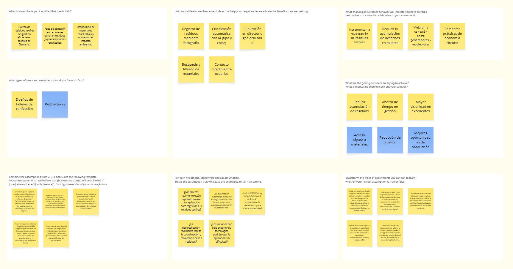

<h5 style="text-align: center"> Área: Ingeniería de Software </h5>

<h5 style="text-align: center"> Curso: Arquitectura De Software Emergentes  </h5>
<h5 style="text-align: center"> NRC: 10042 </h5>

<h5 style="text-align: center"> Docente: Rojas Malasquez, Royer Edelwer </h5>

<h5 style="text-align: center"> Startup: Gamarra Loop </h5>

<h5 style="text-align: center"> Producto: Gamarra Loop  </h5>

## Team members:

  
|                Nombre                 |   Código   |
| :-----------------------------------: | :--------: |
|  Cuya Villegas, Rafael Alberto        | u201913495 |
|  Gongora Castillejos, Williams        | u20221c186 |
|  Huanaco Huayta, Elizabeth Lucero     | u20211g522 |
|  Molina Falcon, Piero Leonardo        |  |
|  Torres Garcia, Andrés Alberto        |  |

<h5 style="text-align: center"> Ciclo 2026-10 </h5>

# Registro de Versiones del Informe

El objetivo de esta sección es resumir las modificaciones relevantes que se realizan al informe durante el ciclo de vida del proyecto. Esta sección inicia en una página nueva y se incluye un cuadro con la siguiente estructura:

| Versión |   Fecha    |             Autor             | Descripción de modificación                                                                                                                                                                       |
| :-----: | :--------: | :---------------------------: | ------------------------------------------------------------------------------------------------------------------------------------------------------------------------------------------------- |
|   TB1   | 25/04/2026 | Gongora Castillejos, Williams   Cuya Villegas, Rafael Alberto   | Realización de:   - Capítulo I: Introducción - Capítulo II: Requirements Elicitation & Analysis  - Capítulo III: Requirements specification  - Capítulo IV: Strategic-Level Software Design |

# Project Report Collaboration Insights

URL del repositorio para el reporte del proyecto: https://github.com/GamarraLoop/Project-Document-Report

**TB1**

  

Para el desarrollo del informe perteneciente a la entrega TF, se dividió la implementación de secciones de la siguiente forma para cada integrante del equipo:

| Integrante                        | Tareas Asignadas                                                                                                                                                              |
| --------------------------------- | ----------------------------------------------------------------------------------------------------------------------------------------------------------------------------- |
| Cuya Villegas, Rafael Alberto       | Capítulo II: Requirements Elicitation & Analysis                                                                                         |
| Gongora Castillejos, Williams         | Capítulo III: Requirements specification                                                                                          |
| Huanaco Huayta, Elizabeth Lucero     | Capítulo I: Introducción                                                                                                       |
| Molina Falcon, Piero Leonardo | Capítulo IV: Strategic-Level Domain-Driven Design                                                                                                              |
| Torres Garcia, Andrés Alberto        | Capítulo IV: Strategic-Level Attribute-Driven Design, Software Architecture  |

**Github Collaboration Insights**

Github también presenta un timeline de las ramas principales y los procesos de merge a los que se han sometido. Todas las ramas se crearon tomando en cuenta el diseño de GitFlow para una buena organización cuando se usa un software de control de versiones.

Los integrantes son:

- Cuya Villegas, Rafael Alberto (RafaelCuya)
- Gongora Castillejos, Williams (WiJeGo)
- Huanaco Huayta, Elizabeth Lucero (lucerohh)
- Molina Falcon, Piero Leonardo ()
- Torres Garcia, Andrés Alberto (andrest04)

# Contenido

1. [**Capítulo I: Introducción.**](#1.)  
   1.1. [Startup Profile.](#1.1.)  
   1.1.1. [Descripción del startup.](#1.1.1.) 
   1.1.2.[Perfiles de los integrantes del equipo.](#1.1.2.) 
   1.2. [Solution Profile.](#1.2.) 
   1.2.1. [Antecedentes y Problemática.](#1.2.1.) 
   1.2.2. [Lean UX Process.](#1.2.2.) 
   1.2.2.1 [Lean UX Problem Statements.](#1.2.2.1.) 
   1.2.2.2. [Lean UX Assumptions.](#1.2.2.2.) 
   1.2.2.3 [Lean UX Hypothesis Statements.](#1.2.2.3.) 
   1.2.2.4 [Lean UX Canvas.](#1.2.2.4.) 
   1.3. [Segmentos objetivo.](#1.3.) 
2. [**Capítulo II: Requirements Elicitation & Analysis.**](#2.) 
   2.1. [Competidores.](#2.1.) 
   2.1.1. [Análisis competitivo.](#2.1.1.) 
   2.1.2. [Estrategias y tácticas frente a competidores.](#2.1.2.) 
   2.2. [Entrevistas.](#2.2.) 
   2.2.1. [Diseño de entrevistas.](#2.2.1.) 
   2.2.2. [Registro de entrevistas.](#2.2.2.) 
   2.2.3. [Análisis de entrevistas.](#2.2.3.) 
   2.3. [Needfinding.](#2.3.) 
   2.3.1. [User Personas.](#2.3.1.) 
   2.3.2. [User Task Matrix.](#2.3.2.) 
   2.3.3. [User Journey Mapping.](#2.3.3.) 
   2.3.4. [Empathy Mapping.](#2.3.4.) 
   2.3.5. [As-is Scenario Mapping.](#2.3.5.) 
   2.4. [Ubiquitous Language](#2.4.) 
3. [**Capítulo III: Requirements Specification.**](#3.) 
   3.1. [To-Be Scenario Mapping.](#3.1.) 
   3.2. [User Stories.](#3.2.) 
   3.3. [Impact Mapping.](#3.3.) 
   3.4. [Product Backlog.](#3.4.) 
4. [**Capítulo IV: Solution Software Design.**](#4.) 
   4.1. [Strategic-Level Attribute-Driven Design.](#4.1.) 
   4.1.1. [Design Purpose.](#4.1.1.) 
   4.1.2. [Attribute-Driven Design Inputs.](#4.1.2.) 
   4.1.2.1. [Primary Functionality (Primary User Stories).](#4.1.2.1.) 
   4.1.2.2. [Quality Attribute Scenarios.](#4.1.2.2.) 
   4.1.2.3. [Constraints.](#4.1.2.3.) 
   4.1.3. [Architectural Drivers Backlog.](#4.1.3.) 
   4.1.4. [Architectural Design Decisions.](#4.1.4.) 
   4.1.5. [Quality Attribute Scenario Refinements.](#4.1.5.) 
   4.2. [Strategic-Level Domain-Driven Design.](#4.2.) 
   4.2.1. [EventStorming.](#4.2.1.) 
   4.2.2. [Candidate Context Discovery.](#4.2.2.) 
   4.2.3. [Domain Message Flows Modeling.](#4.2.3.) 
   4.2.4. [Bounded Context Canvases.](#4.2.4.) 
   4.2.5. [Context Mapping.](#4.2.5.) 
   4.3. [Software Architecture.](#4.3.) 
   4.3.1. [Software Architecture System Landscape Diagram.](#4.3.1.) 
   4.3.2. [Software Architecture Context Level Diagrams.](#4.3.2.) 
   4.3.3. [Software Architecture Container Level Diagrams.](#4.3.3.) 
   4.3.4. [Software Architecture Deployment Diagrams.](#4.3.4.) 
7. [**Conclusiones**](#1.)  
9. [**Referencias bibliográficas**](#1.)  
10. [**Anexo**](#1.)  

# STUDENT OUTCOME

**ABET – EAC - Student Outcome 3:** Capacidad de comunicarse efectivamente con un rango de audiencias.

| Criterio específico | Acciones realizadas | Conclusiones |
| :--- | :--- | :--- |
| Comunica oralmente sus ideas y/o resultados con objetividad a público de diferentes especialidades y niveles jerárquicos, en el marco del desarrollo de un proyecto en ingeniería. | **Cuya Villegas, Rafael Alberto**  Compartí con el equipo diversas ideas orientadas a la creación y mejora de nuestro proyecto, comunicándolas de manera clara y objetiva. Asimismo, en el desarrollo del Capítulo II, estuve a cargo de la realización de entrevistas, lo que implicó interactuar con los participantes de forma estructurada y profesional, asegurando una comunicación efectiva con personas de diferentes niveles y contextos.  **Gongora Castillejos, Williams:**  **TB1:** Sustenté frente al equipo la viabilidad técnica y de negocio para la gestión de requerimientos (Capítulo III), argumentando la necesidad de aplicar IA y rediseñar el flujo logístico.    **Huanaco Huayta, Elizabeth Lucero**   **TB1:** Sustenté frente al equipo la problemática, contexto y propuesta de solución del proyecto (Capítulo I), argumentando la necesidad de implementar una plataforma basada en IA para optimizar la gestión y reutilización de residuos textiles dentro de un enfoque de economía circular.    **Molina Falcon, Piero Leonardo**    **Torres Garcia, Andrés Alberto** | **TB1:** El equipo logró alinear la visión del producto mediante debates estructurados, asegurando que todos los miembros comprendan a profundidad el modelo de negocio antes de iniciar el diseño arquitectónico. |
| Comunica en forma escrita ideas y/o resultados con objetividad a público de diferentes especialidades y niveles jerárquicos, en el marco del desarrollo de un proyecto en ingeniería. | **Cuya Villegas, Rafael Alberto**  Me encargué del desarrollo del Capítulo II, diseñando entrevistas y desarrollando herramientas como mapas de análisis con el objetivo de comprender mejor a los usuarios y sus necesidades. La información fue presentada de manera clara y objetiva.  **Gongora Castillejos, Williams:**   **TB1:** Redacté y estructuré el Capítulo III (Requirements Specification), elaborando diagramas estratégicos (Impact Mapping, To-Be Scenario) y estandarizando las User Stories en formato Gherkin.    **Huanaco Huayta, Elizabeth Lucero**   **TB1:** Redacté y estructuré el Capítulo I del proyecto, desarrollando el perfil de la startup, la problemática, los segmentos de usuarios y los artefactos de Lean UX, comunicando las ideas de manera clara, organizada y comprensible para públicos tanto técnicos como no técnicos.    **Molina Falcon, Piero Leonardo**    **Torres Garcia, Andrés Alberto** | **TB1:** La documentación rigurosa y estandarizada ha demostrado ser fundamental. Redactar requerimientos sin ambigüedades ni detalles de UI garantiza una base sólida y comprensible para el posterior diseño de software. |

# Capítulo I: Introducción

## 1.1. Startup Profile

En esta sección se presenta la descripción del startup y los perfiles de los miembros del equipo.

### 1.1.1. Descripción del startup

GamarraLoop está conformado por estudiantes de Ingeniería de Software con formación académica en diseño, desarrollo y arquitectura de aplicaciones modernas. Cuenta con conocimientos en desarrollo de aplicaciones móviles, backend y principios de arquitectura de software, lo que permite abordar el proyecto desde una perspectiva integral. Con respecto a su forma de trabajo, el equipo adopta un enfoque iterativo e incremental, priorizando el desarrollo de prototipos funcionales y la validación progresiva de las funcionalidades mediante retroalimentación continua. Asimismo, el equipo muestra un fuerte interés en el desarrollo de soluciones con impacto social, especialmente en contextos como el emporio comercial de Gamarra, donde la digitalización y optimización de procesos representan una oportunidad significativa para mejorar la gestión de recursos y fomentar prácticas sostenibles. Esta motivación impulsa el diseño de una propuesta tecnológica que no solo sea funcional, sino también relevante para su entorno.

### 1.1.2. Perfiles de los integrantes del equipo

<table align="center"  border="1" width="70%" style="text-align:center;">
    <tr align="center">
        <td rowspan="3">
             
        </td>
        <td align="left">
            <b>Nombre y Apellido:</b>
             
            Cuya Villegas, Rafael Alberto
        </td>
    </tr>
    <tr>
        <td align="left">
        <b>Carrera:</b>
         
        Ingeniería de Software
        </td>
    </tr>
    <tr>
        <td align="left">
        <b>Acerca de:</b>
          
          Soy estudiante de Ingeniería de Software y actualmente curso el octavo ciclo de la carrera. Cuento con conocimientos en Python, JavaScript, SQL, MongoDB y ciberseguridad. Me considero una persona perseverante, orientada al aprendizaje continuo y al logro de objetivos. Además, valoro el trabajo en equipo, ya que considero que el intercambio de ideas y perspectivas permite desarrollar soluciones más sólidas y de mayor calidad.
        </td>
    </tr>
    <tr align="center">
        <td rowspan="3">
            
        </td>
        <td align="left">
            <b>Nombre y Apellido:</b>
             
            Gongora Castillejos, Williams
        </td>
    </tr>
    <tr>
        <td align="left">
        <b>Carrera:</b>
         
          Ingeniería de Software 
        </td>
    </tr>
    <tr>
        <td align="left">
        <b>Acerca de:</b>
         
        Soy estudiante del octavo ciclo de Ingeniería de Software en la UPC, perteneciente al quinto superior de mi carrera. Me apasiona el desarrollo de soluciones tecnológicas, con un enfoque especial en el Front-end, donde disfruto construyendo interfaces funcionales, atractivas y centradas en el usuario. Cuento con experiencia técnica en tecnologías como Angular, React y Spring Boot, además de un sólido manejo de bases de datos. Me caracterizo por ser una persona creativa y empática, comprometida con el trabajo en equipo y la aplicación de buenas prácticas para entregar productos de software de alta calidad que generen un impacto real.
        </td>
    </tr>
    <tr align="center">
        <td rowspan="3">
            
        </td>
        <td align="left">
            <b>Nombre y Apellido: </b>
             
            Huanaco Huayta, Elizabeth Lucero
        </td>
    </tr>
    <tr>
        <td align="left">
        <b>Carrera:</b>
         
        Ingenieria de Software
        </td>
    </tr>
    <tr>
        <td align="left">
        <b>Acerca de:</b>
         
         Soy estudiante del octavo ciclo de la carrera de Ingeniería de Software en la UPC, con interés en el desarrollo de soluciones tecnológicas que generen impacto real. Me motiva la posibilidad de crear aplicaciones funcionales y útiles, aplicando buenas prácticas de programación y arquitectura de software. A lo largo de mi formación académica, he venido fortaleciendo mis habilidades técnicas y de trabajo en equipo. Dentro del proyecto, me comprometo a contribuir de manera responsable y proactiva, aportando al cumplimiento de los objetivos del equipo. Busco mejorar continuamente mis capacidades y aportar al desarrollo de una solución de calidad que responda a las necesidades planteadas.
        </td>
    </tr>
    <tr align="center">
        <td rowspan="3">
            
        </td>
        <td align="left">
            <b>Nombre y Apellido:</b>
             
            Molina Falcon, Piero Leonardo
        </td>
    </tr>
    <tr>
        <td align="left">
        <b>Carrera:</b>
         
        Ingeniería de Software
        </td>
    </tr>
    <tr>
        <td align="left">
        <b>Acerca de:</b>
         
        </td>
    </tr>
    <tr align="center">
        <td rowspan="3">
            
        </td>
        <td align="left">
            <b>Nombre y Apellido:</b>
             
            Torres Garcia, Andrés Alberto
        </td>
    </tr>
    <tr>
        <td align="left">
        <b>Carrera:</b>
         
        Ingeniería de Software
        </td>
    </tr>
    <tr>
        <td align="left">
        <b>Acerca de:</b>
         
        </td>
    </tr>
</table>

## 1.2. Solution Profile

### 1.2.1. Antecedentes y Problemática

Según la Ellen MacArthur Fundación (2017), la industria textil genera grandes volúmenes de residuos que no son reutilizados eficientemente, lo que representa una oportunidad clave para implementar modelos de economía circular. Debido a la alta actividad productiva en el emporio comercial de Gamarra, se generan diariamente grandes cantidades de residuos textiles que, en su mayoría, no son gestionados de manera eficiente. Sin embargo, existe una creciente necesidad por parte de artesanos, emprendedores y recolectores de acceder a materia prima para sus actividades. Sin embargo, la falta de un sistema organizado dificulta la conexión entre quienes generan estos excedentes y quienes podrían reutilizarlos, provocando desperdicio de recursos y un impacto ambiental negativo.

De acuerdo con la European Environment Agency (2019), la industria textil representa uno de los sectores con mayor impacto ambiental debido al alto volumen de residuos generados y al bajo nivel de reutilización de materiales. A pesar del potencial que tienen estos residuos para ser reincorporados en nuevos ciclos productivos, gran parte de ellos termina siendo desechado debido a la falta de sistemas eficientes que faciliten su clasificación, recuperación y redistribución. En este contexto, la adopción de enfoques basados en la economía circular resulta fundamental para reducir el desperdicio y promover un uso más sostenible de los recursos textiles.
Frente a esta problemática, nuestra solución propone una plataforma digital que facilite la gestión y redistribución de residuos textiles dentro de un enfoque de economía circular. A través de nuestro producto ReciTex, los talleres podrán registrar sus excedentes de forma rápida mediante el uso de Inteligencia Artificial, la cual permitirá identificar automáticamente el tipo de material y color a partir de una fotografía. Esta información será publicada en un directorio geolocalizado, creando un espacio unificado donde artesanos y recolectores podrán identificar puntos de disponibilidad y coordinar el recojo de materiales de manera eficiente, promoviendo así la reutilización de recursos y la sostenibilidad en el sector.

**WHAT (Qué): ¿Cuál es el problema?**

El problema es la ineficiente gestión y aprovechamiento de los residuos textiles generados en el emporio comercial de Gamarra. Esto se traduce en acumulación de materiales reutilizables, desperdicio de recursos valiosos y falta de visibilidad sobre la disponibilidad de estos excedentes, limitando su reutilización en otros procesos productivos.

**WHEN (Cuándo): ¿Cuándo sucede el problema?**

El problema ocurre de manera constante durante las actividades diarias de producción en los talleres de confección, especialmente al finalizar procesos de corte y fabricación, donde se generan retazos y sobrantes que no son gestionados adecuadamente.

**WHERE (Dónde): ¿Dónde surge el problema?**

El problema surge principalmente en los talleres textiles ubicados en el emporio comercial de Gamarra, donde la alta concentración de producción genera grandes volúmenes de residuos sin un sistema estructurado para su gestión y redistribución.

**WHO (Quién): ¿A quiénes les sucede el problema?**

El problema afecta directamente a los dueños de talleres, quienes no cuentan con herramientas para gestionar sus residuos. Asimismo, afecta a recolectores que podrían reutilizar estos materiales, pero no tienen acceso a información sobre su disponibilidad. De manera indirecta, también impacta al entorno urbano debido al incremento de residuos.

**WHY (Por qué): ¿Cuál es la causa del problema?**

La principal causa radica en la falta de herramientas digitales accesibles que permitan registrar, clasificar y compartir información sobre los residuos textiles. Esto se ve agravado por la baja adopción tecnológica en pequeños talleres, la informalidad del sector y la ausencia de un sistema que conecte oferta y demanda de estos materiales.

**HOW (Cómo): ¿Cómo llevó a los involucrados a llegar a esta situación?**

La dependencia de procesos manuales y prácticas informales, junto con la ausencia de soluciones tecnológicas adaptadas a este contexto, ha generado una desconexión entre quienes generan residuos y quienes podrían reutilizarlos. Esto ha derivado en una gestión ineficiente y en la pérdida de oportunidades dentro de un modelo de economía circular.

**HOW MUCH (Cuánto): ¿Cuánto afecta el problema?**

Este problema impacta significativamente en la sostenibilidad ambiental y en la eficiencia del uso de recursos, generando acumulación innecesaria de residuos y desaprovechamiento de materiales reutilizables. Además, limita oportunidades económicas para pequeños emprendedores y contribuye a la contaminación en el entorno, afectando tanto al sector productivo como a la comunidad en general.

### 1.2.2. Lean UX Process

#### 1.2.2.1. Lean UX Problem Statements

En la actualidad, la gestión de residuos textiles en entornos como el emporio comercial de Gamarra se realiza de manera informal y poco estructurada. Los talleres de confección generan constantemente excedentes de producción que, en muchos casos, no son reutilizados eficientemente debido a la falta de herramientas digitales accesibles que permitan registrar, clasificar y compartir esta información.

Para los generadores de estos residuos, un problema común es la dificultad para gestionar y dar visibilidad a los materiales sobrantes, lo que conlleva a su acumulación o descarte. Por otro lado, para recolectores, resulta complicado identificar y acceder a fuentes confiables de materia prima reutilizable, lo que limita sus oportunidades de producción y crecimiento.

¿Qué soluciones deberíamos brindar para lograr que los procesos relacionados con la gestión, clasificación y redistribución de residuos textiles sean más automatizados y permitan conectar de manera eficiente a los generadores con quienes pueden reutilizar estos materiales dentro de un modelo de economía circular sostenible?

#### 1.2.2.2. Lean UX Assumptions

**Business Assumptions**

- Creemos que nuestros usuarios necesitan una forma más eficiente y accesible de gestionar y reutilizar residuos textiles generados en entornos productivos como Gamarra.
- Estas necesidades se pueden resolver mediante el uso de una aplicación móvil low-code asistida por Inteligencia Artificial que permita registrar, clasificar y geolocalizar los excedentes textiles de manera rápida.
- Los clientes principales son los dueños de talleres textiles, así como recolectores que buscan acceder a materiales reutilizables de forma sencilla.
- El valor #1 que un cliente quiere del servicio es la facilidad y rapidez para publicar o encontrar materiales disponibles, optimizando tiempo y reduciendo desperdicios.
- El cliente también puede obtener beneficios adicionales mediante funcionalidades como clasificación automática por imagen, visualización en mapas geolocalizados y notificaciones de disponibilidad de materiales.
- Vamos a adquirir la mayoría de los usuarios mediante campañas de concientización, marketing digital y alianzas con asociaciones textiles y comunidades de emprendedores.
- El modelo de ingresos podrá basarse en alianzas estratégicas con organizaciones interesadas en la gestión sostenible de residuos.
- Nuestra competencia principal son los métodos tradicionales e informales de gestión de residuos, así como plataformas genéricas que no están enfocadas en economía circular ni en el sector textil.
- Los venceremos mediante el uso de Inteligencia Artificial, una experiencia de usuario simple (low-code) y un enfoque específico en la reutilización de materiales dentro de un ecosistema colaborativo.
- Nuestro mayor riesgo es la baja adopción tecnológica por parte de los talleres y la resistencia al cambio frente a procesos tradicionales.
- Resolveremos esto mediante interfaces simples, capacitación básica, demostraciones del sistema y generación de valor inmediato para los usuarios.

**Assumptions Worksheet**

- **¿Quién es el usuario?**  
  Los usuarios son dueños de talleres textiles y recolectores que buscan gestionar o acceder a materiales reutilizables de manera eficiente.

- **¿Dónde encaja nuestro producto en su trabajo o vida?**  
  La aplicación se integra en las actividades diarias de producción y recolección, facilitando el registro inmediato de residuos y la búsqueda de materiales disponibles en el entorno.

- **¿Qué problemas tiene nuestro producto que resolver?**  
  La falta de visibilidad de los residuos textiles, la desconexión entre oferta y demanda de materiales reutilizables y la baja adopción de herramientas digitales en el sector.

- **¿Cuándo y cómo es nuestro producto usado?**  
  Se utiliza durante y después de los procesos de producción, cuando se generan residuos, así como en momentos de búsqueda de materiales por parte de recolectores.

- **¿Qué características son importantes?**  
  Registro rápido mediante fotografía, clasificación automática con IA, geolocalización de materiales, interfaz simple y accesible desde dispositivos móviles.

- **¿Cómo debe verse nuestro producto y cómo comportarse?**  
  Debe ser intuitivo, rápido y fácil de usar, con una interfaz limpia que permita a usuarios no técnicos interactuar sin dificultad. Además, debe responder de manera eficiente y mostrar información clara y útil en tiempo real.

#### 1.2.2.3. Lean UX Hypothesis Statements

- Creemos que al permitir el registro de residuos textiles mediante el uso de fotografías y su clasificación automática con Inteligencia Artificial, se reducirá el esfuerzo y tiempo requerido por los talleres para gestionar sus excedentes. Sabremos que tenemos éxito cuando observemos un incremento significativo en la cantidad de publicaciones registradas y una reducción en el tiempo promedio de registro.

- Creemos que al implementar un directorio geolocalizado de residuos textiles disponibles, se facilitará la conexión entre generadores y recolectores. Sabremos que estamos cumpliendo este objetivo cuando aumente la cantidad de interacciones y coordinaciones realizadas a partir de los puntos publicados en la plataforma.

- Creemos que al ofrecer una interfaz simple y accesible (low-code), se incrementará la adopción de la plataforma por parte de usuarios con bajo nivel de experiencia tecnológica. Sabremos que tenemos éxito cuando se evidencie un crecimiento sostenido en el número de usuarios activos y una disminución en las dificultades de uso reportadas.

- Creemos que al centralizar la información sobre residuos textiles disponibles, se mejorará la visibilidad de materiales reutilizables. Sabremos que estamos cumpliendo este objetivo cuando aumente la tasa de reutilización de materiales registrados dentro del sistema.

- Creemos que al promover el uso de la plataforma como medio de gestión de residuos, se contribuirá a la reducción del desperdicio textil. Sabremos que estamos cumpliendo este objetivo cuando se observe una disminución en la acumulación de residuos no reutilizados en los talleres participantes.

#### 1.2.2.4. Lean UX Canvas

## 1.3. Segmentos objetivo

En esta sección, definiremos los perfiles específicos del público objetivo para nuestro producto. Dichos grupos comparten características demográficas, comportamientos y necesidades similares, lo que permite diseñar soluciones adecuadas para optimizar la gestión y reutilización de residuos dentro de un modelo de economía circular sostenible.

**Segmento 1: Talleres de Confección**

- **Segmento demográfico:**  
  Propietarios de talleres textiles con ingresos variables, generalmente pequeños o medianos empresarios que buscan optimizar sus procesos productivos y reducir desperdicios.

- **Segmento geográfico:**  
  Ubicados principalmente en zonas urbanas con alta actividad textil, como el emporio comercial de Gamarra.

- **Segmento psicográfico:**  
  Personas prácticas que buscan soluciones simples y rápidas para gestionar sus excedentes, con interés creciente en mejorar la eficiencia y reducir pérdidas.

- **Segmento conductual:**  
  Generan residuos textiles de forma constante, registran excedentes mediante fotografías, requieren herramientas que automaticen la clasificación (tipo y color) y publican la disponibilidad para coordinar el recojo con interesados.

**Segmento 2: Recolectores**

- **Segmento demográfico:**  
  Recolectores, como emprendedores o artesanos, que buscan acceder a materia prima reutilizable para sus actividades productivas.

- **Segmento geográfico:**  
  Ubicados en zonas cercanas a centros de producción textil o con acceso a los mismos.

- **Segmento psicográfico:**  
  Personas con mentalidad emprendedora y enfoque en el aprovechamiento de recursos, interesadas en oportunidades económicas sostenibles.

- **Segmento conductual:**  
  Exploran mapas de materiales disponibles, filtran por tipo, color y cercanía, contactan talleres para coordinar el recojo y utilizan los materiales obtenidos como insumo para sus productos.

# Capítulo II: Requirements Elicitation & Analysis

## 2.1. Competidores

### 2.1.1. Análisis competitivo

<table>
  <thead>
    <tr>
      <th colspan="6" align="left">Competitive Analysis Landscape</th>
    </tr>
    <tr>
      <th align="left">¿Por qué llevar a cabo este análisis?</th>
      <th colspan="5" align="left"> Identificar las fortalezas, debilidades, oportunidades y amenazas de los principales competidores nos perimite delimitar mejor nuestro proyecto y definir nuestra propuesta diferenciada en el mercado.</th>
    </tr>
    <tr>
      <th colspan="2" align="left">(En la cabecera colocar por cada competidor nombre y logo)</th>
      <th>GamarraLoop </th>
      <th>Vinted </th>
      <th>Facebook Marketplace </th>
      <th>Etsy </th>
    </tr>
  </thead>
  <tbody>
    <tr>
      <th rowspan="2" valign="middle">Perfil</th>
      <td><strong>Overview</strong></td>
      <td>Sistema para gestión de residuos textiles. Conecta talleres de confeccion con artesanos y recolectores.</td>
      <td>Mercado en línea y comunitario, en el que se permite a los usuarios vender, comprar e intercambiar artículos de segunda mano.</td>
      <td>Plataforma gratuita dentro de Facebook que permite encontrar, comprar y vender artículos nuevos o de segunda mano.</td>
      <td>App dedicada al comercio electrónico, que gestiona un mercado online donde se puede comprar y vender artículos de artesanía, vintage y decorativos.</td>
    </tr>
    <tr>
      <td><strong>Ventaja competitiva</strong> ¿Qué valor ofrece a los clientes?</td>
      <td>Clasificacion y enfoque sin transacciones monetarias.</td>
      <td>Cuenta con una de las comisiones más bajas del mercado.</td>
      <td>Permite una comunicación directa, para concretar transacciones, mediante este.</td>
      <td>Tarifa por transacción baja e incluye los gastos de envio, Además, cuenta con su propio sistema de pagos.</td>
    </tr>
    <tr>
      <th rowspan="2" valign="middle">Perfil de Marketing</th>
      <td><strong>Mercado objetivo</strong></td>
      <td>Talleres de confección, artesanos, recolectores y micro emprendedores textiles.</td>
      <td>Jóvenes y adultos interesados en artículos de segunda mano.</td>
      <td>Publico general que utiliza Facebook.</td>
      <td>Consumidores de productos del sector manualidades o vintage.</td>
    </tr>
    <tr>
      <td><strong>Estrategias de marketing</strong></td>
      <td>Alianza con talleres, campañas locales, educación sobre reciclaje textil.</td>
      <td>Influencers, redes sociales y campañas ecológicas.</td>
      <td>Publicidad dentro de Facebook.</td>
      <td>Campañas digitales.</td>
    </tr>
    <tr>
      <th rowspan="3" valign="middle">Perfil de Producto</th>
      <td><strong>Productos & Servicios</strong></td>
      <td>App móvil para encontrar residuos textiles</td>
      <td>App de venta de marcas reconocidas y variedad de productos.</td>
      <td>App que cuenta con amplia variedad de productos.</td>
      <td>Aplicación para ubicar productos personalizados y diferenciados.</td>
    </tr>
    <tr>
      <td><strong>Precios & Costos</strong></td>
      <td>Modelo gratuito para usuarios, posible monetización futura mediante servicios Premium..</td>
      <td>Comisión baja para vendedores.</td>
      <td>Gratis, sin comisiones directas.</td>
      <td>Comisión por publicación y transacción</td>
    </tr>
    <tr>
      <td><strong>Canales de distribución</strong> (Web y/o Móvil)</td>
      <td>Web App, Mobile App y Landing Page.</td>
      <td>Web y app móvil.</td>
      <td>Aplicación móvil y presencia web en faceebok.</td>
      <td>Aplicación móvil y web.</td>
    </tr>
    <tr>
      <th rowspan="4" valign="middle">Análisis SWOT</th>
      <td><strong>Fortalezas</strong></td>
      <td>Uso de IA para automatizar procesos, solución especializada e impacto ambiental positivo.</td>
      <td>Comunidad activa, facilidad de uso.</td>
      <td>Alcance masivo y cantidad de usuarios.</td>
      <td>Marca consolidada y productos diferenciados.</td>
    </tr>
    <tr>
      <td><strong>Debilidades</strong></td>
      <td>Dependencia de adopción inicial en talleres.</td>
      <td>Control de calidad limitado, tiempo de envios variables y algunos pases con cobertura completa del servicio.</td>
      <td>Dependencia de los usuarios para los envíos y control de calidad.</td>
      <td>Riesgo de fraudes</td>
    </tr>
    <tr>
      <td><strong>Oportunidades</strong></td>
      <td>Crecimiento en enconomia circular en Perú, escalable a otras industrias y unica en el sector específico.</td>
      <td>Crecimiento de mercado y expansión a nuevos (Latam).</td>
      <td>Incremento en el mercado de ventas de productos de manera online.  </td>
      <td>Incremento del comercio digital.</td>
    </tr>
    <tr>
      <td><strong>Amenazas</strong></td>
      <td>Baja adopción tecnológica en el sector.</td>
      <td>Alta competencia, perdida de confianza por malas experiencias.</td>
      <td>Alta competencia de otras apps.</td>
      <td>Problemas de confianza en métodos de pago afecta su uso.</td>
    </tr>
  </tbody>
</table>

---

### 2.1.2. Estrategias y tácticas frente a competidores

---

**Estrategia Ofensiva **

Aprovechar el crecimiento de la economía circular y la digitalización en el sector textil, creando una plataforma basada en IA y geolocalización. Recitex potencia su propuesta mediante la automatización del registro de residuos textiles. Además, el desarrollo del sistema visual permitirá una fácil localización de los excedentes textiles en tiempo real, esto ayudará a la conexión eficiente entre nuestros segmentos objetivos generando valor para ambos.

---

**Estrategia Defensiva **

Analizar de manera continua las propuestas de valor de los principales competidores indirectos como Facebook Marketplace, Vinted o Etsy, con el fin de incorporar buenas prácticas y elementos diferenciadores que mantengan fresca e innovadora la solución de Recitex. Adicionalmente, se reforzará la propuesta diferenciadora mediante el uso de IA y la especialización en el sector de residuos textiles. La optimización en la experiencia del usuario será un punto clave para permitirle a nuestros usuarios un flujo rápido y sencillo.

---

**Estrategia de Reorientación **

Validar y adaptar nuestro sistema en distintos segmentos dentro del perfil textil, como recicladores urbanos, emprendimientos de moda y asociaciones textiles, ajustando las funcionalidades según sus necesidades. Por otro lado, establecer alianzas estrátegicas con municipalidades, ONGs ambientales y centros de tecnología, que aporten conocimientos en IA y la interfaz. Esto permitirá mantener una mejora continua de nuestra plataforma y explorar nuevas funcionalidades.

---

**Estrategia de Supervivencia **

Reforzar la diferenciación de Recitex en todos los canales de marketing, destacando su facilidad de uso, enfoque sin transacciones monetarias y su impacto ambiental positivo en la reducción de residuos textiles. También, se implementará un sistema de acompañamiento y capacitación para usuarios, con el fin de reducir la resistencia al uso de tecnología. La retroalimentación constante permitirá llevar a cabo mejorar en nuestra app, incrementando su competitividad y fortaleciendo su adopción en el mercado.

## 2.2. Entrevistas

### 2.2.1. Diseño de entrevistas

##### Preguntas Generales
- ¿Cuál es tu nombre y apellido?
- ¿Cuántos años tienes?
- ¿A qué te dedicas?

---

#### Segmento 1: Talleres de confección 

##### Preguntas principales
- ¿Qué haces actualmente con los residuos o sobrantes textiles que generas?
- ¿Qué tipo de materiales sueles desechar o acumular?
- ¿Con qué frecuencia generas estos excedentes?
- ¿Cómo decides qué hacer con esos materiales (guardar, botar, reutilizar)?
- ¿Has intentado venderlos o regalarlos? ¿Cómo fue esa experiencia?
- ¿Qué es lo más difícil o incómodo al gestionar estos residuos?
- ¿Cuánto tiempo o esfuerzo te toma lidiar con ellos?
- ¿Qué tan cómodo te sientes usando aplicaciones móviles en tu trabajo?
- ¿Qué tan fácil sería para ti tomar una foto de un material y subirla a una app?
- Si existiera una app donde solo tomas una foto y automáticamente se publica el material para que otros lo recojan, ¿la usarías? ¿Qué debería tener para que realmente te sea útil?

---

#### Segmento 2: Artesanos/ recolectores

##### Preguntas principales
- ¿Dónde consigues actualmente los materiales textiles que utilizas?
- ¿Qué tipo de materiales buscas con mayor frecuencia?
- ¿Qué dificultades tienes para encontrar materiales accesibles o reutilizables?
- ¿Te ha pasado que no encuentras lo que necesitas? ¿Qué haces en ese caso?
- ¿Cómo te enteras cuando alguien tiene materiales disponibles?
- ¿Qué tan importante es para ti la cercanía del lugar donde están los materiales?
- ¿Cuánto tiempo inviertes buscando materiales?
- ¿Qué es lo más complicado o frustrante en ese proceso?
- ¿Qué tan cómodo te sientes usando apps con mapas o ubicación?
- Si existiera una app donde puedas ver materiales disponibles en un mapa y contactar al taller para recogerlos, ¿la usarías? ¿Qué funcionalidad sería indispensable para ti?

---

### 2.2.2. Registro de entrevistas

#### Entrevistas al Segmento 1: Talleres de confección

#### Entrevista 1

| Campo             | Detalle |
|-------------------|---------|
| **Entrevistado**  | Piero Gamio |
| **Entrevistador** | Rafael Cuya |
| **Sexo**          |Masculino |
| **Edad**          | 32 |
| **Distrito**      | Lince |
| **Timing**        | 5:28 |
| **Link**          |  [Video de Entrevista](https://upcedupe-my.sharepoint.com/:v:/g/personal/u201913495_upc_edu_pe/IQAN7gYHGcYlSLXuoJ9JBJjkAf3Zrbft26IoBjtFGzD699k?e=QFawgz&nav=eyJyZWZlcnJhbEluZm8iOnsicmVmZXJyYWxBcHAiOiJTdHJlYW1XZWJBcHAiLCJyZWZlcnJhbFZpZXciOiJTaGFyZURpYWxvZy1MaW5rIiwicmVmZXJyYWxBcHBQbGF0Zm9ybSI6IldlYiIsInJlZmVycmFsTW9kZSI6InZpZXcifX0%3D) |
| **Resumen**       | Piero nos comenta que genera retazos de tela casi todos los días y los acumula hasta que ocupan mucho espacio. A veces los regala o los da a recicladores, pero coordinar es complicado. Dice que le gustaría algo simple para deshacerse de esos materiales rápido, sin perder tiempo. |

#### Entrevista 2

| Campo             | Detalle |
|-------------------|---------|
| **Entrevistado**  | Rosa Martínez |
| **Entrevistador** | Williams Gongora Castillejos |
| **Sexo**          | Femenino |
| **Edad**          | 34 |
| **Distrito**      | La Victoria |
| **Timing**        | 06:02 |
| **Link**          | [Video de Entrevista](https://upcedupe-my.sharepoint.com/:v:/g/personal/u201913495_upc_edu_pe/IQArNG8BqQYzTr7f2-UB5DbSAeSejaqnHHuiyOv-EuvjNpw?e=DdlBtz&nav=eyJyZWZlcnJhbEluZm8iOnsicmVmZXJyYWxBcHAiOiJTdHJlYW1XZWJBcHAiLCJyZWZlcnJhbFZpZXciOiJTaGFyZURpYWxvZy1MaW5rIiwicmVmZXJyYWxBcHBQbGF0Zm9ybSI6IldlYiIsInJlZmVycmFsTW9kZSI6InZpZXcifX0%3D) |
| **Resumen**       | Rosa menciona que en el taller juntan los residuos en bolsas y luego los botan o venden barato. El problema es que no siempre hay quién los compre. Para ella, sería útil una app donde pueda publicar rápido los materiales y que alguien los recoja sin tanto trámite. |
---
#### Entrevista 3

| Campo             | Detalle |
|-------------------|---------|
| **Entrevistado**  | Luis García |
| **Entrevistador** |  |
| **Sexo**          | Masculino |
| **Edad**          | 52 |
| **Distrito**      | Pueblo Libre |
| **Timing**        |  |
| **Link**          |  |
| **Resumen**       | Luis explica que generan muchos residuos y aunque intentan reutilizar algunos, la mayoría se pierde. Siente que falta una forma organizada de conectar con personas interesadas. Dice que usaría una app si le facilita ubicar y coordinar el recojo. |

#### Entrevistas al Segmento 2: Artesanos/recolectores

#### Entrevista 1

| Campo             | Detalle |
|-------------------|---------|
| **Entrevistado**  | María López |
| **Entrevistador** |  |
| **Sexo**          | |
| **Edad**          | 28 |
| **Distrito**      | Jesús Maria |
| **Timing**        |  |
| **Link**          |  |
| **Resumen**       | María cuenta que busca materiales en Gamarra o con recicladores, pero muchas veces no encuentra lo que necesita. Pierde tiempo buscando y a veces termina comprando más caro. Le interesaría una app donde pueda ver materiales cercanos y elegir más rápido. |

---

#### Entrevista 2

| Campo             | Detalle |
|-------------------|---------|
| **Entrevistado**  | Carlos Ramos |
| **Entrevistador** | Rafael Cuya |
| **Sexo**          | Masculino |
| **Edad**          | 28 |
| **Distrito**      | Lince |
| **Timing**        | 5:01 |
| **Link**          |  [Video de Entrevista](https://upcedupe-my.sharepoint.com/:v:/g/personal/u201913495_upc_edu_pe/IQBK4us_1WkPR468kAVyanV0ASwmeiolYIAU2Cb3FhJRLc8?e=i9k3rf&nav=eyJyZWZlcnJhbEluZm8iOnsicmVmZXJyYWxBcHAiOiJTdHJlYW1XZWJBcHAiLCJyZWZlcnJhbFZpZXciOiJTaGFyZURpYWxvZy1MaW5rIiwicmVmZXJyYWxBcHBQbGF0Zm9ybSI6IldlYiIsInJlZmVycmFsTW9kZSI6InZpZXcifX0%3D) |
| **Resumen**       | Carlos comenta que encuentra materiales caminando y preguntando en talleres. A veces pierde medio día sin conseguir nada. Dice que le serviría mucho saber dónde hay material disponible sin tener que buscar tanto. |

---
#### Entrevista 3

| Campo             | Detalle |
|-------------------|---------|
| **Entrevistado**  | Andrea Gonzales |
| **Entrevistador** |  |
| **Sexo**          | |
| **Edad**          | 38 |
| **Distrito**      | La Victoria |
| **Timing**        |  |
| **Link**          |  |
| **Resumen**       | Andrea menciona que le cuesta encontrar telas específicas a buen precio. Muchas veces pierde tiempo o tiene que cambiar sus diseños. Le gustaría una app con fotos claras y filtros para encontrar materiales más rápido. |
---

### 2.2.3. Análisis de entrevistas

De acuerdo con lo que hemos podido observar en las entrevistas realizadas a trabajadores o dueños de talleres de confección y artesanos/recolectores, se identificó que el 100% de los entrevistados gestiona los residuos textiles de forma manual, lo que evidencia una clara falta de digitalización en el proceso. En el caso de los talleres, el principal problema es la acumulación de residuos y la falta de espacio, además de la dificultad para encontrar personas que los recojan. Por otro lado, los artesanos y recolectores indicaron que obtienen materiales de forma informal, lo que implica una alta inversión de tiempo en la búsqueda, llegando incluso a perder varias horas sin resultados. Respecto al uso de tecnología, el 75% estaría dispuesto a usar una aplicación móvil, siempre que sea simple y rápida, mientras que el resto muestra cierta dificultad en su uso. Sin embargo, el 100% coincide en que sería útil contar con una herramienta que permita ver materiales disponibles, especialmente si incluye ubicación y fotos. En conclusión, el principal problema identificado es la falta de visibilidad y conexión entre quienes generan y quienes necesitan los materiales, lo que valida el desarrollo de una solución como Recitex basada en registro rápido y geolocalización.

---

## 2.3. Needfinding

### 2.3.1. User Personas

**Figura 2**

*User Persona del segmento Talleres*

*Nota.* Elaboración propia (2026) en UXPressia.

---

**Figura 3**

*User Persona del segmento Artesanos/Recolectores*

*Nota.* Elaboración propia (2026) en UXPressia.

---
                                                                                                                                                                                                                                                                                                                                                                                                                          

### 2.3.2. User Task Matrix

| Tarea |Integrante 1 (Frecuencia) | Integrante 1 (Importancia) | Integrante 2 (Frecuencia) |Integrante 2 (Importancia) |
|-------|-------------------------------|--------------------------------|--------------------------|--------------------------|
| Registrar residuos textiles| Siempre | Alta | — | — |
| Tomar foto del material| Siempre | Alta | — | — |
| Publicar disponibilidad de materiales | Frecuentemente | Alta | — | — |
| Coordinar recojo con interesados | Siempre | Alta | — | — |
| Organizar residuos en el taller | Frecuentemente | Media | — | — |
| Buscar a quién recoja materiales | Siempre | Alta | — | — |
| Buscar materiales reutilizables | — | — | Siempre | Alta |
| Revisar materiales reutilizables | — | — | Siempre | Alta |
| Filtrar por tipo/color de tela | — | — | Siempre | Alta |
| Ubicar materiales en el mapa | — | — | Frecuentemente | Alta |
| Contactar al taller | — | — | Siempre | Alta |
| Coordinar recojo | — | — | Frecuentemente | Alta |
| Comparar opciones de materiales | — | — | Ocasionalmente | Alta |
| Seleccionar material según preferencia | — | — | Frecuentemente | Media |

**Análisis**
En la matriz de tareas podemos observar las actividades con mayor frecuencia e importancia, tenemos acciones como registrar materiales, tomar fotos, publicar disponibilidad y coordinar recojo para los talleres de confección. Esto evidencia la necesidad de contar con un proceso rápido y sencillo que ayude a la gestión de residuos en estos establecimientos. 

Por otro lado, para el segmento Artesano/recolectores, encontramos que dentro de las tareas mas importantes estan buscar materiales, visualizar opciones disponibles, ubicarlos mediante un mapa y conectase con tallers. Esto refleja que el principal valor para este segmento es la accesibilidad y visibilidad de recursos disponibles.

La matriz de tareas nos perimite identificar cuales son las funcionalidades mas críticas del sistema y en que secciones debemos centrarnos para que nuestra aplicación sea eficiente.

### 2.3.3. User Journey Mapping

---

**Figura 4**

*User Journey Map As-Is del segmento Talleres*

*Nota.* Elaboración propia (2026) en UXPressia.

---

**Figura 5**

*User Journey Map As-Is del segmento Artesanos/Recolectores*

*Nota.* Elaboración propia (2026) en UXPressia.

### 2.3.4. Empathy Mapping

---

**Figura 6**

*Empathy Map del segmento Talleres*

*Nota.* Elaboración propia (2026) en UXPressia.

---

**Figura 7**

*Empathy Map del segmento Artesanos/Recolectores*

*Nota.* Elaboración propia (2026) en UXPressia.

### 2.3.5. As-is Scenario Mapping

---

Figura 8

*As-Is Scenario Map del segmento Talleres*

*Nota.* Elaboración propia (2026) en Miro.

---

Figura 9

*As-Is Scenario Map del segmento Artesanos/Recolectores*

*Nota.* Elaboración propia (2026) en Miro.

---

## 2.4. Ubiquitous Language

| Término | Definición |
|--------|-----------|
| Recitex / GamarraLoop | Aplicación que conecta talleres de confección con artesanos/recolectores para la reutilización de residuos textiles. |
| Residuo textil | Material sobrante generado en los procesos de confección (retazos, telas, excedentes). |
| Excedente | Cantidad de material textil que no será utilizado por el taller y está disponible para reutilización. |
| Lote de tela | Conjunto de residuos textiles agrupados y publicados como una unidad dentro del sistema. |
| Taller de confección | Usuario que genera residuos textiles y los publica en la plataforma. |
| Artesano | Usuario que reutiliza materiales textiles para crear nuevos productos. |
| Recolector | Usuario que busca, recoge y reutiliza residuos textiles disponibles en la plataforma. |
| Publicación de lote | Acción de registrar un lote de tela en el sistema mediante foto, ubicación y descripción. |
| Clasificación automática | Proceso en el que la IA identifica el tipo de material y color a partir de una imagen. |
| Geolocalización | Funcionalidad que permite ubicar los lotes en un mapa según su ubicación real. |
| Punto de recojo | Ubicación física donde el artesano o recolector puede recoger el lote publicado. |
| Estado del lote | Condición actual del lote dentro del sistema (Disponible, Reservado, Entregado, Expirado, Cancelado). |
| Reserva de lote | Acción mediante la cual un artesano asegura un lote antes de recogerlo. |
| Confirmación de entrega | Acción del taller para indicar que el lote fue entregado físicamente. |
| Confirmación de recepción | Acción del artesano para indicar que recibió el lote correctamente. |
| Directorio de materiales | Vista donde se muestran los lotes disponibles con información relevante. |
| Usuario | Persona que utiliza la plataforma (taller o artesano). |
| Perfil de usuario | Información básica del usuario dentro del sistema (nombre, rol, contacto). |
| Interacción | Acción de contacto o coordinación entre taller y artesano. |
| Economía circular | Modelo que promueve la reutilización de materiales para reducir residuos. |
| Low-code | Enfoque de desarrollo que permite usar la aplicación con mínima complejidad técnica. |
| API RESTful | Servicio backend que permite la comunicación entre frontend y sistema. |
| Notificación | Mensaje enviado al usuario sobre eventos importantes (reserva, entrega, etc.). |
| Expiración de lote | Estado automático que se asigna a un lote no recogido después de cierto tiempo. |

# Capítulo III: Requirements Specification

## 3.1. To-Be Scenario Mapping

En esta sección se presenta el **To-Be Scenario Mapping** de Gamarra Loop, el cual proyecta la experiencia ideal futura de nuestros User Personas al interactuar con nuestra solución digital. 

A continuación, se presentan las capturas de los To-Be Scenario Mapping elaborados:

* **To-Be Scenario: Taller Textil**

*Nota.* Elaboración propia (2026) en Miro.

 

* **To-Be Scenario: Artesano**

*Nota.* Elaboración propia (2026) en Miro.

 

## 3.2. User Stories

En esta sección se detallan las *Epics* y los *User Stories* (incluyendo *Technical Stories*) que conforman los requisitos funcionales de **Gamarra Loop**. Los criterios de aceptación están redactados siguiendo la estructura *Gherkin* (Given-When-Then), garantizando que las condiciones sean comprobables y estén enfocadas en el comportamiento del sistema sin depender de detalles específicos de la interfaz de usuario.

### Epics

| Epic ID | Título del Epic | Descripción |
| :--- | :--- | :--- |
| **EP01** | Landing Page y Adquisición | Funcionalidades de la página web estática para informar y captar Talleres donantes y Artesanos recicladores. |
| **EP02** | Publicación de Lotes (Talleres) | Funciones para que los talleres publiquen lotes de tela, incluyendo la asignación de la ubicación como punto de recojo en Gamarra. |
| **EP03** | Procesamiento de Textiles (IA) | Capacidades del sistema para analizar la foto del lote usando Google Cloud Vision y determinar viabilidad/material. |
| **EP04** | Exploración y Recojo (Artesanos) | Funciones para que los artesanos encuentren lotes disponibles, los reserven y confirmen su recojo físico en los talleres. |
| **EP05** | Technical Stories (APIs) | Historias técnicas orientadas a los servicios backend, APIs RESTful y comunicación con servicios externos (agnóstico a la infraestructura). |

### User Stories

| User Story ID | Título | Descripción | Criterios de Aceptación | Relacionado con (Epic ID) |
| :--- | :--- | :--- | :--- | :--- |
| **US01** | Propuesta de valor en Landing Page | Como Visitante, quiero visualizar la propuesta de valor del proyecto para entender cómo funciona el reciclaje de textiles. | **Dado** que un visitante ingresa al sitio web estático **Cuando** la página carga exitosamente **Entonces** el sistema expone la propuesta de valor principal sobre reciclaje textil. | EP01 |
| **US02** | Sección de contacto para talleres | Como Visitante del segmento Taller, quiero leer información sobre cómo mi empresa puede afiliarse a Gamarra Loop para publicar lotes sobrantes. | **Dado** que un visitante del segmento taller navega por la página web **Cuando** el visitante accede a la sección de aliados estratégicos **Entonces** el sistema presenta los requisitos y provee un canal de contacto para afiliación. | EP01 |
| **US03** | Redirección a descarga de App | Como Visitante, quiero encontrar un enlace directo a la tienda de aplicaciones para descargar la aplicación móvil fácilmente. | **Dado** que un visitante interactúa con el sitio web estático **Cuando** el visitante solicita la descarga de la app **Entonces** el sistema redirige la navegación a la tienda de aplicaciones correspondiente al sistema operativo. | EP01 |
| **US04** | Creación de perfil básico | Como Usuario, quiero crear un perfil indicando mi rol (Taller o Artesano) sin procesos complejos de contraseñas para empezar a usar la app. | **Dado** que un usuario ingresa por primera vez **Cuando** el usuario provee su nombre, contacto y selecciona su rol **Entonces** el sistema guarda el perfil de forma simplificada y autoriza el acceso a la plataforma. | EP02 |
| **US05** | Carga de imagen de lote de tela | Como Confeccionista, quiero tomar una foto de mis retazos de tela para publicar el lote en la plataforma. | **Dado** que un confeccionista inicia la publicación de un lote **Cuando** el confeccionista proporciona una fotografía nítida de los textiles **Entonces** el sistema almacena temporalmente la imagen y la envía a procesar. | EP02 |
| **US06** | Asignación automática de ubicación | Como Confeccionista, quiero que al publicar un lote, mi ubicación actual en Gamarra se asigne automáticamente como el punto de recojo. | **Dado** que un confeccionista está publicando un nuevo lote **Cuando** el dispositivo captura las coordenadas GPS actuales **Entonces** el sistema asocia estas coordenadas al lote como el punto exacto de recojo. | EP02 |
| **US07** | Edición manual de ubicación de recojo | Como Confeccionista, quiero poder agregar referencias a la ubicación automática (ej. número de stand o galería) para que el artesano me encuentre fácilmente. | **Dado** que el sistema ha asignado una ubicación al lote **Cuando** el confeccionista provee texto adicional como referencia de ubicación **Entonces** el sistema adjunta este texto a los datos geográficos del lote. | EP02 |
| **US08** | Cancelación de lote publicado | Como Confeccionista, quiero poder cancelar la publicación de mi lote en caso la tela ya no esté disponible. | **Dado** que un confeccionista tiene un lote en estado 'Disponible' **Cuando** el confeccionista ejecuta la acción de cancelar publicación **Entonces** el sistema actualiza el estado del lote a 'Cancelado' y lo oculta de consultas públicas. | EP02 |
| **US09** | Confirmación de entrega al artesano | Como Confeccionista, quiero confirmar en la app que entregué el lote de tela al artesano que vino a recogerlo. | **Dado** que un lote se encuentra en estado 'Reservado' **Cuando** el confeccionista emite la confirmación de entrega física **Entonces** el sistema actualiza el estado del lote a 'Entregado' definitivamente. | EP02 |
| **US10** | Extracción de metadatos de imagen | Como Confeccionista, quiero que el sistema analice la foto de mi lote para determinar su material automáticamente. | **Dado** que el sistema ha recibido la imagen del lote **Cuando** el sistema procesa la imagen a través del servicio de IA **Entonces** el sistema genera una lista de etiquetas descriptivas sobre el textil. | EP03 |
| **US11** | Presentación de resultados de IA | Como Confeccionista, quiero visualizar la categoría en la que fue clasificado mi lote para confirmar si la IA acertó. | **Dado** que el análisis de la imagen del lote finaliza exitosamente **Cuando** el sistema recibe los resultados de clasificación **Entonces** el sistema asocia las etiquetas al lote y las presenta al confeccionista antes de la publicación final. | EP03 |
| **US12** | Visualización de lotes disponibles | Como Artesano, quiero ver una lista de los lotes de tela publicados en Gamarra para saber a dónde dirigirme. | **Dado** que un artesano consulta el listado de lotes **Cuando** el sistema recupera los datos del backend **Entonces** el sistema presenta los lotes en estado 'Disponible' ordenados por proximidad o fecha. | EP04 |
| **US13** | Ver detalle del lote | Como Artesano, quiero seleccionar un lote para ver su foto, el material identificado y la ubicación exacta del taller. | **Dado** que un artesano explora la lista de lotes **Cuando** el artesano solicita el detalle de un elemento específico **Entonces** el sistema retorna la imagen ampliada, las etiquetas y las referencias exactas de ubicación. | EP04 |
| **US14** | Reserva de lote para recojo | Como Artesano, quiero marcar un lote como 'Reservado' para asegurar que el taller me lo guarde mientras voy en camino. | **Dado** que un artesano evalúa un lote 'Disponible' **Cuando** el artesano ejecuta la acción de reserva sobre dicho lote **Entonces** el sistema cambia el estado del lote a 'Reservado'. | EP04 |
| **US15** | Confirmación de recepción | Como Artesano, quiero confirmar en mi aplicación que ya recibí el lote una vez que estoy en el taller. | **Dado** que un artesano ha reservado un lote **Cuando** el artesano emite la confirmación de recepción física tras el recojo **Entonces** el sistema marca el lote como completado en el registro histórico del artesano. | EP04 |
| **US16** | Recepción de notificación de reserva | Como Confeccionista, quiero recibir una notificación inmediata cuando un artesano reserve mi lote para estar preparado para la entrega. | **Dado** que un artesano reserva un lote exitosamente **Cuando** el sistema backend registra el cambio a estado 'Reservado' **Entonces** el sistema emite una alerta o notificación al dispositivo del confeccionista creador del lote. | EP02 |
| **US17** | Integración con Google Cloud Vision | Como Developer, quiero implementar un servicio interno que se comunique con la API de Cloud Vision para delegar el reconocimiento de imágenes. | **Dado** que el servicio recibe un payload con una imagen **Cuando** interactúa con la API externa de Google Cloud Vision **Entonces** el servicio retorna una lista de etiquetas y niveles de confianza. | EP05 |
| **US18** | Endpoint de listado de lotes activos | Como Developer, quiero exponer una API que provea rápidamente los lotes disponibles para que la app cliente los muestre sin demoras. | **Dado** que el endpoint recibe una petición GET de consulta de lotes **Cuando** el servicio lee los registros de la base de datos con estado 'Disponible' **Entonces** retorna un JSON con la lista de lotes. | EP05 |
| **US19** | Servicio transaccional de reserva | Como Developer, quiero implementar un servicio seguro para cambiar el estado de un lote a 'Reservado', evitando que dos artesanos reserven el mismo lote al mismo tiempo. | **Dado** que el endpoint recibe una petición de reserva con el ID del lote y el ID del artesano **Cuando** el servicio valida que el lote sigue disponible mediante un bloqueo o transacción **Entonces** actualiza el estado y asocia el ID del artesano, retornando un éxito. | EP05 |
| **US20** | Servicio de compresión de imágenes | Como Developer, quiero que las fotos subidas se compriman automáticamente en el servidor/backend para ahorrar almacenamiento y acelerar la carga de listas. | **Dado** que se recibe un archivo de imagen en el servidor de almacenamiento **Cuando** el proceso de guardado finaliza **Entonces** un proceso asíncrono genera y guarda una versión de baja resolución (thumbnail). | EP05 |
| **US21** | Servicio programado de expiración de lotes | Como Developer, quiero configurar un cronjob o tarea programada que marque como expirados los lotes que lleven más de 48 horas sin ser recogidos. | **Dado** que se ejecuta la tarea de limpieza del sistema **Cuando** identifica registros en estado 'Disponible' con antigüedad mayor al umbral de 48 horas **Entonces** el sistema actualiza su estado a 'Expirado' automáticamente en la base de datos. | EP05 |
| **US22** | Servicio de emisión de notificaciones | Como Developer, quiero implementar un servicio centralizado de notificaciones que alerte a los usuarios sobre cambios críticos en sus lotes. | **Dado** que ocurre un evento de dominio como una reserva o confirmación de entrega **Cuando** el servicio procesador captura el evento **Entonces** invoca la API del proveedor de notificaciones para enviar un mensaje push al cliente. | EP05 |

## 3.3. Impact Mapping

En esta sección se presenta el **Impact Mapping** de Gamarra Loop, una herramienta estratégica que alinea los objetivos de negocio del proyecto con el comportamiento esperado de nuestros usuarios clave: los **Talleres Textiles** (representantes de los confeccionistas que donan sus sobrantes) y los **Artesanos** (quienes recogen estos lotes para reciclarlos en Gamarra). 

El mapa visualiza cómo las funcionalidades de la plataforma (Deliverables) y nuestras User Stories motivarán a estos actores a cambiar su comportamiento tradicional de descarte de telas, facilitando así el cumplimiento de nuestras metas comerciales y logísticas a corto plazo.

A continuación, se detalla el Impact Map elaborado en **UXpressia**:

* Usuario: Taller Textil (Confeccionista)

*Nota.* Elaboración propia (2026) en UXPressia.

 

* Usuario: Artesano

*Nota.* Elaboración propia (2026) en UXPressia.

 

## 3.4. Product Backlog

En esta sección se presenta el **Product Backlog** de Gamarra Loop. La priorización se ha realizado basándose en el **valor para el negocio**, colocando en primer lugar los requisitos fundamentales para validar el modelo (Landing Page) y las funciones *core* de intercambio de textiles (publicación y reserva), dejando para iteraciones posteriores las funciones de soporte (perfiles, notificaciones y automatizaciones de limpieza).

| # Orden | User Story Id | Título | Descripción | Story Points (1 / 2 / 3 / 5 / 8) |
| :--- | :--- | :--- | :--- | :--- |
| 1 | **US01** | Propuesta de valor en Landing Page | Como Visitante, quiero visualizar la propuesta de valor del proyecto para entender cómo funciona el reciclaje de textiles. | 2 |
| 2 | **US02** | Sección de contacto para talleres | Como Visitante del segmento Taller, quiero leer información sobre cómo mi empresa puede afiliarse a Gamarra Loop para publicar lotes sobrantes. | 2 |
| 3 | **US03** | Redirección a descarga de App | Como Visitante, quiero encontrar un enlace directo a la tienda de aplicaciones para descargar la aplicación móvil fácilmente. | 1 |
| 4 | **US05** | Carga de imagen de lote de tela | Como Confeccionista, quiero tomar una foto de mis retazos de tela para publicar el lote en la plataforma. | 3 |
| 5 | **US06** | Asignación automática de ubicación | Como Confeccionista, quiero que al publicar un lote, mi ubicación actual en Gamarra se asigne automáticamente como el punto de recojo. | 3 |
| 6 | **US17** | Integración con Google Cloud Vision | Como Developer, quiero implementar un servicio interno que se comunique con la API de Cloud Vision para delegar el reconocimiento de imágenes. | 5 |
| 7 | **US10** | Extracción de metadatos de imagen | Como Confeccionista, quiero que el sistema analice la foto de mi lote para determinar su material automáticamente. | 3 |
| 8 | **US11** | Presentación de resultados de IA | Como Confeccionista, quiero visualizar la categoría en la que fue clasificado mi lote para confirmar si la IA acertó. | 2 |
| 9 | **US18** | Endpoint de listado de lotes activos | Como Developer, quiero exponer una API que provea rápidamente los lotes disponibles para que la app cliente los muestre sin demoras. | 3 |
| 10 | **US12** | Visualización de lotes disponibles | Como Artesano, quiero ver una lista de los lotes de tela publicados en Gamarra para saber a dónde dirigirme. | 3 |
| 11 | **US13** | Ver detalle del lote | Como Artesano, quiero seleccionar un lote para ver su foto, el material identificado y la ubicación exacta del taller. | 2 |
| 12 | **US19** | Servicio transaccional de reserva | Como Developer, quiero implementar un servicio seguro para cambiar el estado de un lote a 'Reservado', evitando que dos artesanos reserven el mismo lote al mismo tiempo. | 5 |
| 13 | **US14** | Reserva de lote para recojo | Como Artesano, quiero marcar un lote como 'Reservado' para asegurar que el taller me lo guarde mientras voy en camino. | 3 |
| 14 | **US09** | Confirmación de entrega al artesano | Como Confeccionista, quiero confirmar en la app que entregué el lote de tela al artesano que vino a recogerlo. | 2 |
| 15 | **US15** | Confirmación de recepción | Como Artesano, quiero confirmar en mi aplicación que ya recibí el lote una vez que estoy en el taller. | 2 |
| 16 | **US04** | Creación de perfil básico | Como Usuario, quiero crear un perfil indicando mi rol (Taller o Artesano) sin procesos complejos de contraseñas para empezar a usar la app. | 3 |
| 17 | **US07** | Edición manual de ubicación de recojo | Como Confeccionista, quiero poder agregar referencias a la ubicación automática (ej. número de stand o galería) para que el artesano me encuentre fácilmente. | 2 |
| 18 | **US08** | Cancelación de lote publicado | Como Confeccionista, quiero poder cancelar la publicación de mi lote en caso la tela ya no esté disponible. | 2 |
| 19 | **US22** | Servicio de emisión de notificaciones | Como Developer, quiero implementar un servicio centralizado de notificaciones que alerte a los usuarios sobre cambios críticos en sus lotes. | 5 |
| 20 | **US16** | Recepción de notificación de reserva | Como Confeccionista, quiero recibir una notificación inmediata cuando un artesano reserve mi lote para estar preparado para la entrega. | 3 |
| 21 | **US20** | Servicio de compresión de imágenes | Como Developer, quiero que las fotos subidas se compriman automáticamente en el servidor/backend para ahorrar almacenamiento y acelerar la carga de listas. | 5 |
| 22 | **US21** | Servicio programado de expiración de lotes | Como Developer, quiero configurar un cronjob o tarea programada que marque como expirados los lotes que lleven más de 48 horas sin ser recogidos. | 5 |

**Evidencia de Herramienta de Gestión Ágil:**

- **URL del Product Backlog:** [Jira Product Backlog](https://williamsgongora1943.atlassian.net/jira/software/projects/US/list?jql=project+%3D+%22US%22+and+updatedDate+%3E%3D+-1w+ORDER+BY+resolution+ASC&atlOrigin=eyJpIjoiMDlhOTcwN2E1ZmE0NDZiNWI1MmI2Mjc3ZmE1M2Q1NGQiLCJwIjoiaiJ9)
- **Captura de pantalla:**

*Nota.* Elaboración propia (2026) en Jira.

 

# Capítulo IV: Solution Software Design

## 4.1. Strategic-Level Attribute-Driven Design

### 4.1.1. Design Purpose

### 4.1.2. Attribute-Driven Design Inputs

#### 4.1.2.1. Primary Functionality (Primary User Stories)

#### 4.1.2.2. Quality Attribute Scenarios

#### 4.1.2.3. Constraints

### 4.1.3. Architectural Drivers Backlog

### 4.1.4. Architectural Design Decisions

### 4.1.5. Quality Attribute Scenario Refinements

## 4.2. Strategic-Level Domain-Driven Design

### 4.2.1. EventStorming

### 4.2.2. Candidate Context Discovery

### 4.2.3. Domain Message Flows Modeling

### 4.2.4. Bounded Context Canvases

### 4.2.5. Context Mapping

## 4.3. Software Architecture

### 4.3.1. Software Architecture System Landscape Diagram

### 4.3.2. Software Architecture Context Level Diagrams

### 4.3.3. Software Architecture Container Level Diagrams

### 4.3.4. Software Architecture Deployment Diagrams

# Conclusiones

# Referencia bibliográficas

- Ellen MacArthur Foundation. (2017). *A new textiles economy: Redesigning fashion’s future*. https://ellenmacarthurfoundation.org/

- European Environment Agency. (2019). *Textiles in Europe’s circular economy*. https://www.eea.europa.eu/

# Anexos

