<p align="center">
  
</p>

<h3 align="center">Universidad Peruana de Ciencias Aplicadas</h3>

<h3 align="center">Ingeniería de Software</h3>

<h3 align="center">1ASI0728 Arquitecturas de Software Emergentes</h3>

<h3 align="center">202601</h3>

<br>

<h3 align="center">NRC: 10042</h3>

<br>

<h3 align="center">Profesor: Rojas Malasquez, Royer Edelwer</h3>

<br>

<h3 align="center">Informe del Trabajo Final</h3>

<br>

<h3 align="center">Nombre del Producto: Gamarra Loop</h3>

<br>

<h3>Integrantes:</h3>

<div style="text-align: center;">
  
|                Nombre                 |   Código   |
| :-----------------------------------: | :--------: |
|  Cuya Villegas, Rafael Alberto        | u201913495 |
|  Gongora Castillejos, Williams        | u20221c186 |
|  Huanaco Huayta, Elizabeth Lucero     | u20211g522 |
|  Molina Falón, Piero Leonardo         | u201610857 |
|  Torres Garcia, Andrés Alberto        | u202220528 |

</div>

<br>

<h3 align="center">Mayo de 2026</h3>

<br><br>

# Registro de Versiones del Informe

El objetivo de esta sección es resumir las modificaciones relevantes que se realizan al informe durante el ciclo de vida del proyecto. Esta sección inicia en una página nueva y se incluye un cuadro con la siguiente estructura:

| Versión |   Fecha    |                                                                     Autor                                                                      | Descripción de modificación                                                                                                                                                                                                                                                                                                                                                                        |
| :-----: | :--------: | :--------------------------------------------------------------------------------------------------------------------------------------------: | -------------------------------------------------------------------------------------------------------------------------------------------------------------------------------------------------------------------------------------------------------------------------------------------------------------------------------------------------------------------------------------------------- |
|   TB1   | 25/04/2026 | Huanaco Huayta, Elizabeth Lucero <br> Cuya Villegas, Rafael Alberto <br> Gongora Castillejos, Williams <br> Torres Garcia, Andrés Alberto <br> Molina Falcón, Piero Leonardo <br>| Realización de: <br> - Capítulo I: Introducción<br>- Capítulo II: Requirements Elicitation & Analysis <br>- Capítulo III: Requirements specification <br>- Capítulo IV: Strategic-Level Software Design (Strategic-Level Attribute-Driven Design y Software Architecture)                                                                                                                          |
|   TP    | 10/05/2026 |   Huanaco Huayta, Elizabeth Lucero <br> Cuya Villegas, Rafael Alberto <br> Gongora Castillejos, Williams <br> Torres Garcia, Andrés Alberto  <br> Molina Falcón, Piero Leonardo <br>  | Realización de: <br> - Capítulo V: Tactical-Level Software DesignBounded Context: Textile Classification <br> - Capítulo V: Tactical-Level Software DesignBounded Context: Reservation Management <br> - Capítulo VI: Solution UX Design (6.1. Style Guidelines, 6.2. Information Architecture, 6.3. Landing Page UI Design: wireframes y mock-ups Desktop/Mobile, 6.4. Applications UX/UI Design) |
|   TB2   | 14/06/2026 | Torres Garcia, Andrés Alberto <br> | Realización de: <br> - Capítulo VI: Solution UX Design (6.4.3. Applications Mock-ups, 6.4.4. Applications User Flow Diagrams, 6.5. Applications Prototyping) |

# Project Report Collaboration Insights

URL del repositorio para el reporte del proyecto: https://github.com/GamarraLoop/Project-Document-Report

**TB1**

<div align="center">
  
</div>

*Figura: Project Report Collaboration Insights TB1*

**TP**

<div align="center">
  
</div>

*Figura: Project Report Collaboration Insights TP*

Para el desarrollo del informe perteneciente a la entrega TF, se dividió la implementación de secciones de la siguiente forma para cada integrante del equipo:

| Integrante                       | Tareas Asignadas                                                                                                                                                                                                                 |
| -------------------------------- | -------------------------------------------------------------------------------------------------------------------------------------------------------------------------------------------------------------------------------- |
| Cuya Villegas, Rafael Alberto    | Capítulo II: Requirements Elicitation & Analysis <br> Capítulo VI: Solution UX Design (6.1 Style Guidelines, 6.2 Information Architecture, 6.3 Landing Page UI Design, 6.4 Applications UX/UI Design)                            |
| Gongora Castillejos, Williams    | Capítulo III: Requirements specification <br> Capítulo V: Tactical-Level Software Design (Bounded Context: Textile Classification)                                                                                               |
| Huanaco Huayta, Elizabeth Lucero | Capítulo I: Introducción <br> Capítulo V: Tactical-Level Software Design (Bounded Context: Reservation Management)                                                                                                               |
| Molina Falcón, Piero Leonardo    | Capítulo IV: Strategic-Level Domain-Driven Design <br> Capítulo V: Tactical-Level Software Design (Bounded Context: Lot Publication Managment)                                                                                   |
| Torres Garcia, Andrés Alberto    | Capítulo IV: Strategic-Level Attribute-Driven Design, Software Architecture <br> Capítulo VI: Solution UX Design (6.1 Style Guidelines, 6.2 Information Architecture, 6.3 Landing Page UI Design, 6.4 Applications UX/UI Design) |

**Github Collaboration Insights**

Github también presenta un timeline de las ramas principales y los procesos de merge a los que se han sometido. Todas las ramas se crearon tomando en cuenta el diseño de GitFlow para una buena organización cuando se usa un software de control de versiones.

Los integrantes son:

- Cuya Villegas, Rafael Alberto (RafaelCuya)
- Gongora Castillejos, Williams (WiJeGo)
- Huanaco Huayta, Elizabeth Lucero (lucerohh)
- Molina Falcón, Piero Leonardo (PieroMFAL)
- Torres Garcia, Andrés Alberto (andrest04)

# Contenido

1. [**Capítulo I: Introducción.**](#1.) <br>
   1.1. [Startup Profile.](#1.1.) <br>
   1.1.1. [Descripción del startup.](#1.1.1.)<br>
   1.1.2.[Perfiles de los integrantes del equipo.](#1.1.2.)<br>
   1.2. [Solution Profile.](#1.2.)<br>
   1.2.1. [Antecedentes y Problemática.](#1.2.1.)<br>
   1.2.2. [Lean UX Process.](#1.2.2.)<br>
   1.2.2.1 [Lean UX Problem Statements.](#1.2.2.1.)<br>
   1.2.2.2. [Lean UX Assumptions.](#1.2.2.2.)<br>
   1.2.2.3 [Lean UX Hypothesis Statements.](#1.2.2.3.)<br>
   1.2.2.4 [Lean UX Canvas.](#1.2.2.4.)<br>
   1.3. [Segmentos objetivo.](#1.3.)<br>
2. [**Capítulo II: Requirements Elicitation & Analysis.**](#2.)<br>
   2.1. [Competidores.](#2.1.)<br>
   2.1.1. [Análisis competitivo.](#2.1.1.)<br>
   2.1.2. [Estrategias y tácticas frente a competidores.](#2.1.2.)<br>
   2.2. [Entrevistas.](#2.2.)<br>
   2.2.1. [Diseño de entrevistas.](#2.2.1.)<br>
   2.2.2. [Registro de entrevistas.](#2.2.2.)<br>
   2.2.3. [Análisis de entrevistas.](#2.2.3.)<br>
   2.3. [Needfinding.](#2.3.)<br>
   2.3.1. [User Personas.](#2.3.1.)<br>
   2.3.2. [User Task Matrix.](#2.3.2.)<br>
   2.3.3. [User Journey Mapping.](#2.3.3.)<br>
   2.3.4. [Empathy Mapping.](#2.3.4.)<br>
   2.3.5. [As-is Scenario Mapping.](#2.3.5.)<br>
   2.4. [Ubiquitous Language](#2.4.)<br>
3. [**Capítulo III: Requirements Specification.**](#3.)<br>
   3.1. [To-Be Scenario Mapping.](#3.1.)<br>
   3.2. [User Stories.](#3.2.)<br>
   3.3. [Impact Mapping.](#3.3.)<br>
   3.4. [Product Backlog.](#3.4.)<br>
4. [**Capítulo IV: Solution Software Design.**](#4.)<br>
   4.1. [Strategic-Level Attribute-Driven Design.](#4.1.)<br>
   4.1.1. [Design Purpose.](#4.1.1.)<br>
   4.1.2. [Attribute-Driven Design Inputs.](#4.1.2.)<br>
   4.1.2.1. [Primary Functionality (Primary User Stories).](#4.1.2.1.)<br>
   4.1.2.2. [Quality Attribute Scenarios.](#4.1.2.2.)<br>
   4.1.2.3. [Constraints.](#4.1.2.3.)<br>
   4.1.3. [Architectural Drivers Backlog.](#4.1.3.)<br>
   4.1.4. [Architectural Design Decisions.](#4.1.4.)<br>
   4.1.5. [Quality Attribute Scenario Refinements.](#4.1.5.)<br>
   4.2. [Strategic-Level Domain-Driven Design.](#4.2.)<br>
   4.2.1. [EventStorming.](#4.2.1.)<br>
   4.2.2. [Candidate Context Discovery.](#4.2.2.)<br>
   4.2.3. [Domain Message Flows Modeling.](#4.2.3.)<br>
   4.2.4. [Bounded Context Canvases.](#4.2.4.)<br>
   4.2.5. [Context Mapping.](#4.2.5.)<br>
   4.3. [Software Architecture.](#4.3.)<br>
   4.3.1. [Software Architecture System Landscape Diagram.](#4.3.1.)<br>
   4.3.2. [Software Architecture Context Level Diagrams.](#4.3.2.)<br>
   4.3.3. [Software Architecture Container Level Diagrams.](#4.3.3.)<br>
   4.3.4. [Software Architecture Deployment Diagrams.](#4.3.4.)<br>
5. [**Capítulo V: Tactical-Level Software Design.**](#5.)<br>
   5.1. [Bounded Context: Textile Classification.](#5.1.)<br>
   5.1.1. [Domain Layer.](#5.1.1.)<br>
   5.1.2. [Interface Layer.](#5.1.2.)<br>
   5.1.3. [Application Layer.](#5.1.3.)<br>
   5.1.4. [Infrastructure Layer.](#5.1.4.)<br>
   5.1.6. [Bounded Context Software Architecture Component Level Diagrams.](#5.1.6.)<br>
   5.1.7. [Bounded Context Software Architecture Code Level Diagrams.](#5.1.7.)<br>
   5.1.7.1. [Bounded Context Domain Layer Class Diagrams.](#5.1.7.1.)<br>
   5.1.7.2. [Bounded Context Database Design Diagram.](#5.1.7.2.)<br>
   5.2. [Bounded Context: Reservation Management.](#5.2.)<br>
   5.2.1. [Domain Layer.](#5.2.1.)<br>
   5.2.2. [Interface Layer.](#5.2.2.)<br>
   5.2.3. [Application Layer.](#5.2.3.)<br>
   5.2.4. [Infrastructure Layer.](#5.2.4.)<br>
   5.2.5. [Bounded Context Software Architecture Component Level Diagrams.](#5.2.5.)<br>
   5.2.6. [Bounded Context Software Architecture Code Level Diagrams.](#5.2.6.)<br>
   5.2.6.1. [Bounded Context Domain Layer Class Diagrams.](#5.2.6.1.)<br>
   5.2.6.2. [Bounded Context Database Design Diagram.](#5.2.6.2.)<br>
   5.3. [Bounded Context: Lot Publication Management.](#5.3.)<br>
   5.3.1. [Domain Layer.](#5.3.1.)<br>
   5.3.2. [Interface Layer.](#5.3.2.)<br>
   5.3.3. [Application Layer.](#5.3.3.)<br>
   5.3.4. [Infrastructure Layer.](#5.3.4.)<br>
   5.3.5. [Bounded Context Software Architecture Component Level Diagrams.](#5.3.5.)<br>
   5.3.6. [Bounded Context Software Architecture Code Level Diagrams.](#5.3.6.)<br>
   5.3.6.1. [Bounded Context Domain Layer Class Diagrams.](#5.3.6.1.)<br>
   5.3.6.2. [Bounded Context Database Design Diagram.](#5.3.6.2.)<br>
6. [**Capítulo VI: Solution UX Design.**](#6.)<br>
   6.1. [Style Guidelines.](#6.1.)<br>
   6.1.1. [General Style Guidelines.](#6.1.1.)<br>
   6.1.2. [Web, Mobile & Devices Style Guidelines.](#6.1.2.)<br>
   6.2. [Information Architecture.](#6.2.)<br>
   6.2.1. [Labeling Systems.](#6.2.1.)<br>
   6.2.2. [Searching Systems.](#6.2.2)<br>
   6.2.3. [SEO Tags and Meta Tags.](#6.2.3.)<br>
   6.2.4. [Navigation Systems.](#6.2.4.)<br>
   6.3. [Landing Page UI Design.](#6.3.)<br>
   6.3.1. [Landing Page Wireframe.](#6.3.1.)<br>
   6.3.2. [Landing Page Mock-up.](#6.3.2.)<br>
   6.4. [Applications UX/UI Design.](#6.4.)<br>
   6.4.1. [Applications Wireframes.](#6.4.1)<br>
   6.4.2. [Applications Wireflow Diagrams.](#6.4.2)<br>
   6.4.3. [Applications Mock-ups.](#6.4.3)<br>
   6.4.4. [Applications User Flow Diagrams.](#6.4.4)<br>
   6.5. [Applications Prototyping.](#6.5.)<br>
7. [**Conclusiones**](#8.) <br>
8. [**Referencias bibliográficas**](#9.) <br>
9. [**Anexo**](#10.) <br>

# STUDENT OUTCOME

**ABET – EAC - Student Outcome 3:** Capacidad de comunicarse efectivamente con un rango de audiencias.

| Criterio específico            | Acciones realizadas     | Conclusiones      |
| :------------ | :---------------- | :--------------- |
| Comunica oralmente sus ideas y/o resultados con objetividad a público de diferentes especialidades y niveles jerárquicos, en el marco del desarrollo de un proyecto en ingeniería.    | **Cuya Villegas, Rafael Alberto** <br> **TB1:** Compartí con el equipo diversas ideas orientadas a la creación y mejora de nuestro proyecto, comunicándolas de manera clara y objetiva. Asimismo, en el desarrollo del Capítulo II, estuve a cargo de la realización de entrevistas, lo que implicó interactuar con los participantes de forma estructurada y profesional, asegurando una comunicación efectiva con personas de diferentes niveles y contextos.<br><br> **TP:** Para este entregable, estuve a cargo del capítulo 6, en el cual expuse y sustenté las decisiones relacionadas con el diseño de nuestra aplicación, como la selección de colores, la creación del logo y la propuesta visual de la landing page. Además, comuniqué al equipo diversas ideas orientadas a fortalecer la identidad visual del proyecto y colaboré en la elaboración de los prototipos, asegurando una presentación clara y objetiva de las propuestas durante el desarrollo del proyecto.<br><br>**Gongora Castillejos, Williams:**<br> **TB1:** Sustenté frente al equipo la viabilidad técnica y de negocio para la gestión de requerimientos (Capítulo III), argumentando la necesidad de aplicar IA y rediseñar el flujo logístico. <br><br> **TP:** Sustenté frente al equipo las decisiones de diseño arquitectónico a nivel táctico para el Capítulo V, argumentando la aplicación del patrón Hexagonal (Ports & Adapters) en el Bounded Context de Textile Classification. Expliqué cómo la separación en capas (Domain, Application, Infrastructure, Interface) garantiza la independencia de la lógica de negocio y cómo la integración asíncrona mediante Pub/Sub resuelve dependencias externas complejas, asegurando que la solución técnica sea escalable y fácil de comunicar al resto del equipo de desarrollo. <br><br> **Huanaco Huayta, Elizabeth Lucero** <br> **TB1:** Sustenté frente al equipo la problemática, contexto y propuesta de solución del proyecto (Capítulo I), argumentando la necesidad de implementar una plataforma basada en IA para optimizar la gestión y reutilización de residuos textiles dentro de un enfoque de economía circular. <br><br> **TP:** Durante el desarrollo del bounded context Reservation Management de Gamarraloop, comuniqué de manera clara y objetiva las decisiones arquitectónicas y modelos de dominio aplicados en el sistema. Utilicé diagramas y documentación técnica para explicar conceptos de DDD a compañeros con distintos niveles de conocimiento. Además, sustenté las soluciones propuestas de forma ordenada y comprensible dentro del proyecto de ingeniería de software. <br><br> **Molina Falcón, Piero Leonardo** <br>**TB1:** Sustenté ante el equipo la definición de los bounded contexts y la delimitación del dominio en el Capítulo IV (Strategic Design), explicando la importancia del EventStorming, Candidate Context Discovery y Context Mapping para estructurar correctamente la arquitectura del sistema. Asimismo, argumenté cómo estas decisiones permitían mejorar la escalabilidad, mantenibilidad y claridad de los procesos de negocio dentro de GamarraLoop.<br><br> **TP:** Durante el desarrollo del bounded context Lot Publication Management de GamarraLoop, comuniqué de manera estructurada las decisiones de diseño y arquitectura relacionadas con la publicación y gestión de lotes textiles. Elaboré diagramas técnicos y documentación basada en Domain-Driven Design para facilitar la comprensión del modelo de dominio y la interacción entre componentes del sistema. Asimismo, expliqué las soluciones implementadas de forma clara y ordenada, permitiendo una mejor coordinación y entendimiento dentro del proyecto de ingeniería de software. <br><br> **Torres Garcia, Andrés Alberto** <br> **TB1:** Sustenté frente al equipo el proceso de Attribute-Driven Design aplicado al Capítulo IV, argumentando la priorización de los diez drivers arquitectónicos en dos ejes (importancia para stakeholders e impacto en complejidad técnica), la elección del estilo monolito modular frente a microservicios para una solución en fase de validación, y la distribución entre tres proveedores cloud heterogéneos (Google Cloud Platform, Supabase y GitHub Pages) priorizando free tiers permanentes sobre la uniformidad arquitectónica. Asimismo, expuse los trade-offs explícitos asumidos por la arquitectura: cold start de Cloud Run, optimistic vs pessimistic locking en la reserva concurrente, y clasificación asíncrona vs síncrona ante la dependencia con Google Cloud Vision. <br><br> **TP:** Sustenté frente al equipo las decisiones de diseño de experiencia para el Capítulo VI, argumentando cómo los Style Guidelines (paleta beige/verde oscuro/negro, tipografía y componentes Material Design) y la Arquitectura de Información (Labeling, Searching, SEO/Meta y Navigation Systems) se traducen en el Landing Page de GamarraLoop. Expliqué la racional detrás de las versiones Desktop y Mobile, la jerarquía de CTAs por segmento (Confeccionistas y recolectores) y la consistencia visual y de navegación entre el Landing Page y las Mobile Applications. Adicionalmente, sustenté la propuesta de Applications UX/UI Design (6.4), explicando por qué la solución se materializa en dos apps móviles nativas separadas (App Confeccionista y App Artesano) en línea con la Technical Story TS01, cómo cada wireflow se deriva agregando User Stories del Capítulo III por User Persona, y cómo la trazabilidad UG → US → Bounded Context cierra el bucle entre los Capítulos III, IV y VI. <br><br> **TB2:** Sustenté frente al equipo la propuesta de alta fidelidad de las aplicaciones móviles para el Capítulo VI, argumentando cómo los Applications Mock-ups (6.4.3) aplican el Design System de marca (paleta beige/verde oscuro/negro, iconografía y colores de estado Disponible/Reservado/Entregado) sobre los wireframes de baja fidelidad ya validados, y cómo los Applications User Flow Diagrams (6.4.4) y el Applications Prototyping (6.5) navegable evidencian la coherencia de cada flujo de usuario con las User Stories del Capítulo III. Expliqué de forma clara y objetiva las decisiones de interacción y los criterios de diseño inclusivo aplicados, asegurando que la propuesta visual fuera comprensible para audiencias técnicas y no técnicas del equipo. | **TB1:** El equipo logró alinear la visión del producto mediante debates estructurados, asegurando que todos los miembros comprendan a profundidad el modelo de negocio antes de iniciar el diseño arquitectónico. <br><br> **TP:** La discusión de las decisiones de UX permitió al equipo unificar criterios sobre la experiencia esperada por cada segmento objetivo, asegurando consistencia entre el Landing Page y las aplicaciones antes de avanzar con la implementación. <br><br> **TB2:** La revisión conjunta de los mock-ups y el prototipo navegable permitió al equipo validar la experiencia de alta fidelidad de ambas aplicaciones antes de la implementación, unificando criterios sobre interacción, identidad visual y accesibilidad.                                                                                             |
| Comunica en forma escrita ideas y/o resultados con objetividad a público de diferentes especialidades y niveles jerárquicos, en el marco del desarrollo de un proyecto en ingeniería. | **Cuya Villegas, Rafael Alberto** <br> **TB1:** Me encargué del desarrollo del Capítulo II, diseñando entrevistas y desarrollando herramientas como mapas de análisis con el objetivo de comprender mejor a los usuarios y sus necesidades. La información fue presentada de manera clara y objetiva.<br><br> **TP:** Durante el desarrollo del proyecto, estuve a cargo de la elaboración del capítulo 6, comunicando de forma escrita las decisiones de diseño de la aplicación, incluyendo la elección de colores, el diseño del logo y la estructura visual de la landing page. Asimismo, compartí propuestas con el equipo y colaboré en el desarrollo de prototipos, contribuyendo a una comunicación clara y objetiva entre los integrantes del proyecto.<br><br> **Gongora Castillejos, Williams:** <br> **TB1:** Redacté y estructuré el Capítulo III (Requirements Specification), elaborando diagramas estratégicos (Impact Mapping, To-Be Scenario) y estandarizando las User Stories en formato Gherkin. <br><br> **TP:** Redacté y estructuré la sección de Tactical-Level Software Design (Capítulo V) correspondiente al Bounded Context de Textile Classification. Documenté de manera objetiva y rigurosa la responsabilidad de cada capa arquitectónica (Domain, Interface, Application, Infrastructure) y elaboré los diagramas a nivel de componentes (C4 Model), clases y diseño de base de datos relacional. Utilicé herramientas especializadas como Structurizr, PlantUML y Vertabelo, garantizando que la documentación técnica mantenga una alta trazabilidad con los requerimientos previos y sea comprensible para el equipo técnico. <br><br> **Huanaco Huayta, Elizabeth Lucero** <br> **TB1:** Redacté y estructuré el Capítulo I del proyecto, desarrollando el perfil de la startup, la problemática, los segmentos de usuarios y los artefactos de Lean UX, comunicando las ideas de manera clara, organizada y comprensible para públicos tanto técnicos como no técnicos. <br><br> **TP:** Durante el desarrollo del bounded context Reservation Management de Gamarraloop, elaboré documentación técnica y descripciones arquitectónicas de manera clara y estructurada. Desarrollé diagramas, modelos de dominio y decisiones de diseño utilizando un lenguaje comprensible para distintos niveles técnicos y jerárquicos. Esto permitió comunicar eficazmente los resultados y avances del proyecto de ingeniería de software. <br><br> **Molina Falcón, Piero Leonardo** <br>**TB1:** Redacté y estructuré el Capítulo IV (Strategic Design), desarrollando el EventStorming, Candidate Context Discovery, Domain Message Flows Modeling, Bounded Context Canvases y Context Mapping, organizando los bounded contexts del sistema y definiendo las relaciones estratégicas entre ellos para una arquitectura clara, escalable y alineada al dominio del negocio. <br><br> **TP:** Redacté y estructuré la sección de Tactical-Level Software Design (Capítulo V) correspondiente al Bounded Context de Lot Publication Management. Documenté de manera clara y técnica la responsabilidad de cada capa arquitectónica (Domain, Interface, Application e Infrastructure), así como las interacciones entre componentes del sistema. Además, elaboré diagramas de arquitectura a nivel de componentes (C4 Model), diagramas de clases del dominio y el diseño de base de datos relacional asociado al bounded context. Para ello, utilicé herramientas de modelado y documentación técnica que permitieron mantener coherencia arquitectónica, trazabilidad con los requerimientos funcionales y una comunicación efectiva dentro del equipo de desarrollo. <br><br> **Torres Garcia, Andrés Alberto** <br> **TB1:** Redacté y estructuré las secciones de Strategic-Level Attribute-Driven Design (4.1) y Software Architecture (4.3) del Capítulo IV. Documenté el Architectural Drivers Backlog con diez drivers priorizados (D01–D10), los siete escenarios de atributos de calidad en formato SEI de seis dimensiones (QA01–QA07), las seis Technical Stories que actúan como constraints (TS01–TS06), la matriz de Architectural Design Decisions con la evaluación de dos a tres patrones candidatos por driver con sus pros y contras, y los Quality Attribute Scenario Refinements con Business Goals, Questions e Issues asociados. Adicionalmente, modelé las cuatro vistas del C4 Model (System Landscape, Context, Container y Deployment) en Structurizr y las acompañé de tablas con trazabilidad explícita a los drivers, escenarios de calidad y User Stories del Capítulo III. <br><br> **TP:** Redacté y estructuré el Capítulo VI: Solution UX Design. Documenté en 6.1 los Style Guidelines de marca, tipografía, paleta de colores y componentes Material Design; en 6.2 la Arquitectura de Información (Labeling Systems, Searching Systems, SEO/Meta Tags y Navigation Systems); en 6.3 el Landing Page UI Design con wireframes y mock-ups para Desktop Web Browser y Mobile Web Browser elaborados en Figma, explicando la aplicación de principios de diseño visual, diseño inclusivo y arquitectura de información en cada vista; y en 6.4 el Applications UX/UI Design completo, con 19 wireframes móviles de baja fidelidad (11 para App Confeccionista y 8 para App Artesano) y 7 wireflow diagrams (UG-C01 a UG-C04 y UG-A01 a UG-A03), todos elaborados en Figma a 375×812 con el mismo Design System, y acompañados de una tabla de trazabilidad explícita que vincula cada User Goal con sus User Stories del Capítulo III y los Bounded Contexts del Capítulo IV. <br><br> **TB2:** Redacté y estructuré la extensión del Capítulo VI: Solution UX Design, documentando en 6.4.3 los Applications Mock-ups de alta fidelidad para la App Confeccionista y la App Artesano, aplicando sobre los wireframes ya validados el Design System completo (paleta beige/verde oscuro/negro, iconografía coherente con el logotipo y colores de estado); en 6.4.4 los Applications User Flow Diagrams de cada User Goal de ambas aplicaciones; y en 6.5 el Applications Prototyping navegable elaborado en Figma. Acompañé cada artefacto con la explicación de la aplicación del Design System, los principios de diseño visual e inclusivo y la trazabilidad explícita hacia las User Stories del Capítulo III y los Bounded Contexts del Capítulo IV, manteniendo una comunicación escrita clara y rigurosa para audiencias técnicas y no técnicas.                                                                                                                                     | **TB1:** La documentación rigurosa y estandarizada ha demostrado ser fundamental. Redactar requerimientos sin ambigüedades ni detalles de UI garantiza una base sólida y comprensible para el posterior diseño de software. <br><br> **TP:** Documentar la propuesta de UX por capa (Style Guidelines → Information Architecture → UI Design) demostró ser efectivo para mantener trazabilidad entre las decisiones de marca, la arquitectura de información y los artefactos visuales finales, facilitando la comprensión del informe por audiencias técnicas y no técnicas. <br><br> **TB2:** Documentar la solución UX en alta fidelidad (Mock-ups → User Flow Diagrams → Prototyping) consolidó la trazabilidad entre las decisiones de diseño y los artefactos navegables, cerrando la transición entre el espacio del problema y una propuesta lista para implementación. |

<a name="1."></a>

# Capítulo I: Introducción

<a name="1.1."></a>

## 1.1. Startup Profile

En esta sección se presenta la descripción del startup y los perfiles de los miembros del equipo.

<a name="1.1.1."></a>

### 1.1.1. Descripción del startup

GamarraLoop está conformado por estudiantes de Ingeniería de Software con formación académica en diseño, desarrollo y arquitectura de aplicaciones modernas. Cuenta con conocimientos en desarrollo de aplicaciones móviles, backend y principios de arquitectura de software, lo que permite abordar el proyecto desde una perspectiva integral. Con respecto a su forma de trabajo, el equipo adopta un enfoque iterativo e incremental, priorizando el desarrollo de prototipos funcionales y la validación progresiva de las funcionalidades mediante retroalimentación continua. Asimismo, el equipo muestra un fuerte interés en el desarrollo de soluciones con impacto social, especialmente en contextos como el emporio comercial de Gamarra, donde la digitalización y optimización de procesos representan una oportunidad significativa para mejorar la gestión de recursos y fomentar prácticas sostenibles. Esta motivación impulsa el diseño de una propuesta tecnológica que no solo sea funcional, sino también relevante para su entorno.

<a name="1.1.2."></a>

### 1.1.2. Perfiles de los integrantes del equipo

<table align="center"  border="1" width="70%" style="text-align:center;">
    <tr align="center">
        <td rowspan="3">
            <br>
        </td>
        <td align="left">
            <b>Nombre y Apellido:</b>
            <br>
            Cuya Villegas, Rafael Alberto
        </td>
    </tr>
    <tr>
        <td align="left">
        <b>Carrera:</b>
        <br>
        Ingeniería de Software
        </td>
    </tr>
    <tr>
        <td align="left">
        <b>Acerca de:</b>
        <br> 
          Soy estudiante de Ingeniería de Software y actualmente curso el octavo ciclo de la carrera. Cuento con conocimientos en Python, JavaScript, SQL, MongoDB y ciberseguridad. Me considero una persona perseverante, orientada al aprendizaje continuo y al logro de objetivos. Además, valoro el trabajo en equipo, ya que considero que el intercambio de ideas y perspectivas permite desarrollar soluciones más sólidas y de mayor calidad.
        </td>
    </tr>
    <tr align="center">
        <td rowspan="3">
            <br>
        </td>
        <td align="left">
            <b>Nombre y Apellido:</b>
            <br>
            Gongora Castillejos, Williams
        </td>
    </tr>
    <tr>
        <td align="left">
        <b>Carrera:</b>
        <br>
          Ingeniería de Software 
        </td>
    </tr>
    <tr>
        <td align="left">
        <b>Acerca de:</b>
        <br>
        Soy estudiante del octavo ciclo de Ingeniería de Software en la UPC, perteneciente al quinto superior de mi carrera. Me apasiona el desarrollo de soluciones tecnológicas, con un enfoque especial en el Front-end, donde disfruto construyendo interfaces funcionales, atractivas y centradas en el usuario. Cuento con experiencia técnica en tecnologías como Angular, React y Spring Boot, además de un sólido manejo de bases de datos. Me caracterizo por ser una persona creativa y empática, comprometida con el trabajo en equipo y la aplicación de buenas prácticas para entregar productos de software de alta calidad que generen un impacto real.
        </td>
    </tr>
    <tr align="center">
        <td rowspan="3">
            <br>
        </td>
        <td align="left">
            <b>Nombre y Apellido: </b>
            <br>
            Huanaco Huayta, Elizabeth Lucero
        </td>
    </tr>
    <tr>
        <td align="left">
        <b>Carrera:</b>
        <br>
        Ingenieria de Software
        </td>
    </tr>
    <tr>
        <td align="left">
        <b>Acerca de:</b>
        <br>
         Soy estudiante del octavo ciclo de la carrera de Ingeniería de Software en la UPC, con interés en el desarrollo de soluciones tecnológicas que generen impacto real. Me motiva la posibilidad de crear aplicaciones funcionales y útiles, aplicando buenas prácticas de programación y arquitectura de software. A lo largo de mi formación académica, he venido fortaleciendo mis habilidades técnicas y de trabajo en equipo. Dentro del proyecto, me comprometo a contribuir de manera responsable y proactiva, aportando al cumplimiento de los objetivos del equipo. Busco mejorar continuamente mis capacidades y aportar al desarrollo de una solución de calidad que responda a las necesidades planteadas.
        </td>
    </tr>
    <tr align="center">
    <td rowspan="3">
        <br>
    </td>
    <td align="left">
        <b>Nombre y Apellido:</b>
        <br>
        Molina Falcon, Piero Leonardo
    </td>
</tr>

<tr>
    <td align="left">
        <b>Carrera:</b>
        <br>
        Ingeniería de Software
    </td>
</tr>

<tr>
    <td align="left">
        <b>Acerca de:</b>
        <br>
        Soy estudiante de Ingeniería de Software en la UPC, con interés en el diseño de arquitecturas de software, desarrollo de soluciones tecnológicas y optimización de procesos mediante enfoques estructurados. Me considero una persona analítica, disciplinada y orientada a resultados, con capacidad para trabajar en equipo y aportar soluciones claras y eficientes. Dentro del proyecto, contribuí en el desarrollo del Capítulo IV (Strategic Design), especialmente en el Candidate Context Discovery, Domain Message Flows Modeling, Bounded Context Canvases y Context Mapping, apoyando en la definición estratégica de la arquitectura del sistema.
    </td>
</tr>
    <tr align="center">
        <td rowspan="3">
            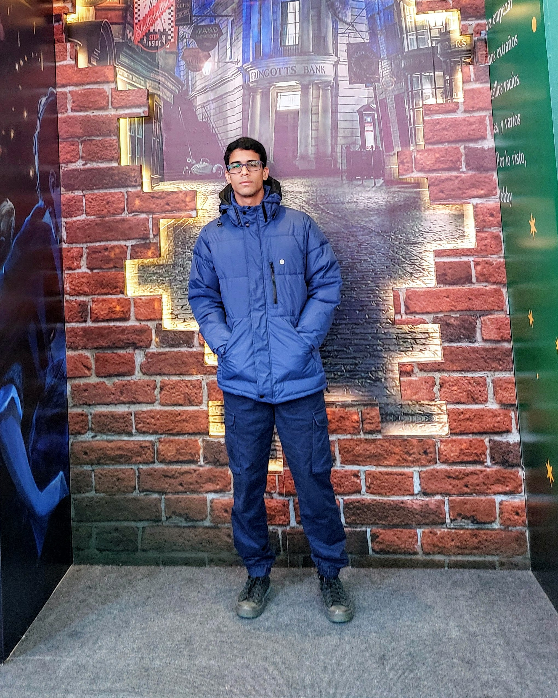<br>
        </td>
        <td align="left">
            <b>Nombre y Apellido:</b>
            <br>
            Torres Garcia, Andrés Alberto
        </td>
    </tr>
    <tr>
        <td align="left">
        <b>Carrera:</b>
        <br>
        Ingeniería de Software
        </td>
    </tr>
    <tr>
        <td align="left">
        <b>Acerca de:</b>
        <br>
         Soy estudiante de Ingeniería de Software en la UPC, con interés en el diseño y la arquitectura de software como base para construir soluciones tecnológicas de calidad. Me motiva comprender los fundamentos detrás de cada decisión técnica y aplicar buenas prácticas de programación, patrones de diseño y desarrollo de software. A lo largo de mi formación académica he venido fortaleciendo mis habilidades técnicas y de trabajo en equipo, comprometiéndome a aportar de manera responsable y proactiva. Dentro del proyecto, busco contribuir al cumplimiento de los objetivos planteados, aportando esfuerzo y compromiso para entregar una solución que responda a las necesidades del equipo.
        </td>
    </tr>
</table>

<a name="1.2."></a>

## 1.2. Solution Profile

<a name="1.2.1."></a>

### 1.2.1. Antecedentes y Problemática

Según la Ellen MacArthur Fundación (2017), la industria textil genera grandes volúmenes de residuos que no son reutilizados eficientemente, lo que representa una oportunidad clave para implementar modelos de economía circular. Debido a la alta actividad productiva en el emporio comercial de Gamarra, se generan diariamente grandes cantidades de residuos textiles que, en su mayoría, no son gestionados de manera eficiente. Sin embargo, existe una creciente necesidad por parte de artesanos, emprendedores y recolectores de acceder a materia prima para sus actividades. Sin embargo, la falta de un sistema organizado dificulta la conexión entre quienes generan estos excedentes y quienes podrían reutilizarlos, provocando desperdicio de recursos y un impacto ambiental negativo.

De acuerdo con la European Environment Agency (2019), la industria textil representa uno de los sectores con mayor impacto ambiental debido al alto volumen de residuos generados y al bajo nivel de reutilización de materiales. A pesar del potencial que tienen estos residuos para ser reincorporados en nuevos ciclos productivos, gran parte de ellos termina siendo desechado debido a la falta de sistemas eficientes que faciliten su clasificación, recuperación y redistribución. En este contexto, la adopción de enfoques basados en la economía circular resulta fundamental para reducir el desperdicio y promover un uso más sostenible de los recursos textiles.
Frente a esta problemática, nuestra solución propone una plataforma digital que facilite la gestión y redistribución de residuos textiles dentro de un enfoque de economía circular. A través de nuestro producto GamarraLoop, los talleres podrán registrar sus excedentes de forma rápida mediante el uso de Inteligencia Artificial, la cual permitirá identificar automáticamente el tipo de material y color a partir de una fotografía. Esta información será publicada en un directorio geolocalizado, creando un espacio unificado donde artesanos y recolectores podrán identificar puntos de disponibilidad y coordinar el recojo de materiales de manera eficiente, promoviendo así la reutilización de recursos y la sostenibilidad en el sector.

**WHAT (Qué): ¿Cuál es el problema?**

El problema es la ineficiente gestión y aprovechamiento de los residuos textiles generados en el emporio comercial de Gamarra. Esto se traduce en acumulación de materiales reutilizables, desperdicio de recursos valiosos y falta de visibilidad sobre la disponibilidad de estos excedentes, limitando su reutilización en otros procesos productivos.

**WHEN (Cuándo): ¿Cuándo sucede el problema?**

El problema ocurre de manera constante durante las actividades diarias de producción en los talleres de confección, especialmente al finalizar procesos de corte y fabricación, donde se generan retazos y sobrantes que no son gestionados adecuadamente.

**WHERE (Dónde): ¿Dónde surge el problema?**

El problema surge principalmente en los talleres textiles ubicados en el emporio comercial de Gamarra, donde la alta concentración de producción genera grandes volúmenes de residuos sin un sistema estructurado para su gestión y redistribución.

**WHO (Quién): ¿A quiénes les sucede el problema?**

El problema afecta directamente a los dueños de talleres, quienes no cuentan con herramientas para gestionar sus residuos. Asimismo, afecta a recolectores que podrían reutilizar estos materiales, pero no tienen acceso a información sobre su disponibilidad. De manera indirecta, también impacta al entorno urbano debido al incremento de residuos.

**WHY (Por qué): ¿Cuál es la causa del problema?**

La principal causa radica en la falta de herramientas digitales accesibles que permitan registrar, clasificar y compartir información sobre los residuos textiles. Esto se ve agravado por la baja adopción tecnológica en pequeños talleres, la informalidad del sector y la ausencia de un sistema que conecte oferta y demanda de estos materiales.

**HOW (Cómo): ¿Cómo llevó a los involucrados a llegar a esta situación?**

La dependencia de procesos manuales y prácticas informales, junto con la ausencia de soluciones tecnológicas adaptadas a este contexto, ha generado una desconexión entre quienes generan residuos y quienes podrían reutilizarlos. Esto ha derivado en una gestión ineficiente y en la pérdida de oportunidades dentro de un modelo de economía circular.

**HOW MUCH (Cuánto): ¿Cuánto afecta el problema?**

Este problema impacta significativamente en la sostenibilidad ambiental y en la eficiencia del uso de recursos, generando acumulación innecesaria de residuos y desaprovechamiento de materiales reutilizables. Además, limita oportunidades económicas para pequeños emprendedores y contribuye a la contaminación en el entorno, afectando tanto al sector productivo como a la comunidad en general.

<a name="1.2.2."></a>

### 1.2.2. Lean UX Process

<a name="1.2.2.1."></a>

#### 1.2.2.1. Lean UX Problem Statements

En la actualidad, la gestión de residuos textiles en entornos como el emporio comercial de Gamarra se realiza de manera informal y poco estructurada. Los talleres de confección generan constantemente excedentes de producción que, en muchos casos, no son reutilizados eficientemente debido a la falta de herramientas digitales accesibles que permitan registrar, clasificar y compartir esta información.

Para los generadores de estos residuos, un problema común es la dificultad para gestionar y dar visibilidad a los materiales sobrantes, lo que conlleva a su acumulación o descarte. Por otro lado, para recolectores, resulta complicado identificar y acceder a fuentes confiables de materia prima reutilizable, lo que limita sus oportunidades de producción y crecimiento.

¿Qué soluciones deberíamos brindar para lograr que los procesos relacionados con la gestión, clasificación y redistribución de residuos textiles sean más automatizados y permitan conectar de manera eficiente a los generadores con quienes pueden reutilizar estos materiales dentro de un modelo de economía circular sostenible?

<a name="1.2.2.2."></a>

#### 1.2.2.2. Lean UX Assumptions

**Business Assumptions**

- Creemos que nuestros usuarios necesitan una forma más eficiente y accesible de gestionar y reutilizar residuos textiles generados en entornos productivos como Gamarra.
- Estas necesidades se pueden resolver mediante el uso de una aplicación móvil low-code asistida por Inteligencia Artificial que permita registrar, clasificar y geolocalizar los excedentes textiles de manera rápida.
- Los clientes principales son los dueños de talleres textiles, así como recolectores que buscan acceder a materiales reutilizables de forma sencilla.
- El valor #1 que un cliente quiere del servicio es la facilidad y rapidez para publicar o encontrar materiales disponibles, optimizando tiempo y reduciendo desperdicios.
- El cliente también puede obtener beneficios adicionales mediante funcionalidades como clasificación automática por imagen, visualización en mapas geolocalizados y notificaciones de disponibilidad de materiales.
- Vamos a adquirir la mayoría de los usuarios mediante campañas de concientización, marketing digital y alianzas con asociaciones textiles y comunidades de emprendedores.
- El modelo de ingresos podrá basarse en alianzas estratégicas con organizaciones interesadas en la gestión sostenible de residuos.
- Nuestra competencia principal son los métodos tradicionales e informales de gestión de residuos, así como plataformas genéricas que no están enfocadas en economía circular ni en el sector textil.
- Los venceremos mediante el uso de Inteligencia Artificial, una experiencia de usuario simple (low-code) y un enfoque específico en la reutilización de materiales dentro de un ecosistema colaborativo.
- Nuestro mayor riesgo es la baja adopción tecnológica por parte de los talleres y la resistencia al cambio frente a procesos tradicionales.
- Resolveremos esto mediante interfaces simples, capacitación básica, demostraciones del sistema y generación de valor inmediato para los usuarios.

**Assumptions Worksheet**

- **¿Quién es el usuario?**  
  Los usuarios son dueños de talleres textiles y recolectores que buscan gestionar o acceder a materiales reutilizables de manera eficiente.

- **¿Dónde encaja nuestro producto en su trabajo o vida?**  
  La aplicación se integra en las actividades diarias de producción y recolección, facilitando el registro inmediato de residuos y la búsqueda de materiales disponibles en el entorno.

- **¿Qué problemas tiene nuestro producto que resolver?**  
  La falta de visibilidad de los residuos textiles, la desconexión entre oferta y demanda de materiales reutilizables y la baja adopción de herramientas digitales en el sector.

- **¿Cuándo y cómo es nuestro producto usado?**  
  Se utiliza durante y después de los procesos de producción, cuando se generan residuos, así como en momentos de búsqueda de materiales por parte de recolectores.

- **¿Qué características son importantes?**  
  Registro rápido mediante fotografía, clasificación automática con IA, geolocalización de materiales, interfaz simple y accesible desde dispositivos móviles.

- **¿Cómo debe verse nuestro producto y cómo comportarse?**  
  Debe ser intuitivo, rápido y fácil de usar, con una interfaz limpia que permita a usuarios no técnicos interactuar sin dificultad. Además, debe responder de manera eficiente y mostrar información clara y útil en tiempo real.

<a name="1.2.2.3."></a>

#### 1.2.2.3. Lean UX Hypothesis Statements

- Creemos que al permitir el registro de residuos textiles mediante el uso de fotografías y su clasificación automática con Inteligencia Artificial, se reducirá el esfuerzo y tiempo requerido por los talleres para gestionar sus excedentes. Sabremos que tenemos éxito cuando observemos un incremento significativo en la cantidad de publicaciones registradas y una reducción en el tiempo promedio de registro.

- Creemos que al implementar un directorio geolocalizado de residuos textiles disponibles, se facilitará la conexión entre generadores y recolectores. Sabremos que estamos cumpliendo este objetivo cuando aumente la cantidad de interacciones y coordinaciones realizadas a partir de los puntos publicados en la plataforma.

- Creemos que al ofrecer una interfaz simple y accesible (low-code), se incrementará la adopción de la plataforma por parte de usuarios con bajo nivel de experiencia tecnológica. Sabremos que tenemos éxito cuando se evidencie un crecimiento sostenido en el número de usuarios activos y una disminución en las dificultades de uso reportadas.

- Creemos que al centralizar la información sobre residuos textiles disponibles, se mejorará la visibilidad de materiales reutilizables. Sabremos que estamos cumpliendo este objetivo cuando aumente la tasa de reutilización de materiales registrados dentro del sistema.

- Creemos que al promover el uso de la plataforma como medio de gestión de residuos, se contribuirá a la reducción del desperdicio textil. Sabremos que estamos cumpliendo este objetivo cuando se observe una disminución en la acumulación de residuos no reutilizados en los talleres participantes.

<a name="1.2.2.4."></a>

#### 1.2.2.4. Lean UX Canvas

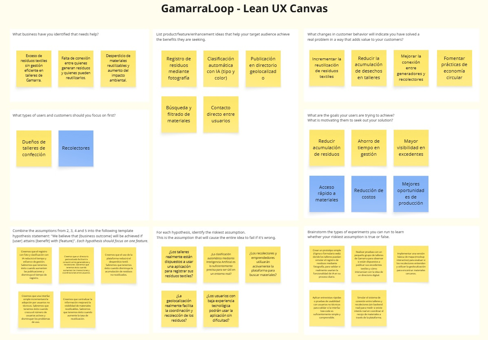<br>
*Figura: Lean Ux Canvas*

> **URL del Lean UX Canvas:** [Lean UX Canvas](https://miro.com/app/board/uXjVHd6pQow=/?share_link_id=174494873351)

<a name="1.3."></a>

## 1.3. Segmentos objetivo

En esta sección, definiremos los perfiles específicos del público objetivo para nuestro producto. Dichos grupos comparten características demográficas, comportamientos y necesidades similares, lo que permite diseñar soluciones adecuadas para optimizar la gestión y reutilización de residuos dentro de un modelo de economía circular sostenible.

**Segmento 1: Talleres de Confección**

- **Segmento demográfico:**  
  Propietarios de talleres textiles con ingresos variables, generalmente pequeños o medianos empresarios que buscan optimizar sus procesos productivos y reducir desperdicios.

- **Segmento geográfico:**  
  Ubicados principalmente en zonas urbanas con alta actividad textil, como el emporio comercial de Gamarra.

- **Segmento psicográfico:**  
  Personas prácticas que buscan soluciones simples y rápidas para gestionar sus excedentes, con interés creciente en mejorar la eficiencia y reducir pérdidas.

- **Segmento conductual:**  
  Generan residuos textiles de forma constante, registran excedentes mediante fotografías, requieren herramientas que automaticen la clasificación (tipo y color) y publican la disponibilidad para coordinar el recojo con interesados.

**Segmento 2: Recolectores**

- **Segmento demográfico:**  
  Recolectores, como emprendedores o artesanos, que buscan acceder a materia prima reutilizable para sus actividades productivas.

- **Segmento geográfico:**  
  Ubicados en zonas cercanas a centros de producción textil o con acceso a los mismos.

- **Segmento psicográfico:**  
  Personas con mentalidad emprendedora y enfoque en el aprovechamiento de recursos, interesadas en oportunidades económicas sostenibles.

- **Segmento conductual:**  
  Exploran mapas de materiales disponibles, filtran por tipo, color y cercanía, contactan talleres para coordinar el recojo y utilizan los materiales obtenidos como insumo para sus productos.

<a name="2."></a>

# Capítulo II: Requirements Elicitation & Analysis

<a name="2.1."></a>

## 2.1. Competidores

<a name="2.1.1."></a>

### 2.1.1. Análisis competitivo

<table>
  <thead>
    <tr>
      <th colspan="6" align="left">Competitive Analysis Landscape</th>
    </tr>
    <tr>
      <th align="left">¿Por qué llevar a cabo este análisis?</th>
      <th colspan="5" align="left"> Identificar las fortalezas, debilidades, oportunidades y amenazas de los principales competidores nos perimite delimitar mejor nuestro proyecto y definir nuestra propuesta diferenciada en el mercado.</th>
    </tr>
    <tr>
      <th colspan="2" align="center">Startups</th>
      <th>GamarraLoop<br></th>
      <th>Vinted<br><br></th>
      <th>Facebook Marketplace<br><br></th>
      <th>Etsy<br><br></th>
    </tr>
  </thead>
  <tbody>
    <tr>
      <th rowspan="2" valign="middle">Perfil</th>
      <td><strong>Overview</strong></td>
      <td>Sistema para gestión de residuos textiles. Conecta talleres de confeccion con artesanos y recolectores.</td>
      <td>Mercado en línea y comunitario, en el que se permite a los usuarios vender, comprar e intercambiar artículos de segunda mano.</td>
      <td>Plataforma gratuita dentro de Facebook que permite encontrar, comprar y vender artículos nuevos o de segunda mano.</td>
      <td>App dedicada al comercio electrónico, que gestiona un mercado online donde se puede comprar y vender artículos de artesanía, vintage y decorativos.</td>
    </tr>
    <tr>
      <td><strong>Ventaja competitiva</strong><br>¿Qué valor ofrece a los clientes?</td>
      <td>Clasificacion y enfoque sin transacciones monetarias.</td>
      <td>Cuenta con una de las comisiones más bajas del mercado.</td>
      <td>Permite una comunicación directa, para concretar transacciones, mediante este.</td>
      <td>Tarifa por transacción baja e incluye los gastos de envio, Además, cuenta con su propio sistema de pagos.</td>
    </tr>
    <tr>
      <th rowspan="2" valign="middle">Perfil de Marketing</th>
      <td><strong>Mercado objetivo</strong></td>
      <td>Talleres de confección, artesanos, recolectores y micro emprendedores textiles.</td>
      <td>Jóvenes y adultos interesados en artículos de segunda mano.</td>
      <td>Publico general que utiliza Facebook.</td>
      <td>Consumidores de productos del sector manualidades o vintage.</td>
    </tr>
    <tr>
      <td><strong>Estrategias de marketing</strong></td>
      <td>Alianza con talleres, campañas locales, educación sobre reciclaje textil.</td>
      <td>Influencers, redes sociales y campañas ecológicas.</td>
      <td>Publicidad dentro de Facebook.</td>
      <td>Campañas digitales.</td>
    </tr>
    <tr>
      <th rowspan="3" valign="middle">Perfil de Producto</th>
      <td><strong>Productos & Servicios</strong></td>
      <td>App móvil para encontrar residuos textiles</td>
      <td>App de venta de marcas reconocidas y variedad de productos.</td>
      <td>App que cuenta con amplia variedad de productos.</td>
      <td>Aplicación para ubicar productos personalizados y diferenciados.</td>
    </tr>
    <tr>
      <td><strong>Precios & Costos</strong></td>
      <td>Modelo gratuito para usuarios, posible monetización futura mediante servicios Premium..</td>
      <td>Comisión baja para vendedores.</td>
      <td>Gratis, sin comisiones directas.</td>
      <td>Comisión por publicación y transacción</td>
    </tr>
    <tr>
      <td><strong>Canales de distribución</strong><br>(Web y/o Móvil)</td>
      <td>Web App, Mobile App y Landing Page.</td>
      <td>Web y app móvil.</td>
      <td>Aplicación móvil y presencia web en faceebok.</td>
      <td>Aplicación móvil y web.</td>
    </tr>
    <tr>
      <th rowspan="4" valign="middle">Análisis SWOT</th>
      <td><strong>Fortalezas</strong></td>
      <td>Uso de IA para automatizar procesos, solución especializada e impacto ambiental positivo.</td>
      <td>Comunidad activa, facilidad de uso.</td>
      <td>Alcance masivo y cantidad de usuarios.</td>
      <td>Marca consolidada y productos diferenciados.</td>
    </tr>
    <tr>
      <td><strong>Debilidades</strong></td>
      <td>Dependencia de adopción inicial en talleres.</td>
      <td>Control de calidad limitado, tiempo de envios variables y algunos pases con cobertura completa del servicio.</td>
      <td>Dependencia de los usuarios para los envíos y control de calidad.</td>
      <td>Riesgo de fraudes</td>
    </tr>
    <tr>
      <td><strong>Oportunidades</strong></td>
      <td>Crecimiento en enconomia circular en Perú, escalable a otras industrias y unica en el sector específico.</td>
      <td>Crecimiento de mercado y expansión a nuevos (Latam).</td>
      <td>Incremento en el mercado de ventas de productos de manera online.  </td>
      <td>Incremento del comercio digital.</td>
    </tr>
    <tr>
      <td><strong>Amenazas</strong></td>
      <td>Baja adopción tecnológica en el sector.</td>
      <td>Alta competencia, perdida de confianza por malas experiencias.</td>
      <td>Alta competencia de otras apps.</td>
      <td>Problemas de confianza en métodos de pago afecta su uso.</td>
    </tr>
  </tbody>
</table>

---

<a name="2.1.2."></a>

### 2.1.2. Estrategias y tácticas frente a competidores

---

**Estrategia Ofensiva**

Aprovechar el crecimiento de la economía circular y la digitalización en el sector textil, creando una plataforma basada en IA y geolocalización. GamarraLoop potencia su propuesta mediante la automatización del registro de residuos textiles. Además, el desarrollo del sistema visual permitirá una fácil localización de los excedentes textiles en tiempo real, esto ayudará a la conexión eficiente entre nuestros segmentos objetivos generando valor para ambos.

---

**Estrategia Defensiva**

Analizar de manera continua las propuestas de valor de los principales competidores indirectos como Facebook Marketplace, Vinted o Etsy, con el fin de incorporar buenas prácticas y elementos diferenciadores que mantengan fresca e innovadora la solución de GamarraLoop. Adicionalmente, se reforzará la propuesta diferenciadora mediante el uso de IA y la especialización en el sector de residuos textiles. La optimización en la experiencia del usuario será un punto clave para permitirle a nuestros usuarios un flujo rápido y sencillo.

---

**Estrategia de Reorientación**

Validar y adaptar nuestro sistema en distintos segmentos dentro del perfil textil, como recicladores urbanos, emprendimientos de moda y asociaciones textiles, ajustando las funcionalidades según sus necesidades. Por otro lado, establecer alianzas estrátegicas con municipalidades, ONGs ambientales y centros de tecnología, que aporten conocimientos en IA y la interfaz. Esto permitirá mantener una mejora continua de nuestra plataforma y explorar nuevas funcionalidades.

---

**Estrategia de Supervivencia**

Reforzar la diferenciación de GamarraLoop en todos los canales de marketing, destacando su facilidad de uso, enfoque sin transacciones monetarias y su impacto ambiental positivo en la reducción de residuos textiles. También, se implementará un sistema de acompañamiento y capacitación para usuarios, con el fin de reducir la resistencia al uso de tecnología. La retroalimentación constante permitirá llevar a cabo mejorar en nuestra app, incrementando su competitividad y fortaleciendo su adopción en el mercado.

<a name="2.2."></a>

## 2.2. Entrevistas

<a name="2.2.1."></a>

### 2.2.1. Diseño de entrevistas

##### Preguntas Generales

- ¿Cuál es tu nombre y apellido?
- ¿Cuántos años tienes?
- ¿A qué te dedicas?

---

#### Segmento 1: Talleres de confección

##### Preguntas principales

- ¿Qué haces actualmente con los residuos o sobrantes textiles que generas?
- ¿Qué tipo de materiales sueles desechar o acumular?
- ¿Con qué frecuencia generas estos excedentes?
- ¿Cómo decides qué hacer con esos materiales (guardar, botar, reutilizar)?
- ¿Has intentado venderlos o regalarlos? ¿Cómo fue esa experiencia?
- ¿Qué es lo más difícil o incómodo al gestionar estos residuos?
- ¿Cuánto tiempo o esfuerzo te toma lidiar con ellos?
- ¿Qué tan cómodo te sientes usando aplicaciones móviles en tu trabajo?
- ¿Qué tan fácil sería para ti tomar una foto de un material y subirla a una app?
- Si existiera una app donde solo tomas una foto y automáticamente se publica el material para que otros lo recojan, ¿la usarías? ¿Qué debería tener para que realmente te sea útil?

---

#### Segmento 2: Artesanos/ recolectores

##### Preguntas principales

- ¿Dónde consigues actualmente los materiales textiles que utilizas?
- ¿Qué tipo de materiales buscas con mayor frecuencia?
- ¿Qué dificultades tienes para encontrar materiales accesibles o reutilizables?
- ¿Te ha pasado que no encuentras lo que necesitas? ¿Qué haces en ese caso?
- ¿Cómo te enteras cuando alguien tiene materiales disponibles?
- ¿Qué tan importante es para ti la cercanía del lugar donde están los materiales?
- ¿Cuánto tiempo inviertes buscando materiales?
- ¿Qué es lo más complicado o frustrante en ese proceso?
- ¿Qué tan cómodo te sientes usando apps con mapas o ubicación?
- Si existiera una app donde puedas ver materiales disponibles en un mapa y contactar al taller para recogerlos, ¿la usarías? ¿Qué funcionalidad sería indispensable para ti?

---

<a name="2.2.2."></a>

### 2.2.2. Registro de entrevistas

#### Entrevistas Recopiladas

[Video de Entrevista](https://upcedupe-my.sharepoint.com/:v:/g/personal/u201913495_upc_edu_pe/IQCG3I3xirNgRLlYRp8jvFvdAVxnozrRDNJhoAe3dCki3OE?e=isARYl&nav=eyJyZWZlcnJhbEluZm8iOnsicmVmZXJyYWxBcHAiOiJTdHJlYW1XZWJBcHAiLCJyZWZlcnJhbFZpZXciOiJTaGFyZURpYWxvZy1MaW5rIiwicmVmZXJyYWxBcHBQbGF0Zm9ybSI6IldlYiIsInJlZmVycmFsTW9kZSI6InZpZXcifX0%3D)

#### Entrevistas al Segmento 1: Talleres de confección

#### Entrevista 1

| Campo             | Detalle                                                                                                                                                                                                                                                                                                                                        |
| ----------------- | ---------------------------------------------------------------------------------------------------------------------------------------------------------------------------------------------------------------------------------------------------------------------------------------------------------------------------------------------- |
| **Entrevistado**  | Piero Gamio                                                                                                                                                                                                                                                                                                                                    |
| **Entrevistador** | Rafael Cuya                                                                                                                                                                                                                                                                                                                                    |
| **Sexo**          | Masculino                                                                                                                                                                                                                                                                                                                                      |
| **Edad**          | 32                                                                                                                                                                                                                                                                                                                                             |
| **Distrito**      | Lince                                                                                                                                                                                                                                                                                                                                          |
| **Evidencia**     | <br>*Figura: Entrevista 1*                                                                                                                                                                                                             |
| **Timing**        | 05:28                                                                                                                                                                                                                                                                                                                                          |
| **Link**          | [Video de Entrevista](https://upcedupe-my.sharepoint.com/:v:/g/personal/u201913495_upc_edu_pe/IQAN7gYHGcYlSLXuoJ9JBJjkAf3Zrbft26IoBjtFGzD699k?e=QFawgz&nav=eyJyZWZlcnJhbEluZm8iOnsicmVmZXJyYWxBcHAiOiJTdHJlYW1XZWJBcHAiLCJyZWZlcnJhbFZpZXciOiJTaGFyZURpYWxvZy1MaW5rIiwicmVmZXJyYWxBcHBQbGF0Zm9ybSI6IldlYiIsInJlZmVycmFsTW9kZSI6InZpZXcifX0%3D) |
| **Resumen**       | Piero nos comenta que genera retazos de tela casi todos los días y los acumula hasta que ocupan mucho espacio. A veces los regala o los da a recicladores, pero coordinar es complicado. Dice que le gustaría algo simple para deshacerse de esos materiales rápido, sin perder tiempo.                                                        |

#### Entrevista 2

| Campo             | Detalle                                                                                                                                                                                                                                                                                                                                        |
| ----------------- | ---------------------------------------------------------------------------------------------------------------------------------------------------------------------------------------------------------------------------------------------------------------------------------------------------------------------------------------------- |
| **Entrevistado**  | Rosa Martínez                                                                                                                                                                                                                                                                                                                                  |
| **Entrevistador** | Williams Gongora Castillejos                                                                                                                                                                                                                                                                                                                   |
| **Sexo**          | Femenino                                                                                                                                                                                                                                                                                                                                       |
| **Edad**          | 34                                                                                                                                                                                                                                                                                                                                             |
| **Distrito**      | La Victoria                                                                                                                                                                                                                                                                                                                                    |
| **Evidencia**     | <br>*Figura: Entrevista 2*                                                                                                                                                                                                             |
| **Timing**        | 06:02                                                                                                                                                                                                                                                                                                                                          |
| **Link**          | [Video de Entrevista](https://upcedupe-my.sharepoint.com/:v:/g/personal/u201913495_upc_edu_pe/IQArNG8BqQYzTr7f2-UB5DbSAeSejaqnHHuiyOv-EuvjNpw?e=DdlBtz&nav=eyJyZWZlcnJhbEluZm8iOnsicmVmZXJyYWxBcHAiOiJTdHJlYW1XZWJBcHAiLCJyZWZlcnJhbFZpZXciOiJTaGFyZURpYWxvZy1MaW5rIiwicmVmZXJyYWxBcHBQbGF0Zm9ybSI6IldlYiIsInJlZmVycmFsTW9kZSI6InZpZXcifX0%3D) |
| **Resumen**       | Rosa menciona que en el taller juntan los residuos en bolsas y luego los botan o venden barato. El problema es que no siempre hay quién los compre. Para ella, sería útil una app donde pueda publicar rápido los materiales y que alguien los recoja sin tanto trámite.                                                                       |

---

#### Entrevista 3

| Campo             | Detalle                                                                                                                                                                                                                                                                                                                                        |
| ----------------- | ---------------------------------------------------------------------------------------------------------------------------------------------------------------------------------------------------------------------------------------------------------------------------------------------------------------------------------------------- |
| **Entrevistado**  | Fabrizio                                                                                                                                                                                                                                                                                                                                       |
| **Entrevistador** | Andrés Torres                                                                                                                                                                                                                                                                                                                                  |
| **Sexo**          | Masculino                                                                                                                                                                                                                                                                                                                                      |
| **Edad**          | 22                                                                                                                                                                                                                                                                                                                                             |
| **Distrito**      | Chorrillos                                                                                                                                                                                                                                                                                                                                     |
| **Evidencia**     | <br>*Figura: Entrevista 3*                                                                                                                                                                                                             |
| **Timing**        | 03:43                                                                                                                                                                                                                                                                                                                                          |
| **Link**          | [Video de Entrevista](https://upcedupe-my.sharepoint.com/:v:/g/personal/u201913495_upc_edu_pe/IQDKYfua_SghSL9Ho4qeQKQHAfLgcdUG9dIqtuEfJrs-yLQ?e=Podp5t&nav=eyJyZWZlcnJhbEluZm8iOnsicmVmZXJyYWxBcHAiOiJTdHJlYW1XZWJBcHAiLCJyZWZlcnJhbFZpZXciOiJTaGFyZURpYWxvZy1MaW5rIiwicmVmZXJyYWxBcHBQbGF0Zm9ybSI6IldlYiIsInJlZmVycmFsTW9kZSI6InZpZXcifX0%3D) |
| **Resumen**       | Fabrizio explica que generan muchos residuos y aunque intentan reutilizar algunos, la mayoría se pierde. Siente que falta una forma organizada de conectar con personas interesadas. Dice que usaría una app si le facilita ubicar y coordinar el recojo.                                                                                      |

#### Entrevistas al Segmento 2: Artesanos/recolectores

#### Entrevista 1

| Campo             | Detalle                                                                                                                                                                                                                                                                                                                                        |
| ----------------- | ---------------------------------------------------------------------------------------------------------------------------------------------------------------------------------------------------------------------------------------------------------------------------------------------------------------------------------------------- |
| **Entrevistado**  | Anthony Martín Huapaya Cuevas                                                                                                                                                                                                                                                                                                                  |
| **Entrevistador** | Elizabeth Lucero Huanaco Huayta                                                                                                                                                                                                                                                                                                                |
| **Sexo**          | Masculino                                                                                                                                                                                                                                                                                                                                      |
| **Edad**          | 26                                                                                                                                                                                                                                                                                                                                             |
| **Distrito**      | Jesús Maria                                                                                                                                                                                                                                                                                                                                    |
| **Evidencia**     | <br>*Figura: Entrevista 1*                                                                                                                                                                                                             |
| **Timing**        | 08:05                                                                                                                                                                                                                                                                                                                                          |
| **Link**          | [Video de Entrevista](https://upcedupe-my.sharepoint.com/:v:/g/personal/u20211g522_upc_edu_pe/IQDfTLJqZPgERq92KZQYQyIcAamOMdEuGeg0HEMG1UtIuTU?e=Pjbsgr&nav=eyJyZWZlcnJhbEluZm8iOnsicmVmZXJyYWxBcHAiOiJTdHJlYW1XZWJBcHAiLCJyZWZlcnJhbFZpZXciOiJTaGFyZURpYWxvZy1MaW5rIiwicmVmZXJyYWxBcHBQbGF0Zm9ybSI6IldlYiIsInJlZmVycmFsTW9kZSI6InZpZXcifX0%3D) |
| **Resumen**       | Anthony cuenta que busca materiales en Gamarra o con recicladores, pero muchas veces no encuentra lo que necesita. Pierde tiempo buscando y a veces termina comprando más caro. Le interesaría una app donde pueda ver materiales cercanos y elegir más rápido.                                                                                |

---

#### Entrevista 2

| Campo             | Detalle                                                                                                                                                                                                                                                                                                                                        |
| ----------------- | ---------------------------------------------------------------------------------------------------------------------------------------------------------------------------------------------------------------------------------------------------------------------------------------------------------------------------------------------- |
| **Entrevistado**  | Carlos Ramos                                                                                                                                                                                                                                                                                                                                   |
| **Entrevistador** | Rafael Cuya                                                                                                                                                                                                                                                                                                                                    |
| **Sexo**          | Masculino                                                                                                                                                                                                                                                                                                                                      |
| **Edad**          | 28                                                                                                                                                                                                                                                                                                                                             |
| **Distrito**      | Lince                                                                                                                                                                                                                                                                                                                                          |
| **Evidencia**     | <br>*Figura: Entrevista 2*                                                                                                                                                                                                             |
| **Timing**        | 05:01                                                                                                                                                                                                                                                                                                                                          |
| **Link**          | [Video de Entrevista](https://upcedupe-my.sharepoint.com/:v:/g/personal/u201913495_upc_edu_pe/IQBK4us_1WkPR468kAVyanV0ASwmeiolYIAU2Cb3FhJRLc8?e=i9k3rf&nav=eyJyZWZlcnJhbEluZm8iOnsicmVmZXJyYWxBcHAiOiJTdHJlYW1XZWJBcHAiLCJyZWZlcnJhbFZpZXciOiJTaGFyZURpYWxvZy1MaW5rIiwicmVmZXJyYWxBcHBQbGF0Zm9ybSI6IldlYiIsInJlZmVycmFsTW9kZSI6InZpZXcifX0%3D) |
| **Resumen**       | Carlos comenta que encuentra materiales caminando y preguntando en talleres. A veces pierde medio día sin conseguir nada. Dice que le serviría mucho saber dónde hay material disponible sin tener que buscar tanto.                                                                                                                           |

---

#### Entrevista 3

| Campo             | Detalle                                                                                                                                                                                                                                                                                                                                                                                                                         |
| ----------------- | ------------------------------------------------------------------------------------------------------------------------------------------------------------------------------------------------------------------------------------------------------------------------------------------------------------------------------------------------------------------------------------------------------------------------------- |
| **Entrevistado**  | Julio Rivera                                                                                                                                                                                                                                                                                                                                                                                                                    |
| **Entrevistador** | Piero Molina                                                                                                                                                                                                                                                                                                                                                                                                                    |
| **Sexo**          | Masculino                                                                                                                                                                                                                                                                                                                                                                                                                       |
| **Edad**          | 31                                                                                                                                                                                                                                                                                                                                                                                                                              |
| **Distrito**      | Jesús Maria                                                                                                                                                                                                                                                                                                                                                                                                                     |
| **Evidencia**     | <br>*Figura: Entrevista 3*                                                                                                                                                                                                                                                                                              |
| **Timing**        | 00:06:12                                                                                                                                                                                                                                                                                                                                                                                                                        |
| **Link**          | [Video de Entrevista](https://upcedupe-my.sharepoint.com/:v:/g/personal/u201913495_upc_edu_pe/IQCzJIS6m2xIRbHBWJGDkaK_AeiWOaK4J9QIwCrWbHR2qKw?e=d0M2U2&nav=eyJyZWZlcnJhbEluZm8iOnsicmVmZXJyYWxBcHAiOiJTdHJlYW1XZWJBcHAiLCJyZWZlcnJhbFZpZXciOiJTaGFyZURpYWxvZy1MaW5rIiwicmVmZXJyYWxBcHBQbGF0Zm9ybSI6IldlYiIsInJlZmVycmFsTW9kZSI6InZpZXcifX0%3D)                                                                                  |
| **Resumen**       | En la entrevista realizada a Julio Rivera, se identificó que los artesanos dependen principalmente de talleres de confección, mercados textiles y contactos informales para conseguir materiales reutilizables. La principal problemática es la dificultad para encontrar materiales disponibles, cercanos y en buen estado, por lo que una plataforma con geolocalización y reserva facilitaría significativamente su trabajo. |

---

<a name="2.2.3."></a>

### 2.2.3. Análisis de entrevistas

De acuerdo con lo que hemos podido observar en las entrevistas realizadas a trabajadores o dueños de talleres de confección y artesanos/recolectores, se identificó que el 100% de los entrevistados gestiona los residuos textiles de forma manual, lo que evidencia una clara falta de digitalización en el proceso. En el caso de los talleres, el principal problema es la acumulación de residuos y la falta de espacio, además de la dificultad para encontrar personas que los recojan. Por otro lado, los artesanos y recolectores indicaron que obtienen materiales de forma informal, lo que implica una alta inversión de tiempo en la búsqueda, llegando incluso a perder varias horas sin resultados. Respecto al uso de tecnología, el 75% estaría dispuesto a usar una aplicación móvil, siempre que sea simple y rápida, mientras que el resto muestra cierta dificultad en su uso. Sin embargo, el 100% coincide en que sería útil contar con una herramienta que permita ver materiales disponibles, especialmente si incluye ubicación y fotos. En conclusión, el principal problema identificado es la falta de visibilidad y conexión entre quienes generan y quienes necesitan los materiales, lo que valida el desarrollo de una solución como GamarraLoop basada en registro rápido y geolocalización.

---

<a name="2.3."></a>

## 2.3. Needfinding

<a name="2.3.1."></a>

### 2.3.1. User Personas

**Figura 2**

_User Persona del segmento Talleres_

<br>
*Figura: 2.3.1. User Personas*

_Nota._ Elaboración propia (2026) en UXPressia.

---

**Figura 3**

_User Persona del segmento Artesanos/Recolectores_

<br>
*Figura: 2.3.1. User Personas*

_Nota._ Elaboración propia (2026) en UXPressia.

---

<a name="2.3.2."></a>

### 2.3.2. User Task Matrix

| Tarea                                  | Usuario 1 (Frecuencia) | Usuario 1 (Importancia) | Usuario 2 (Frecuencia) | Usuario 2 (Importancia) |
| -------------------------------------- | ---------------------- | ----------------------- | ---------------------- | ----------------------- |
| Registrar residuos textiles            | Siempre                | Alta                    | —                      | —                       |
| Tomar foto del material                | Siempre                | Alta                    | —                      | —                       |
| Publicar disponibilidad de materiales  | Frecuentemente         | Alta                    | —                      | —                       |
| Coordinar recojo con interesados       | Siempre                | Alta                    | —                      | —                       |
| Organizar residuos en el taller        | Frecuentemente         | Media                   | —                      | —                       |
| Buscar a quién recoja materiales       | Siempre                | Alta                    | —                      | —                       |
| Buscar materiales reutilizables        | —                      | —                       | Siempre                | Alta                    |
| Revisar materiales reutilizables       | —                      | —                       | Siempre                | Alta                    |
| Filtrar por tipo/color de tela         | —                      | —                       | Siempre                | Alta                    |
| Ubicar materiales en el mapa           | —                      | —                       | Frecuentemente         | Alta                    |
| Contactar al taller                    | —                      | —                       | Siempre                | Alta                    |
| Coordinar recojo                       | —                      | —                       | Frecuentemente         | Alta                    |
| Comparar opciones de materiales        | —                      | —                       | Ocasionalmente         | Alta                    |
| Seleccionar material según preferencia | —                      | —                       | Frecuentemente         | Media                   |

**Análisis**
En la matriz de tareas podemos observar las actividades con mayor frecuencia e importancia, tenemos acciones como registrar materiales, tomar fotos, publicar disponibilidad y coordinar recojo para los talleres de confección. Esto evidencia la necesidad de contar con un proceso rápido y sencillo que ayude a la gestión de residuos en estos establecimientos.

Por otro lado, para el segmento Artesano/recolectores, encontramos que dentro de las tareas mas importantes estan buscar materiales, visualizar opciones disponibles, ubicarlos mediante un mapa y conectase con tallers. Esto refleja que el principal valor para este segmento es la accesibilidad y visibilidad de recursos disponibles.

La matriz de tareas nos perimite identificar cuales son las funcionalidades mas críticas del sistema y en que secciones debemos centrarnos para que nuestra aplicación sea eficiente.

<a name="2.3.3."></a>

### 2.3.3. User Journey Mapping

---

**Figura 4**

_User Journey Map As-Is del segmento Talleres_

<br>
*Figura: 2.3.3. User Journey Mapping*

_Nota._ Elaboración propia (2026) en UXPressia.

---

**Figura 5**

_User Journey Map As-Is del segmento Artesanos/Recolectores_

<br>
*Figura: 2.3.3. User Journey Mapping*

_Nota._ Elaboración propia (2026) en UXPressia.

<a name="2.3.4."></a>

### 2.3.4. Empathy Mapping

---

**Figura 6**

_Empathy Map del segmento Talleres_

<br>
*Figura: 2.3.4. Empathy Mapping*

_Nota._ Elaboración propia (2026) en UXPressia.

---

**Figura 7**

_Empathy Map del segmento Artesanos/Recolectores_

<br>
*Figura: 2.3.4. Empathy Mapping*

_Nota._ Elaboración propia (2026) en UXPressia.

<a name="2.3.5."></a>

### 2.3.5. As-is Scenario Mapping

---

Figura 8

_As-Is Scenario Map del segmento Talleres_

<br>
*Figura: 2.3.5. As-is Scenario Mapping*

_Nota._ Elaboración propia (2026) en Miro.

---

Figura 9

_As-Is Scenario Map del segmento Artesanos/Recolectores_

<br>
*Figura: 2.3.5. As-is Scenario Mapping*

_Nota._ Elaboración propia (2026) en Miro.

---

<a name="2.4."></a>

## 2.4. Ubiquitous Language

| Término                   | Definición                                                                                                           |
| ------------------------- | -------------------------------------------------------------------------------------------------------------------- |
| GamarraLoop / GamarraLoop | Aplicación que conecta talleres de confección con artesanos/recolectores para la reutilización de residuos textiles. |
| Residuo textil            | Material sobrante generado en los procesos de confección (retazos, telas, excedentes).                               |
| Excedente                 | Cantidad de material textil que no será utilizado por el taller y está disponible para reutilización.                |
| Lote de tela              | Conjunto de residuos textiles agrupados y publicados como una unidad dentro del sistema.                             |
| Taller de confección      | Usuario que genera residuos textiles y los publica en la plataforma.                                                 |
| Artesano                  | Usuario que reutiliza materiales textiles para crear nuevos productos.                                               |
| Recolector                | Usuario que busca, recoge y reutiliza residuos textiles disponibles en la plataforma.                                |
| Publicación de lote       | Acción de registrar un lote de tela en el sistema mediante foto, ubicación y descripción.                            |
| Clasificación automática  | Proceso en el que la IA identifica el tipo de material y color a partir de una imagen.                               |
| Geolocalización           | Funcionalidad que permite ubicar los lotes en un mapa según su ubicación real.                                       |
| Punto de recojo           | Ubicación física donde el artesano o recolector puede recoger el lote publicado.                                     |
| Estado del lote           | Condición actual del lote dentro del sistema (Disponible, Reservado, Entregado, Expirado, Cancelado).                |
| Reserva de lote           | Acción mediante la cual un artesano asegura un lote antes de recogerlo.                                              |
| Confirmación de entrega   | Acción del taller para indicar que el lote fue entregado físicamente.                                                |
| Confirmación de recepción | Acción del artesano para indicar que recibió el lote correctamente.                                                  |
| Directorio de materiales  | Vista donde se muestran los lotes disponibles con información relevante.                                             |
| Usuario                   | Persona que utiliza la plataforma (taller o artesano).                                                               |
| Perfil de usuario         | Información básica del usuario dentro del sistema (nombre, rol, contacto).                                           |
| Interacción               | Acción de contacto o coordinación entre taller y artesano.                                                           |
| Economía circular         | Modelo que promueve la reutilización de materiales para reducir residuos.                                            |
| Low-code                  | Enfoque de desarrollo que permite usar la aplicación con mínima complejidad técnica.                                 |
| API RESTful               | Servicio backend que permite la comunicación entre frontend y sistema.                                               |
| Notificación              | Mensaje enviado al usuario sobre eventos importantes (reserva, entrega, etc.).                                       |
| Expiración de lote        | Estado automático que se asigna a un lote no recogido después de cierto tiempo.                                      |

<a name="3."></a>

# Capítulo III: Requirements Specification

<a name="3.1."></a>

## 3.1. To-Be Scenario Mapping

En esta sección se presenta el **To-Be Scenario Mapping** de Gamarra Loop, el cual proyecta la experiencia ideal futura de nuestros User Personas al interactuar con nuestra solución digital.

A continuación, se presentan las capturas de los To-Be Scenario Mapping elaborados:

- **To-Be Scenario: Taller Textil**

<br>
*Figura: 3.1. To-Be Scenario Mapping*

_Nota._ Elaboración propia (2026) en Miro.

<br>

- **To-Be Scenario: Artesano**

<br>
*Figura: 3.1. To-Be Scenario Mapping*

_Nota._ Elaboración propia (2026) en Miro.

<br>

<a name="3.2."></a>

## 3.2. User Stories

En esta sección se detallan las _Epics_ y los _User Stories_ (incluyendo _Technical Stories_) que conforman los requisitos funcionales de **Gamarra Loop**. Los criterios de aceptación están redactados siguiendo la estructura _Gherkin_ (Given-When-Then), garantizando que las condiciones sean comprobables y estén enfocadas en el comportamiento del sistema sin depender de detalles específicos de la interfaz de usuario.

### Epics

| Epic ID  | Título del Epic                  | Descripción                                                                                                                                 |
| :------- | :------------------------------- | :------------------------------------------------------------------------------------------------------------------------------------------ |
| **EP01** | Landing Page y Adquisición       | Funcionalidades de la página web estática para informar y captar Talleres donantes y Artesanos recicladores.                                |
| **EP02** | Publicación de Lotes (Talleres)  | Funciones para que los talleres publiquen lotes de tela, incluyendo la asignación de la ubicación como punto de recojo en Gamarra.          |
| **EP03** | Procesamiento de Textiles (IA)   | Capacidades del sistema para analizar la foto del lote usando Google Cloud Vision y determinar viabilidad/material.                         |
| **EP04** | Exploración y Recojo (Artesanos) | Funciones para que los artesanos encuentren lotes disponibles, los reserven y confirmen su recojo físico en los talleres.                   |
| **EP05** | Technical Stories (APIs)         | Historias técnicas orientadas a los servicios backend, APIs RESTful y comunicación con servicios externos (agnóstico a la infraestructura). |

### User Stories

| User Story ID | Título                                     | Descripción                                                                                                                                                               | Criterios de Aceptación                                                                                                                                                                                                                                                               | Relacionado con (Epic ID) |
| :------------ | :----------------------------------------- | :------------------------------------------------------------------------------------------------------------------------------------------------------------------------ | :------------------------------------------------------------------------------------------------------------------------------------------------------------------------------------------------------------------------------------------------------------------------------------ | :------------------------ |
| **US01**      | Propuesta de valor en Landing Page         | Como Visitante, quiero visualizar la propuesta de valor del proyecto para entender cómo funciona el reciclaje de textiles.                                                | **Dado** que un visitante ingresa al sitio web estático<br>**Cuando** la página carga exitosamente<br>**Entonces** el sistema expone la propuesta de valor principal sobre reciclaje textil.                                                                                          | EP01                      |
| **US02**      | Sección de contacto para talleres          | Como Visitante del segmento Taller, quiero leer información sobre cómo mi empresa puede afiliarse a Gamarra Loop para publicar lotes sobrantes.                           | **Dado** que un visitante del segmento taller navega por la página web<br>**Cuando** el visitante accede a la sección de aliados estratégicos<br>**Entonces** el sistema presenta los requisitos y provee un canal de contacto para afiliación.                                       | EP01                      |
| **US03**      | Redirección a descarga de App              | Como Visitante, quiero encontrar un enlace directo a la tienda de aplicaciones para descargar la aplicación móvil fácilmente.                                             | **Dado** que un visitante interactúa con el sitio web estático<br>**Cuando** el visitante solicita la descarga de la app<br>**Entonces** el sistema redirige la navegación a la tienda de aplicaciones correspondiente al sistema operativo.                                          | EP01                      |
| **US04**      | Creación de perfil básico                  | Como Usuario, quiero crear un perfil indicando mi rol (Taller o Artesano) sin procesos complejos de contraseñas para empezar a usar la app.                               | **Dado** que un usuario ingresa por primera vez<br>**Cuando** el usuario provee su nombre, contacto y selecciona su rol<br>**Entonces** el sistema guarda el perfil de forma simplificada y autoriza el acceso a la plataforma.                                                       | EP02                      |
| **US05**      | Carga de imagen de lote de tela            | Como Confeccionista, quiero tomar una foto de mis retazos de tela para publicar el lote en la plataforma.                                                                 | **Dado** que un confeccionista inicia la publicación de un lote<br>**Cuando** el confeccionista proporciona una fotografía nítida de los textiles<br>**Entonces** el sistema almacena temporalmente la imagen y la envía a procesar.                                                  | EP02                      |
| **US06**      | Asignación automática de ubicación         | Como Confeccionista, quiero que al publicar un lote, mi ubicación actual en Gamarra se asigne automáticamente como el punto de recojo.                                    | **Dado** que un confeccionista está publicando un nuevo lote<br>**Cuando** el dispositivo captura las coordenadas GPS actuales<br>**Entonces** el sistema asocia estas coordenadas al lote como el punto exacto de recojo.                                                            | EP02                      |
| **US07**      | Edición manual de ubicación de recojo      | Como Confeccionista, quiero poder agregar referencias a la ubicación automática (ej. número de stand o galería) para que el artesano me encuentre fácilmente.             | **Dado** que el sistema ha asignado una ubicación al lote<br>**Cuando** el confeccionista provee texto adicional como referencia de ubicación<br>**Entonces** el sistema adjunta este texto a los datos geográficos del lote.                                                         | EP02                      |
| **US08**      | Cancelación de lote publicado              | Como Confeccionista, quiero poder cancelar la publicación de mi lote en caso la tela ya no esté disponible.                                                               | **Dado** que un confeccionista tiene un lote en estado 'Disponible'<br>**Cuando** el confeccionista ejecuta la acción de cancelar publicación<br>**Entonces** el sistema actualiza el estado del lote a 'Cancelado' y lo oculta de consultas públicas.                                | EP02                      |
| **US09**      | Confirmación de entrega al artesano        | Como Confeccionista, quiero confirmar en la app que entregué el lote de tela al artesano que vino a recogerlo.                                                            | **Dado** que un lote se encuentra en estado 'Reservado'<br>**Cuando** el confeccionista emite la confirmación de entrega física<br>**Entonces** el sistema actualiza el estado del lote a 'Entregado' definitivamente.                                                                | EP02                      |
| **US10**      | Extracción de metadatos de imagen          | Como Confeccionista, quiero que el sistema analice la foto de mi lote para determinar su material automáticamente.                                                        | **Dado** que el sistema ha recibido la imagen del lote<br>**Cuando** el sistema procesa la imagen a través del servicio de IA<br>**Entonces** el sistema genera una lista de etiquetas descriptivas sobre el textil.                                                                  | EP03                      |
| **US11**      | Presentación de resultados de IA           | Como Confeccionista, quiero visualizar la categoría en la que fue clasificado mi lote para confirmar si la IA acertó.                                                     | **Dado** que el análisis de la imagen del lote finaliza exitosamente<br>**Cuando** el sistema recibe los resultados de clasificación<br>**Entonces** el sistema asocia las etiquetas al lote y las presenta al confeccionista antes de la publicación final.                          | EP03                      |
| **US12**      | Visualización de lotes disponibles         | Como Artesano, quiero ver una lista de los lotes de tela publicados en Gamarra para saber a dónde dirigirme.                                                              | **Dado** que un artesano consulta el listado de lotes<br>**Cuando** el sistema recupera los datos del backend<br>**Entonces** el sistema presenta los lotes en estado 'Disponible' ordenados por proximidad o fecha.                                                                  | EP04                      |
| **US13**      | Ver detalle del lote                       | Como Artesano, quiero seleccionar un lote para ver su foto, el material identificado y la ubicación exacta del taller.                                                    | **Dado** que un artesano explora la lista de lotes<br>**Cuando** el artesano solicita el detalle de un elemento específico<br>**Entonces** el sistema retorna la imagen ampliada, las etiquetas y las referencias exactas de ubicación.                                               | EP04                      |
| **US14**      | Reserva de lote para recojo                | Como Artesano, quiero marcar un lote como 'Reservado' para asegurar que el taller me lo guarde mientras voy en camino.                                                    | **Dado** que un artesano evalúa un lote 'Disponible'<br>**Cuando** el artesano ejecuta la acción de reserva sobre dicho lote<br>**Entonces** el sistema cambia el estado del lote a 'Reservado'.                                                                                      | EP04                      |
| **US15**      | Confirmación de recepción                  | Como Artesano, quiero confirmar en mi aplicación que ya recibí el lote una vez que estoy en el taller.                                                                    | **Dado** que un artesano ha reservado un lote<br>**Cuando** el artesano emite la confirmación de recepción física tras el recojo<br>**Entonces** el sistema marca el lote como completado en el registro histórico del artesano.                                                      | EP04                      |
| **US16**      | Recepción de notificación de reserva       | Como Confeccionista, quiero recibir una notificación inmediata cuando un artesano reserve mi lote para estar preparado para la entrega.                                   | **Dado** que un artesano reserva un lote exitosamente<br>**Cuando** el sistema backend registra el cambio a estado 'Reservado'<br>**Entonces** el sistema emite una alerta o notificación al dispositivo del confeccionista creador del lote.                                         | EP02                      |
| **US17**      | Integración con Google Cloud Vision        | Como Developer, quiero implementar un servicio interno que se comunique con la API de Cloud Vision para delegar el reconocimiento de imágenes.                            | **Dado** que el servicio recibe un payload con una imagen<br>**Cuando** interactúa con la API externa de Google Cloud Vision<br>**Entonces** el servicio retorna una lista de etiquetas y niveles de confianza.                                                                       | EP05                      |
| **US18**      | Endpoint de listado de lotes activos       | Como Developer, quiero exponer una API que provea rápidamente los lotes disponibles para que la app cliente los muestre sin demoras.                                      | **Dado** que el endpoint recibe una petición GET de consulta de lotes<br>**Cuando** el servicio lee los registros de la base de datos con estado 'Disponible'<br>**Entonces** retorna un JSON con la lista de lotes.                                                                  | EP05                      |
| **US19**      | Servicio transaccional de reserva          | Como Developer, quiero implementar un servicio seguro para cambiar el estado de un lote a 'Reservado', evitando que dos artesanos reserven el mismo lote al mismo tiempo. | **Dado** que el endpoint recibe una petición de reserva con el ID del lote y el ID del artesano<br>**Cuando** el servicio valida que el lote sigue disponible mediante un bloqueo o transacción<br>**Entonces** actualiza el estado y asocia el ID del artesano, retornando un éxito. | EP05                      |
| **US20**      | Servicio de compresión de imágenes         | Como Developer, quiero que las fotos subidas se compriman automáticamente en el servidor/backend para ahorrar almacenamiento y acelerar la carga de listas.               | **Dado** que se recibe un archivo de imagen en el servidor de almacenamiento<br>**Cuando** el proceso de guardado finaliza<br>**Entonces** un proceso asíncrono genera y guarda una versión de baja resolución (thumbnail).                                                           | EP05                      |
| **US21**      | Servicio programado de expiración de lotes | Como Developer, quiero configurar un cronjob o tarea programada que marque como expirados los lotes que lleven más de 48 horas sin ser recogidos.                         | **Dado** que se ejecuta la tarea de limpieza del sistema<br>**Cuando** identifica registros en estado 'Disponible' con antigüedad mayor al umbral de 48 horas<br>**Entonces** el sistema actualiza su estado a 'Expirado' automáticamente en la base de datos.                        | EP05                      |
| **US22**      | Servicio de emisión de notificaciones      | Como Developer, quiero implementar un servicio centralizado de notificaciones que alerte a los usuarios sobre cambios críticos en sus lotes.                              | **Dado** que ocurre un evento de dominio como una reserva o confirmación de entrega<br>**Cuando** el servicio procesador captura el evento<br>**Entonces** invoca la API del proveedor de notificaciones para enviar un mensaje push al cliente.                                      | EP05                      |

<a name="3.3."></a>

## 3.3. Impact Mapping

En esta sección se presenta el **Impact Mapping** de Gamarra Loop, una herramienta estratégica que alinea los objetivos de negocio del proyecto con el comportamiento esperado de nuestros usuarios clave: los **Talleres Textiles** (representantes de los confeccionistas que donan sus sobrantes) y los **Artesanos** (quienes recogen estos lotes para reciclarlos en Gamarra).

El mapa visualiza cómo las funcionalidades de la plataforma (Deliverables) y nuestras User Stories motivarán a estos actores a cambiar su comportamiento tradicional de descarte de telas, facilitando así el cumplimiento de nuestras metas comerciales y logísticas a corto plazo.

A continuación, se detalla el Impact Map elaborado en **UXpressia**:

- Usuario: Taller Textil (Confeccionista)

<br>
*Figura: 3.3. Impact Mapping*

_Nota._ Elaboración propia (2026) en UXPressia.

<br>

- Usuario: Artesano

<br>
*Figura: 3.3. Impact Mapping*

_Nota._ Elaboración propia (2026) en UXPressia.

<br>

<a name="3.4."></a>

## 3.4. Product Backlog

En esta sección se presenta el **Product Backlog** de Gamarra Loop. La priorización se ha realizado basándose en el **valor para el negocio**, colocando en primer lugar los requisitos fundamentales para validar el modelo (Landing Page) y las funciones _core_ de intercambio de textiles (publicación y reserva), dejando para iteraciones posteriores las funciones de soporte (perfiles, notificaciones y automatizaciones de limpieza).

| # Orden | User Story Id | Título                                     | Descripción                                                                                                                                                               | Story Points (1 / 2 / 3 / 5 / 8) |
| :------ | :------------ | :----------------------------------------- | :------------------------------------------------------------------------------------------------------------------------------------------------------------------------ | :------------------------------- |
| 1       | **US01**      | Propuesta de valor en Landing Page         | Como Visitante, quiero visualizar la propuesta de valor del proyecto para entender cómo funciona el reciclaje de textiles.                                                | 2                                |
| 2       | **US02**      | Sección de contacto para talleres          | Como Visitante del segmento Taller, quiero leer información sobre cómo mi empresa puede afiliarse a Gamarra Loop para publicar lotes sobrantes.                           | 2                                |
| 3       | **US03**      | Redirección a descarga de App              | Como Visitante, quiero encontrar un enlace directo a la tienda de aplicaciones para descargar la aplicación móvil fácilmente.                                             | 1                                |
| 4       | **US05**      | Carga de imagen de lote de tela            | Como Confeccionista, quiero tomar una foto de mis retazos de tela para publicar el lote en la plataforma.                                                                 | 3                                |
| 5       | **US06**      | Asignación automática de ubicación         | Como Confeccionista, quiero que al publicar un lote, mi ubicación actual en Gamarra se asigne automáticamente como el punto de recojo.                                    | 3                                |
| 6       | **US17**      | Integración con Google Cloud Vision        | Como Developer, quiero implementar un servicio interno que se comunique con la API de Cloud Vision para delegar el reconocimiento de imágenes.                            | 5                                |
| 7       | **US10**      | Extracción de metadatos de imagen          | Como Confeccionista, quiero que el sistema analice la foto de mi lote para determinar su material automáticamente.                                                        | 3                                |
| 8       | **US11**      | Presentación de resultados de IA           | Como Confeccionista, quiero visualizar la categoría en la que fue clasificado mi lote para confirmar si la IA acertó.                                                     | 2                                |
| 9       | **US18**      | Endpoint de listado de lotes activos       | Como Developer, quiero exponer una API que provea rápidamente los lotes disponibles para que la app cliente los muestre sin demoras.                                      | 3                                |
| 10      | **US12**      | Visualización de lotes disponibles         | Como Artesano, quiero ver una lista de los lotes de tela publicados en Gamarra para saber a dónde dirigirme.                                                              | 3                                |
| 11      | **US13**      | Ver detalle del lote                       | Como Artesano, quiero seleccionar un lote para ver su foto, el material identificado y la ubicación exacta del taller.                                                    | 2                                |
| 12      | **US19**      | Servicio transaccional de reserva          | Como Developer, quiero implementar un servicio seguro para cambiar el estado de un lote a 'Reservado', evitando que dos artesanos reserven el mismo lote al mismo tiempo. | 5                                |
| 13      | **US14**      | Reserva de lote para recojo                | Como Artesano, quiero marcar un lote como 'Reservado' para asegurar que el taller me lo guarde mientras voy en camino.                                                    | 3                                |
| 14      | **US09**      | Confirmación de entrega al artesano        | Como Confeccionista, quiero confirmar en la app que entregué el lote de tela al artesano que vino a recogerlo.                                                            | 2                                |
| 15      | **US15**      | Confirmación de recepción                  | Como Artesano, quiero confirmar en mi aplicación que ya recibí el lote una vez que estoy en el taller.                                                                    | 2                                |
| 16      | **US04**      | Creación de perfil básico                  | Como Usuario, quiero crear un perfil indicando mi rol (Taller o Artesano) sin procesos complejos de contraseñas para empezar a usar la app.                               | 3                                |
| 17      | **US07**      | Edición manual de ubicación de recojo      | Como Confeccionista, quiero poder agregar referencias a la ubicación automática (ej. número de stand o galería) para que el artesano me encuentre fácilmente.             | 2                                |
| 18      | **US08**      | Cancelación de lote publicado              | Como Confeccionista, quiero poder cancelar la publicación de mi lote en caso la tela ya no esté disponible.                                                               | 2                                |
| 19      | **US22**      | Servicio de emisión de notificaciones      | Como Developer, quiero implementar un servicio centralizado de notificaciones que alerte a los usuarios sobre cambios críticos en sus lotes.                              | 5                                |
| 20      | **US16**      | Recepción de notificación de reserva       | Como Confeccionista, quiero recibir una notificación inmediata cuando un artesano reserve mi lote para estar preparado para la entrega.                                   | 3                                |
| 21      | **US20**      | Servicio de compresión de imágenes         | Como Developer, quiero que las fotos subidas se compriman automáticamente en el servidor/backend para ahorrar almacenamiento y acelerar la carga de listas.               | 5                                |
| 22      | **US21**      | Servicio programado de expiración de lotes | Como Developer, quiero configurar un cronjob o tarea programada que marque como expirados los lotes que lleven más de 48 horas sin ser recogidos.                         | 5                                |

**Evidencia de Herramienta de Gestión Ágil:**

- **URL del Product Backlog:** [Jira Product Backlog](https://williamsgongora1943.atlassian.net/jira/software/projects/US/list?jql=project+%3D+%22US%22+and+updatedDate+%3E%3D+-1w+ORDER+BY+resolution+ASC&atlOrigin=eyJpIjoiMDlhOTcwN2E1ZmE0NDZiNWI1MmI2Mjc3ZmE1M2Q1NGQiLCJwIjoiaiJ9)
- **Captura de pantalla:**

<br>
*Figura: Product Backlog*

_Nota._ Elaboración propia (2026) en Jira.

<br>

<a name="4."></a>

# Capítulo IV: Solution Software Design

<a name="4.1."></a>

## 4.1. Strategic-Level Attribute-Driven Design

<a name="4.1.1."></a>

### 4.1.1. Design Purpose

El propósito de aplicar **Attribute-Driven Design (ADD)** sobre Gamarra Loop / GamarraLoop es construir una arquitectura que sostenga, con evidencia explícita y trazable, la propuesta de valor de la solución: cerrar el ciclo de los residuos textiles en el emporio comercial de Gamarra mediante una plataforma que conecta a los **Confeccionistas** —origen del scrap textil sobrante— con los **Artesanos**, quienes lo reutilizan como insumo productivo. Esta conexión exige equilibrar drivers funcionales y de calidad que entran en tensión natural: la disponibilidad inmediata del listado de lotes para el Artesano, la integridad transaccional al reservar un lote único entre múltiples interesados simultáneos, la latencia variable de un servicio externo de clasificación por imagen, la usabilidad accesible para Confeccionistas con baja exposición a herramientas digitales, y las restricciones impuestas por el contexto local del emporio. ADD ofrece un proceso disciplinado para reconocer estos drivers, evaluar patrones candidatos y dejar trazabilidad entre los requisitos consolidados en el [Capítulo III](#3.) y las decisiones arquitectónicas que los soportan, garantizando que la arquitectura emerja de las necesidades del negocio y de los segmentos objetivo, y no de preferencias técnicas adoptadas a priori.

<a name="4.1.2."></a>

### 4.1.2. Attribute-Driven Design Inputs

El proceso ADD del equipo se alimenta de tres tipos de inputs definidos por la metodología: la **funcionalidad primaria**, entendida como el subconjunto de User Stories con impacto directo sobre la arquitectura; los **escenarios de atributos de calidad** que deben sostenerse en operación; y las **restricciones (constraints)** no negociables impuestas por el cliente o el propio negocio. Las tres entradas se especifican a continuación, manteniendo trazabilidad explícita con el [Product Backlog](#3.4.) y los Epics consolidados en el [Capítulo III](#3.2.).

<a name="4.1.2.1."></a>

#### 4.1.2.1. Primary Functionality (Primary User Stories)

De las 22 User Stories y 5 Epics consolidados en la [sección 3.2.](#3.2.) del Capítulo III, se han seleccionado las que el equipo considera **arquitectónicamente significativas**: aquellas que comprometen recursos compartidos entre múltiples actores, integran servicios externos con latencia variable, exigen consistencia transaccional, definen contratos de rendimiento críticos para la experiencia del usuario, o introducen dependencia explícita con infraestructura específica. El resto de las User Stories del backlog se considera derivable a partir de los patrones que estas historias primarias impongan, por lo que **no se replican** en este cuadro —de acuerdo con la consigna del proceso ADD, esta sección no duplica el catálogo del Capítulo III, sino que lo filtra al subconjunto que conduce las decisiones de diseño—.

| User Story ID | Título                               | Descripción                                                                                                                                                               | Criterios de Aceptación                                                                                                                                                                                                                                                               | Relacionado con (Epic ID) |
| :------------ | :----------------------------------- | :------------------------------------------------------------------------------------------------------------------------------------------------------------------------ | :------------------------------------------------------------------------------------------------------------------------------------------------------------------------------------------------------------------------------------------------------------------------------------ | :------------------------ |
| **US05**      | Carga de imagen de lote de tela      | Como Confeccionista, quiero tomar una foto de mis retazos de tela para publicar el lote en la plataforma.                                                                 | **Dado** que un confeccionista inicia la publicación de un lote<br>**Cuando** el confeccionista proporciona una fotografía nítida de los textiles<br>**Entonces** el sistema almacena temporalmente la imagen y la envía a procesar.                                                  | EP02                      |
| **US06**      | Asignación automática de ubicación   | Como Confeccionista, quiero que al publicar un lote, mi ubicación actual en Gamarra se asigne automáticamente como el punto de recojo.                                    | **Dado** que un confeccionista está publicando un nuevo lote<br>**Cuando** el dispositivo captura las coordenadas GPS actuales<br>**Entonces** el sistema asocia estas coordenadas al lote como el punto exacto de recojo.                                                            | EP02                      |
| **US10**      | Extracción de metadatos de imagen    | Como Confeccionista, quiero que el sistema analice la foto de mi lote para determinar su material automáticamente.                                                        | **Dado** que el sistema ha recibido la imagen del lote<br>**Cuando** el sistema procesa la imagen a través del servicio de IA<br>**Entonces** el sistema genera una lista de etiquetas descriptivas sobre el textil.                                                                  | EP03                      |
| **US12**      | Visualización de lotes disponibles   | Como Artesano, quiero ver una lista de los lotes de tela publicados en Gamarra para saber a dónde dirigirme.                                                              | **Dado** que un artesano consulta el listado de lotes<br>**Cuando** el sistema recupera los datos del backend<br>**Entonces** el sistema presenta los lotes en estado 'Disponible' ordenados por proximidad o fecha.                                                                  | EP04                      |
| **US14**      | Reserva de lote para recojo          | Como Artesano, quiero marcar un lote como 'Reservado' para asegurar que el taller me lo guarde mientras voy en camino.                                                    | **Dado** que un artesano evalúa un lote 'Disponible'<br>**Cuando** el artesano ejecuta la acción de reserva sobre dicho lote<br>**Entonces** el sistema cambia el estado del lote a 'Reservado'.                                                                                      | EP04                      |
| **US17**      | Integración con Google Cloud Vision  | Como Developer, quiero implementar un servicio interno que se comunique con la API de Cloud Vision para delegar el reconocimiento de imágenes.                            | **Dado** que el servicio recibe un payload con una imagen<br>**Cuando** interactúa con la API externa de Google Cloud Vision<br>**Entonces** el servicio retorna una lista de etiquetas y niveles de confianza.                                                                       | EP05                      |
| **US18**      | Endpoint de listado de lotes activos | Como Developer, quiero exponer una API que provea rápidamente los lotes disponibles para que la app cliente los muestre sin demoras.                                      | **Dado** que el endpoint recibe una petición GET de consulta de lotes<br>**Cuando** el servicio lee los registros de la base de datos con estado 'Disponible'<br>**Entonces** retorna un JSON con la lista de lotes.                                                                  | EP05                      |
| **US19**      | Servicio transaccional de reserva    | Como Developer, quiero implementar un servicio seguro para cambiar el estado de un lote a 'Reservado', evitando que dos artesanos reserven el mismo lote al mismo tiempo. | **Dado** que el endpoint recibe una petición de reserva con el ID del lote y el ID del artesano<br>**Cuando** el servicio valida que el lote sigue disponible mediante un bloqueo o transacción<br>**Entonces** actualiza el estado y asocia el ID del artesano, retornando un éxito. | EP05                      |

<a name="4.1.2.2."></a>

#### 4.1.2.2. Quality Attribute Scenarios

Esta sección consolida la **primera versión** de los escenarios de atributos de calidad que el equipo identificó como relevantes para conducir el proceso de diseño. Los escenarios se especifican siguiendo el formato de seis dimensiones del _Software Engineering Institute_ — _Source_, _Stimulus_, _Artifact_, _Environment_, _Response_ y _Response Measure_ — colapsado en una fila por escenario para facilitar la lectura comparativa. Esta versión es **input** al proceso ADD; las decisiones tomadas durante el _Quality Attribute Workshop_ podrán refinar, priorizar o desdoblar estos escenarios en la [sección 4.1.5.](#4.1.5.).

| Atributo                                                              | Fuente                                       | Estímulo                                                                                 | Artefacto                                                                | Entorno                                                                                    | Respuesta                                                                                                                                     | Medida                                                                                                             |
| :-------------------------------------------------------------------- | :------------------------------------------- | :--------------------------------------------------------------------------------------- | :----------------------------------------------------------------------- | :----------------------------------------------------------------------------------------- | :-------------------------------------------------------------------------------------------------------------------------------------------- | :----------------------------------------------------------------------------------------------------------------- |
| **QA01 — Performance** (Listado de lotes)                             | Artesano vía cliente móvil                   | Solicita el listado de lotes disponibles ordenados por proximidad                        | Endpoint REST de listado de lotes (US18) y su pipeline de lectura        | Operación normal con hasta 1 000 lotes activos en el catálogo y red 4G estándar de Gamarra | El sistema responde con la lista paginada y ordenada por proximidad geográfica                                                                | Latencia ≤ 2 segundos en el percentil 95; primer bloque de 20 lotes en ≤ 1 segundo                                 |
| **QA02 — Disponibilidad** (Reserva concurrente)                       | Dos o más Artesanos en simultáneo            | Reservan el mismo lote dentro de una ventana temporal menor a 1 segundo                  | Servicio transaccional de reserva (US19) y capa de persistencia          | Operación normal con concurrencia entre clientes móviles                                   | El sistema otorga la reserva a un único Artesano y rechaza las demás con un mensaje controlado                                                | 100 % de los conflictos resueltos sin doble-reserva; respuesta exitosa o de rechazo en ≤ 500 ms en el percentil 95 |
| **QA03 — Modificabilidad** (Sustitución del proveedor de IA)          | Equipo de desarrollo                         | Reemplaza Google Cloud Vision por otro proveedor de clasificación o por un modelo propio | Adaptador de clasificación de imágenes y sus contratos con el dominio    | Tiempo de diseño / mantenimiento programado                                                | El cambio se confina al adaptador; el dominio y los servicios consumidores no requieren modificación                                          | Sustitución completada modificando ≤ 1 componente y sin alterar contratos públicos del puerto                      |
| **QA04 — Usabilidad** (Primera publicación de lote)                   | Confeccionista en primer uso, sin asistencia | Inicia el flujo completo de publicación (alta, foto, GPS, referencias, confirmación)     | App móvil del Confeccionista y servicios de onboarding y publicación     | Operación normal en sitio (taller o stand de Gamarra) con red móvil estándar               | El usuario completa el flujo por su cuenta y recibe confirmación visual y notificación push de publicación exitosa                            | Tasa de finalización ≥ 80 % sin asistencia; tiempo total ≤ 3 minutos; ≤ 2 errores recuperables por sesión          |
| **QA05 — Disponibilidad / Resiliencia** (Degradación de Cloud Vision) | Servicio externo Google Cloud Vision         | Latencia > 3 segundos o respuesta de error 5xx durante la clasificación                  | Adaptador de clasificación, cola de reintentos y servicio de publicación | Operación normal con dependencia externa degradada o caída completa                        | El lote se persiste en estado _Disponible_ con atributo _clasificación pendiente_ y se reintenta de forma asíncrona con _backoff_ exponencial | 0 % de pérdida de lotes ante caída del proveedor; reintento exitoso en ≤ 30 minutos en el 95 % de los casos        |
| **QA06 — Seguridad** (Acceso al endpoint de reserva)                  | Cliente sin token o con token inválido       | Envía petición POST al endpoint de reserva (US19)                                        | Capa de autenticación / API Gateway frente al servicio transaccional     | Operación normal                                                                           | El sistema rechaza la petición con código 401 sin filtrar información del lote ni del estado interno                                          | 100 % de peticiones no autenticadas rechazadas en ≤ 100 ms; 0 fugas de datos del lote en logs o respuesta          |
| **QA07 — Performance** (Compresión de imagen)                         | Confeccionista vía cliente móvil             | Sube una imagen de hasta 8 MB para la publicación de un lote                             | Servicio de compresión de imagen (US20) y almacén de archivos            | Operación normal con red 4G estándar de Gamarra                                            | El sistema persiste la imagen comprimida y genera una versión _thumbnail_                                                                     | Persistencia + _thumbnail_ completados en ≤ 5 segundos en el percentil 90                                          |

<a name="4.1.2.3."></a>

#### 4.1.2.3. Constraints

Las restricciones que actúan como guardarraíles del diseño se consolidan a partir de las decisiones explícitas del _Lean UX Canvas_ presentado en la [sección 1.2.2.](#1.2.2.), las hipótesis de adopción de los segmentos objetivo descritas en la [sección 1.3.](#1.3.) y las dependencias técnicas declaradas en las Technical Stories del [Capítulo III](#3.2.). Cada _constraint_ se representa como una _Technical Story_ con los mismos campos del backlog y todas tienen el carácter de **no negociables**: cualquier decisión arquitectónica posterior deberá respetarlas o, en su defecto, justificar formalmente la desviación ante el equipo y el cliente antes de avanzar.

| Technical Story ID | Título                                                            | Descripción                                                                                                                                                                                                                                                                                | Criterios de Aceptación                                                                                                                                                                                                                                                       | Relacionado con (Epic ID) |
| :----------------- | :---------------------------------------------------------------- | :----------------------------------------------------------------------------------------------------------------------------------------------------------------------------------------------------------------------------------------------------------------------------------------- | :---------------------------------------------------------------------------------------------------------------------------------------------------------------------------------------------------------------------------------------------------------------------------- | :------------------------ |
| **TS01**           | Plataforma móvil nativa para usuarios finales                     | Como Equipo de producto, queremos que la experiencia primaria de Confeccionistas y Artesanos sea una aplicación móvil, dado que ambos segmentos operan en campo dentro del emporio de Gamarra y necesitan acceso a cámara y GPS.                                                           | **Dado** que un usuario final accede a la solución<br>**Cuando** ejecuta cualquier flujo crítico de publicación o reserva de lotes<br>**Entonces** lo hace desde un cliente móvil que dispone de cámara y geolocalización del dispositivo.                                    | EP02, EP04                |
| **TS02**           | Comunicación cliente-servidor mediante APIs RESTful               | Como Equipo de desarrollo, queremos exponer toda la lógica de negocio a través de APIs RESTful, dado que el cliente móvil y la landing page deben consumir los mismos contratos sin duplicar reglas en el cliente.                                                                         | **Dado** que se construye una capacidad funcional<br>**Cuando** un cliente requiere ejecutarla<br>**Entonces** la accede exclusivamente a través de un endpoint REST documentado, versionado y agnóstico al cliente.                                                          | EP01, EP05                |
| **TS03**           | Clasificación de imágenes delegada en Google Cloud Vision         | Como Equipo de producto, queremos delegar el reconocimiento automático de los textiles en Google Cloud Vision, dado que es la decisión declarada en el Lean UX Canvas para evitar entrenar modelos propios durante la etapa de validación del modelo de negocio.                           | **Dado** que se publica un nuevo lote con imagen<br>**Cuando** el sistema requiere clasificar el material<br>**Entonces** invoca la API de Google Cloud Vision y persiste sus etiquetas y niveles de confianza como metadatos del lote.                                       | EP03, EP05                |
| **TS04**           | Geolocalización del dispositivo como punto de recojo              | Como Equipo de producto, queremos asignar el punto de recojo a partir del GPS del dispositivo del Confeccionista, dado que el recorrido del Artesano dentro de Gamarra depende de coordenadas confiables enriquecidas con referencias textuales del stand o galería.                       | **Dado** que un Confeccionista publica un lote<br>**Cuando** el sistema necesita registrar la ubicación del recojo<br>**Entonces** captura las coordenadas GPS del dispositivo y permite adjuntar referencias textuales adicionales sobre el punto exacto.                    | EP02                      |
| **TS05**           | Onboarding simplificado para usuarios con baja exposición digital | Como Equipo de producto, queremos un alta y autenticación simplificados sin gestión compleja de contraseñas, dado que el segmento Confeccionista presenta baja exposición a herramientas digitales según las entrevistas y el Empathy Mapping del Capítulo II.                             | **Dado** que un usuario nuevo abre la aplicación por primera vez<br>**Cuando** completa el alta indicando rol, nombre y canal de contacto<br>**Entonces** queda autorizado para operar la plataforma sin pasos adicionales de verificación compleja.                          | EP02                      |
| **TS06**           | Idioma único en español neutro para la solución completa          | Como Equipo de producto, queremos que la totalidad de la interfaz, los mensajes del sistema y las notificaciones estén en español neutro, dado que la base de usuarios del emporio de Gamarra opera exclusivamente en este idioma y la consistencia léxica reduce la fricción de adopción. | **Dado** que un usuario interactúa con cualquier superficie de la solución (app móvil, landing page o notificaciones)<br>**Cuando** lee texto generado por el sistema<br>**Entonces** lo recibe en español neutro, sin variantes regionales que generen ambigüedad operativa. | EP01, EP02, EP04          |

<a name="4.1.3."></a>

### 4.1.3. Architectural Drivers Backlog

El equipo consolidó el _Architectural Drivers Backlog_ a partir de los tres inputs declarados en la sección anterior — funcionalidad primaria, escenarios de atributos de calidad y _constraints_ —, agrupando todos los elementos con impacto arquitectónico en un único catálogo priorizado. El proceso seguido se inspiró en la dinámica de un _Quality Attribute Workshop_ (QAW) reducido: cada miembro propuso _drivers_ candidatos a partir de las _primary stories_ y de los _Quality Attribute Scenarios_; luego se revisaron en sesión conjunta para acordar el peso de cada uno en dos ejes — **importancia para los stakeholders** (Confeccionistas, Artesanos, equipo de producto y equipo técnico) e **impacto sobre la complejidad técnica** del sistema —, y finalmente se ordenó el backlog colocando primero los _drivers_ con la combinación más alta en ambos ejes. El resultado de esta priorización es la entrada directa para la evaluación de patrones documentada en la [sección 4.1.4.](#4.1.4.).

| Driver ID | Título de Driver                                                    | Descripción                                                                                                                                                                                                        | Importancia para Stakeholders (High/Medium/Low) | Impacto en Architecture Technical Complexity (High/Medium/Low) |
| :-------- | :------------------------------------------------------------------ | :----------------------------------------------------------------------------------------------------------------------------------------------------------------------------------------------------------------- | :---------------------------------------------- | :------------------------------------------------------------- |
| **D01**   | Reserva consistente sin doble-asignación de lotes                   | Garantizar que un lote único nunca quede asignado a más de un Artesano en simultáneo, preservando la confianza en el modelo de intercambio. _Origen: US14, US19, QA02._                                            | High                                            | High                                                           |
| **D02**   | Listado de lotes con baja latencia y orden por proximidad           | Entregar al Artesano la lista de lotes disponibles ordenada por cercanía geográfica y en tiempo casi-instantáneo, dado que el recorrido se decide sobre el dispositivo móvil en sitio. _Origen: US12, US18, QA01._ | High                                            | High                                                           |
| **D03**   | Captura móvil de imagen y geolocalización del lote                  | Permitir al Confeccionista publicar un lote en sitio capturando foto y coordenadas GPS desde el dispositivo, con referencias adicionales de stand o galería. _Origen: US05, US06, TS01, TS04._                     | High                                            | Medium                                                         |
| **D04**   | Onboarding sin contraseñas para usuarios de baja exposición digital | Habilitar alta y operación inmediata sin gestionar contraseñas complejas ni MFA, en línea con el _Empathy Mapping_ del Capítulo II. _Origen: US04, TS05, QA04._                                                    | High                                            | Medium                                                         |
| **D05**   | Clasificación automática de textiles a partir de la imagen          | Generar etiquetas de material desde la foto del lote para alimentar la búsqueda del Artesano y validar el material publicado por el Confeccionista. _Origen: US10, US11, US17, TS03._                              | High                                            | Medium                                                         |
| **D06**   | Estados explícitos del ciclo de vida del lote                       | Modelar de forma controlada las transiciones _Disponible → Reservado → Entregado / Cancelado / Expirado_, con eventos de dominio asociados a cada cambio de estado. _Origen: US08, US09, US14, US15, US21._        | High                                            | Medium                                                         |
| **D07**   | Aislamiento del proveedor de clasificación de imágenes              | Confinar la dependencia con Google Cloud Vision en un único componente, permitiendo reemplazo o evolución sin afectar el dominio ni los servicios de aplicación. _Origen: TS03, QA03._                             | Medium                                          | High                                                           |
| **D08**   | Resiliencia ante degradación de Google Cloud Vision                 | Continuar operando el flujo de publicación ante latencia o caída del proveedor de IA, sin pérdida de lotes ni bloqueo del Confeccionista. _Origen: TS03, QA05._                                                    | Medium                                          | High                                                           |
| **D09**   | APIs RESTful versionadas y agnósticas al cliente                    | Exponer la totalidad de la lógica de negocio vía REST, soportando app móvil y _landing page_ sin duplicar reglas en el cliente. _Origen: TS02, US18, US19._                                                        | Medium                                          | Low                                                            |
| **D10**   | Idioma único en español neutro en toda la solución                  | Garantizar consistencia léxica en interfaz, mensajes del sistema y notificaciones para reducir la fricción de adopción entre Confeccionistas y Artesanos. _Origen: TS06._                                          | Low                                             | Low                                                            |

<a name="4.1.4."></a>

### 4.1.4. Architectural Design Decisions

El equipo aplicó un proceso iterativo inspirado en el _Quality Attribute Workshop_ sobre los _drivers_ de mayor impacto del [backlog](#4.1.3.). En cada iteración se tomó un _driver_ desde la cabecera del catálogo, se identificaron entre dos y tres patrones reconocidos en la literatura capaces de satisfacer los escenarios de calidad asociados, y se evaluaron sus _pros_ y _contras_ a la luz del contexto del producto y de las restricciones declaradas. Los criterios transversales que el equipo aplicó al ponderar alternativas fueron: **alineamiento con DDD** —anticipando el trabajo estratégico de la [sección 4.2.](#4.2.) y la arquitectura de la [sección 4.3.](#4.3.)—, **simplicidad operacional** para una solución en fase de validación, **capacidad de evolución** sin reescritura, y **costo de adopción** para un equipo de cinco integrantes con experiencia heterogénea.

Los _drivers_ de menor importancia y menor complejidad técnica (D09 — APIs RESTful y D10 — Idioma neutro) se atienden con decisiones directas, sin requerir matriz comparativa: para D09 se adopta REST sobre HTTP/JSON con versionado por _path_ (`/api/v1/...`), patrón maduro y suficiente para el alcance actual; para D10 se establece una convención de copia centralizada en archivos de recursos por idioma, dejando la solución abierta a internacionalización futura sin trabajo arquitectónico adicional. La matriz a continuación documenta la evaluación de patrones para los _drivers_ restantes; las decisiones definitivas se cierran junto con los refinamientos de escenarios en la [sección 4.1.5.](#4.1.5.) y se materializan en las vistas C4 de la [sección 4.3.](#4.3.).

| Driver ID | Título de Driver                         | Patrón 1                                                  | Pros (P1)                                                                                  | Contras (P1)                                                                              | Patrón 2                                        | Pros (P2)                                                                                  | Contras (P2)                                                                                       | Patrón 3                                          | Pros (P3)                                                                                      | Contras (P3)                                                                               |
| :-------- | :--------------------------------------- | :-------------------------------------------------------- | :----------------------------------------------------------------------------------------- | :---------------------------------------------------------------------------------------- | :---------------------------------------------- | :----------------------------------------------------------------------------------------- | :------------------------------------------------------------------------------------------------- | :------------------------------------------------ | :--------------------------------------------------------------------------------------------- | :----------------------------------------------------------------------------------------- |
| **D01**   | Reserva consistente sin doble-asignación | **Pessimistic Locking** (`SELECT ... FOR UPDATE`)         | Garantía dura de no doble-reserva; semántica explícita; sencilla sobre BD relacional       | Bloqueos en BD reducen concurrencia; riesgo de _deadlocks_; peor latencia bajo alta carga | **Optimistic Locking** (versión + reintento)    | Alta concurrencia sin bloqueos; escala horizontalmente; bajo costo en condiciones normales | Requiere reintento en cliente o servicio; el conflicto se vuelve visible al Artesano si compite    | **Saga + Idempotencia**                           | Encaja con eventos de dominio (alimenta US22); útil si la reserva evoluciona a multi-paso      | Sobre-ingeniería para una transacción atómica simple; aumenta latencia y deuda operativa   |
| **D02**   | Listado performante con orden geográfico | **Cache distribuido (Redis)** con invalidación por evento | Latencia muy baja para el catálogo caliente; simple de operar inicialmente; escala lectura | Necesita coherencia entre BD y _cache_; riesgo de _stale reads_ ante invalidación tardía  | **Read Replica + índice geoespacial (PostGIS)** | Consultas geográficas eficientes nativas; desacopla lectura de escritura; estándar maduro  | Complejidad operativa adicional (réplicas); latencia de replicación afecta otros flujos            | **CQRS con vista materializada**                  | _Query_ optimizada por proyección; separación clara de comandos y consultas                    | Complejidad alta; sólo se justifica si la lectura escala mucho más que la escritura        |
| **D03**   | Captura móvil de imagen + GPS            | **Direct API con SDK móvil ligero**                       | Simple, menos componentes; suficiente para MVP; menor latencia extremo a extremo           | Lógica de agregación queda en el cliente; mayor riesgo de divergencia entre clientes      | **Backend for Frontend (BFF)**                  | Optimiza _payload_ por cliente; concentra agregaciones; aísla cambios del cliente          | Componente adicional que mantener; duplica _concerns_ en fase de validación                        | **Offline-first con sincronización**              | Operativo sin red (Gamarra tiene cobertura irregular en ciertas galerías)                      | Complejidad de resolución de conflictos; no justificable hasta validar uso real            |
| **D04**   | Onboarding sin contraseñas               | **Token de dispositivo + datos de contacto**              | Alta instantánea, alineado con el _Empathy Mapping_ del Cap. II; sin canales externos      | Re-alta requerida al cambiar de equipo; vulnerable a pérdida del dispositivo              | **Magic Link** (email/SMS _one-time_)           | Sin contraseñas; mecanismo conocido por usuarios; soporta cambio de dispositivo            | Requiere infraestructura de email/SMS; latencia de entrega; muchos Confeccionistas usan email poco | **OAuth (Google/Facebook)**                       | Identidad verificada; sin contraseña local; reduce el abandono de registro                     | Muchos Confeccionistas no tienen una cuenta gestionada; introduce dependencia con terceros |
| **D05**   | Clasificación automática de textiles     | **Adapter síncrono al servicio externo**                  | Simple de razonar; flujo lineal; respuesta inmediata si todo va bien                       | Bloquea publicación ante latencia o caída del proveedor; no resiliente sin trabajo extra  | **Async Adapter + Cola de eventos**             | Desacopla publicación de clasificación; soporta degradación del proveedor; reintentable    | _Eventual consistency_ en etiquetas; mayor complejidad operativa                                   | **Strangler Fig** (intermediación progresiva)     | Habilita migración futura sin _big-bang_; útil si se introducen modelos propios                | Prematuro en fase de validación; _over-design_ para la versión actual del producto         |
| **D06**   | Estados explícitos del lote              | **State Pattern** (clase `Lote` con objetos por estado)   | Transiciones controladas en código; semántica clara; alta testabilidad                     | Clases adicionales por estado; puede inflar el modelo si los estados crecen               | **Máquina de estados explícita (FSM)**          | Transiciones declarativas y validables; documentables externamente                         | Puede sentirse pesado para 5 estados; requiere librería o infra propia                             | **Domain Events + Aggregate Lote**                | Alineado con DDD (anticipa 4.2); cada transición emite evento (alimenta US22 y notificaciones) | Requiere infraestructura de eventos; mayor curva de aprendizaje del equipo                 |
| **D07**   | Aislamiento del proveedor de IA          | **Hexagonal Port + Adapter**                              | Encaja naturalmente con DDD; testeable con dobles; el código de dominio queda limpio       | Disciplina del equipo necesaria para no filtrar el modelo del proveedor al dominio        | **Anti-Corruption Layer (ACL)**                 | Traduce el modelo del proveedor al lenguaje ubicuo del dominio; protege el dominio         | Capa adicional que mantener; verbosidad para casos simples                                         | **Strangler Fig**                                 | Útil si en el futuro se reemplazan partes incrementalmente                                     | Prematuro: hoy hay un único proveedor declarado en TS03                                    |
| **D08**   | Resiliencia ante caída de Cloud Vision   | **Async Queue + Retry con backoff exponencial**           | Persiste el lote sin bloquear; reintentos sin pérdida; resiliente a _outages_ cortos       | _Eventual consistency_ en clasificación; cola adicional que operar                        | **Circuit Breaker + degradación a _pendiente_** | Protege al sistema de cascadas de fallo; simple de incorporar como cuña en el adaptador    | No resuelve la clasificación, sólo la difiere                                                      | **Fallback con clasificación manual del usuario** | El Confeccionista valida la categoría desde el dispositivo                                     | Agrega fricción al flujo y contradice TS05 (_onboarding_ sin pasos extra)                  |

A continuación se consolidan las **decisiones adoptadas** para cada _driver_ que requirió evaluación comparativa, indicando el patrón ganador y la justificación que sustenta la elección a la luz de los criterios transversales declarados al inicio de la sección. Estas decisiones son el insumo directo para los refinamientos de escenarios de la [sección 4.1.5.](#4.1.5.) y se materializan en las vistas C4 de la [sección 4.3.](#4.3.).

| Driver ID | Decisión adoptada                                                                         | Justificación                                                                                                                                                                                                                                                                                                                                                                                      |
| :-------- | :---------------------------------------------------------------------------------------- | :------------------------------------------------------------------------------------------------------------------------------------------------------------------------------------------------------------------------------------------------------------------------------------------------------------------------------------------------------------------------------------------------- |
| **D01**   | **P2 — Optimistic Locking** (`@Version` en JPA, reintento ante `OptimisticLockException`) | Preserva la concurrencia del catálogo sin introducir bloqueos en la base de datos; el conflicto es excepcional y manejable con un reintento corto en el cliente, asumible dada la baja frecuencia esperada de colisiones simultáneas en el MVP. Se descarta P1 (Pessimistic) por su impacto en latencia bajo carga, y P3 (Saga) por sobre-ingeniería frente a una transacción atómica simple.      |
| **D02**   | **P2 — Read Replica + índice geoespacial PostGIS**                                        | Las consultas geoespaciales son nativas y eficientes en PostGIS; la complejidad operativa adicional se contiene al ser Supabase un servicio gestionado. Se descarta P1 (cache distribuido) por el riesgo de _stale reads_ sobre un catálogo cuya frescura es crítica para la confianza del Artesano, y P3 (CQRS) por complejidad no justificada en fase de validación.                             |
| **D03**   | **P1 — Direct API con SDK móvil ligero**                                                  | Suficiente para la fase de validación; introducir un BFF (P2) anticipa una capa de complejidad sin evidencia aún de divergencia entre clientes. La operación _offline-first_ (P3) se descarta hasta validar la frecuencia real de pérdida de cobertura en Gamarra.                                                                                                                                 |
| **D04**   | **P1 — Token de dispositivo + datos de contacto**                                         | Alineado con el _Empathy Mapping_ del Capítulo II y con el _constraint_ TS05; permite _onboarding_ instantáneo sin canales externos de email/SMS. P2 (_Magic Link_) se descarta por la baja exposición digital del segmento Confeccionista y por la dependencia con infraestructura de mensajería; P3 (OAuth) por la baja penetración de cuentas gestionadas en el segmento.                       |
| **D05**   | **P2 — Async Adapter + Cola de eventos**                                                  | Desacopla la publicación del lote de la disponibilidad del proveedor de IA; la _eventual consistency_ en las etiquetas es aceptable para el flujo de descubrimiento del Artesano y habilita la resiliencia exigida por D08. Se descarta P1 (síncrono) por bloquear la publicación ante latencia, y P3 (_Strangler Fig_) por prematuro frente a un único proveedor declarado.                       |
| **D06**   | **P3 — Domain Events + Aggregate Lote**                                                   | Habilita la arquitectura DDD anticipada en la [sección 4.2.](#4.2.) y soportada por la decisión P1 de D07; cada transición de estado emite un evento de dominio que alimenta tanto las notificaciones (QA04) como la trazabilidad operacional. Se descarta P1 (_State Pattern_) y P2 (FSM) por ofrecer menor poder expresivo y no integrarse con la mensajería de eventos ya elegida en D05 y D08. |
| **D07**   | **P1 — Hexagonal Port + Adapter**                                                         | Encaja naturalmente con la decisión DDD de D06 y mantiene el dominio limpio frente al modelo del proveedor externo. La Anti-Corruption Layer (P2) se reserva como técnica complementaria dentro del propio _adapter_ cuando la traducción del modelo externo lo amerite; la _Strangler Fig_ (P3) es prematura al haber un único proveedor declarado en TS03.                                       |
| **D08**   | **P1 — Async Queue + Retry con backoff exponencial**                                      | Persiste el lote sin bloquear la publicación ante latencia o caída de Cloud Vision; reutiliza la infraestructura de cola adoptada en D05, evitando duplicar mecanismos de resiliencia. P2 (_Circuit Breaker_) se incorpora como cuña adicional dentro del _adapter_ sin reemplazar la cola; P3 (_fallback_ manual) se descarta por contradecir el _constraint_ TS05.                               |

Las decisiones para D09 y D10, atendidas sin matriz comparativa según se justificó al inicio de la sección, quedan así: **D09 — REST sobre HTTP/JSON con versionado por _path_** y **D10 — copia centralizada en archivos de recursos por idioma**.

<a name="4.1.5."></a>

### 4.1.5. Quality Attribute Scenario Refinements

A continuación se presentan los escenarios de atributos de calidad **refinados** tras el _Quality Attribute Workshop_. Cada cuadro extiende un escenario inicial de la [sección 4.1.2.2.](#4.1.2.2.) con su detalle de seis dimensiones SEI, los _Business Goals_ asociados, las _Questions_ abiertas que el equipo dejará para validación posterior, y los _Issues_ identificados que pueden afectar las decisiones de implementación. Los escenarios se presentan **en orden de prioridad** decreciente: comienzan los que el equipo considera críticos para preservar la confianza en el modelo (consistencia transaccional, performance del descubrimiento) y continúan con los que sostienen la operación bajo condiciones adversas (resiliencia, modificabilidad y usabilidad de adopción).

#### Scenario Refinement #1 — Reserva concurrente de lote (QA02)

<table>
  <tr>
    <td><b>Scenario(s)</b></td>
    <td>Múltiples Artesanos intentan reservar simultáneamente el mismo lote en estado <i>Disponible</i> dentro de una ventana temporal menor a 1 segundo. El sistema debe garantizar que un único Artesano obtenga el lote y que los demás reciban un rechazo controlado con guía explícita para volver al listado.</td>
  </tr>
  <tr>
    <td><b>Business Goals</b></td>
    <td>Mantener la confianza de Artesanos y Confeccionistas en el modelo de intercambio, evitando entregas duplicadas que dañen la reputación del proceso y desalienten la participación en la plataforma.</td>
  </tr>
  <tr>
    <td><b>Relevant Quality Attributes</b></td>
    <td>Disponibilidad, Integridad transaccional.</td>
  </tr>
  <tr>
    <td rowspan="4"><b>Stimulus</b></td>
    <td><b>Source:</b> Dos o más Artesanos vía cliente móvil.</td>
  </tr>
  <tr>
    <td><b>Stimulus:</b> Petición concurrente de reserva sobre el mismo identificador de lote.</td>
  </tr>
  <tr>
    <td><b>Environment:</b> Operación normal en horario diurno con concurrencia esperada entre clientes móviles.</td>
  </tr>
  <tr>
    <td><b>Artifact:</b> Servicio transaccional de reserva (US19), capa de persistencia y gestor de bloqueos.</td>
  </tr>
  <tr>
    <td rowspan="2"><b>Response</b></td>
    <td><b>Response:</b> El sistema garantiza atomicidad: un único Artesano queda asociado al lote y los restantes reciben respuesta de rechazo con causa explicada y sugerencia de actualizar el listado.</td>
  </tr>
  <tr>
    <td><b>Response Measure:</b> 100 % de los conflictos resueltos sin doble-reserva; respuesta exitosa o de rechazo en ≤ 500 ms en el percentil 95.</td>
  </tr>
  <tr>
    <td><b>Questions</b></td>
    <td>¿Se notifica al Confeccionista únicamente en la reserva ganadora, o también cuando hubo competencia? ¿Cómo se reintegran los Artesanos rechazados al flujo de descubrimiento (sugerir lotes similares, abrir filtro por proximidad)?</td>
  </tr>
  <tr>
    <td><b>Issues</b></td>
    <td>La estrategia (Pessimistic vs Optimistic) tiene impacto significativo sobre la latencia bajo carga; será necesario validar con pruebas de concurrencia controladas antes de la entrega TF.</td>
  </tr>
</table>

#### Scenario Refinement #2 — Listado de lotes con baja latencia (QA01)

<table>
  <tr>
    <td><b>Scenario(s)</b></td>
    <td>Un Artesano en campo abre la app y solicita el listado de lotes disponibles ordenados por proximidad geográfica. La consulta debe completarse en menos de 2 segundos incluso con 1 000 lotes activos en el catálogo y conexión 4G estándar de Gamarra.</td>
  </tr>
  <tr>
    <td><b>Business Goals</b></td>
    <td>Garantizar que el Artesano tome decisiones de recorrido inmediatamente al ingresar al emporio, sin abandonar la app por percepción de lentitud y sin saltar a competidores informales.</td>
  </tr>
  <tr>
    <td><b>Relevant Quality Attributes</b></td>
    <td>Performance, Disponibilidad.</td>
  </tr>
  <tr>
    <td rowspan="4"><b>Stimulus</b></td>
    <td><b>Source:</b> Artesano vía cliente móvil.</td>
  </tr>
  <tr>
    <td><b>Stimulus:</b> Petición GET al endpoint de listado de lotes con coordenadas actuales del dispositivo.</td>
  </tr>
  <tr>
    <td><b>Environment:</b> Operación normal con 1 000 lotes activos y red 4G estándar de Gamarra.</td>
  </tr>
  <tr>
    <td><b>Artifact:</b> Endpoint REST de listado (US18), <i>cache</i> distribuido, índice geoespacial y capa de persistencia.</td>
  </tr>
  <tr>
    <td rowspan="2"><b>Response</b></td>
    <td><b>Response:</b> El sistema retorna la lista paginada y ordenada por proximidad geográfica, incluyendo <i>thumbnail</i> y metadatos esenciales del lote (estado, etiquetas, distancia).</td>
  </tr>
  <tr>
    <td><b>Response Measure:</b> Latencia ≤ 2 segundos en el percentil 95; primer bloque de 20 lotes entregado en ≤ 1 segundo.</td>
  </tr>
  <tr>
    <td><b>Questions</b></td>
    <td>¿Se ordena por proximidad estricta (distancia euclidiana sobre coordenadas) o se incorpora una heurística que pondere disponibilidad reciente y volumen del lote? ¿Qué tamaño de página es óptimo para el cliente móvil?</td>
  </tr>
  <tr>
    <td><b>Issues</b></td>
    <td>Si el <i>cache</i> se invalida con alta frecuencia (mucha publicación o muchas reservas simultáneas), el comportamiento puede degradarse al de la BD directa; medir tasa de invalidación esperada antes de la entrega TP.</td>
  </tr>
</table>

#### Scenario Refinement #3 — Resiliencia ante degradación de Google Cloud Vision (QA05)

<table>
  <tr>
    <td><b>Scenario(s)</b></td>
    <td>Google Cloud Vision presenta latencias por encima de 3 segundos o devuelve errores 5xx durante un periodo prolongado. La publicación del lote no debe bloquearse ni perderse; la clasificación se completa cuando el proveedor recupera disponibilidad.</td>
  </tr>
  <tr>
    <td><b>Business Goals</b></td>
    <td>Sostener la operatividad del flujo de publicación incluso cuando el proveedor externo está degradado, evitando que un Confeccionista abandone la plataforma por una experiencia de error en su primer intento.</td>
  </tr>
  <tr>
    <td><b>Relevant Quality Attributes</b></td>
    <td>Disponibilidad, Resiliencia, Tolerancia a fallos.</td>
  </tr>
  <tr>
    <td rowspan="4"><b>Stimulus</b></td>
    <td><b>Source:</b> Servicio externo Google Cloud Vision.</td>
  </tr>
  <tr>
    <td><b>Stimulus:</b> Latencia &gt; 3 segundos o respuesta 5xx en una invocación de clasificación.</td>
  </tr>
  <tr>
    <td><b>Environment:</b> Operación normal con dependencia externa degradada o caída completa.</td>
  </tr>
  <tr>
    <td><b>Artifact:</b> Adaptador de clasificación, cola de eventos de reintento, servicio de publicación y base de datos.</td>
  </tr>
  <tr>
    <td rowspan="2"><b>Response</b></td>
    <td><b>Response:</b> El lote se persiste con estado <i>Disponible</i> y atributo <i>clasificación pendiente</i>; un proceso asíncrono encola la imagen para reintento con <i>backoff</i> exponencial; cuando la clasificación se completa, los metadatos se actualizan y se emite un evento de dominio.</td>
  </tr>
  <tr>
    <td><b>Response Measure:</b> 0 % de pérdida de lotes; reintento exitoso en ≤ 30 minutos en el 95 % de los casos; <i>circuit breaker</i> abre tras 5 fallos consecutivos.</td>
  </tr>
  <tr>
    <td><b>Questions</b></td>
    <td>¿Se muestra al Artesano que un lote está pendiente de clasificación o se oculta hasta que tenga etiquetas? ¿Cuál es la política tras N reintentos fallidos: escalar a clasificación manual, descartar, o notificar al equipo de soporte?</td>
  </tr>
  <tr>
    <td><b>Issues</b></td>
    <td>El SLA exacto del proveedor afecta la política de timeout y reintento; pendiente revisar el contrato de Google Cloud Vision antes de la entrega TF para calibrar los umbrales.</td>
  </tr>
</table>

#### Scenario Refinement #4 — Sustitución del proveedor de clasificación de imágenes (QA03)

<table>
  <tr>
    <td><b>Scenario(s)</b></td>
    <td>El equipo decide reemplazar Google Cloud Vision por otro proveedor (AWS Rekognition, Azure AI Vision o un modelo propio entrenado). El cambio se implementa modificando un único componente, sin afectar al dominio ni a los servicios consumidores.</td>
  </tr>
  <tr>
    <td><b>Business Goals</b></td>
    <td>Reducir el riesgo de <i>lock-in</i> con un proveedor externo en una fase de validación, asegurando que la decisión actual no condicione la arquitectura futura ni encarezca migraciones razonables.</td>
  </tr>
  <tr>
    <td><b>Relevant Quality Attributes</b></td>
    <td>Modificabilidad, Mantenibilidad.</td>
  </tr>
  <tr>
    <td rowspan="4"><b>Stimulus</b></td>
    <td><b>Source:</b> Equipo de desarrollo.</td>
  </tr>
  <tr>
    <td><b>Stimulus:</b> Sustitución del proveedor de clasificación de imágenes en una iteración futura del producto.</td>
  </tr>
  <tr>
    <td><b>Environment:</b> Tiempo de diseño / mantenimiento programado, sin impacto sobre operación productiva en curso.</td>
  </tr>
  <tr>
    <td><b>Artifact:</b> Implementación del puerto de clasificación dentro del adaptador hexagonal.</td>
  </tr>
  <tr>
    <td rowspan="2"><b>Response</b></td>
    <td><b>Response:</b> Se implementa una nueva instancia del adaptador para el proveedor entrante; el dominio y los servicios de aplicación no se modifican; los <i>tests</i> del puerto siguen pasando con el nuevo adaptador.</td>
  </tr>
  <tr>
    <td><b>Response Measure:</b> Sustitución completada modificando ≤ 1 componente y sin alterar contratos públicos del puerto; cobertura de <i>tests</i> del puerto ≥ 80 % antes y después del cambio.</td>
  </tr>
  <tr>
    <td><b>Questions</b></td>
    <td>¿Se versionan las etiquetas para que el cambio de proveedor pueda coexistir transitoriamente con etiquetas legadas? ¿El proveedor entrante expone una semántica equivalente (taxonomía de materiales) o requiere mapeo en el adaptador?</td>
  </tr>
  <tr>
    <td><b>Issues</b></td>
    <td>Los proveedores difieren en taxonomía de etiquetas; será necesario un <i>Anti-Corruption Layer</i> dentro del adaptador para traducir al lenguaje ubicuo del dominio (Confeccionista, Lote, Material).</td>
  </tr>
</table>

#### Scenario Refinement #5 — Primera publicación de lote por un Confeccionista (QA04)

<table>
  <tr>
    <td><b>Scenario(s)</b></td>
    <td>Un Confeccionista abre la app por primera vez, sin asistencia, y completa el flujo completo de publicación de un lote: alta de perfil, captura de imagen, captura de GPS, edición de referencias y confirmación. El flujo debe completarse en menos de 3 minutos con tasa de éxito ≥ 80 %.</td>
  </tr>
  <tr>
    <td><b>Business Goals</b></td>
    <td>Maximizar la adopción del segmento Confeccionista, dado que la base operativa de Gamarra Loop depende directamente de la oferta de lotes que estos talleres aporten al ecosistema.</td>
  </tr>
  <tr>
    <td><b>Relevant Quality Attributes</b></td>
    <td>Usabilidad, <i>Learnability</i>.</td>
  </tr>
  <tr>
    <td rowspan="4"><b>Stimulus</b></td>
    <td><b>Source:</b> Confeccionista en primer uso.</td>
  </tr>
  <tr>
    <td><b>Stimulus:</b> Inicia el flujo de publicación de su primer lote sin asistencia previa.</td>
  </tr>
  <tr>
    <td><b>Environment:</b> Operación normal en sitio (taller o stand de Gamarra) con red móvil estándar.</td>
  </tr>
  <tr>
    <td><b>Artifact:</b> App móvil del Confeccionista, flujos de <i>onboarding</i> y publicación, capa de feedback visual.</td>
  </tr>
  <tr>
    <td rowspan="2"><b>Response</b></td>
    <td><b>Response:</b> El usuario completa el flujo (alta + foto + GPS + referencias + confirmación) por su cuenta y recibe confirmación visual y notificación <i>push</i> de publicación exitosa.</td>
  </tr>
  <tr>
    <td><b>Response Measure:</b> Tasa de finalización ≥ 80 % sin asistencia; tiempo total ≤ 3 minutos; ≤ 2 errores recuperables por sesión.</td>
  </tr>
  <tr>
    <td><b>Questions</b></td>
    <td>¿Se incluye un tutorial <i>inline</i> (<i>coach marks</i>) en la primera sesión, o se confía en la simplicidad del flujo? ¿Cómo se mide la tasa de finalización en producción (eventos de telemetría, encuestas in-app)?</td>
  </tr>
  <tr>
    <td><b>Issues</b></td>
    <td>La métrica de 80 % requiere validación con usuarios reales antes de la entrega TF; pendiente coordinar con Lucero (Capítulo I) para incluir esta validación dentro de las pruebas de campo del producto.</td>
  </tr>
</table>

<a name="4.2."></a>

## 4.2. Strategic-Level Domain-Driven Design

<a name="4.2.1."></a>

### 4.2.1. EventStorming

Mediante la técnica del Event Storming definimos los siguientes Bounded Context los cuales son principales dentro del proyecto.

**USUARIO REGISTRADO**

Evento que indica que un nuevo usuario completó exitosamente el proceso de creación de cuenta dentro de la plataforma, permitiéndole acceder a las funcionalidades del sistema según su rol asignado.

<p align="center">
  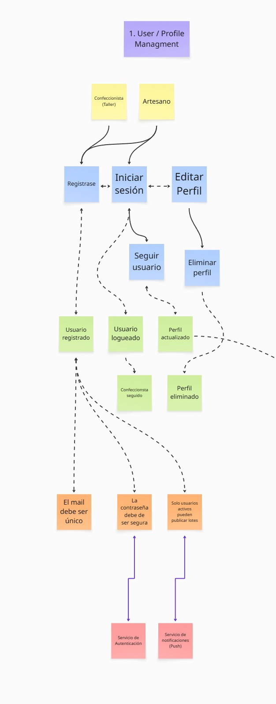<br>
</p>

*Figura: 4.2.1. EventStorming*

**LOTE REGISTRADO**

Evento que indica que un confeccionista ingresó correctamente la información de un lote de residuos textiles en la plataforma, incluyendo datos como material, cantidad, imágenes y características principales.

<p align="center">
  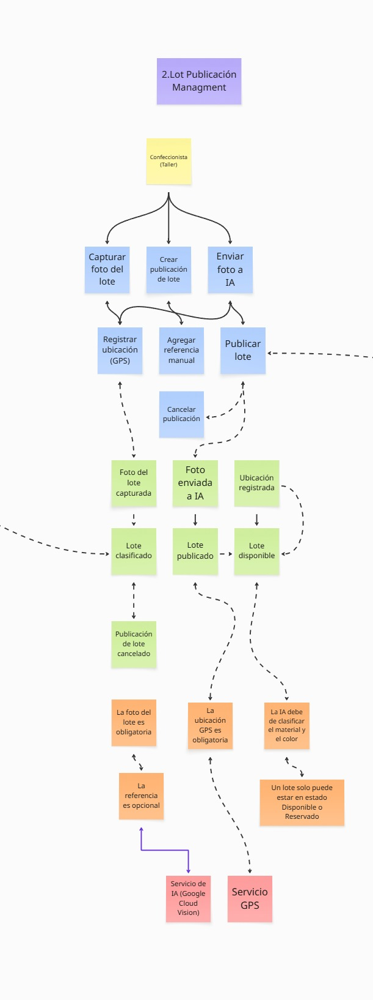<br>
</p>

*Figura: 4.2.1. EventStorming*

**LOTE CLASIFICADO POR IA**

Evento que indica que el sistema de inteligencia artificial analizó automáticamente el lote textil registrado e identificó características como tipo de material, color u otras propiedades relevantes para su publicación y búsqueda.

<p align="center">
  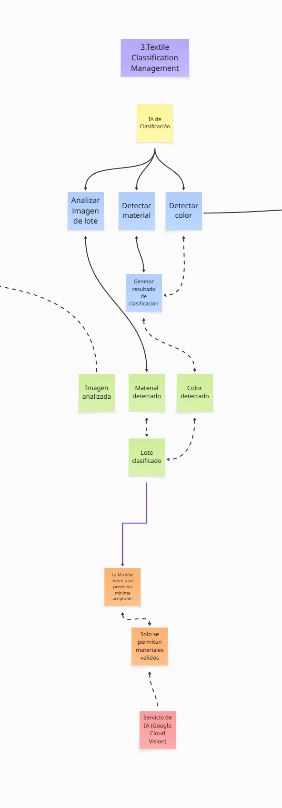<br>
</p>

*Figura: 4.2.1. EventStorming*

**RESERVA SOLICITADA**

Evento que indica que un artesano seleccionó y solicitó la reserva de un lote textil disponible dentro de la plataforma para su posterior recolección o reutilización.

<p align="center">
  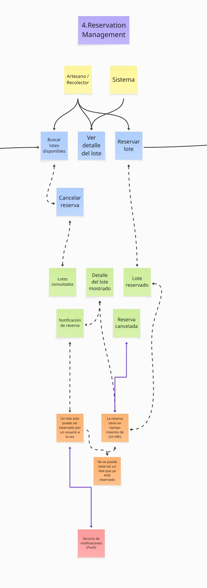<br>
</p>

*Figura: 4.2.1. EventStorming*

**RESERVA PROGRAMADA**

Evento que indica que la solicitud de reserva fue organizada correctamente, estableciendo la fecha, hora o condiciones necesarias para la entrega y recolección del lote textil entre las partes involucradas.

<p align="center">
  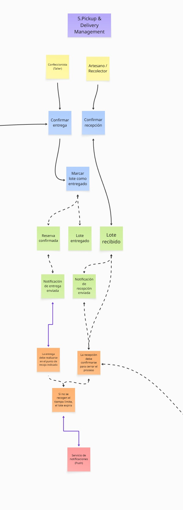<br>
</p>

*Figura: 4.2.1. EventStorming*

**LOTE EXPIRADO**

Evento que indica que un lote textil alcanzó el tiempo límite de disponibilidad establecido en la plataforma sin haber sido reservado o gestionado, quedando automáticamente inhabilitado para nuevas reservas.

<p align="center">
  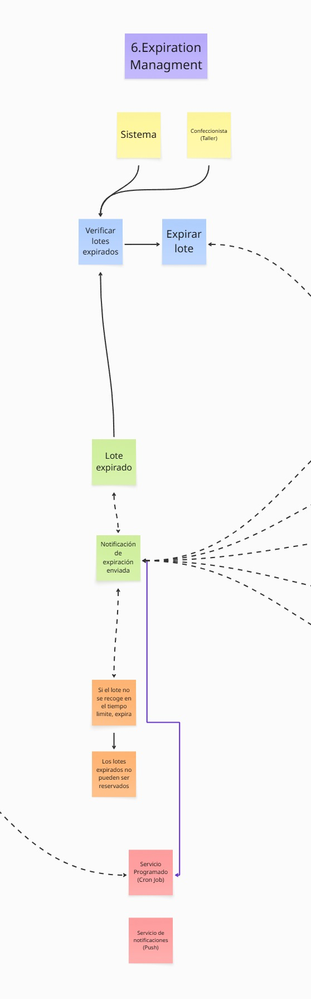<br>
</p>

*Figura: 4.2.1. EventStorming*

**NOTIFICACIÓN ENVIADA**

Evento que indica que el sistema transmitió correctamente un mensaje o alerta a los usuarios involucrados para informar sobre una acción, actualización o cambio relacionado con un lote o una reserva dentro de la plataforma.

<p align="center">
  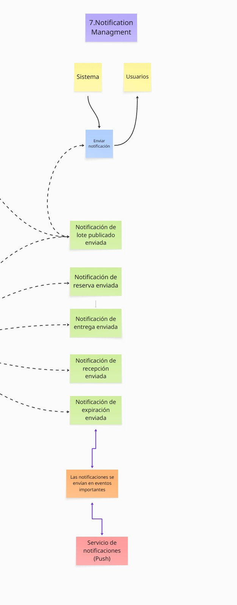<br>
</p>

*Figura: 4.2.1. EventStorming*

El diagrama completo se encuentra en el siguiente enlace: [EventStorming](https://miro.com/app/board/uXjVHfI02Ag=/?share_link_id=281658940692)

<a name="4.2.2."></a>

### 4.2.2. Candidate Context Discovery

La identificación de Candidate Context Discovery en el proyecto GamarraLoop permite descubrir las principales áreas del negocio que pueden separarse en distintos bounded contexts dentro del sistema. Este proceso se enfoca en analizar la gestión de excedentes textiles y la interacción entre confeccionistas, artesanos y el sistema dentro de la plataforma.
A partir de ello, se identificaron capacidades principales como la publicación de lotes textiles, la clasificación automática de materiales mediante IA, la reserva de lotes y la gestión de usuarios. Estas funcionalidades fueron agrupadas en sectores lógicos para facilitar el diseño, mejorar la escalabilidad y asegurar un mejor mantenimiento del sistema.
El objetivo principal es definir bounded contexts claros que representen correctamente el dominio del negocio y permitan construir una arquitectura de software más organizada, flexible y sostenible.

<p align="center">
  <br>
</p>

*Figura: 4.2.2. Candidate Context Discovery*

El diagrama completo se encuentra en el siguiente enlace: [Candidate Context Discovery](https://miro.com/app/board/uXjVHfI02Ag=/?share_link_id=281658940692)

<a name="4.2.3."></a>

### 4.2.3. Domain Message Flows Modeling

El Domain Message Flows Modeling permite visualizar cómo colaboran los bounded contexts del sistema para resolver los principales procesos de negocio dentro de Gamarra Loop (GamarraLoop). Esta técnica ayuda a representar el intercambio de mensajes entre actores, bounded contexts y sistemas externos, facilitando la comprensión del flujo de información dentro de la plataforma.
Para este proceso se aplicó la técnica de Domain Storytelling, la cual permite modelar la secuencia de acciones realizadas por los usuarios y las respuestas automáticas del sistema. Esto permite identificar claramente los actores involucrados, los bounded contexts participantes y sus interacciones.
En nuestro proyecto se seleccionó el escenario “Lot Publication and Pickup Management”, ya que representa uno de los flujos principales del negocio: desde que el confeccionista publica un lote textil hasta que el artesano o recolector realiza la reserva, coordina la entrega y recibe la notificación correspondiente.
Los bounded contexts involucrados son:
Lot Publication Management
Textile Classification Management
Reservation Management
Pickup & Delivery Management
Notification Management
Este modelado permite comprender cómo los bounded contexts colaboran entre sí para garantizar el correcto funcionamiento del sistema.

<p align="center">
  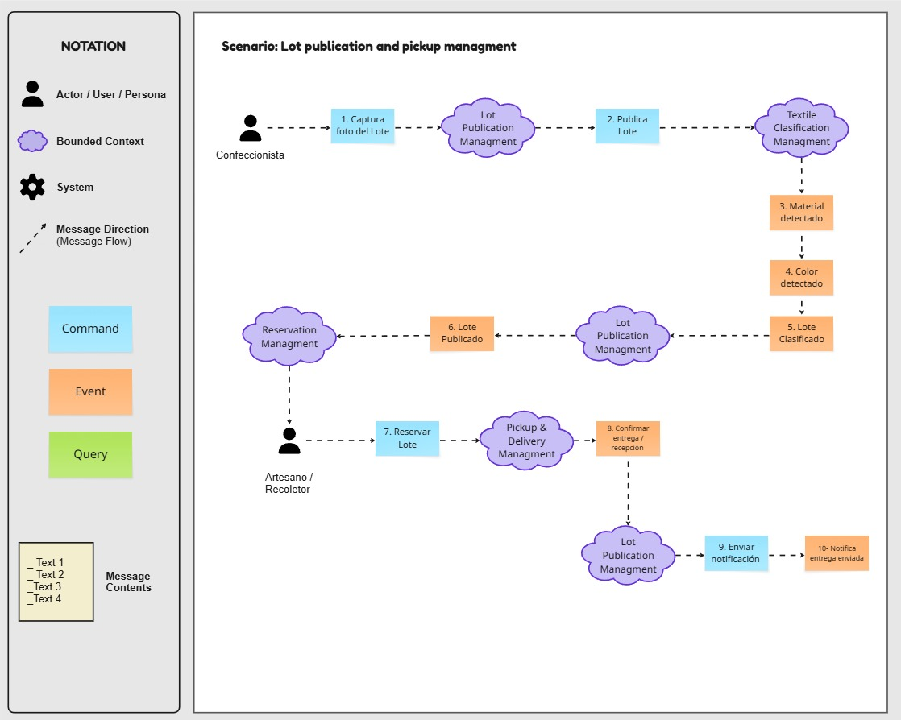<br>
</p>

*Figura: 4.2.3. Domain Message Flows Modeling*

El diagrama completo se encuentra en el siguiente enlace: [Domain Message Flows Modeling](https://miro.com/app/board/uXjVHfI02Ag=/?share_link_id=281658940692)

<a name="4.2.4."></a>

### 4.2.4. Bounded Context Canvases

En esta sección se presentan los Bounded Context Canvases de GamarraLoop, diseñados a partir del análisis estratégico del dominio y la identificación de los principales bounded contexts del sistema. Para su elaboración se siguió un proceso iterativo que incluyó la definición del contexto, reglas de negocio, lenguaje ubicuo, capacidades, dependencias y validación del diseño.
Los bounded contexts definidos fueron: User Profile Management, Textile Classification, Lot Publication Management, Reservation Management, Pickup and Delivery y Notification Management.

**Proceso metodológico**

<p align="center">
  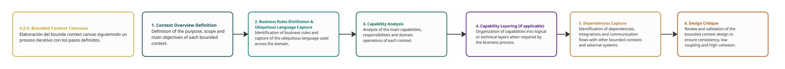<br>
</p>

*Figura: 4.2.4. Bounded Context Canvases*

**User Profile Management**

Gestiona las cuentas de usuario, perfiles y preferencias dentro de la plataforma. Permite el registro, autenticación, actualización de perfil y control de credenciales para confeccionistas y artesanos, asegurando que solo usuarios válidos y activos puedan participar en el sistema.

<p align="center">
  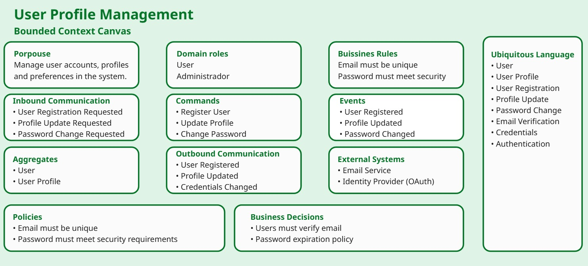<br>
</p>

*Figura: 4.2.4. Bounded Context Canvases*

**Textile Classification**

Se encarga de clasificar los lotes textiles según tipo de tela, color, material, calidad y cantidad disponible. Utiliza clasificación automática por imagen mediante servicios de IA y validación manual cuando sea necesario para asegurar la precisión de los datos antes de la publicación.

<p align="center">
  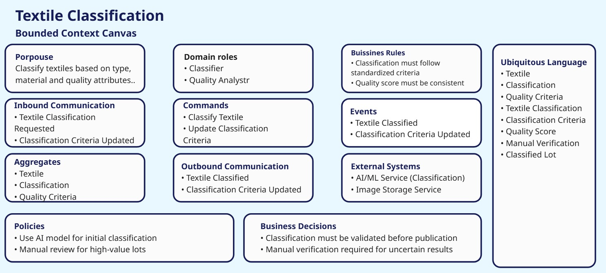<br>
</p>

*Figura: 4.2.4. Bounded Context Canvases*

**Lot Publication Management**

Gestiona la publicación de lotes textiles disponibles para reserva dentro de la plataforma. Permite al confeccionista capturar la información del lote, registrar la ubicación de recojo mediante GPS, enviar imágenes para clasificación automática y publicar únicamente lotes validados y completos.

<p align="center">
  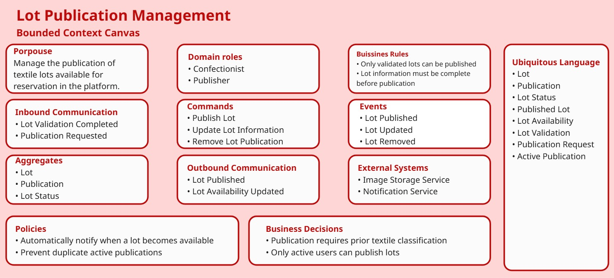<br>
</p>

*Figura: 4.2.4. Bounded Context Canvases*

**Reservation Management**

Administra la reserva de lotes textiles publicados por parte de los artesanos. Controla la disponibilidad, confirmación, cancelación y expiración de reservas, garantizando que un lote solo pueda ser reservado por un usuario a la vez y dentro de un período válido.

<p align="center">
  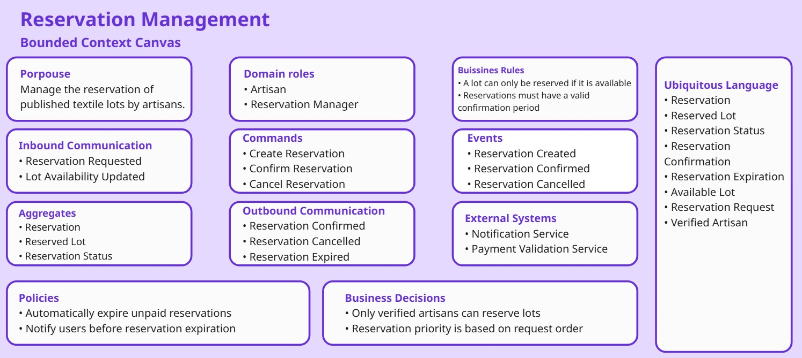<br>
</p>

*Figura: 4.2.4. Bounded Context Canvases*

**Pickup and Delivery**

Gestiona el proceso de recojo y entrega de los lotes reservados. Permite coordinar el punto de recogida, hacer seguimiento del estado de entrega, confirmar la recepción y cerrar correctamente el proceso logístico entre confeccionista y artesano.

<p align="center">
  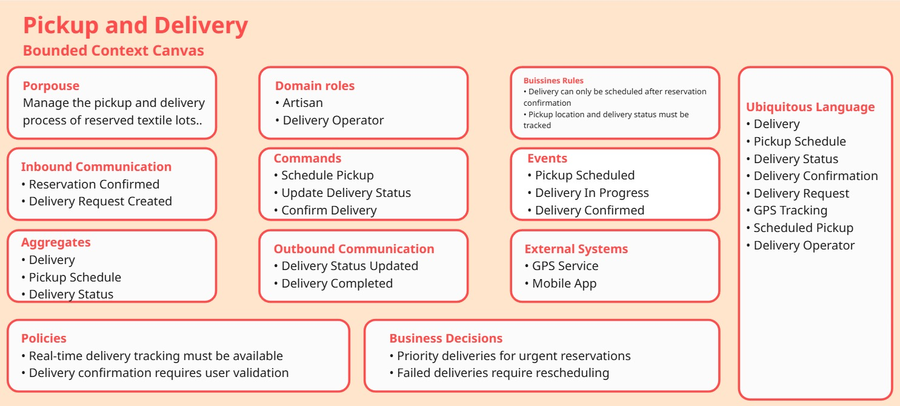<br>
</p>

*Figura: 4.2.4. Bounded Context Canvases*

**Notification Management**

Controla la expiración automática de los lotes cuando no son recogidos dentro del tiempo límite establecido. Verifica periódicamente los lotes pendientes, cambia su estado a expirado cuando corresponde y activa las notificaciones necesarias para informar a los usuarios involucrados.

<p align="center">
  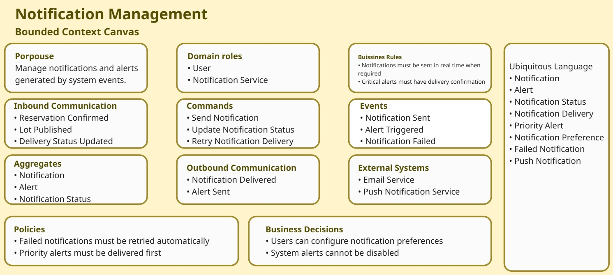<br>
</p>

*Figura: 4.2.4. Bounded Context Canvases*

El diagrama completo se encuentra en el siguiente enlace:
[Bounded Context Canvases](https://miro.com/app/board/uXjVHc84QZA=/?share_link_id=254000344450)

<a name="4.2.5."></a>

### 4.2.5. Context Mapping

El Context Mapping permite identificar y visualizar las relaciones estructurales entre los Bounded Contexts definidos en GamarraLoop, mostrando cómo colaboran entre sí y cómo se intercambia la información dentro del dominio del negocio. A través de este proceso se analizaron las dependencias entre contextos como publicación de lotes, clasificación textil, reservas, entregas, expiraciones y notificaciones, buscando mantener una arquitectura con bajo acoplamiento y alta cohesión. Además, se aplicaron patrones de Domain-Driven Design como Customer/Supplier, Conformist y Anti-Corruption Layer (ACL), permitiendo una mejor separación de responsabilidades y una integración más controlada con servicios externos como la clasificación automática mediante inteligencia artificial.

<p align="center">
  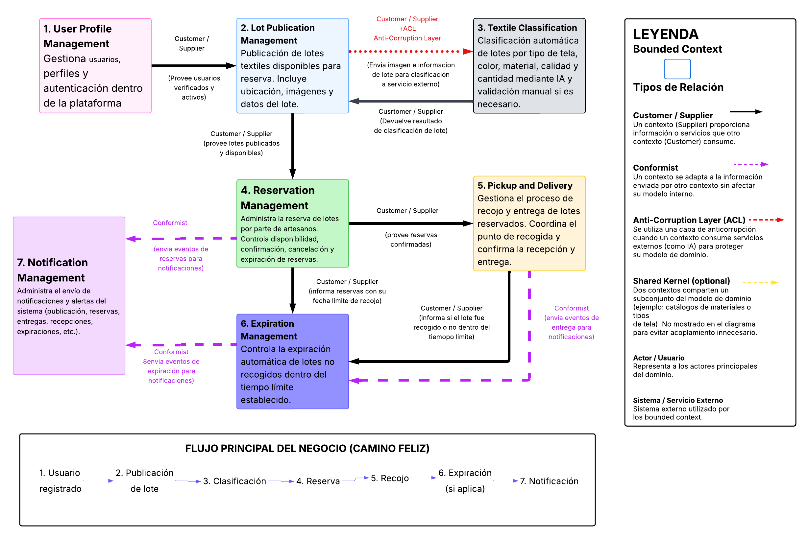<br>
</p>

*Figura: 4.2.5. Context Mapping*

El diagrama presentado muestra cómo cada Bounded Context mantiene su independencia funcional mientras colabora con los demás para completar el flujo principal del negocio, desde el registro del usuario hasta la publicación, clasificación, reserva, recojo y notificación final del lote textil. Esta estructura permite una mejor escalabilidad del sistema, facilita el mantenimiento futuro y asegura que los cambios en un contexto no impacten directamente en todo el dominio, cumpliendo así con los principios fundamentales de Domain-Driven Design.

El diagrama completo se encuentra en el siguiente enlace: [Context Mapping](https://lucid.app/lucidchart/ec20dbd0-3469-494a-b742-630a12a29cbd/edit?viewport_loc=-836%2C39%2C4359%2C1543%2C0_0&invitationId=inv_b8a17edd-7cb1-4abc-b7a9-cb7bc8908400)

<a name="4.3."></a>

## 4.3. Software Architecture

En esta sección se presenta y explica la arquitectura de software de la solución _Gamarra Loop / GamarraLoop_ aplicando el **C4 Model** propuesto por Simon Brown como marco de visualización progresiva, comenzando por una vista organizacional amplia (System Landscape) y avanzando luego por niveles de detalle creciente (Context, Container y Deployment). Las cuatro vistas que se desarrollan a continuación constituyen la materialización visual de las decisiones arquitectónicas tomadas en la [sección 4.1.](#4.1.) — particularmente del _Architectural Drivers Backlog_ de la [sección 4.1.3.](#4.1.3.) y de los patrones evaluados en la [sección 4.1.4.](#4.1.4.) — y consumen el modelado de bounded contexts elaborado en la [sección 4.2.](#4.2.) cuando es necesario establecer límites internos del sistema.

Toda la arquitectura se modeló utilizando **Structurizr**, herramienta indicada por la rúbrica del curso para C4 Model. Las vistas se especifican en el archivo [`c4/workspace.dsl`](c4/workspace.dsl) en la raíz del repositorio, lo cual permite versionar el modelo arquitectónico junto con el resto de la documentación y regenerar las imágenes en cualquier momento de forma reproducible. Las imágenes embebidas en cada subsección son el resultado de exportar dicho modelo desde Structurizr a PNG; los archivos PNG se almacenan en `Img/c4/`.

<a name="4.3.1."></a>

### 4.3.1. Software Architecture System Landscape Diagram

El **System Landscape Diagram** ofrece la mirada más amplia del C4 Model y representa la posición de _Gamarra Loop / GamarraLoop_ dentro del ecosistema operativo del **emporio comercial de Gamarra**, mostrando exclusivamente al sistema y a los dos segmentos objetivo definidos en la [sección 1.3.](#1.3.) — Confeccionistas y Artesanos / Recolectores. A diferencia del _Context Diagram_ desarrollado en la [sección 4.3.2.](#4.3.2.) —que detalla las integraciones técnicas con servicios de terceros—, esta vista omite deliberadamente los sistemas externos para enfocar la atención en la **dimensión humana** del producto: quiénes lo operan y qué intercambio habilita la plataforma dentro del distrito de La Victoria. Está pensada para comunicar el alcance de la solución a stakeholders no técnicos (cliente, equipo de producto, audiencia académica) sin introducir la complejidad de la integración cloud.

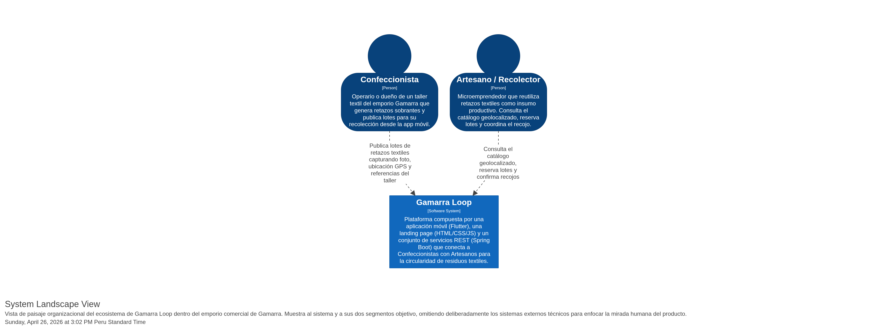<br>
*Figura: Software Architecture System Landscape Diagram — Gamarra Loop*

El diagrama integra dos categorías de elementos, ambos sustentados en capítulos previos del informe:

| Categoría                                                               | Elementos                             | Rol en el ecosistema                                                                                                                                                                                                                                                           |
| :---------------------------------------------------------------------- | :------------------------------------ | :----------------------------------------------------------------------------------------------------------------------------------------------------------------------------------------------------------------------------------------------------------------------------- |
| **Usuarios primarios** (actores con interacción directa con el sistema) | Confeccionista; Artesano / Recolector | Son los dos segmentos objetivo definidos en la [sección 1.3.](#1.3.), las personas elaboradas en la [sección 2.3.1.](#2.3.1.) y los autores de las User Stories del [Capítulo III](#3.). Operan los flujos de publicación, descubrimiento, reserva y recojo de lotes textiles. |
| **Sistema in-scope**                                                    | _Gamarra Loop_                        | Plataforma compuesta por una aplicación móvil multiplataforma (Flutter, construida con FlutterFlow), una landing page (HTML5/CSS3/JS) y un conjunto de servicios REST internos (Spring Boot). Es el único elemento sobre el que el equipo tiene control de implementación.     |

<a name="4.3.2."></a>

### 4.3.2. Software Architecture Context Level Diagrams

El **Context Diagram** corresponde al primer nivel del C4 Model y representa el sistema _Gamarra Loop_ como un único recuadro central rodeado por sus usuarios y por los sistemas externos con los que se integra técnicamente. A diferencia del _System Landscape_ anterior, esta vista deliberadamente **excluye** a los stakeholders organizacionales (ONGs, gobierno, recicladoras) que no participan de las integraciones técnicas, y se enfoca en explicitar las dependencias externas que serán objeto de diseño detallado en la [sección 4.3.3.](#4.3.3.) (Container Level) y en el _Tactical-Level Software Design_ del [Capítulo V](#5.).

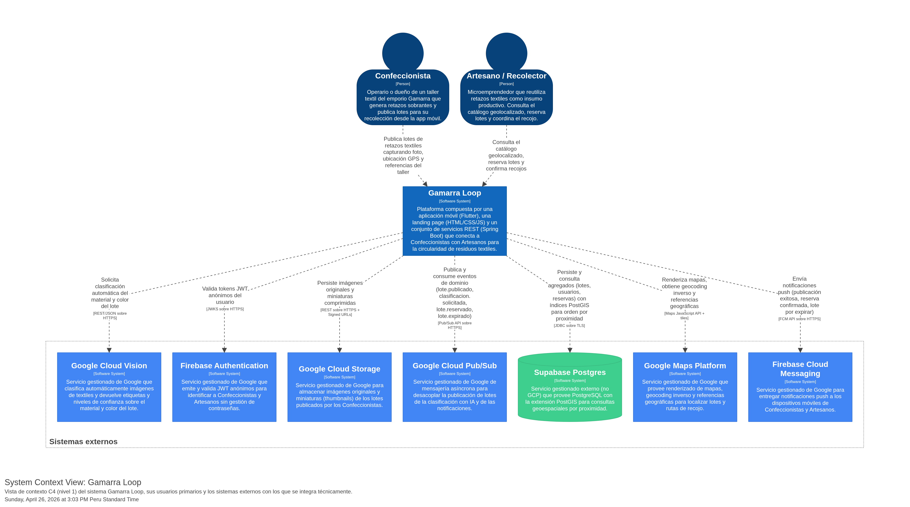<br>
*Figura: Software Architecture Context Level Diagram — Gamarra Loop*

El cuadro a continuación documenta las **integraciones externas** del sistema _Gamarra Loop_, especificando para cada una el propósito de la integración, el protocolo de comunicación y la decisión arquitectónica que la justifica con trazabilidad explícita al _Architectural Drivers Backlog_ de la [sección 4.1.3.](#4.1.3.) y a las _Architectural Design Decisions_ de la [sección 4.1.4.](#4.1.4.).

| Sistema externo              | Propósito de la integración                                                                     | Protocolo                      | Decisión arquitectónica que la sustenta                                                                                                                                                                                      |
| :--------------------------- | :---------------------------------------------------------------------------------------------- | :----------------------------- | :--------------------------------------------------------------------------------------------------------------------------------------------------------------------------------------------------------------------------- |
| **Google Cloud Vision**      | Clasificación automática del material y color a partir de la fotografía del lote                | REST/JSON sobre HTTPS          | **TS03** (Constraint del Lean UX Canvas) + **D05** (Clasificación automática de textiles) + **D07** (Aislamiento del proveedor de IA bajo el patrón _Hexagonal Port + Adapter_).                                             |
| **Supabase Postgres**        | Persistencia transaccional con PostgreSQL para almacenamiento del catálogo y perfiles           | JDBC sobre TLS                 | **D02** (Listado de lotes con baja latencia) + **D01** (Reserva consistente sin doble-asignación, soportada por _optimistic locking_ JPA).                                                                                   |
| **Google Maps Platform**     | Renderizado de mapas, geocoding inverso y obtención de referencias geográficas                  | Maps JavaScript API + tiles    | **D03** (Captura móvil de imagen y geolocalización del lote) + **TS04** (Geolocalización del dispositivo como punto de recojo).                                                                                              |

Las **interacciones de los actores con el sistema** se documentan a continuación, también con trazabilidad al [Capítulo III](#3.):

| Actor                     | Interacción primaria con _Gamarra Loop_                                                   | User Stories asociadas |
| :------------------------ | :---------------------------------------------------------------------------------------- | :--------------------- |
| **Confeccionista**        | Publica lotes de retazos textiles capturando foto, ubicación GPS y referencias del taller | US05, US06, US07, US08 |
| **Artesano / Recolector** | Consulta el catálogo geolocalizado de lotes disponibles, los reserva y confirma el recojo | US12, US13, US14, US15 |

El diagrama explicita que las integraciones externas combinan **servicios de Google Cloud Platform** (Vision, Maps) y **Supabase Postgres**. Esta decisión es consciente del equipo: la identidad y persistencia se delegan nativamente en Spring Boot y Supabase para simplificar el MVP y aprovechar el _free tier_ permanente de PostgreSQL, evitando la sobrecarga técnica de tokens de terceros como Firebase. La complejidad operativa se mantiene baja usando estándares (JDBC/TLS y REST) bajo el patrón _Hexagonal Port + Adapter_ adoptado en la [sección 4.1.4.](#4.1.4.).

<a name="4.3.3."></a>

### 4.3.3. Software Architecture Container Level Diagrams

El **Container Diagram** corresponde al segundo nivel del C4 Model y descompone el sistema _Gamarra Loop_ — que en la [sección 4.3.2.](#4.3.2.) era una caja única — en las **unidades ejecutables** que lo constituyen, mostrando para cada una su tecnología, responsabilidad y forma de comunicación con las demás. A diferencia del _Context Diagram_, esta vista omite deliberadamente a los stakeholders organizacionales del [System Landscape](#4.3.1.) y se enfoca en lo que el equipo efectivamente construye, despliega y opera. Los sistemas externos del 4.3.2. se mantienen presentes pero su relación se _re-asigna_ desde el sistema completo hacia el container puntual que los consume, lo cual permite leer con precisión qué pieza del sistema depende de qué proveedor cloud.

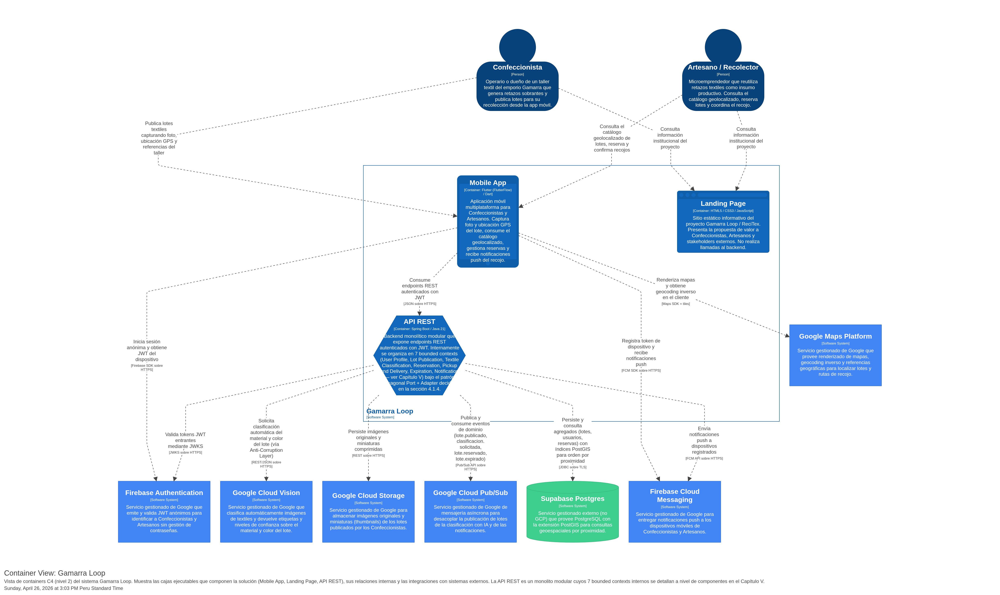<br>
*Figura: Software Architecture Container Level Diagram — Gamarra Loop*

El diagrama identifica **tres containers** dentro del sistema _Gamarra Loop_, todos ellos derivados directamente de la _primary functionality_ y de las _constraints_ declaradas en la [sección 4.1.2.](#4.1.2.):

| Container        | Tecnología                   | Responsabilidad                                                                                                                                                                                                                                                                                                                                                                   | Driver / Decisión arquitectónica que lo sustenta                                                                                                                                                                                                                                                                                                                                                                                           |
| :--------------- | :--------------------------- | :-------------------------------------------------------------------------------------------------------------------------------------------------------------------------------------------------------------------------------------------------------------------------------------------------------------------------------------------------------------------------------- | :----------------------------------------------------------------------------------------------------------------------------------------------------------------------------------------------------------------------------------------------------------------------------------------------------------------------------------------------------------------------------------------------------------------------------------------- |
| **Mobile App**   | Flutter (FlutterFlow) / Dart | Aplicación móvil multiplataforma para Confeccionistas y Artesanos. Captura foto y ubicación GPS del lote, consume el catálogo geolocalizado, gestiona reservas y recibe notificaciones push del recojo.                                                                                                                                                                           | **D03** (Captura móvil de imagen y geolocalización del lote) + **TS01** y **TS04** (constraints de captura nativa y geolocalización del dispositivo) + decisión P1 del **D03** en la [sección 4.1.4.](#4.1.4.) — _Direct API con SDK móvil ligero_, alineada con _primary stories_ **US05**, **US06**, **US12**, **US14**.                                                                                                                 |
| **Landing Page** | HTML5 / CSS3 / JavaScript    | Sitio estático informativo del proyecto _Gamarra Loop / GamarraLoop_. Presenta la propuesta de valor a Confeccionistas, Artesanos y stakeholders externos. No realiza llamadas al backend.                                                                                                                                                                                        | **D09** (APIs RESTful versionadas y agnósticas al cliente) en su corolario inverso: separar el canal de marketing del canal transaccional, evitando acoplar la presencia pública del producto al ciclo de releases del backend. La estática también sostiene el escenario **QA04** (Usabilidad — primer contacto sin fricción).                                                                                                            |
| **API REST**     | Spring Boot / Java 21        | Backend monolítico modular que expone endpoints REST autenticados con JWT. Internamente se organiza en los **siete bounded contexts** elaborados en la [sección 4.2.](#4.2.) — _User Profile_, _Lot Publication_, _Textile Classification_, _Reservation_, _Pickup and Delivery_, _Expiration_ y _Notification_ — que se detallan a nivel **componente** en el [Capítulo V](#5.). | **D07** (Hexagonal Port + Adapter) + **D09** (REST versionada) + **D06** (Domain Events sobre _Aggregate_ Lote). El estilo **monolito modular** — un único deployable con separación lógica por bounded context — se eligió frente a microservicios por simplicidad operacional para el equipo y por evitar la complejidad de transacciones distribuidas que **D01** (consistencia de reserva) y **D06** (estados explícitos) acarrearían. |

La **única relación interna** entre containers se documenta a continuación; las dependencias externas se desglosan en el cuadro siguiente porque el _re-asignamiento_ desde el sistema completo (4.3.2.) hacia containers puntuales es uno de los aportes informativos centrales de esta vista:

| Origen         | Destino      | Propósito                                                                                                                           | Protocolo        |
| :------------- | :----------- | :---------------------------------------------------------------------------------------------------------------------------------- | :--------------- |
| **Mobile App** | **API REST** | Consumo de endpoints transaccionales (publicación, catálogo, reservas). Gestión de identidad basada en UUID nativo y enrutamiento mediante API Gateway (Method Override) para evadir limitaciones de plataformas Low-Code (FlutterFlow). | JSON sobre HTTPS |

A diferencia del 4.3.2. — donde todas las integraciones externas se atribuyeron al sistema en su conjunto —, esta vista distribuye las **mismas siete dependencias** entre el container que las consume realmente. La separación importa porque revela qué piezas del sistema sufrirían en caso de degradación de cada proveedor:

| Container que consume | Sistema externo              | Naturaleza de la dependencia                                                                                                                                                                                              | Driver / Decisión que la sustenta                                                                                                                                                   |
| :-------------------- | :--------------------------- | :------------------------------------------------------------------------------------------------------------------------------------------------------------------------------------------------------------------------ | :---------------------------------------------------------------------------------------------------------------------------------------------------------------------------------- |
| **Mobile App**        | **Google Maps Platform**     | Renderiza mapas y resuelve _geocoding_ inverso directamente en el dispositivo, evitando proxy a través de la API y reduciendo la latencia percibida por el Artesano en campo.                                             | **D03** + **D02** (listado con orden por proximidad) — la presentación geográfica corresponde al cliente.                                                                           |
| **API REST**          | **Google Cloud Vision**      | Solicita la clasificación automática del material y color del lote a partir de la imagen. La invocación se hace desde un _adapter_ aislado en una **Anti-Corruption Layer** del bounded context _Textile Classification_. | **D05** (Clasificación automática) + **D07** (Hexagonal Port + Adapter, decisión P1).                                                                                               |
| **API REST**          | **Supabase Postgres**        | Persistencia transaccional con PostgreSQL. Usado por todos los bounded contexts a través del _port_ de persistencia del dominio para gestionar perfiles, lotes y clasificaciones.                                         | **D02** (Catálogo de lotes y perfiles) + **D01** (Reserva consistente y relacional, soportada por JPA).                                                                             |

La vista materializa la decisión de **monolito modular** del [Capítulo IV](#4.). Los siete bounded contexts del [4.2.](#4.2.) **no se vuelven** containers separados: viven dentro del único _container_ "API REST" como **componentes** organizados bajo el patrón _Hexagonal Port + Adapter_ ([D07](#4.1.4.)), con _ports_ de aplicación que los desacoplan entre sí y _adapters_ de infraestructura que los conectan a los proveedores cloud externos. Esta elección preserva la posibilidad futura de extraer cualquiera de los contextos como microservicio independiente — particularmente _Textile Classification_, dada su asimetría de carga frente al resto — sin requerir hoy la complejidad operativa que esa separación impondría sobre un equipo de cinco integrantes en fase de validación.

<a name="4.3.4."></a>

### 4.3.4. Software Architecture Deployment Diagrams

El **Deployment Diagram** corresponde al cuarto nivel del C4 Model y proyecta los _containers_ del [4.3.3.](#4.3.3.) sobre la **infraestructura concreta** donde corren en producción. A diferencia de los niveles previos —que describían la solución en términos puramente lógicos—, esta vista responde preguntas operativas explícitas: dónde se aloja cada pieza, qué proveedor cloud la sostiene, cómo se conecta el cliente final con el backend y qué propiedades de costo, escalabilidad y resiliencia se obtienen de cada elección. La organización de los nodos materializa, además, una decisión consciente del equipo: distribuir la solución entre **tres proveedores cloud heterogéneos** (Google Cloud Platform, Supabase y GitHub Pages) priorizando _free tiers_ permanentes sobre la uniformidad arquitectónica, en línea con la _constraint_ implícita de operar el sistema sin costos durante toda la fase académica.

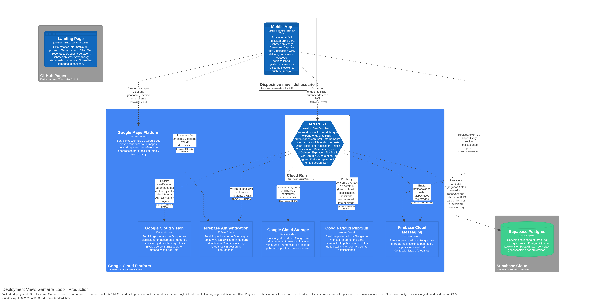<br>
*Figura: Software Architecture Deployment Diagram — Gamarra Loop / Production*

El entorno **_Production_** se compone de **cuatro _deployment nodes_** raíz, cada uno representando un proveedor o tipo de hospedaje distinto:

| Deployment Node                   | Tecnología / Servicio                           | Container o sistema desplegado                                                                                                                                             | Justificación arquitectónica                                                                                                                                                                                                                                                                                                                                                                                                                                                                                                                                                               |
| :-------------------------------- | :---------------------------------------------- | :------------------------------------------------------------------------------------------------------------------------------------------------------------------------- | :----------------------------------------------------------------------------------------------------------------------------------------------------------------------------------------------------------------------------------------------------------------------------------------------------------------------------------------------------------------------------------------------------------------------------------------------------------------------------------------------------------------------------------------------------------------------------------------- |
| **Dispositivo móvil del usuario** | Android 8+ / iOS 14+                            | _Mobile App_ (Flutter)                                                                                                                                                     | Cumple **TS01** (plataforma móvil nativa) y **TS04** (geolocalización del dispositivo). El _binary_ se distribuye vía Google Play / App Store y consume directamente, desde el dispositivo, los SDKs de _Firebase Authentication_, _Google Maps_ y _Firebase Cloud Messaging_, evitando la latencia y el costo de proxy a través del backend para operaciones puramente del cliente.                                                                                                                                                                                                       |
| **GitHub Pages**                  | CDN global de GitHub para sitios estáticos      | _Landing Page_ (HTML5 / CSS3 / JavaScript)                                                                                                                                 | _Free tier_ permanente sin límite temporal y _deploy_ automático desde una rama del propio repositorio del equipo. Permite **desacoplar el ciclo de _release_** del canal de marketing (un cambio en la landing no requiere redeploy del backend ni del móvil) y elimina la necesidad de configurar CI específico, dado que la solución no incluye _build pipeline_ propio.                                                                                                                                                                                                                |
| **Google Cloud Platform**         | Región _us-central1_                            | _Cloud Run_ (con instancia del container _API REST_) + _software system instances_ de Cloud Vision | Concentra el backend transaccional y el servicio gestionado de Inteligencia Artificial. La selección de **GCP como proveedor** se sustenta en el driver **D05** (clasificación automática vía Cloud Vision), siendo un servicio first-class del ecosistema Google.                                                                                                                                                                                                                                                                                                         |
| **&nbsp;&nbsp;↳ Cloud Run**       | Servicio gestionado de contenedores _stateless_ | Instancia del container _API REST_ (Spring Boot)                                                                                                                           | Elegido frente a App Engine Standard y GKE por dos razones: (1) **escala automática a cero instancias** durante períodos de inactividad, alineado con la operación intermitente de la fase académica; (2) **_free tier_ permanente de 2M requests/mes**, suficiente para el volumen inicial; la naturaleza _stateless_ del container encaja sin fricción con el modelo de instancias efímeras de Cloud Run.                                                                                                                                                                    |
| **Supabase Cloud**                | Región _us-east-1_                              | Instancia gestionada de _Supabase Postgres_ (PostgreSQL 15)                                                                                                                | Reemplaza a Cloud SQL — la opción nativa de GCP — porque Cloud SQL **no dispone de _free tier_ permanente**, mientras que Supabase ofrece PostgreSQL de forma gratuita y sin límite temporal. La heterogeneidad operativa adicional es marginal: la conexión es estándar (JDBC sobre TLS) y queda **aislada detrás del _port_ de persistencia** del dominio, en línea con el patrón Hexagonal Port + Adapter adoptado en la [sección 4.1.4.](#4.1.4.) ([D07](#4.1.4.)). Sostiene la consistencia transaccional y el almacenamiento del catálogo.                                 |

La elección de **Cloud Run** como _runtime_ del backend introduce un único _trade-off_ explícito que el equipo asumió de manera consciente: el **_cold start_ de la JVM** — entre 2 y 5 segundos en la primera petición tras un período de inactividad prolongada — degrada la latencia percibida en escenarios de uso esporádico. Para el alcance académico actual el impacto es irrelevante, dado que la operación esperada concentra picos cortos durante demos y validaciones. En un escenario de producción con tráfico real, la mitigación canónica es configurar `min-instances=1` en el servicio de Cloud Run, lo cual sí incurre en costo continuo y debería ponderarse contra los escenarios de calidad **QA01** (latencia ≤ 2 s en p95 del listado) y **QA04** (usabilidad — confirmaciones inmediatas) refinados en la [sección 4.1.5.](#4.1.5.).

La **distribución entre tres proveedores** (GCP + Supabase + GitHub Pages) materializa la prioridad del equipo de mantener la solución dentro de _free tiers_ permanentes durante toda la fase académica, aceptando como costo la ausencia de un único panel de observabilidad y de una factura unificada. Esta decisión es reversible: tanto la persistencia (Supabase → Cloud SQL) como el hospedaje estático (GitHub Pages → Firebase Hosting) podrían migrarse a GCP sin cambios al código del backend, dado que ambos componentes están aislados detrás de interfaces estándar (JDBC/TLS y HTTP estático sobre CDN, respectivamente).

<a name="5."></a>

# Capítulo V: Tactical-Level Software Design

<a name="5.1."></a>

## 5.1. Bounded Context: Textile Classification

El Bounded Context **Textile Classification** es el núcleo diferenciador de la plataforma Gamarra Loop. Su única responsabilidad es recibir una imagen de un lote textil, delegar el análisis visual a un servicio externo de Inteligencia Artificial (Google Cloud Vision), transformar el resultado crudo en un conjunto de etiquetas de dominio comprensibles para el negocio y, finalmente, notificar al Bounded Context de Publicación de Lotes que la clasificación está lista para revisión.

Las clases del contexto se distribuyen en cuatro capas siguiendo el patrón **Hexagonal Port + Adapter** adoptado en la decisión arquitectónica **D07** (sección 4.1.4.). A continuación, se detalla el diccionario completo de clases para cada capa.

<a name="5.1.1."></a>

### 5.1.1. Domain Layer

La capa de dominio contiene la lógica de negocio pura del proceso de clasificación. Es totalmente independiente de frameworks, bases de datos y servicios externos.

| Clase / Interfaz                     | Categoría               | Propósito                                                                                                                                                                                   | Atributos                                                                                                                                                                                                                           | Métodos                                                                                                                                                                                                                 |
| :----------------------------------- | :---------------------- | :------------------------------------------------------------------------------------------------------------------------------------------------------------------------------------------ | :---------------------------------------------------------------------------------------------------------------------------------------------------------------------------------------------------------------------------------- | :---------------------------------------------------------------------------------------------------------------------------------------------------------------------------------------------------------------------- |
| **ClassificationRequest**            | Entity / Aggregate Root | Representa la solicitud de clasificación de un lote. Es el agregado raíz que centraliza el estado del proceso de análisis de la imagen.                                                     | `- id: ClassificationRequestId` <br> `- lotId: LotId` <br> `- imageUrl: ImageUrl` <br> `- status: ClassificationStatus` <br> `- labels: List<TextileLabel>` <br> `- requestedAt: LocalDateTime` <br> `- processedAt: LocalDateTime` | `+ create(lotId, imageUrl): ClassificationRequest` <br> `+ markAsProcessing(): void` <br> `+ applyLabels(labels: List<TextileLabel>): void` <br> `+ markAsFailed(reason: String): void` <br> `+ isCompleted(): boolean` |
| **TextileLabel**                     | Value Object            | Representa una etiqueta descriptiva devuelta por el servicio de IA, inmutable. No tiene identidad propia fuera del agregado.                                                                | `- name: String` <br> `- confidence: float` <br> `- category: LabelCategory`                                                                                                                                                        | `+ of(name, confidence, category): TextileLabel` <br> `+ isHighConfidence(): boolean` (umbral: confidence ≥ 0.75)                                                                                                       |
| **ClassificationRequestId**          | Value Object            | Envuelve el identificador único de la solicitud (UUID). Garantiza type-safety.                                                                                                              | `- value: UUID`                                                                                                                                                                                                                     | `+ generate(): ClassificationRequestId` <br> `+ of(uuid: UUID): ClassificationRequestId`                                                                                                                                |
| **LotId**                            | Value Object            | Referencia al lote del Bounded Context de Publicación. Es una referencia cruzada de contexto (no una clave foránea directa).                                                                | `- value: UUID`                                                                                                                                                                                                                     | `+ of(uuid: UUID): LotId`                                                                                                                                                                                               |
| **ImageUrl**                         | Value Object            | URL validada de la imagen almacenada en Google Cloud Storage. La validación se realiza en construcción.                                                                                     | `- value: String`                                                                                                                                                                                                                   | `+ of(url: String): ImageUrl` (lanza excepción si el formato no es válido)                                                                                                                                              |
| **ClassificationStatus**             | Enumeration             | Estado del ciclo de vida de la solicitud.                                                                                                                                                   | `PENDING, PROCESSING, COMPLETED, FAILED`                                                                                                                                                                                            | —                                                                                                                                                                                                                       |
| **LabelCategory**                    | Enumeration             | Categoría semántica de la etiqueta textil, derivada del resultado crudo de Cloud Vision.                                                                                                    | `MATERIAL, COLOR, TEXTURE, PATTERN, QUALITY, OTHER`                                                                                                                                                                                 | —                                                                                                                                                                                                                       |
| **ClassificationDomainService**      | Domain Service          | Contiene la lógica de negocio que no pertenece naturalmente a una sola entidad: filtrar las etiquetas crudas de la IA, aplicar el umbral de confianza y mapearlas a categorías del dominio. | —                                                                                                                                                                                                                                   | `+ filterAndCategorize(rawLabels: List<RawLabel>): List<TextileLabel>` <br> `+ evaluateQuality(labels: List<TextileLabel>): ClassificationQuality`                                                                      |
| **IClassificationRequestRepository** | Repository (Interfaz)   | Puerto de persistencia del agregado. Define el contrato de acceso a datos sin exponer la implementación.                                                                                    | —                                                                                                                                                                                                                                   | `+ save(request: ClassificationRequest): void` <br> `+ findById(id: ClassificationRequestId): Optional<ClassificationRequest>` <br> `+ findByLotId(lotId: LotId): Optional<ClassificationRequest>`                      |
| **IVisionApiAdapter**                | Port (Interfaz)         | Puerto de salida hacia el servicio de IA externo. Desacopla el dominio de Google Cloud Vision.                                                                                              | —                                                                                                                                                                                                                                   | `+ analyze(imageUrl: ImageUrl): List<RawLabel>`                                                                                                                                                                         |
| **ClassificationCompletedEvent**     | Domain Event            | Evento publicado cuando la clasificación finaliza exitosamente. Lo consume el Bounded Context de Publicación de Lotes.                                                                      | `+ requestId: ClassificationRequestId` <br> `+ lotId: LotId` <br> `+ labels: List<TextileLabel>` <br> `+ occurredAt: LocalDateTime`                                                                                                 | —                                                                                                                                                                                                                       |
| **ClassificationFailedEvent**        | Domain Event            | Evento publicado cuando la clasificación falla después de agotar los reintentos. Permite al Bounded Context de Publicación mantener el lote en estado `PENDING_CLASSIFICATION`.             | `+ requestId: ClassificationRequestId` <br> `+ lotId: LotId` <br> `+ reason: String` <br> `+ occurredAt: LocalDateTime`                                                                                                             | —                                                                                                                                                                                                                       |

<a name="5.1.2."></a>

### 5.1.2. Interface Layer

La capa de interfaz expone el Bounded Context hacia el exterior: tanto hacia los clientes HTTP (la aplicación móvil) como hacia el sistema de mensajería (Google Cloud Pub/Sub). Actúa como adaptador de entrada (_driving adapter_ en la arquitectura hexagonal).

| Clase                         | Categoría                | Propósito                                                                                                                                                                                                                  | Endpoints / Suscripciones                                                                                                                                                                                                                                                              | Request / Response                                                                                                                                                   |
| :---------------------------- | :----------------------- | :------------------------------------------------------------------------------------------------------------------------------------------------------------------------------------------------------------------------- | :------------------------------------------------------------------------------------------------------------------------------------------------------------------------------------------------------------------------------------------------------------------------------------- | :------------------------------------------------------------------------------------------------------------------------------------------------------------------- |
| **ClassificationController**  | REST Controller          | Expone los endpoints HTTP para que la API REST reciba solicitudes de clasificación y consulte su estado. Es consumido por la aplicación móvil a través del API Gateway interno.                                            | `POST /api/v1/classifications` — Inicia una solicitud de clasificación. <br> `GET /api/v1/classifications/{requestId}` — Consulta el estado y las etiquetas de una solicitud. <br> `GET /api/v1/classifications/lot/{lotId}` — Obtiene la clasificación asociada a un lote específico. | **Request (POST):** `{ lotId: UUID, imageUrl: String }` <br> **Response (GET):** `{ requestId, lotId, status, labels: [{name, confidence, category}], processedAt }` |
| **LotPublishedEventConsumer** | Event Consumer (Pub/Sub) | Suscriptor del tópico `lot.published` de Google Cloud Pub/Sub. Cuando un nuevo lote se publica en el Bounded Context de Publicación, este consumer lanza automáticamente el proceso de clasificación de la imagen adjunta. | Suscripción: `lot-published-subscription` en el tópico `lot.published`                                                                                                                                                                                                                 | Mensaje esperado: `{ lotId: UUID, imageUrl: String, publishedAt: String }`                                                                                           |

<a name="5.1.3."></a>

### 5.1.3. Application Layer

La capa de aplicación orquesta los flujos de negocio. No contiene lógica de dominio, sino que coordina la colaboración entre la capa de dominio, los repositorios y los adaptadores externos. Implementa el patrón **Command Handler** para peticiones explícitas y **Event Handler** para reaccionar a eventos del sistema.

| Clase                                   | Categoría           | Propósito                                                                                                                                                                                                                                                           | Comandos / Eventos que procesa                     | Colaboraciones                                                                                                                                                                                                                                                                            |
| :-------------------------------------- | :------------------ | :------------------------------------------------------------------------------------------------------------------------------------------------------------------------------------------------------------------------------------------------------------------ | :------------------------------------------------- | :---------------------------------------------------------------------------------------------------------------------------------------------------------------------------------------------------------------------------------------------------------------------------------------- |
| **RequestClassificationCommandHandler** | Command Handler     | Procesa el comando `RequestClassificationCommand`. Crea el agregado `ClassificationRequest`, lo persiste en estado `PENDING` y publica un mensaje en Pub/Sub para iniciar el procesamiento asíncrono.                                                               | `RequestClassificationCommand { lotId, imageUrl }` | `IClassificationRequestRepository.save()` → `ClassificationEventPublisher.publishClassificationRequested()`                                                                                                                                                                               |
| **ProcessClassificationCommandHandler** | Command Handler     | Procesa el comando `ProcessClassificationCommand` (disparado por el worker asíncrono). Llama al adaptador de Cloud Vision, aplica el Domain Service para filtrar y categorizar las etiquetas, actualiza el agregado y publica el evento de dominio correspondiente. | `ProcessClassificationCommand { requestId }`       | `IClassificationRequestRepository.findById()` → `IVisionApiAdapter.analyze()` → `ClassificationDomainService.filterAndCategorize()` → `ClassificationRequest.applyLabels()` → `IClassificationRequestRepository.save()` → `ClassificationEventPublisher.publishClassificationCompleted()` |
| **HandleLotPublishedEventHandler**      | Event Handler       | Reacciona al evento externo `LotPublishedEvent` (recibido del Consumer de la capa Interface). Construye y despacha un `RequestClassificationCommand` al handler correspondiente.                                                                                    | `LotPublishedEvent { lotId, imageUrl }`            | `RequestClassificationCommandHandler.handle()`                                                                                                                                                                                                                                            |
| **RequestClassificationCommand**        | Command             | DTO de comando inmutable que transporta los datos necesarios para iniciar una clasificación.                                                                                                                                                                        | —                                                  | —                                                                                                                                                                                                                                                                                         |
| **ProcessClassificationCommand**        | Command             | DTO de comando que ordena procesar una clasificación pendiente a partir de su ID.                                                                                                                                                                                   | —                                                  | —                                                                                                                                                                                                                                                                                         |
| **ClassificationEventPublisher**        | Application Service | Servicio de aplicación que abstrae la publicación de eventos de dominio hacia el bus de mensajes (Pub/Sub), desacoplando los handlers del mecanismo de transporte.                                                                                                  | —                                                  | `IMessageBrokerPort.publish()`                                                                                                                                                                                                                                                            |

<a name="5.1.4."></a>

### 5.1.4. Infrastructure Layer

La capa de infraestructura contiene las implementaciones concretas de los puertos definidos en el dominio. Aquí viven los adaptadores que conectan el sistema con Google Cloud Vision, Supabase Postgres y Google Cloud Pub/Sub.

| Clase                                  | Categoría                 | Propósito                                                                                                                                                                                                                                                                                                             | Tecnología                                      | Detalles de implementación                                                                                                                                                                            |
| :------------------------------------- | :------------------------ | :-------------------------------------------------------------------------------------------------------------------------------------------------------------------------------------------------------------------------------------------------------------------------------------------------------------------- | :---------------------------------------------- | :---------------------------------------------------------------------------------------------------------------------------------------------------------------------------------------------------- |
| **JpaClassificationRequestRepository** | Repository Implementation | Implementación del `IClassificationRequestRepository` usando Spring Data JPA. Gestiona la persistencia del agregado `ClassificationRequest` en la tabla `classification_requests` de Supabase Postgres.                                                                                                               | Spring Data JPA / Supabase Postgres             | Mapeo del agregado con `@Entity` + `@Table("classification_requests")`. Los Value Objects (`TextileLabel`) se persisten como una columna `jsonb` en Postgres para evitar tablas de join innecesarias. |
| **CloudVisionAdapter**                 | External Service Adapter  | Implementación del puerto `IVisionApiAdapter`. Realiza la llamada HTTP a la API de Google Cloud Vision (`images:annotate`), transforma la respuesta cruda en una lista de `RawLabel` y maneja reintentos con _backoff_ exponencial (máx. 3 intentos, intervalo inicial 1 s) según la decisión arquitectónica **D08**. | Google Cloud Vision REST API / Spring WebClient | Autenticación mediante `Application Default Credentials` (ADC) de GCP. Si los 3 reintentos fallan, lanza `VisionApiException` que el Command Handler captura para marcar la solicitud como `FAILED`.  |
| **PubSubMessageBrokerAdapter**         | Message Broker Adapter    | Implementación del puerto `IMessageBrokerPort`. Publica y serializa eventos de dominio como mensajes JSON en los tópicos de Google Cloud Pub/Sub (`classification.completed`, `classification.failed`).                                                                                                               | Google Cloud Pub/Sub Java Client Library        | Serialización con Jackson. Los mensajes incluyen atributos de cabecera (`eventType`, `occurredAt`) para facilitar el enrutamiento en los subscriptores.                                               |
| **ClassificationRequestEntity**        | JPA Entity                | Entidad JPA que mapea la tabla `classification_requests`. Realiza la traducción bidireccional entre el agregado de dominio y el modelo de persistencia, aislando así el dominio de los detalles de la base de datos.                                                                                                  | JPA / Hibernate                                 | Incluye conversores (`@Converter`) para los Value Objects (`ClassificationRequestId`, `LotId`, `ImageUrl`) y para el campo `labels` serializado como `jsonb`.                                         |
| **RawLabel**                           | Infrastructure DTO        | DTO que representa la etiqueta cruda devuelta por Cloud Vision antes de ser transformada por el Domain Service. No debe salir de la capa de infraestructura.                                                                                                                                                          | —                                               | Campos: `description: String`, `score: float`, `topicality: float`.                                                                                                                                   |

<a name="5.1.6."></a>

### 5.1.6. Bounded Context Software Architecture Component Level Diagrams

En este diagrama de componentes (nivel 3 del C4 Model) se descompone el container **API REST** en los componentes internos que pertenecen exclusivamente al Bounded Context _Textile Classification_, mostrando sus responsabilidades, relaciones y tecnologías.

El diagrama fue elaborado en **Structurizr** siguiendo la convención del workspace `c4/workspace.dsl` del repositorio.

<p align="center">
  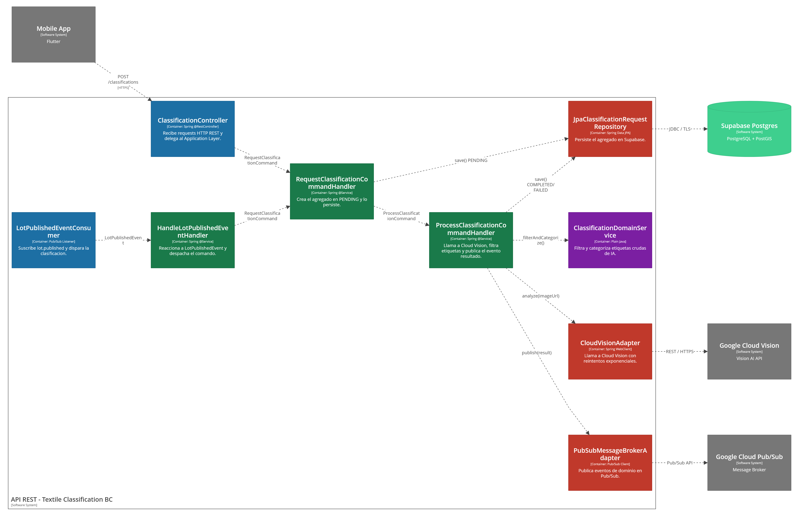<br>
</p>

*Figura: Component Level Diagram — Textile Classification BC*

> **URL del diagrama en Structurizr:** [Component Level Diagram — Textile Classification BC](https://structurizr.com/share/109739/d4c0c1d0-ff19-4acb-9c60-b841f1ceaca6)

El diagrama muestra los siguientes componentes y sus interacciones:

| Componente                            | Tecnología                             | Responsabilidad                                                        | Interactúa con                                                                         |
| :------------------------------------ | :------------------------------------- | :--------------------------------------------------------------------- | :------------------------------------------------------------------------------------- |
| `ClassificationController`            | Spring MVC `@RestController`           | Recibe peticiones HTTP REST y delega al Application Layer              | `RequestClassificationCommandHandler`, `IClassificationRequestRepository`              |
| `LotPublishedEventConsumer`           | Spring `@Component` + Pub/Sub Listener | Suscribe el tópico `lot.published` y dispara el flujo de clasificación | `HandleLotPublishedEventHandler`                                                       |
| `RequestClassificationCommandHandler` | Spring `@Service`                      | Orquesta la creación y persistencia de la solicitud                    | `IClassificationRequestRepository`, `ClassificationEventPublisher`                     |
| `ProcessClassificationCommandHandler` | Spring `@Service`                      | Orquesta la llamada a IA y la actualización del agregado               | `IVisionApiAdapter`, `ClassificationDomainService`, `IClassificationRequestRepository` |
| `ClassificationDomainService`         | Plain Java                             | Filtra, categoriza y evalúa etiquetas crudas                           | (ninguna dependencia externa)                                                          |
| `JpaClassificationRequestRepository`  | Spring Data JPA                        | Persiste y recupera el agregado de dominio                             | Supabase Postgres                                                                      |
| `CloudVisionAdapter`                  | Spring WebClient                       | Invoca Google Cloud Vision con reintentos                              | Google Cloud Vision API                                                                |
| `PubSubMessageBrokerAdapter`          | Pub/Sub Java Client                    | Publica eventos de dominio en Pub/Sub                                  | Google Cloud Pub/Sub                                                                   |

<a name="5.1.7."></a>

### 5.1.7. Bounded Context Software Architecture Code Level Diagrams

<a name="5.1.7.1."></a>

#### 5.1.7.1. Bounded Context Domain Layer Class Diagrams

El siguiente diagrama de clases UML detalla las clases, interfaces, enumeraciones y sus relaciones para la capa de dominio del Bounded Context _Textile Classification_. Incluye atributos, métodos y sus modificadores de acceso (`+` público, `-` privado, `#` protegido). El diagrama fue elaborado en **LucidChart**.

<p align="center">
  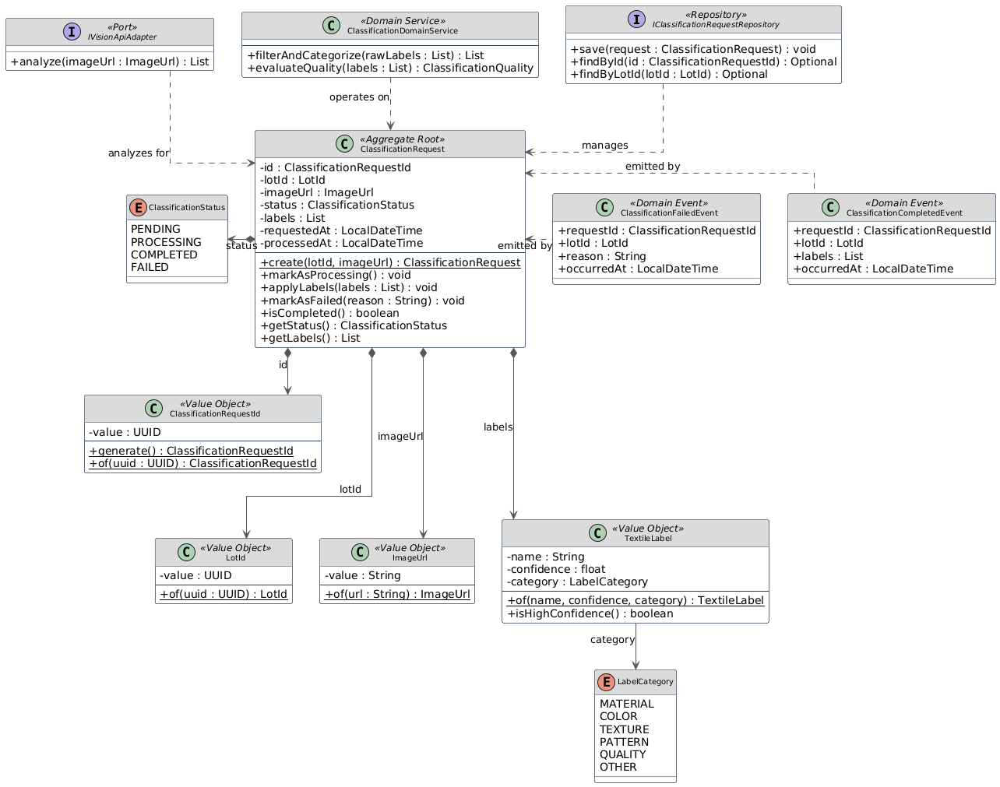<br>
</p>

*Figura: Domain Layer Class Diagram — Textile Classification BC*

> **URL del diagrama en LucidChart:** [Textile Classification - Domain Layer Class Diagram](https://lucid.app/lucidchart/40532e9e-fa09-4910-96bb-9af9bdcd916d/edit?view_items=IxdWNX_8koxV&page=0_0&invitationId=inv_1bbae2c5-8451-4cbc-bbc2-3dcaa60090ae)

**Descripción de relaciones principales:**

| Relación                                                     | Tipo        | Multiplicidad | Descripción                                                                                                     |
| :----------------------------------------------------------- | :---------- | :------------ | :-------------------------------------------------------------------------------------------------------------- |
| `ClassificationRequest` → `TextileLabel`                     | Composición | 1..\*         | El agregado contiene y controla el ciclo de vida de sus etiquetas. Las etiquetas no existen fuera del agregado. |
| `ClassificationRequest` → `ClassificationRequestId`          | Dependencia | 1             | El agregado usa su Value Object como identidad.                                                                 |
| `ClassificationRequest` → `LotId`                            | Asociación  | 1             | Referencia cruzada al lote del BC de Publicación.                                                               |
| `ClassificationRequest` → `ImageUrl`                         | Asociación  | 1             | URL validada de la imagen a clasificar.                                                                         |
| `ClassificationRequest` → `ClassificationStatus`             | Uso         | 1             | El agregado cambia su estado según el flujo.                                                                    |
| `TextileLabel` → `LabelCategory`                             | Uso         | 1             | Cada etiqueta pertenece a una categoría semántica.                                                              |
| `ClassificationDomainService` → `ClassificationRequest`      | Dependencia | —             | El servicio opera sobre el agregado como parámetro.                                                             |
| `IClassificationRequestRepository` ← `ClassificationRequest` | Realización | —             | El repositorio gestiona la persistencia del agregado.                                                           |
| `IVisionApiAdapter` → `RawLabel`                             | Dependencia | 1..\*         | El puerto devuelve etiquetas crudas de la IA.                                                                   |

<a name="5.1.7.2."></a>

#### 5.1.7.2. Bounded Context Database Design Diagram

El siguiente diagrama de base de datos detalla los objetos de persistencia necesarios para el Bounded Context _Textile Classification_ en **Supabase Postgres**. El diagrama fue elaborado en **LucidChart / Vertabelo**.

<p align="center">
  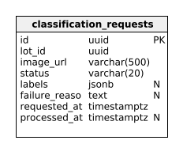<br>
</p>

*Figura: Database Design Diagram — Textile Classification BC*

> **URL del diagrama en LucidChart / Vertabelo:** [Textile Classification - Database Design Diagram](https://lucid.app/lucidchart/40532e9e-fa09-4910-96bb-9af9bdcd916d/edit?view_items=IxdWNX_8koxV&page=0_0&invitationId=inv_1bbae2c5-8451-4cbc-bbc2-3dcaa60090ae)

**Descripción de la tabla principal:**

**Tabla: `classification_requests`**

| Columna          | Tipo           | Constraints                     | Descripción                                                                                                                     |
| :--------------- | :------------- | :------------------------------ | :------------------------------------------------------------------------------------------------------------------------------ |
| `id`             | `UUID`         | `PRIMARY KEY`, `NOT NULL`       | Identificador único de la solicitud de clasificación.                                                                           |
| `lot_id`         | `UUID`         | `NOT NULL`, `INDEX`             | Referencia al lote en el BC de Publicación. No es FK directa (contextos desacoplados).                                          |
| `image_url`      | `VARCHAR(500)` | `NOT NULL`                      | URL validada de la imagen en Google Cloud Storage.                                                                              |
| `status`         | `VARCHAR(20)`  | `NOT NULL`, `DEFAULT 'PENDING'` | Estado del ciclo de vida: `PENDING`, `PROCESSING`, `COMPLETED`, `FAILED`.                                                       |
| `labels`         | `JSONB`        | `NULL`                          | Array JSON con las etiquetas generadas: `[{name, confidence, category}]`. Se usa `JSONB` para consultas indexadas por etiqueta. |
| `failure_reason` | `TEXT`         | `NULL`                          | Descripción del error en caso de estado `FAILED`.                                                                               |
| `requested_at`   | `TIMESTAMPTZ`  | `NOT NULL`, `DEFAULT NOW()`     | Timestamp de creación de la solicitud.                                                                                          |
| `processed_at`   | `TIMESTAMPTZ`  | `NULL`                          | Timestamp de finalización del procesamiento (exitoso o fallido).                                                                |

**Índices:**

| Índice                      | Columnas | Tipo   | Propósito                                                                                      |
| :-------------------------- | :------- | :----- | :--------------------------------------------------------------------------------------------- |
| `idx_classification_lot_id` | `lot_id` | B-Tree | Consulta eficiente de la clasificación de un lote por su ID.                                   |
| `idx_classification_status` | `status` | B-Tree | Filtrado rápido de solicitudes en estado `PENDING` o `PROCESSING` por el worker de reintentos. |
| `idx_classification_labels` | `labels` | GIN    | Búsqueda dentro del campo JSONB para filtrar lotes por tipo de material o categoría textil.    |

> **Decisión de diseño:** Se optó por una **tabla única** con un campo `JSONB` para las etiquetas en lugar de una tabla normalizada `classification_labels` con FK. Esta decisión se justifica porque las etiquetas son inmutables una vez que la clasificación se completa (se generan y escriben una sola vez) y el patrón de acceso es siempre recuperar el conjunto completo de etiquetas de una solicitud, nunca etiquetas individuales en aislamiento. El índice GIN sobre el campo `JSONB` garantiza eficiencia en las consultas de búsqueda por material sin sacrificar la simplicidad del esquema.

<a name="5.2."></a>

## 5.2. Bounded Context: Reservation Management

El Bounded Context Reservation Management es responsable de gestionar el ciclo de vida de las reservas de lotes textiles dentro de la plataforma GamarraLoop. Este contexto permite que los artesanos o recolectores puedan reservar materiales disponibles publicados por los talleres de confección, evitando conflictos de disponibilidad y asegurando la trazabilidad del proceso de recojo.

<a name="5.2.1."></a>

### 5.2.1. Domain Layer

**Sub-capa Model**
| Tipo | Nombre | Descripción | Responsabilidad Principal | Relación con otros elementos |
| ------------ | ---------------------- | ------------------------------------------------------------------------------- | ---------------------------------------------------------------------------------------------- | -------------------------------------------------------------------------- |
| Aggregate | Reservation | Representa la reserva de un lote textil realizada por un artesano o recolector. | Centralizar el ciclo de vida de la reserva y garantizar la consistencia del proceso de recojo. | Relacionado con PickupConfirmation, ReservationStatus, Publication y User. |
| Entity | PickupConfirmation | Representa la confirmación de entrega y recepción de un lote reservado. | Validar y registrar el recojo exitoso del lote textil. | Relacionado con Reservation. |
| Value Object | ReservationStatus | Estado actual de una reserva dentro del sistema. | Controlar las transiciones válidas del flujo de reserva. | Relacionado con Reservation. |
| Value Object | PickupLocation | Representa la ubicación exacta donde será recogido el lote textil. | Estandarizar la información geográfica asociada al recojo. | Relacionado con Reservation y Publication. |
| Value Object | ReservationPeriod | Intervalo de tiempo válido para una reserva. | Gestionar expiraciones y tiempos límite de recojo. | Relacionado con Reservation. |
| Value Object | ReservationNote | Comentario adicional asociado a la reserva. | Permitir agregar observaciones relevantes para la coordinación del recojo. | Relacionado con Reservation. |
| Command | CreateReservation | Registra una nueva reserva sobre un lote disponible. | Crear una reserva válida asociada a un lote textil. | Usa Reservation, Publication y User. |
| Command | CancelReservation | Cancela una reserva activa. | Cambiar el estado de la reserva y liberar el lote. | Usa Reservation. |
| Command | ConfirmPickup | Registra la confirmación del recojo físico del lote. | Completar el proceso de entrega y recepción. | Usa Reservation y PickupConfirmation. |
| Command | ExpireReservation | Marca automáticamente una reserva como expirada. | Liberar reservas vencidas no atendidas. | Usa Reservation y ReservationPeriod. |
| Command | UpdateReservationNote | Actualiza observaciones asociadas a la reserva. | Mantener información complementaria actualizada. | Usa Reservation y ReservationNote. |
| Query | GetReservationById | Recupera la información detallada de una reserva. | Consultar datos completos de una reserva específica. | Consulta Reservation y PickupConfirmation. |
| Query | GetReservationsByUser | Recupera las reservas realizadas por un usuario. | Permitir seguimiento de reservas activas e históricas. | Consulta Reservation y User. |
| Query | GetActiveReservations | Recupera todas las reservas activas del sistema. | Facilitar monitoreo y gestión operativa. | Consulta Reservation. |
| Query | GetExpiredReservations | Recupera reservas expiradas automáticamente. | Permitir auditoría y control de reservas vencidas. | Consulta Reservation y ReservationPeriod. |

**Sub-capa Services**
| Tipo | Nombre | Descripción | Responsabilidad Principal | Relación con otros elementos |
| --------- | ------------------------------ | ------------------------------------------------------------------ | ------------------------------------------------------------- | -------------------------------------------------------------------------- |
| Interface | ReservationCommandService | Servicio para comandos relacionados con reservas. | Declarar métodos para crear, cancelar, actualizar y confirmar reservas. | Implementado por ReservationCommandServiceImpl. Usado en capa Application. |
| Interface | ReservationQueryService | Servicio para consultas relacionadas con reservas. | Declarar métodos para recuperar información de reservas. | Implementado por ReservationQueryServiceImpl. Usado en capa Application. |
| Interface | ReservationExpirationService | Servicio para expiración automática de reservas. | Detectar y procesar reservas vencidas. | Utiliza Reservation y ReservationPeriod. |
| Interface | ReservationNotificationService | Servicio para emisión de notificaciones relacionadas con reservas. | Informar eventos importantes del flujo de reserva. | Relacionado con Notification Management. |

<a name="5.2.2."></a>

### 5.2.2. Interface Layer

**Sub-capa REST**

| Tipo       | Nombre                                            | Descripción                                                                       | Responsabilidad Principal                                                                           | Relación con otros elementos                                                                  |
| ---------- | ------------------------------------------------- | --------------------------------------------------------------------------------- | --------------------------------------------------------------------------------------------------- | --------------------------------------------------------------------------------------------- |
| Controller | ReservationController                             | Controlador REST para gestionar reservas de lotes textiles.                       | Recibir solicitudes relacionadas con reservas, coordinar comandos y devolver respuestas al cliente. | Utiliza ReservationRequestResource, ReservationResponseResource y sus respectivos assemblers. |
| Resource   | CreateReservationRequestResource                  | Estructura de una petición para crear una nueva reserva.                          | Representar los datos enviados por el cliente para registrar una reserva.                           | Usado por ReservationController para enviar datos al sistema.                                 |
| Resource   | CancelReservationRequestResource                  | Estructura de una petición para cancelar una reserva.                             | Representar los datos necesarios para cancelar una reserva activa.                                  | Usado por ReservationController.                                                              |
| Resource   | UpdateReservationNoteRequestResource              | Estructura de una petición para actualizar observaciones de una reserva.          | Representar información complementaria asociada a la reserva.                                       | Usado por ReservationController.                                                              |
| Resource   | ReservationResponseResource                       | Estructura de respuesta con información detallada de una reserva.                 | Devolver al cliente una representación clara del estado de la reserva.                              | Usado por ReservationController como respuesta.                                               |
| Resource   | ConfirmPickupRequestResource                      | Estructura de una petición para confirmar el recojo de un lote textil.            | Representar datos de confirmación enviados por el usuario.                                          | Usado por ReservationController.                                                              |
| Resource   | ConfirmPickupResponseResource                     | Estructura de respuesta con información de confirmación de recojo.                | Devolver al cliente el resultado del proceso de confirmación.                                       | Usado por ReservationController.                                                              |
| Assembler  | CreateReservationCommandFromResourceAssembler     | Convierte un recurso de petición en un comando de creación de reserva.            | Traducir datos de entrada del cliente a comandos de dominio.                                        | Usado por ReservationController.                                                              |
| Assembler  | CancelReservationCommandFromResourceAssembler     | Convierte un recurso de petición en un comando de cancelación.                    | Transformar solicitudes del cliente en comandos del dominio.                                        | Usado por ReservationController.                                                              |
| Assembler  | UpdateReservationNoteCommandFromResourceAssembler | Convierte un recurso de petición en un comando de actualización de observaciones. | Traducir solicitudes del cliente a comandos de dominio.                                             | Usado por ReservationController.                                                              |
| Assembler  | ConfirmPickupCommandFromResourceAssembler         | Convierte un recurso de petición en un comando de confirmación de recojo.         | Traducir datos del cliente a comandos de dominio relacionados con confirmaciones.                   | Usado por ReservationController.                                                              |
| Assembler  | ReservationResourceFromEntityAssembler            | Convierte una entidad Reservation en un recurso de respuesta.                     | Traducir objetos del dominio a estructuras legibles para el cliente.                                | Usado por ReservationController.                                                              |
| Assembler  | ConfirmPickupResourceFromEntityAssembler          | Convierte una entidad PickupConfirmation en un recurso de respuesta.              | Traducir confirmaciones del dominio a respuestas claras para el cliente.                            | Usado por ReservationController.                                                              |

<a name="5.2.3."></a>

### 5.2.3. Application Layer

**Sub-capa Internal**
| Tipo | Nombre | Descripción | Responsabilidad Principal | Relación con otros elementos |
| ------- | ---------------------------------- | ------------------------------------------------------------------------ | -------------------------------------------------------------------------------------- | -------------------------------------------------------------------------------------------------------- |
| Service | ReservationCommandServiceImpl | Implementación del servicio de comandos para reservas. | Ejecutar la lógica de creación, cancelación, actualización y confirmación de reservas. | Implementa ReservationCommandService. Utiliza Reservation, PickupConfirmation y repositorios de dominio. |
| Service | ReservationQueryServiceImpl | Implementación del servicio de consultas para reservas. | Obtener información de reservas mediante distintas consultas del sistema. | Implementa ReservationQueryService. Consulta entidades Reservation y PickupConfirmation. |
| Service | ReservationExpirationServiceImpl | Implementación del servicio de expiración automática de reservas. | Detectar reservas vencidas y actualizar su estado automáticamente. | Implementa ReservationExpirationService. Utiliza Reservation y ReservationPeriod. |
| Service | ReservationNotificationServiceImpl | Implementación del servicio de notificaciones relacionadas con reservas. | Gestionar el envío de notificaciones sobre eventos importantes del flujo de reservas. | Implementa ReservationNotificationService. Interactúa con Notification Management. |

<a name="5.2.4."></a>

### 5.2.4. Infrastructure Layer

**Sub-capa Infrastructure**

| Tipo       | Nombre                | Descripción                                                             | Responsabilidad Principal                                                       | Relación con otros elementos                                                                                 |
| ---------- | --------------------- | ----------------------------------------------------------------------- | ------------------------------------------------------------------------------- | ------------------------------------------------------------------------------------------------------------ |
| Repository | ReservationRepository | Repositorio para gestionar reservas de lotes textiles.                  | Encargado de la persistencia y recuperación de datos relacionados con reservas. | Relacionado con la entidad Reservation, interactúa con la base de datos para almacenar y consultar reservas. |
| Service    | NotificationGateway   | Servicio de integración con el bounded context Notification Management. | Enviar notificaciones relacionadas con reservas y confirmaciones de recojo.     | Utilizado por ReservationNotificationServiceImpl.                                                            |
| Service    | PublicationGateway    | Servicio de integración con Publication Management.                     | Consultar disponibilidad y estado de publicaciones antes de generar reservas.   | Utilizado por ReservationCommandServiceImpl y ReservationExpirationServiceImpl.                              |
| Service    | SchedulerService      | Servicio encargado de tareas automáticas programadas.                   | Ejecutar procesos periódicos de expiración de reservas vencidas.                | Utilizado por ReservationExpirationServiceImpl.                                                              |

<a name="5.2.5."></a>

### 5.2.5. Bounded Context Software Architecture Component Level Diagrams

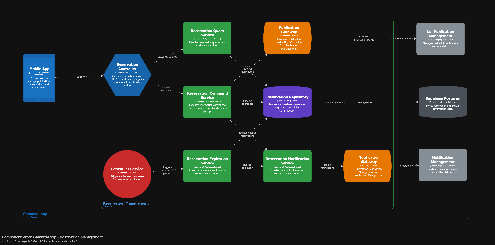<br>
*Figura: Reservation Management Component Diagram*

> **URL del diagrama en Structurizr:** [Component Level Diagram — Reservation Management](https://structurizr.com/share/87648/2a7d9c28-bae2-436b-8916-703b4e1cc1a1)

<a name="5.2.6."></a>

### 5.2.6. Bounded Context Software Architecture Code Level Diagrams

<a name="5.2.6.1."></a>

### 5.2.6.1. Bounded Context Domain Layer Class Diagrams

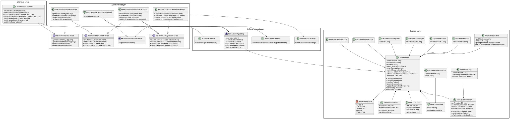<br>
*Figura: Reservation Management Class Diagram*

> **URL del diagrama en LucidChart:** [Reservation Management - Domain Layer Class Diagram](https://lucid.app/lucidchart/34041e0d-7674-4dfd-814e-27636277f650/edit?viewport_loc=-2594%2C-386%2C3108%2C1656%2CePIVMkaeuy2n&invitationId=inv_1ebd179d-ef67-4d10-99e2-dae5e795b0dd)

<a name="5.2.6.2."></a>

### 5.2.6.2. Bounded Context Database Design Diagram

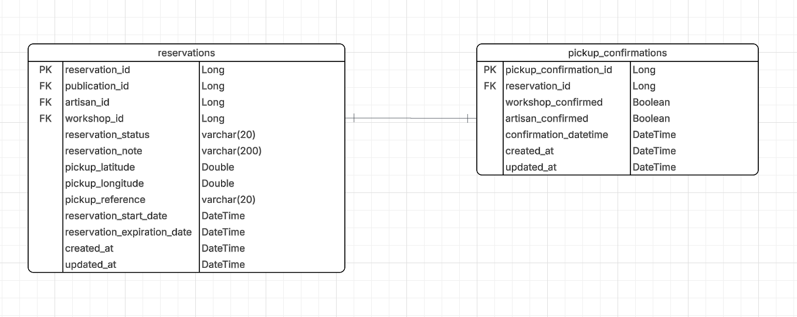<br>
*Figura: Reservation Management Class Diagram*

> **URL del diagrama en LucidChart / Vertabelo:** [Reservation Management - Database Design Diagram](https://lucid.app/lucidchart/34041e0d-7674-4dfd-814e-27636277f650/edit?invitationId=inv_1ebd179d-ef67-4d10-99e2-dae5e795b0dd)


## 5.3. Bounded Context: Lot Publication Management

Este bounded context se encarga de gestionar la publicación de lotes textiles registrados por los confeccionistas dentro de la plataforma GamarraLoop/Recitex. Su responsabilidad principal es permitir que un confeccionista cree, actualice, publique o retire un lote textil, manteniendo la información necesaria para que posteriormente pueda ser clasificado, visualizado y reservado por los artesanos.
Este bounded context no clasifica los lotes, no gestiona reservas, no controla entregas y no expira lotes. Esas responsabilidades pertenecen a otros bounded contexts. Su foco está en el ciclo inicial del lote: registro, validación básica, publicación y disponibilidad inicial.


## 5.3.1. Domain Layer

La capa de interfaz expone el bounded context Lot Publication Management hacia el exterior, principalmente hacia los clientes HTTP, como la aplicación móvil, y hacia otros bounded contexts mediante eventos. Actúa como adaptador de entrada dentro de una arquitectura hexagonal, recibiendo solicitudes externas y delegando la ejecución a la capa de aplicación.


| Clase / Interfaz | Categoría | Propósito | Atributos | Métodos |
|---|---|---|---|---|
| **Lot** | Entity / Aggregate Root | Representa un lote textil publicado por un confeccionista. Es el agregado raíz que controla su información, estado y transiciones del ciclo de publicación. | `lotId: LotId`<br>`publisherId: PublisherId`<br>`title: LotTitle`<br>`description: LotDescription`<br>`weight: LotWeight`<br>`location: LotLocation`<br>`images: List<LotImage>`<br>`status: LotStatus`<br>`createdAt: CreatedAt`<br>`publishedAt: PublishedAt` | `create(publisherId, title, description, weight, location, images): Lot`<br><br>`updateDetails(title, description, weight, location, images): void`<br><br>`submitForClassification(): void`<br><br>`publish(): void`<br><br>`withdraw(): void`<br><br>`canBeEdited(): boolean`<br><br>`isPublished(): boolean` |
| **LotImage** | Value Object | Representa una imagen asociada al lote. Inmutable. | `imageUrl: ImageUrl`<br>`thumbnailUrl: ImageUrl`<br>`order: Integer` | `of(imageUrl: ImageUrl, thumbnailUrl: ImageUrl, order: Integer): LotImage` |
| **PublisherId** | Value Object | Identificador único del confeccionista que publica el lote. | `value: UUID` | `of(uuid: UUID): PublisherId` |
| **LotId** | Value Object | Identificador único del lote dentro del sistema. | `value: UUID` | `of(uuid: UUID): LotId` |
| **LotTitle** | Value Object | Título descriptivo del lote. | `value: String` | `of(value: String): LotTitle` |
| **LotDescription** | Value Object | Descripción detallada del lote textil. | `value: String` | `of(value: String): LotDescription` |
| **LotWeight** | Value Object | Peso aproximado del lote textil (en kg). | `value: Decimal` | `of(value: Decimal): LotWeight` |
| **LotLocation** | Value Object | Ubicación del lote para referencia y coordinación. | `address: String`<br>`district: String`<br>`coordinates: Coordinates` | `of(address, district, coordinates): LotLocation` |
| **Coordinates** | Value Object | Coordenadas geográficas del lote. | `latitude: Decimal`<br>`longitude: Decimal` | `of(latitude: Decimal, longitude: Decimal): Coordinates` |
| **LotStatus** | Enumeration | Estados posibles del ciclo de vida del lote dentro del proceso de publicación. | `DRAFT`<br>`PENDING_CLASSIFICATION`<br>`PUBLISHED`<br>`WITHDRAWN` | — |
| **LotPublicationPolicy** | Domain Service | Contiene reglas de negocio para validar si un lote cumple con los requisitos para ser publicado. | — | `canBePublished(lot: Lot): ValidationResult`<br><br>`validateForSubmission(lot: Lot): ValidationResult` |
| **LotRepository** | Repository (Interfaz) | Punto de persistencia del agregado `Lot`. Define el contrato de acceso a datos sin exponer la implementación. | — | `save(lot: Lot): void`<br><br>`findById(lotId: LotId): Optional<Lot>`<br><br>`existsById(lotId: LotId): boolean`<br><br>`findByPublisherId(publisherId: PublisherId): List<Lot>` |
| **LotPublishedEvent** | Domain Event | Evento publicado cuando un lote pasa al estado `PUBLISHED`. | `lotId: LotId`<br>`publisherId: PublisherId`<br>`publishedAt: LocalDateTime` | — |
| **LotWithdrawnEvent** | Domain Event | Evento publicado cuando un lote es retirado antes de ser reservado. | `lotId: LotId`<br>`publisherId: PublisherId`<br>`withdrawnAt: LocalDateTime`<br>`reason: String` | — |
| **LotSubmittedForClassificationEvent** | Domain Event | Evento publicado cuando un lote es enviado al proceso de clasificación. | `lotId: LotId`<br>`publisherId: PublisherId`<br>`submittedAt: LocalDateTime` | — |


### 5.3.2. Interface Layer


La capa de interfaz expone el Bounded Context **Lot Publication Management** hacia el exterior. Atiende solicitudes de la aplicación móvil a través de API REST y se integra con otros Bounded Contexts mediante eventos (Google Cloud Pub/Sub). Actúa como adaptador de entrada (*driving adapter*).

| Clase | Categoría | Propósito | Endpoints / Suscripciones | Request / Response |
|---|---|---|---|---|
| **LotPublicationController** | REST Controller | Expone los endpoints HTTP para registrar, actualizar, enviar a clasificación, publicar, retirar y consultar lotes. Es consumido por la aplicación móvil a través del API Gateway. | `POST /api/v1/lots` → Crea un nuevo lote (estado DRAFT).<br><br>`PUT /api/v1/lots/{lotId}` → Actualiza información básica del lote (editable).<br><br>`POST /api/v1/lots/{lotId}/submit-classification` → Envía el lote al proceso de clasificación.<br><br>`POST /api/v1/lots/{lotId}/publish` → Publica el lote cuando está clasificado.<br><br>`POST /api/v1/lots/{lotId}/withdraw` → Retira el lote publicado o pendiente.<br><br>`GET /api/v1/lots/{lotId}` → Obtiene detalle de un lote.<br><br>`GET /api/v1/lots/publisher/{publisherId}` → Lista lotes por confeccionista.<br><br>`GET /api/v1/lots?status={status}` → Lista lotes por estado (DRAFT, PENDING_CLASSIFICATION, PUBLISHED, WITHDRAWN). | **Request (POST / PUT):**<br><br>```json { "publisherId": "UUID", "title": "String", "description": "String", "weight": 12.5, "location": { "address": "String", "district": "String", "coordinates": { "latitude": -12.0464, "longitude": -77.0428 } }, "images": ["String"] } ```<br><br>**Response (ejemplo):**<br><br>```json { "lotId": "UUID", "status": "DRAFT", "createdAt": "2025-05-20T10:15:00Z" } ``` |
| **LotQueryController** | REST Controller | Expone endpoints especializados en consultas (lecturas). No modifica el estado del dominio. | `GET /api/v1/lots/{lotId}`<br><br>`GET /api/v1/lots/publisher/{publisherId}`<br><br>`GET /api/v1/lots?status={status}` | **Response (GET):**<br><br>```json { "lotId": "UUID", "publisherId": "UUID", "title": "String", "description": "String", "weight": 12.5, "location": { ... }, "images": ["imageUrl", "String"], "status": "PUBLISHED", "createdAt": "2025-05-20T10:15:00Z", "publishedAt": "2025-05-22T08:30:00Z" } ``` |
| **ClassificationCompletedEventConsumer** | Event Consumer (Pub/Sub) | Suscriptor del evento publicado por el Bounded Context Textile Classification Management cuando un lote ha sido clasificado exitosamente. Dispara el flujo para permitir su publicación. | Suscripción: `classification.completed-subscription`<br><br>Topic: `classification.completed` | **Mensaje esperado:**<br><br>```json { "lotId": "UUID", "classificationId": "UUID", "labels": [{ "name": "String", "confidence": 0.92 }], "processedAt": "2025-05-22T08:30:00Z" } ``` |
| **ReservationStartedEventConsumer** | Event Consumer (Pub/Sub) | Suscriptor del evento publicado por el Bounded Context Reservation Management cuando un lote ha sido reservado. Evita modificaciones adicionales que sean inválidas según el dominio. | Suscripción: `reservation.started-subscription`<br><br>Topic: `reservation.started` | **Mensaje esperado:**<br><br>```json { "lotId": "UUID", "reservationId": "UUID", "artisanId": "UUID", "reservedAt": "2025-05-22T09:10:00Z" } ``` |
| **LotPublicationEventPublisher** | Event Publisher | Publica eventos de dominio generados en este bounded context para que otros contextos reaccionen de forma desacoplada. | Tópicos publicados:<br><br>• `lot.submitted-for-classification`<br>• `lot.published`<br>• `lot.withdrawn` | **Mensajes publicados (ejemplo):**<br><br>```json { "lotId": "UUID", "publisherId": "UUID", "occurredAt": "2025-05-22T10:20:00Z", "reason": "String (solo para withdrawn)" } ``` |


### 5.3.3. Application Layer


La capa de aplicación orquesta los flujos de negocio del Bounded Context **Lot Publication Management**. No contiene lógica de dominio, sino que coordina la colaboración entre la capa de dominio, los repositorios y los adaptadores externos. Implementa el patrón **Command Handler** para peticiones explícitas, **Query Handler** para consultas y **Event Handler** para reaccionar a eventos del sistema.

| Clase | Categoría | Propósito | Comandos / Eventos que procesa | Colaboraciones |
|---|---|---|---|---|
| **CreateLotCommandHandler** | Command Handler | Procesa el comando `CreateLotCommand`. Crea el agregado `Lot` en estado `DRAFT`, valida los datos iniciales y lo persiste mediante el repositorio. | ```text CreateLotCommand { publisherId, title, description, weight, location, images } ``` | `Lot.create()` →<br>`LotRepository.save()` |
| **UpdateLotCommandHandler** | Command Handler | Procesa el comando `UpdateLotCommand`. Recupera el lote existente, valida que pueda ser editado y actualiza su información básica sin romper las reglas del dominio. | ```text UpdateLotCommand { lotId, title, description, weight, location, images } ``` | `LotRepository.findById()` →<br>`Lot.canBeEdited()` →<br>`Lot.updateDetails()` →<br>`LotRepository.save()` |
| **SubmitLotForClassificationCommandHandler** | Command Handler | Procesa el comando `SubmitLotForClassificationCommand`. Recupera el lote, valida que tenga información suficiente y cambia su estado a `PENDING_CLASSIFICATION`. Luego publica un evento para iniciar el proceso de clasificación en otro BC. | ```text SubmitLotForClassificationCommand { lotId } ``` | `LotRepository.findById()` →<br>`LotPublicationPolicy.validateForSubmission()` →<br>`Lot.submitForClassification()` →<br>`LotRepository.save()` →<br>`LotPublicationEventPublisher.publishLotSubmittedForClassification()` |
| **PublishLotCommandHandler** | Command Handler | Procesa el comando `PublishLotCommand`. Publica el lote cuando ya cumple las reglas necesarias del dominio y lo deja disponible para los artesanos. | ```text PublishLotCommand { lotId } ``` | `LotRepository.findById()` →<br>`LotPublicationPolicy.canBePublished()` →<br>`Lot.publish()` →<br>`LotRepository.save()` →<br>`LotPublicationEventPublisher.publishLotPublished()` |
| **WithdrawLotCommandHandler** | Command Handler | Procesa el comando `WithdrawLotCommand`. Permite al confeccionista retirar un lote antes de que sea reservado, cambiando su estado a `WITHDRAWN`. | ```text WithdrawLotCommand { lotId, reason } ``` | `LotRepository.findById()` →<br>`Lot.withdraw()` →<br>`LotRepository.save()` →<br>`LotPublicationEventPublisher.publishLotWithdrawn()` |
| **HandleClassificationCompletedEventHandler** | Event Handler | Reacciona al evento externo `ClassificationCompletedEvent`, recibido desde `Textile Classification Management`. Verifica el lote asociado y dispara el comando de publicación si corresponde. | ```text ClassificationCompletedEvent { lotId, classificationId, labels, processedAt } ``` | `LotRepository.findById()` →<br>`PublishLotCommandHandler.handle()` |
| **HandleReservationStartedEventHandler** | Event Handler | Reacciona al evento externo `ReservationStartedEvent`, recibido desde `Reservation Management`. Marca internamente que el lote ya no debe seguir disponible para nuevas modificaciones o publicaciones paralelas. | ```text ReservationStartedEvent { lotId, reservationId, artisanId, reservedAt } ``` | `LotRepository.findById()` →<br>`Lot.markAsReserved()` →<br>`LotRepository.save()` |
| **GetLotByIdQueryHandler** | Query Handler | Procesa la consulta para obtener la información detallada de un lote específico. | ```text GetLotByIdQuery { lotId } ``` | `LotRepository.findById()` →<br>`LotResponseAssembler.toResponse()` |
| **GetLotsByPublisherQueryHandler** | Query Handler | Procesa la consulta para recuperar los lotes registrados por un confeccionista. | ```text GetLotsByPublisherQuery { publisherId } ``` | `LotRepository.findByPublisherId()` →<br>`LotResponseAssembler.toResponseList()` |
| **GetPublishedLotsQueryHandler** | Query Handler | Procesa la consulta para listar los lotes publicados y disponibles para los artesanos. | ```text GetPublishedLotsQuery { status = PUBLISHED } ``` | `LotRepository.findByStatus()` →<br>`LotResponseAssembler.toResponseList()` |
| **CreateLotCommand** | Command | DTO de comando inmutable que transporta los datos necesarios para registrar un nuevo lote. | — | — |
| **UpdateLotCommand** | Command | DTO de comando inmutable que transporta los datos necesarios para actualizar un lote existente. | — | — |
| **SubmitLotForClassificationCommand** | Command | DTO de comando que solicita enviar un lote al proceso de clasificación textil. | — | — |
| **PublishLotCommand** | Command | DTO de comando que solicita publicar un lote validado en la plataforma. | — | — |
| **WithdrawLotCommand** | Command | DTO de comando que solicita retirar un lote publicado o pendiente antes de ser reservado. | — | — |
| **LotPublicationEventPublisher** | Application Service | Servicio de aplicación que abstrae la publicación de eventos hacia el bus de mensajería (Pub/Sub). | — | `MessageBrokerPort.publish()` |
| **LotResponseAssembler** | Application Service / Assembler | Transforma objetos del dominio en respuestas de aplicación para la capa de interfaz. | — | `Lot → LotResponse` |

### 5.3.4. Infrastructure Layer


La capa de infraestructura contiene las implementaciones concretas de los puertos definidos en el dominio. Aquí viven los adaptadores que conectan el sistema con Supabase PostgreSQL y Google Cloud Pub/Sub. Esta capa depende de tecnologías específicas y provee mecanismos de persistencia, comunicación y configuración.

| Clase | Categoría | Propósito | Tecnología | Detalles de implementación |
|---|---|---|---|---|
| **JpaLotRepository** | Repository Implementation | Implementación del puerto `LotRepository` usando Spring Data JPA. Gestiona la persistencia del agregado `Lot` en Supabase PostgreSQL. | Spring Data JPA / Hibernate / Supabase PostgreSQL | Mapeo del agregado con `@Entity` + `@Table("lots")`.<br><br>Los Value Objects (`LotId`, `PublisherId`, `LotTitle`, `LotDescription`, `LotWeight`, `LotLocation`) se persisten como columnas JSONB para evitar tablas de join innecesarias. |
| **CloudVisionAdapter** | External Service Adapter | Implementación del puerto `IVisionApiAdapter`. Realiza la llamada HTTP a la API de Google Cloud Vision (`images:annotate`), transforma la respuesta en una lista de `RawLabel` y maneja reintentos con backoff exponencial (máx. 3 intentos, intervalo inicial 1 s) según la decisión arquitectónica D08. | Google Cloud Vision REST API / Spring WebClient | Autenticación mediante `Application Default Credentials (ADC)` de GCP. Si los 3 reintentos fallan, lanza `VisionApiException` que el Command Handler captura para marcar la solicitud como `FAILED`. |
| **PubSubMessageBrokerAdapter** | Message Broker Adapter | Implementación del puerto `IMessageBrokerPort`. Publica y serializa eventos de dominio como mensajes JSON en los tópicos de Google Cloud Pub/Sub (`lot.submitted-for-classification`, `lot.published`, `lot.withdrawn`). | Google Cloud Pub/Sub Java Client Library | Serialización con Jackson. Los mensajes incluyen atributos de cabecera (`eventType`, `occurredAt`, `aggregateId`) para facilitar el enrutamiento en los subscriptores. |
| **LotEntity** | JPA Entity | Entidad JPA que mapea la tabla `lots`. Realiza la traducción bidireccional entre el agregado de dominio y el modelo de persistencia, aislando los detalles de la base de datos. | JPA / Hibernate | Incluye conversores (`@Converter`) para los Value Objects (`LotId`, `PublisherId`, `LotTitle`, `LotDescription`, `LotWeight`, `LotLocation`) y para la colección de imágenes (`LotImage`). Los campos complejos se guardan como JSONB. |
| **LotImageEmbeddable** | JPA Embeddable | Componente embebible que representa una imagen del lote. Se almacena dentro de la columna `images` (JSONB) en la tabla `lots`. | JPA / Hibernate | Campos:<br>`imageUrl: String`<br>`thumbnailUrl: String`<br>`order: Integer` |
| **CoordinatesEmbeddable** | JPA Embeddable | Componente embebible que representa las coordenadas geográficas del lote. | JPA / Hibernate | Campos:<br>`latitude: Decimal`<br>`longitude: Decimal` |
| **JsonbAttributeConverter** | Infrastructure Converter | Converter genérico para persistir Value Objects como JSONB en Supabase PostgreSQL. | JPA / Hibernate | Implementa `AttributeConverter<T, String>`. Serializa y deserializa Value Objects usando Jackson. |
| **MessageHeaderProvider** | Infrastructure Component | Proveedor de metadatos para eventos publicados en Pub/Sub. | Java / Clock | Agrega automáticamente `eventType`, `occurredAt` y `aggregateId` a los mensajes salientes. |


### 5.3.5. Bounded Context Software Architecture Component Level Diagrams

En este diagrama de componentes (nivel 3 del C4 Model) se descompone el contenedor API REST en los componentes internos que pertenecen exclusivamente al Bounded Context Lot Publication Management, mostrando sus responsabilidades, relaciones y tecnologías.
El diagrama fue elaborado siguiendo el enfoque de arquitectura hexagonal y separación por capas (Interface, Application, Domain e Infrastructure), manteniendo coherencia con los principios de Domain-Driven Design y comunicación basada en eventos.


<p align="center">
  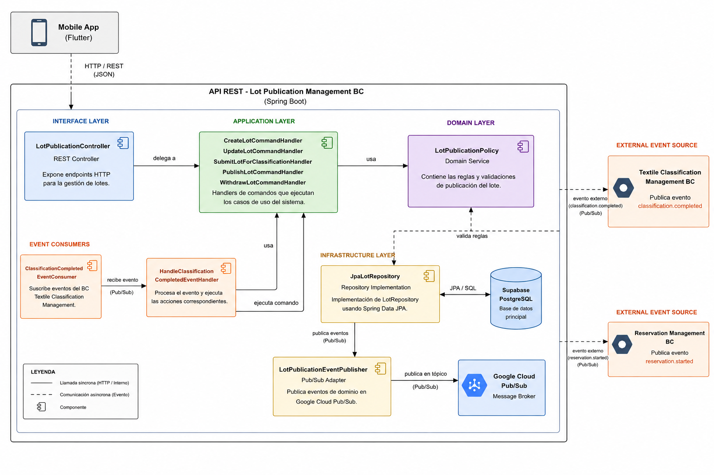
</p>

*Figura: Bounded Context Software Architecture Component Level Diagrams — Lot Publication Management*

| Componente                             | Responsabilidad                                                             |
| -------------------------------------- | --------------------------------------------------------------------------- |
| `LotPublicationController`             | Recibe solicitudes HTTP desde la aplicación móvil.                          |
| `Command Handlers`                     | Orquestan los casos de uso del bounded context.                             |
| `LotPublicationPolicy`                 | Contiene reglas de validación del dominio.                                  |
| `JpaLotRepository`                     | Implementa la persistencia del agregado `Lot`.                              |
| `ClassificationCompletedEventConsumer` | Consume eventos externos provenientes de Textile Classification Management. |
| `LotPublicationEventPublisher`         | Publica eventos del dominio hacia Pub/Sub.                                  |
| `Supabase PostgreSQL`                  | Base de datos principal del bounded context.                                |
| `Google Cloud Pub/Sub`                 | Broker de eventos para comunicación desacoplada.                            |


### 5.3.6. Bounded Context Software Architecture Code Level Diagrams

### 5.3.6.1. Bounded Context Domain Layer Class Diagrams


<p align="center">
  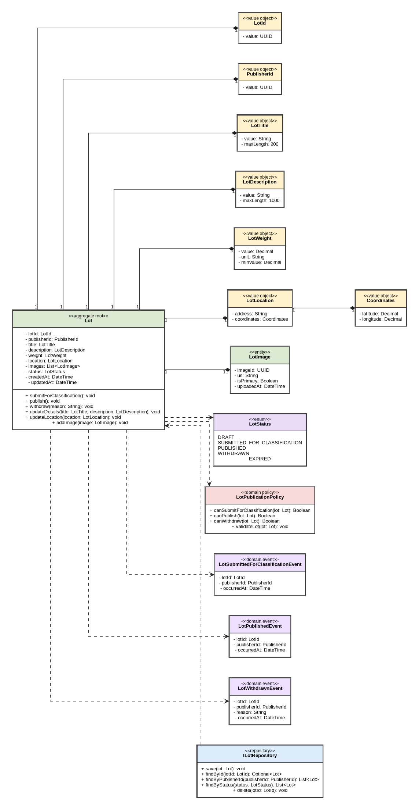
</p>

*Figura: Domain Layer Class Diagram — Lot Publication Management*

Enlace Lucidchart Diagram: [Open Diagram](https://lucid.app/lucidchart/d9f453f5-325d-4c28-a424-548c741b3537/edit?viewport_loc=-3108%2C-4284%2C2593%2C1129%2C0_0&invitationId=inv_b892e46d-27a4-4567-9864-cc2cd041dc56)


Descripción de relaciones principales: 

### Domain Layer Class Diagram – Relationships Description

**Bounded Context:** Lot Publication Management

| # | Relación | Tipo | Elementos Relacionados | Cardinalidad | Descripción | Impacto en el Dominio |
|---|---|---|---|---|---|---|
| 1 | **Composición (Aggregate Root)** | Composición (Fuerte) | `Lot` contiene:<br><br>`LotId`<br>`PublisherId`<br>`LotTitle`<br>`LotDescription`<br>`LotWeight`<br>`LotLocation`<br>`LotImage`<br>`LotStatus` | `1 (Lot)` contiene `1..* (Value Objects / Entity)` | `Lot` es el Aggregate Root que posee y controla el ciclo de vida de todos los Value Objects y la entidad `LotImage`. | Garantiza la consistencia del agregado. Los Value Objects y `LotImage` no pueden existir fuera de un `Lot`. |
| 2 | **Asociación** | Asociación (Débil) | `LotLocation` — `Coordinates` | `1 (LotLocation)` ↔ `1 (Coordinates)` | `LotLocation` utiliza un objeto `Coordinates` para representar las coordenadas geográficas (latitud y longitud). | `Coordinates` es un Value Object compartido que encapsula la ubicación geográfica del lote. |
| 3 | **Dependencia** | Dependencia (Uso) | `Lot` → `LotPublicationPolicy` | `1 (Lot)` → `1 (Policy)` | `Lot` utiliza `LotPublicationPolicy` para validar reglas de negocio antes de permitir operaciones de publicación, retiro o envío a clasificación. | La política puede cambiar de implementación sin afectar el modelo del dominio. |
| 4 | **Dependencia** | Dependencia (Persistencia) | `Application Layer` → `ILotRepository` | `1 (Application)` → `1 (Repository)` | El Application Layer depende del repositorio para persistir y recuperar agregados `Lot`. | Asegura la inversión de dependencias. El dominio no depende de detalles de persistencia. |
| 5 | **Publicación de Evento** | Dependencia (Publicación) | `Lot` → `LotSubmittedForClassificationEvent`<br>`LotPublishedEvent`<br>`LotWithdrawnEvent` | `1 (Lot)` → `1 (Evento)` por evento emitido | `Lot` publica eventos de dominio cuando ocurren cambios de estado relevantes que deben ser comunicados a otros Bounded Contexts. | Permite integración asíncrona y desacoplada con otros contextos a través de eventos de dominio. |
| 6 | **Dependencia entre Contextos** | Dependencia (Inter-Contexto) | `Lot Publication Management` ↔ `Textile Classification Management` | `N/A` (Integración vía eventos) | `Lot Publication Management` envía el evento `LotSubmittedForClassificationEvent` para solicitar procesamiento en el contexto de `Textile Classification Management`. | Mantiene el aislamiento entre contextos. No existe acoplamiento directo, solo comunicación asíncrona por eventos. |

---

## Leyenda de Símbolos

| Símbolo | Significado |
|---|---|
| `◆────` | Composición (Fuerte) |
| `────` | Asociación (Débil) |
| `- - - ->` | Dependencia (Uso) |
| `- - - ->` | Dependencia (Persistencia) |
| `- - - ->` | Publicación de Evento |
| `<- - - ->` | Dependencia entre Contextos |


### 5.3.6.2. Bounded Context Database Design Diagram


<p align="center">
  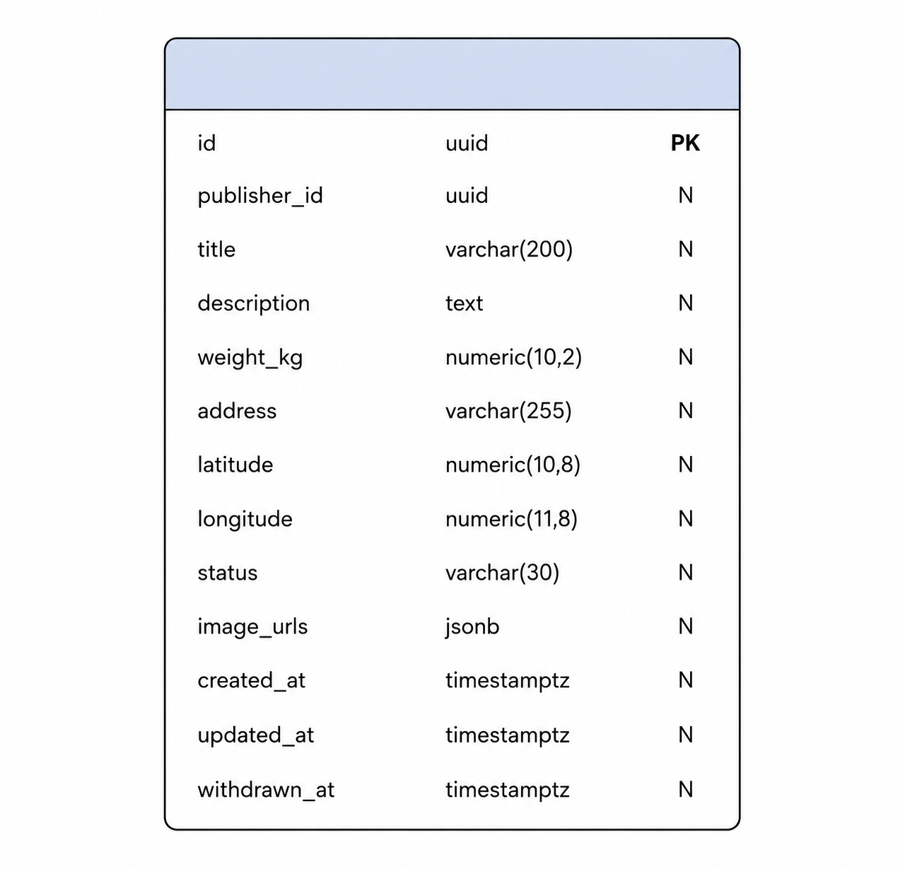
</p>

*Figura: Bounded Context Database Design Diagram — Lot Publication Management*

## Descripción de la tabla principal

### Tabla: `lot_publications`

| Columna | Tipo | Constraints | Descripción |
|---|---|---|---|
| `id` | UUID | PRIMARY KEY, NOT NULL | Identificador único del lote publicado. |
| `publisher_id` | UUID | NOT NULL, INDEX | Referencia al publicador (usuario) que publica el lote. |
| `title` | VARCHAR(200) | NOT NULL | Título o nombre del lote. |
| `description` | TEXT | NOT NULL | Descripción detallada del lote. |
| `weight_kg` | NUMERIC(10,2) | NOT NULL | Peso total del lote en kilogramos. |
| `address` | VARCHAR(255) | NOT NULL | Dirección o referencia de ubicación del lote. |
| `latitude` | NUMERIC(10,8) | NULL | Latitud geográfica de la ubicación del lote (coordenada decimal). |
| `longitude` | NUMERIC(11,8) | NULL | Longitud geográfica de la ubicación del lote (coordenada decimal). |
| `status` | VARCHAR(30) | NOT NULL, DEFAULT `'DRAFT'` | Estado actual del lote en su ciclo de vida.<br><br>Valores posibles:<br>`DRAFT`<br>`SUBMITTED_FOR_CLASSIFICATION`<br>`PUBLISHED`<br>`WITHDRAWN`<br>`EXPIRED` |
| `image_urls` | JSONB | NULL | Array JSON con las URLs de las imágenes del lote. |
| `created_at` | TIMESTAMPTZ | NOT NULL, DEFAULT `NOW()` | Timestamp de creación del registro. |
| `updated_at` | TIMESTAMPTZ | NOT NULL, DEFAULT `NOW()` | Timestamp de última actualización del registro. |
| `withdrawn_at` | TIMESTAMPTZ | NULL | Timestamp en que el lote fue retirado (si aplica). |


## Índices

| Índice | Columnas | Tipo | Propósito |
|---|---|---|---|
| `idx_classification_lot_id` | `lot_id` | B-Tree | Consulta eficiente de la clasificación de un lote por su ID. |
| `idx_classification_status` | `status` | B-Tree | Filtrado rápido de solicitudes en estado `PENDING` o `PROCESSING` por el worker de reintentos. |
| `idx_classification_labels` | `labels` | GIN | Búsqueda dentro del campo JSONB para filtrar lotes por tipo de material o categoría textil. |

### Decisión de diseño

Se optó por una tabla única con un campo `JSONB` para las etiquetas en lugar de una tabla normalizada `classification_labels` con FK. Esta decisión se justifica porque las etiquetas son inmutables una vez que la clasificación se completa (se generan y escriben una sola vez) y el patrón de acceso es siempre recuperar el conjunto completo de etiquetas de una solicitud, nunca etiquetas individuales en aislamiento. El índice `GIN` sobre el campo `JSONB` garantiza eficiencia en las consultas de búsqueda por material sin sacrificar la simplicidad del esquema.


<a name="6."></a>

# Capítulo VI: Solution UX Design

<a name="6.1."></a>

## 6.1. Style Guidelines.

En este capítulo se presentan los lineamientos de estilo y las herramientas que se emplearán para el diseño del proyecto. Se detallarán los criterios visuales, componentes y recursos que permitirán mantener una identidad a lo largo de la aplicación, así como una experiencia de usuario clara y consistente. Estos lineamientos servirán como base para el desarrollo de las interfaces, asegurando una experiencia confortable para el usuario.

<a name="6.1.1."></a>

### 6.1.1. General Style Guidelines.

**Brand Overview**

En un entorno como Gamarra, donde la producción textil es intensa y constante, la generación de residuos de tela es un problema frecuente que muchas veces no cuenta con una gestión adecuada. Retazos, excedentes y materiales sobrantes suelen ser descartados sin ser aprovechados, a pesar de su potencial para reutilización.
GamarraLoop nace como una solución digital que conecta talleres de confección con artesanos y recolectores, facilitando la reutilización de estos residuos textiles. A través de una aplicación móvil, los talleres pueden publicar sus excedentes de manera rápida, mientras que los usuarios interesados pueden visualizar, filtrar y ubicar estos materiales en tiempo real.
La plataforma integra funcionalidades como geolocalización y clasificación automática de materiales mediante inteligencia artificial, permitiendo mejorar la visibilidad de los recursos disponibles. De esta manera, se busca reducir el desperdicio textil, fomentar la economía circular y generar valor tanto económico como ambiental dentro del ecosistema de Gamarra.

**Brand Name**

El nombre GamarraLoop surge de la combinación de dos conceptos clave. Por un lado, “Gamarra”, que representa el principal emporio textil del Perú y el contexto donde se desarrolla la problemática. Por otro lado, “Loop”, que hace referencia a un ciclo continuo, simbolizando la reutilización de materiales dentro de un modelo de economía circular.

El nombre transmite la idea de cerrar el ciclo de vida de los textiles, evitando que los residuos se conviertan en desecho y, en su lugar, se reintegren al sistema productivo. Además, el uso del término en inglés le da un enfoque moderno, tecnológico y fácil de recordar, alineado con una solución digital innovadora.
A continuación, se presenta el logotipo de GamarraLoop, el cual refleja visualmente el concepto de reutilización textil mediante elementos como hilo, aguja y formas circulares que representan el flujo continuo de materiales dentro de la plataforma.
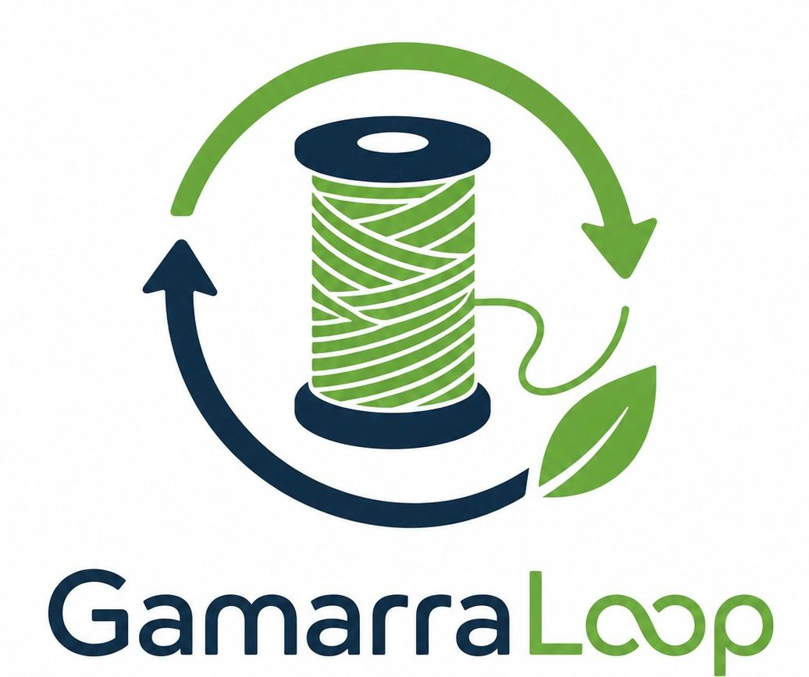<br>
*Figura: Logo GamarraLoop*

**Typography**

La tipografía en GamarraLoop cumple un papel importante en la claridad de la información y en la experiencia de uso dentro de la aplicación. Se ha priorizado el uso de fuentes modernas y altamente legibles, considerando que los usuarios necesitan interactuar de forma rápida y sencilla mientras gestionan o buscan materiales textiles.
La jerarquía tipográfica se organiza en cuatro niveles principales: headings (encabezados) para destacar secciones clave, body (texto) para el contenido general, buttons (botones) para acciones relevantes dentro del sistema y links (enlaces) para la navegación. Esta estructura permite mantener un orden visual claro y consistente en toda la interfaz.
Para el diseño se han seleccionado tipografías que equilibran estética y funcionalidad. Se emplea una fuente con mayor personalidad para títulos y elementos destacados, aportando identidad visual a la aplicación, mientras que para los textos se utiliza una tipografía limpia y fácil de leer, asegurando una correcta comprensión del contenido en distintos dispositivos. Además, el uso de colores como verde oscuro y negro en la tipografía refuerza la identidad del proyecto y mejora el contraste visual.

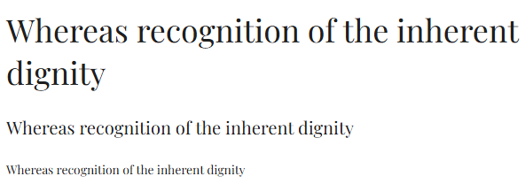<br>
*Figura: Typography*

**Colors**

La elección de colores en GamarraLoop está orientada a reflejar sostenibilidad, orden y conexión con el entorno textil, alineándose con el enfoque de economía circular del proyecto.

**Color Primario(Beige claro):**

El beige claro se utiliza como color predominante en los fondos de la aplicación. Este color transmite calidez, naturalidad y simplicidad, evocando materiales textiles y generando una experiencia visual más amigable. Además, permite que los demás elementos destaquen sin sobrecargar la interfaz.

**Colores Secundarios(Verde y negro):**

El verde oscuro es el color principal de interacción dentro de la aplicación. Representa sostenibilidad, reutilización y crecimiento, valores clave del proyecto. Se utiliza en botones, encabezados y elementos importantes de la interfaz.

El negro complementa la paleta aportando contraste y elegancia. Se emplea principalmente en textos y algunos elementos estructurales, garantizando una alta legibilidad.

**Colores de texto(Negro y Verde):**

El negro se utiliza para el contenido principal debido a su alta legibilidad sobre fondos claros. Por otro lado, el verde oscuro se emplea en títulos, etiquetas y elementos destacados, reforzando la identidad visual de la plataforma.

<a name="6.1.2."></a>

### 6.1.2. Web, Mobile & Devices Style Guidelines.

En GamarraLoop se contempla el desarrollo de una aplicación móvil, diseñada para ofrecer una experiencia fluida y accesible en distintos dispositivos. Se prioriza una interacción simple e intuitiva, donde tanto talleres como artesanos puedan utilizar la plataforma sin complicaciones, accediendo rápidamente a funciones clave como la publicación, búsqueda y reserva de lotes de material textil.
En cuanto al diseño, se aplicará el patrón visual en Z, organizando los elementos de manera natural y fácil de seguir. En la parte superior se ubican el logo y las acciones principales, seguidos por opciones de navegación claras, y posteriormente el contenido relevante como los lotes disponibles, filtros y detalles. Esta estructura permite que los usuarios comprendan rápidamente el funcionamiento de la aplicación y ejecuten acciones de forma eficiente.
Para la interfaz, se utilizará una paleta de colores basada en tonos beige claro, verde oscuro y negro, transmitiendo una identidad visual alineada con la sostenibilidad y la reutilización de materiales. Asimismo, se incorporan colores de estado que permiten identificar rápidamente la disponibilidad de los lotes (verde para disponible, amarillo para reservado y rojo para no disponible), facilitando la toma de decisiones dentro de la aplicación.
En relación con el componente tecnológico, la aplicación integrará servicios de clasificación automática de imágenes, permitiendo identificar el tipo de material textil a partir de fotografías. Esta información se mostrará de manera clara dentro de la interfaz, ayudando a los usuarios a evaluar rápidamente los lotes disponibles y mejorando la confiabilidad del sistema.

<a name="6.2."></a>

## 6.2. Information Architecture.

En esta sección se detallan las decisiones y fundamentos relacionados con la organización del contenido dentro de la aplicación móvil de GamarraLoop. Estas propuestas están orientadas a garantizar que los usuarios, tanto talleres como artesanos, puedan comprender y utilizar las funcionalidades de la plataforma de manera sencilla y sin fricciones.
Las decisiones consideran aspectos clave como la organización de la información, el etiquetado de los elementos, la navegación dentro de la aplicación y los mecanismos de búsqueda y filtrado de lotes. Todo ello con el objetivo de facilitar el acceso a los materiales disponibles, optimizar la interacción entre usuarios y mejorar la experiencia general dentro del sistema.

<a name="6.2.1."></a>

### 6.2.1. Labeling Systems.

En esta sección se describen los sistemas de etiquetado utilizados en la aplicación móvil de GamarraLoop. El objetivo del etiquetado es facilitar la comprensión del sistema, permitiendo que los usuarios identifiquen rápidamente las funciones disponibles y naveguen de manera intuitiva. Se busca mantener consistencia en los nombres, utilizando términos claros, simples y familiares para los talleres y artesanos.

**Etiquetas de Encabezados (Headings)**

Las etiquetas de encabezado permiten organizar el contenido principal dentro de la aplicación:

- Inicio (Home): Muestra un resumen de los lotes disponibles y accesos rápidos a las funciones principales.
- Publicar Lote: Permite a los talleres registrar y publicar nuevos residuos textiles.
- Explorar Materiales: Sección donde los artesanos pueden visualizar los lotes disponibles.
- Mis Lotes: Lista de publicaciones realizadas por el usuario (taller).
- Mis Reservas: Muestra los lotes que el artesano ha reservado.
- Perfil: Información del usuario y configuración básica de la cuenta.

**Etiquetas Textuales (Text Labels)**

Estas etiquetas ayudan a los usuarios a identificar acciones dentro de la aplicación:

- Publicar (Publish): Acción para registrar un nuevo lote de tela.
- Tomar Foto (Take Photo): Permite capturar la imagen del material.
- Reservar (Reserve): Acción para asegurar un lote disponible.
- Disponible (Available): Indica que el lote puede ser recolectado.
- Reservado (Reserved): Indica que el lote ya fue apartado por un usuario.
- Entregado (Delivered): Confirma que el lote ya fue recogido.
- Buscar (Search): Permite encontrar materiales específicos.
- Filtrar (Filter): Ayuda a refinar resultados por tipo, color u otros atributos.
- Ubicación (Location): Muestra el punto de recojo del lote.
- Confirmar Entrega: Acción del taller para validar la entrega del lote.
- Confirmar Recepción: Acción del artesano para confirmar que recibió el material.

**Etiquetas Icónicas (Iconic Labels)**

Se utilizan íconos para reforzar visualmente las acciones y facilitar la navegación:

- Cámara: Representa la captura de imágenes del lote.
- Ubicación (pin): Indica el punto de recojo en el mapa.
- Caja / paquete: Representa los lotes de material textil.
- Campana: Notificaciones sobre reservas o cambios de estado.
- Check: Confirmación de entrega o recepción.
- Reloj: Indica estado pendiente o en proceso.
- Indicadores de estado:
- Verde: lote disponible
- Amarillo: lote reservado
- Rojo: lote no disponible (cancelado o expirado)
- Gris: lote entregado

Estas etiquetas se aplican de manera consistente en toda la aplicación móvil, permitiendo que los usuarios reconozcan fácilmente las funciones sin necesidad de aprendizaje previo. Además, el uso de indicadores visuales facilita la interpretación rápida del estado de los lotes, mejorando la eficiencia y la experiencia general dentro de la plataforma.

<a name="6.2.2"></a>

### 6.2.2. Searching Systems.

Los sistemas de búsqueda de GamarraLoop están diseñados para que los usuarios puedan encontrar lotes de material textil de manera rápida e intuitiva dentro de la aplicación móvil. Estos métodos priorizan la simplicidad, la accesibilidad y la relevancia de la información, facilitando la conexión entre talleres y artesanos.
**Búsqueda por texto**

Los usuarios pueden buscar materiales ingresando palabras clave en la barra de búsqueda, como tipo de tela, color o características específicas (por ejemplo, “algodón”, “denim”, “retazos”). Esto permite encontrar lotes de manera directa y reducir el tiempo de exploración.

**Búsqueda por filtros**

La aplicación incorpora opciones de filtrado que permiten refinar los resultados según distintos criterios, como tipo de material, color, estado del lote o cercanía. Esta funcionalidad facilita a los artesanos encontrar materiales que se ajusten a sus necesidades específicas.

**Búsqueda por ubicación**

La plataforma utiliza la ubicación del usuario para mostrar los lotes disponibles más cercanos. Esto resulta clave para optimizar el proceso de recojo, permitiendo a los artesanos identificar rápidamente opciones accesibles dentro de su zona.

**Búsqueda por mapa**

Se incluye un mapa interactivo donde los usuarios pueden visualizar la ubicación de los lotes publicados. A través de indicadores visuales, es posible identificar rápidamente su estado (disponible, reservado, etc.), lo que facilita la toma de decisiones en tiempo real.

Estos métodos se complementan entre sí, ofreciendo una experiencia de búsqueda eficiente y flexible, adaptada a las necesidades tanto de los talleres como de los artesanos dentro del ecosistema de reutilización textil.

<a name="6.2.3."></a>

### 6.2.3. SEO Tags and Meta Tags.

Los SEO Tags y Meta Tags permiten que la landing page informativa de GamarraLoop sea fácilmente identificable por los motores de búsqueda, mejorando su visibilidad y facilitando que potenciales usuarios (talleres y artesanos) encuentren la solución. Además, contribuyen a una correcta visualización en distintos dispositivos y a una mejor organización del contenido web.

**Title**

El título define el nombre del proyecto en el navegador y en los resultados de búsqueda:

<title>GamarraLoop - Reutilización de Residuos Textiles</title>

**Description**

Describe de forma breve el propósito de la plataforma, destacando su enfoque en economía circular:

<meta name="description" content="GamarraLoop es una plataforma que conecta talleres textiles con artesanos para reutilizar residuos de tela, promoviendo la economía circular en Gamarra.">

**Keywords y Viewport**

Se incluyen etiquetas que ayudan a posicionar la página y asegurar su correcta adaptación en dispositivos móviles:

<meta name="keywords" content="reciclaje textil, Gamarra, economía circular, reutilización de telas, residuos textiles, artesanos, talleres">

<meta name="viewport" content="width=device-width, initial-scale=1.0">

**Author / Copyright**

Identifica la autoría del contenido y los derechos del proyecto:

<meta name="author" content="Equipo GamarraLoop">

<meta name="copyright" content="GamarraLoop 2026">

Estos elementos permiten mejorar la presencia digital de GamarraLoop y asegurar una correcta indexación en buscadores, facilitando la difusión de la propuesta y el acceso a nuevos usuarios interesados en la reutilización de materiales textiles.

<a name="6.2.4."></a>

### 6.2.4. Navigation Systems.

El sistema de navegación de GamarraLoop está diseñado para ser claro, intuitivo y consistente dentro de la aplicación móvil. Se busca que tanto talleres como artesanos puedan desplazarse por la plataforma sin dificultad, identificando rápidamente las acciones principales como publicar un lote, explorar materiales, reservar o gestionar sus actividades.
En la aplicación móvil, la navegación se organiza mediante una barra inferior (bottom navigation) que agrupa las funciones más utilizadas, tales como Inicio, Explorar, Publicar, Mis actividades y Perfil. Esta estructura permite a los usuarios moverse rápidamente entre secciones y realizar acciones clave en pocos pasos, reduciendo la complejidad de uso.
Adicionalmente, se emplea navegación contextual dentro de cada sección. Por ejemplo, desde la vista de exploración, el usuario puede acceder al detalle de un lote, visualizar su ubicación y ejecutar acciones como reservar o contactar al taller. Esto mantiene un flujo continuo y lógico durante la interacción.
El uso de iconos, colores e indicadores visuales refuerza la navegación, facilitando la identificación de acciones importantes y estados de los lotes. Los colores de estado (disponible, reservado, etc.) permiten interpretar rápidamente la información sin necesidad de leer en detalle.
Asimismo, la integración de funcionalidades como geolocalización y clasificación automática de materiales se presenta de forma transparente dentro de la navegación, asegurando que el usuario acceda a información relevante en el momento adecuado.
En conjunto, el sistema de navegación está diseñado para ofrecer una experiencia fluida, rápida y sin fricciones, adaptándose a las necesidades de los distintos tipos de usuarios dentro del ecosistema de reutilización textil.

<a name="6.3."></a>

## 6.3. Landing Page UI Design.

En esta sección se presenta la propuesta de UI para el Landing Page de GamarraLoop. La propuesta traduce las decisiones de arquitectura de información descritas en la sección 6.2 (Labeling, Searching, SEO/Meta y Navigation Systems) y los lineamientos visuales definidos en 6.1 (paleta beige/verde oscuro/negro, tipografía con jerarquía de cuatro niveles y componentes basados en Material Design) hacia un layout concreto y navegable.

El objetivo del Landing es comunicar de forma directa la propuesta de valor del modelo de negocio a los tres segmentos objetivo (Confeccionistas de Gamarra, recolectores/artesanos y aliados del ecosistema circular) y conducir a cada uno hacia el call-to-action correspondiente. El recorrido visual prioriza un hero claro con la propuesta de valor, secciones secuenciales de beneficios por segmento, evidencia (modelo de economía circular y bounded contexts del producto), formulario de contacto y footer con enlaces legales e institucionales, de modo que la lectura siga el patrón Z típico de landings de conversión.

Se elabora la propuesta en dos vistas obligatorias: Desktop Web Browser y Mobile Web Browser. Ambas comparten estructura semántica, jerarquía y CTAs, pero ajustan densidad de información, agrupamiento de secciones y patrón de navegación según el dispositivo, siguiendo principios de diseño responsivo y diseño inclusivo (contraste suficiente, áreas táctiles adecuadas, textos escalables y navegación operable por teclado).

<a name="6.3.1."></a>

### 6.3.1. Landing Page Wireframe.

Los wireframes presentan la estructura de bloques, jerarquía y flujo de lectura del Landing Page antes de aplicar color, tipografía final e imágenes. Su objetivo es validar la arquitectura de información, el orden de los contenidos y la ubicación de los call-to-action por segmento.

Herramienta utilizada: Figma. Enlace al archivo de wireframes: https://www.figma.com/design/J1GM7YvXifXyoHeMuIaHdP/Landing-Page?node-id=0-1

**Versión Desktop Web Browser**

<br>
*Figura: Landing Page Wireframe — Desktop*

El wireframe Desktop organiza el contenido en una retícula amplia que aprovecha el ancho del viewport. La barra de navegación superior fija expone las secciones principales del sitio (Inicio, Cómo funciona, Segmentos, Sobre nosotros, Contacto) y ubica el CTA primario a la derecha, siguiendo el principio de jerarquía visual y consistencia con los patrones convencionales de la web. El hero ocupa el primer pliegue con un encabezado que comunica la propuesta de valor y un CTA dominante; las secciones siguientes presentan los beneficios diferenciados por segmento (Confeccionistas y recolectores) en bloques paralelos, aplicando el principio de proximidad y simetría para facilitar la comparación. El cierre incluye un bloque de evidencia del modelo circular, un formulario de contacto y un footer con enlaces a términos y condiciones, política de privacidad y redes.

La distribución refleja las decisiones de la sección 6.2: las etiquetas de navegación (Labeling Systems) se mantienen breves y orientadas a la acción del visitante; el buscador y los filtros previstos en 6.2.2 quedan reservados para las Web Applications, mientras que el Landing privilegia un recorrido lineal y guiado.

**Versión Mobile Web Browser**

<br>
*Figura: Landing Page Wireframe — Mobile*

El wireframe Mobile reorganiza el mismo contenido en una columna única. La barra de navegación se reduce a un patrón hamburger menu para liberar espacio del viewport y el CTA primario se mantiene visible en el hero. Las secciones que en Desktop aparecen en paralelo (beneficios por segmento) se apilan verticalmente, preservando el mismo orden de lectura y la misma jerarquía tipográfica. Se aplican principios de diseño inclusivo: tamaños de toque mínimos de 44px para botones y enlaces, contraste adecuado en los placeholders y suficiente espacio en blanco para evitar errores de pulsado.

La consistencia entre ambas versiones garantiza que un visitante que descubra GamarraLoop desde el móvil y luego acceda desde escritorio reconozca la misma estructura, los mismos labels y los mismos puntos de conversión.

<a name="6.3.2."></a>

### 6.3.2. Landing Page Mock-up.

Los mock-ups aplican sobre la estructura validada en los wireframes el Design System definido en 6.1: paleta beige claro como fondo, verde oscuro como color de interacción principal, negro para tipografía y elementos estructurales, jerarquía tipográfica de cuatro niveles (headings, body, buttons, links) y componentes de Material Design. El resultado refleja la identidad visual de GamarraLoop —sostenibilidad, reutilización y conexión con el ecosistema textil— manteniendo la legibilidad y el contraste necesarios para diseño inclusivo.

Herramienta utilizada: Figma. 
Enlace al archivo de mock-ups: https://www.figma.com/design/J1GM7YvXifXyoHeMuIaHdP/Landing-Page?node-id=1-2

**Versión Desktop Web Browser**

<br>
*Figura: Landing Page Mock-up — Desktop*

En la versión Desktop, los bloques heredados del wireframe se visten con la paleta institucional. El hero incorpora una imagen ilustrativa del contexto Gamarra/textil junto al headline principal y un CTA verde oscuro de alto contraste sobre el fondo beige, dirigido al segmento Confeccionista. Las secciones intermedias presentan los beneficios por segmento con iconografía coherente con el logotipo (hilo, aguja, ciclo) reforzando la asociación de marca, y aplican espaciado generoso para favorecer la legibilidad. Los CTAs secundarios mantienen el mismo color de interacción pero con variantes de jerarquía (botón sólido para acción primaria, botón outline para acción secundaria), siguiendo la guía de componentes establecida en 6.1.

Las decisiones de arquitectura de información se preservan: las etiquetas de los CTAs son específicas por segmento (por ejemplo, "Publicar excedentes" para Confeccionistas y "Explorar lotes disponibles" para recolectores) y redirigen a las vistas correspondientes de las Web Applications o a la sección de descarga de la aplicación móvil, cumpliendo el requisito del enunciado sobre consistencia entre Landing y aplicaciones.

**Versión Mobile Web Browser**

<br>
*Figura: Landing Page Mock-up — Mobile*

La versión Mobile traslada el Design System a la columna única definida en el wireframe. Los CTAs verde oscuro mantienen el mismo tamaño de toque y contraste que en Desktop; la tipografía conserva la jerarquía y se ajusta el tamaño base para garantizar legibilidad en pantallas pequeñas sin necesidad de zoom. El menú hamburger despliega la misma estructura de navegación definida en 6.2.4, y los formularios reducen los campos visibles por fila a uno solo, manteniendo un solo punto de foco a la vez para favorecer la accesibilidad.

En conjunto, los mock-ups Desktop y Mobile evidencian la aplicación del Design System, los principios de diseño visual (jerarquía, contraste, proximidad, consistencia), el diseño inclusivo (contraste de color suficiente, áreas táctiles adecuadas, tipografía escalable, foco visible) y la arquitectura de información definida en 6.2, asegurando una experiencia coherente entre el Landing Page y los demás productos digitales de la solución.
<a name="6.4."></a>

## 6.4. Applications UX/UI Design.

En esta sección se presenta la propuesta de UI/UX para las aplicaciones móviles que forman parte de la solución GamarraLoop. A diferencia del Landing Page (6.3), que opera como canal de adquisición sobre Desktop y Mobile Web Browser, los productos digitales que dan soporte a los flujos de negocio (publicación, clasificación, exploración, reserva, entrega y recepción de lotes) se materializan en dos aplicaciones móviles nativas, en línea con la Technical Story TS01 documentada en el Capítulo III, que exige acceso a cámara y geolocalización en campo dentro del emporio comercial de Gamarra.

Las dos aplicaciones de alcance son:

| Aplicación             | User Persona destinatario (ver 2.3.1) | Justificación de plataforma                                                                                      |
| ---------------------- | ------------------------------------- | ---------------------------------------------------------------------------------------------------------------- |
| **App Confeccionista** | Confeccionista — segmento Talleres    | Necesita cámara para capturar el lote (US05) y GPS para asignar el punto de recojo (US06) en su stand o galería. |
| **App Artesano**       | Artesano / Recolector                 | Necesita geolocalización para llegar al taller (US13) y operar en movilidad dentro del emporio (TS01).           |

La propuesta traduce las decisiones de Style Guidelines (6.1: paleta beige claro / verde oscuro / negro, jerarquía tipográfica de cuatro niveles, componentes basados en Material Design) y de Arquitectura de Información (6.2: Labeling, Searching, SEO/Meta y Navigation Systems) hacia layouts concretos y navegables. Cada wireframe y cada wireflow se traza explícitamente a las User Stories del Capítulo III y a los User Persona del 2.3.1, garantizando consistencia entre el espacio del problema (Capítulos I–III) y el espacio de la solución (Capítulo VI).

Las herramientas utilizadas son Figma para los wireframes (mismas que en 6.3) y un layout compuesto en Figma para los wireflows que reaprovecha los frames de 6.4.1 como pasos de cada flujo. Enlace al archivo Figma con todos los wireframes y wireflow diagrams de esta sección:
https://www.figma.com/design/85CeQoBh8DOJBiIarBx5al/GamarraLoop-%E2%80%94-Applications-UX-UI-Design

<a name="6.4.1"></a>

### 6.4.1. Applications Wireframes.

Los wireframes que se presentan a continuación son artefactos de baja fidelidad, deliberadamente en **escala de grises**, que validan la jerarquía, la arquitectura de información y la secuencia de interacción de cada aplicación antes de aplicar paleta de marca, tipografía final, imágenes y micro-interacciones. La aplicación del Design System completo (paleta beige / verde oscuro / negro definida en 6.1, iconografía y colores de estado) se reserva para los Mock-ups, según lo que el enunciado del Trabajo Final pide para la entrega TB2. Mantener los wireframes en grayscale es una práctica estándar de UX porque obliga al revisor a evaluar la arquitectura y la jerarquía sin que el color "compense" debilidades estructurales.

Se trabajan en formato móvil nativo a 375×812 puntos (referencia iPhone 13/14), respetando para cada vista las áreas tácticas mínimas de 44 px definidas en los lineamientos de diseño inclusivo, una jerarquía tipográfica de cuatro niveles (heading / subheading / body / caption) y los componentes recurrentes de Material Design: app bar superior, bottom navigation, cards, chips, botones primarios y secundarios, y Floating Action Button para acciones de creación.

Las decisiones de Labeling y Navigation Systems descritas en 6.2 se materializan aquí: las etiquetas de las secciones de navegación inferior, los nombres de acciones (Publicar, Explorar, Reservar, Confirmar) y los estados de los lotes (Disponible / Reservado / Entregado / Cancelado / Vencido) son los mismos en ambas aplicaciones, asegurando consistencia conceptual entre Confeccionistas y Artesanos. En esta capa de baja fidelidad, los estados se distinguen por **variación tonal y por label textual** (chip relleno oscuro para "Disponible" / chip outline para "Reservado", "Entregado" y demás), cumpliendo el criterio WCAG 1.4.1 que exige que ninguna información dependa exclusivamente del color. La diferenciación cromática propia del Design System (verde / amarillo / rojo) se introducirá recién en los Mock-ups.

**App Confeccionista — 11 wireframes**

La App Confeccionista cubre el ciclo completo de oferta: alta del usuario, publicación de un lote (foto + IA de clasificación + GPS + referencia), recepción de la reserva, confirmación de entrega física y cancelación de lotes obsoletos. La navegación inferior agrupa cinco secciones (Inicio, Mis lotes, Publicar, Notificaciones, Perfil) y se complementa con un FAB de publicación para que la acción de mayor frecuencia esté siempre a un toque.

<table>
  <tr>
    <td align="center"><br><i>Figura: C-W01 — Splash</i><br/><sub><b>C-W01</b> · Splash / Acceso</sub></td>
    <td align="center"><br><i>Figura: C-W02 — Onboarding</i><br/><sub><b>C-W02</b> · Onboarding (rol + datos)</sub></td>
    <td align="center"><br><i>Figura: C-W03 — Home</i><br/><sub><b>C-W03</b> · Home / Mis lotes</sub></td>
  </tr>
  <tr>
    <td align="center"><br><i>Figura: C-W04 — Publicar foto</i><br/><sub><b>C-W04</b> · Publicar · Paso 1 (foto)</sub></td>
    <td align="center"><br><i>Figura: C-W05 — Publicar IA</i><br/><sub><b>C-W05</b> · Publicar · Paso 2 (clasificación IA)</sub></td>
    <td align="center"><br><i>Figura: C-W06 — Publicar ubicación</i><br/><sub><b>C-W06</b> · Publicar · Paso 3 (ubicación)</sub></td>
  </tr>
  <tr>
    <td align="center"><br><i>Figura: C-W07 — Publicar confirmación</i><br/><sub><b>C-W07</b> · Publicar · Paso 4 (confirmación)</sub></td>
    <td align="center"><br><i>Figura: C-W08 — Detalle de lote</i><br/><sub><b>C-W08</b> · Detalle de Mi Lote</sub></td>
    <td align="center"><br><i>Figura: C-W09 — Notificación</i><br/><sub><b>C-W09</b> · Notificación de reserva</sub></td>
  </tr>
  <tr>
    <td align="center"><br><i>Figura: C-W10 — Confirmar entrega</i><br/><sub><b>C-W10</b> · Confirmar entrega</sub></td>
    <td align="center"><br><i>Figura: C-W11 — Cancelar lote</i><br/><sub><b>C-W11</b> · Cancelar lote (modal)</sub></td>
    <td></td>
  </tr>
</table>

**Detalle de cada vista — App Confeccionista**

- **C-W01 — Splash / Acceso.** Pantalla de entrada con marca centrada (placeholder de logo en outline circular y wordmark "GamarraLoop") y dos CTAs de bifurcación que marcan el rol del usuario antes de cualquier otro paso. La jerarquía visual aplica el patrón de lectura central y respeta los tamaños táctiles de 44 px para los botones, en línea con los lineamientos de diseño inclusivo (TS05).
- **C-W02 — Onboarding (rol + datos).** Implementa la US04 mediante un alta sin contraseñas: selector de rol con tarjetas grandes (la opción Confeccionista queda destacada con outline y fondo de relleno suave, aplicando el principio de retroalimentación visual mediante variación tonal) y un formulario mínimo de tres campos (nombre, contacto y stand/galería opcional). La etiqueta "Paso 1 de 1" comunica explícitamente la longitud del flujo, reduciendo la ansiedad de onboarding observada en los entrevistados con baja exposición digital (Cap. II).
- **C-W03 — Home / Mis lotes.** Inicio de la aplicación una vez autenticado. Aplica el patrón Z descrito en 6.1.2: saludo personalizado en la esquina superior izquierda, indicadores agregados (Disponibles / Reservados) como cards adyacentes y lista cronológica de lotes recientes con thumbnail, chip de estado (relleno u outline según corresponda) y label textual. El FAB "Publicar" se ubica en la esquina inferior derecha siguiendo la convención de Material Design para acciones primarias persistentes. La bottom navigation expone las cinco secciones definidas en 6.2.4 y resalta el ítem activo (Inicio) con un cuadro relleno frente a los demás en outline, cumpliendo el principio de orientación espacial — la diferenciación cromática se aplicará en los Mock-ups.
- **C-W04 — Publicar · Paso 1 (foto).** Materializa la US05. Viewfinder a pantalla completa con marcas de encuadre en las cuatro esquinas, indicador de paso (1/4) en la app bar y micro-tip al pie sobre cómo mejorar la calidad de imagen para la clasificación automática. El botón de captura sigue la convención de cámara nativa (círculo concéntrico) para reducir la curva de aprendizaje.
- **C-W05 — Publicar · Paso 2 (clasificación IA).** Visualiza la US10 + US11. Resultado del servicio de Cloud Vision presentado en una card destacada con borde reforzado: material detectado, barra de confianza, chips de etiquetas sugeridas y dos acciones (aceptar la clasificación o corregir manualmente). La barra de confianza usa relleno oscuro sobre gris claro y porcentaje numérico, evitando depender solo del relleno como portador de información.
- **C-W06 — Publicar · Paso 3 (ubicación).** Implementa US06 y US07. Mapa esquemático con pin destacado en la posición actual del GPS, card con coordenadas y dirección legible (Gamarra, La Victoria), y un campo libre opcional para agregar una referencia textual del stand o galería. La separación clara entre dato automático (GPS) y dato manual (referencia) cumple el principio de proximidad y de divulgación progresiva.
- **C-W07 — Publicar · Paso 4 (confirmación).** Pantalla de revisión previa a la publicación. Resumen tabular de los cinco datos clave del lote (material, etiquetas, peso, ubicación, GPS) separados por divisores horizontales, aplicando proximidad y simetría. El CTA primario "Publicar lote" se diferencia visualmente del secundario "Volver atrás" mediante variante de relleno (sólido vs. outline) y peso tipográfico, alineado con la jerarquía de componentes definida en 6.1.
- **C-W08 — Detalle de Mi Lote.** Vista de lectura de un lote ya publicado. El estado actual se muestra como chip (relleno u outline según corresponda) con etiqueta textual en la parte superior del bloque de contenido; el ciclo de vida del lote (publicación, reserva, entrega) se documenta en un mini-historial vertical bajo la card del mapa, anticipando trazabilidad y rendición de cuentas para el Confeccionista. Esta misma vista actúa como destino del wireflow de reserva (UG-C03) y del de cancelación (UG-C04).
- **C-W09 — Notificación de reserva.** Implementa la US16. Notificación push superpuesta sobre la home con overlay semitransparente: encabezado de marca, timestamp relativo, headline con el mensaje principal y dos acciones contextuales ("Ver lote" / "Descartar"). El uso de modal sobre overlay obscurecido prioriza el evento sin abandonar el contexto actual.
- **C-W10 — Confirmar entrega.** Implementa la US09. Vista de confirmación con foto del lote, identidad y contacto del artesano (recuperados del registro de la reserva), aviso explícito de irreversibilidad y checkbox de confirmación manual antes de habilitar el CTA primario. Este patrón de doble paso (checkbox + botón) sigue el principio de prevención de errores definido en Nielsen y refuerza el carácter consequencial de la acción.
- **C-W11 — Cancelar lote (modal).** Implementa la US08. Modal centrado con icono de alerta, mensaje en formato pregunta-respuesta y dos acciones jerarquizadas (CTA primario destructivo + CTA secundario para volver). El overlay obscurecido detrás del modal cumple la pauta WCAG 2.4.7 (foco visible) al concentrar la atención en la decisión activa.

**App Artesano — 8 wireframes**

La App Artesano cubre el ciclo de demanda: alta del usuario, exploración de lotes publicados (con orden por proximidad), revisión de detalle, reserva y confirmación de recepción física. La navegación inferior agrupa tres secciones (Explorar, Mis reservas, Perfil) — menos densas que en la App Confeccionista porque el flujo del Artesano es predominantemente lineal y de consumo, mientras que el del Confeccionista es de creación y gestión.

<table>
  <tr>
    <td align="center"><br><i>Figura: A-W01 — Splash</i><br/><sub><b>A-W01</b> · Splash / Acceso</sub></td>
    <td align="center"><br><i>Figura: A-W02 — Onboarding</i><br/><sub><b>A-W02</b> · Onboarding (rol + datos)</sub></td>
    <td align="center"><br><i>Figura: A-W03 — Home</i><br/><sub><b>A-W03</b> · Home / Explorar</sub></td>
  </tr>
  <tr>
    <td align="center"><br><i>Figura: A-W04 — Lista de lotes</i><br/><sub><b>A-W04</b> · Lista de lotes disponibles</sub></td>
    <td align="center"><br><i>Figura: A-W05 — Detalle de lote</i><br/><sub><b>A-W05</b> · Detalle de lote</sub></td>
    <td align="center"><br><i>Figura: A-W06 — Reserva confirmada</i><br/><sub><b>A-W06</b> · Reserva confirmada</sub></td>
  </tr>
  <tr>
    <td align="center"><br><i>Figura: A-W07 — Mis reservas</i><br/><sub><b>A-W07</b> · Mis reservas</sub></td>
    <td align="center"><br><i>Figura: A-W08 — Confirmar recepción</i><br/><sub><b>A-W08</b> · Confirmar recepción</sub></td>
    <td></td>
  </tr>
</table>

**Detalle de cada vista — App Artesano**

- **A-W01 — Splash / Acceso.** Espejo simétrico del C-W01: misma identidad de marca, mismo patrón de dos CTAs, pero con jerarquía invertida (la opción Artesano queda como CTA primario). Mantener la simetría entre ambas apps refuerza la consistencia conceptual definida en 6.2 y permite que un usuario que cambie de rol en el futuro reconozca la estructura inmediatamente.
- **A-W02 — Onboarding (rol + datos).** Mismo patrón de alta que el de Confeccionista (US04) con la selección de rol invertida — la card "Artesano / Recolector" queda destacada y la card "Confeccionista" queda en estado outline. El campo opcional de "Tipo de trabajo" sustituye al de "Stand/Galería", reflejando la diferencia operativa entre ambos perfiles.
- **A-W03 — Home / Explorar.** Implementa la entrada a la US12. La home del Artesano prioriza la exploración: saludo, contador de lotes disponibles cercanos, fila horizontal de filtros rápidos (Más cerca / Más reciente / Algodón / Mezclilla) que reflejan el Searching System definido en 6.2.2, y vista en cards verticales de los lotes priorizados por proximidad. El acceso al mapa se ofrece como link contextual ("Ver mapa") para no fragmentar la home con un toggle dominante.
- **A-W04 — Lista de lotes disponibles.** Implementa la US12 en su vista completa. Encabezado con criterio de orden activo, contador de resultados y atajo a filtros aplicados (2 activos). Las cards aumentan en densidad respecto a la home (incluyen thumbnail más grande, dirección, distancia y estado) para soportar el modo de comparación que el Artesano usa al elegir entre varios lotes simultáneamente.
- **A-W05 — Detalle de lote.** Implementa la US13. Hero superior con galería de fotos (indicador de paginación por puntos), chip de estado, encabezado con material y peso, card destacada con la clasificación de IA (etiquetas y porcentaje de confianza), punto de recojo con distancia explícita y mapa esquemático. El CTA "Reservar este lote" es el botón primario y se acompaña de un disclosure secundario ("Tenés 48 h para retirarlo") que comunica la regla de negocio de la US21.
- **A-W06 — Reserva confirmada.** Implementa la confirmación visual de la US14. Pantalla de éxito con check grande sobre fondo de relleno suave, mensaje afirmativo y recap del lote reservado con el deadline de retiro en peso tipográfico fuerte (énfasis sobre la regla temporal). Las dos acciones secundarias permiten ir al mapa o volver a explorar — el patrón asume que el Artesano probablemente quiera continuar comparando otros lotes en la misma sesión.
- **A-W07 — Mis reservas.** Aplica la US14 + US15 en la vista de gestión. Tabs internos para separar "Activas" e "Históricas" (cumple Labeling Systems del 6.2). La reserva activa se renderiza en card destacada con borde reforzado, chip de estado outline "Reservado", deadline visible con peso tipográfico fuerte (sirve de alarma cuando queda poco tiempo) y CTA primario "Confirmar recepción" en la propia card. Las reservas históricas usan cards más compactas y chips de cierre (Completado / Vencido).
- **A-W08 — Confirmar recepción.** Espejo del C-W10 para el Artesano. Implementa la US15: foto, identidad del Confeccionista, aviso explícito de irreversibilidad, checkbox de confirmación manual y CTA primario "Marcar como recibido". La acción de escape "Aún no llegué" se diferencia tipográficamente y abandona el flujo sin penalización.

**Aplicación de los principios y de la arquitectura de información**

En todas las vistas anteriores se aplican de forma consistente los principios definidos en 6.1 y 6.2, sin recurrir aún a la paleta de marca:

- **Jerarquía**: headings de 18–22 px en negro, body de 12–14 px, captions de 10–11 px en gris, en línea con la jerarquía de cuatro niveles que se cromatizará en los Mock-ups (TB2).
- **Contraste**: combinaciones de gris oscuro y negro sobre blanco cumplen contraste mínimo WCAG AA (≥ 4.5:1) en headings y body, asegurando legibilidad incluso en condiciones de baja visión y bajo brillo de pantalla.
- **Proximidad y simetría**: bloques relacionados se agrupan en cards con espaciado interno constante de 12 px y separación inter-card de 16 px; los formularios alinean labels con sus inputs y agrupan los campos del mismo dominio.
- **Consistencia**: los mismos componentes (app bar, bottom navigation, chips de estado, cards con esquinas a 8–10 px, botones tipo pill de 44 px) se reutilizan en las dos aplicaciones y comparten convenciones de layout con el Landing Page (6.3).
- **Diseño inclusivo**: áreas tácticas ≥ 44 px en todos los CTAs, foco visible en componentes interactivos, refuerzo textual de cualquier información transmitida por variación tonal (estados, validaciones, deadlines) y placeholders explícitos para contenidos visuales (`[ foto del lote ]`, `[ Mapa ]`) que evidencian dónde irán los recursos finales.
- **Integración de IA**: las salidas de Google Cloud Vision (US10 + US11 + US17) se presentan con contexto explícito (porcentaje de confianza, etiquetas sugeridas y posibilidad de corrección manual), respetando los Quality Attribute Scenarios definidos en 4.1 sobre confiabilidad y trazabilidad de la clasificación.
- **Reservas para Mock-ups (TB2)**: paleta de marca beige / verde oscuro / negro, colores de estado (verde Disponible / amarillo Reservado / rojo no disponible), iconografía coherente con el logotipo y fotografías reales del contexto Gamarra se aplicarán sobre esta misma estructura cuando se entreguen los Applications Mock-ups en el siguiente hito.

<a name="6.4.2"></a>

### 6.4.2. Applications Wireflow Diagrams.

Los wireflow diagrams documentan cómo los wireframes de 6.4.1 se encadenan para resolver cada User Goal de las dos aplicaciones. Siguiendo la guía del enunciado, se elabora un wireflow por cada User Goal considerando los User Persona del 2.3.1, y cada flujo refleja explícitamente cómo un cambio de pantalla representa el resultado de una interacción concreta del usuario. Los User Goals se derivan agregando las User Stories del Capítulo III por persona y por intención, lo que garantiza trazabilidad total entre el espacio del problema (US) y el espacio de la solución (wireflows).

Se documentan 7 wireflows en total: 4 para la App Confeccionista (UG-C01 a UG-C04) y 3 para la App Artesano (UG-A01 a UG-A03).

**Wireflows — App Confeccionista**

- **UG-C01 — "Como Confeccionista, quiero registrarme por primera vez en la app."** _User Stories:_ US04. _Flujo:_ C-W01 → C-W02 → C-W03. Desde la pantalla de Splash, el usuario toca "Ingresar como Confeccionista", lo que abre el formulario de alta simplificada de C-W02. Al completar nombre, contacto y stand opcional, el sistema da de alta el perfil sin contraseña (en línea con TS05) y lleva al Home con cero lotes y mensaje guiado.


*Figura: Wireflow UG-C01*


- **UG-C02 — "Como Confeccionista, quiero publicar un lote de tela."** _User Stories:_ US05, US06, US07, US10, US11. _Flujo:_ C-W03 → C-W04 → C-W05 → C-W06 → C-W07 → C-W08. El usuario inicia el flujo desde el Home mediante el FAB "Publicar". El paso 1 (C-W04) captura la foto (US05) y la envía al servicio de IA (US10). El paso 2 (C-W05) muestra los resultados de la clasificación (US11), que el Confeccionista puede aceptar o corregir manualmente. El paso 3 (C-W06) asigna la ubicación automática por GPS (US06) y permite agregar una referencia textual (US07). El paso 4 (C-W07) presenta el resumen completo del lote y, al confirmar, el sistema crea el lote en estado "Disponible" y lleva a la vista de detalle (C-W08) ya como lote publicado.


*Figura: Wireflow UG-C02*


- **UG-C03 — "Como Confeccionista, quiero recibir la reserva y confirmar la entrega."** _User Stories:_ US16, US09. _Flujo:_ C-W09 → C-W08 (estado Reservado) → C-W10 → C-W08 (estado Entregado). El flujo se dispara cuando un artesano reserva el lote: la notificación push (C-W09, US16) llega al dispositivo del Confeccionista. Al tocar "Ver lote", abre el detalle (C-W08), ahora con el chip de estado en amarillo ("Reservado") y el botón de cancelación reemplazado por "Confirmar entrega". Al avanzar a C-W10, el usuario revisa los datos del artesano, confirma manualmente que entregó físicamente el lote (checkbox + CTA) y el sistema actualiza el estado a "Entregado" (US09), reflejado al volver a C-W08.


*Figura: Wireflow UG-C03*


- **UG-C04 — "Como Confeccionista, quiero cancelar un lote que ya no está disponible."** _User Stories:_ US08. _Flujo:_ C-W03 → C-W08 → C-W11 → C-W08 (estado Cancelado). Desde el Home (C-W03), el usuario toca un lote en estado "Disponible" y entra a su detalle (C-W08). El botón secundario "Cancelar publicación" abre un modal de confirmación (C-W11) con mensaje de irreversibilidad. Al confirmar, el sistema cambia el estado del lote a "Cancelado" (US08) y lo oculta de las consultas públicas, manteniéndolo visible solo en el historial del Confeccionista.


*Figura: Wireflow UG-C04*


**Wireflows — App Artesano**

- **UG-A01 — "Como Artesano, quiero registrarme por primera vez en la app."** _User Stories:_ US04. _Flujo:_ A-W01 → A-W02 → A-W03. Espejo del UG-C01: desde el Splash, el usuario toca "Ingresar como Artesano", completa el alta sin contraseña en A-W02 y aterriza directamente en la vista Explorar (A-W03), que ya muestra los lotes disponibles cercanos. Esta aterrizaje sin pasos intermedios prioriza el time-to-value para un perfil cuyo principal objetivo es encontrar materiales.


*Figura: Wireflow UG-A01*


- **UG-A02 — "Como Artesano, quiero explorar lotes disponibles y revisar su detalle."** _User Stories:_ US12, US13. _Flujo:_ A-W03 → A-W04 → A-W05. Desde el Home (A-W03), donde se muestran los tres lotes más cercanos como teaser, el usuario accede al listado completo en A-W04, donde puede filtrar y ordenar (US12). Al tocar una card específica entra al detalle del lote (A-W05, US13), que expone foto ampliada, clasificación de IA, ubicación exacta con distancia desde la posición actual y CTA primario para reservar.


*Figura: Wireflow UG-A02*


- **UG-A03 — "Como Artesano, quiero reservar un lote y confirmar su recepción."** _User Stories:_ US14, US15. _Flujo:_ A-W05 → A-W06 → A-W07 → A-W08. Desde el detalle del lote (A-W05), el usuario toca "Reservar este lote" (US14). El sistema ejecuta la transición transaccional (US19 en backend) y muestra la pantalla de confirmación (A-W06) con el recap del lote, el deadline de retiro y el aviso al Confeccionista emitido en paralelo (US16). Posteriormente, desde la vista "Mis reservas" (A-W07), el Artesano accede a la card de la reserva activa y toca "Confirmar recepción" (A-W08), donde confirma manualmente la recepción física (US15) tras llegar al taller. El sistema marca el lote como completado en su histórico.


*Figura: Wireflow UG-A03*


**Trazabilidad consolidada**

La siguiente tabla consolida la trazabilidad de cada User Goal con sus User Stories, su User Persona destinatario y los Bounded Contexts del Capítulo IV a los que pertenecen las acciones soportadas:

| User Goal                   | User Persona   | User Stories                 | Bounded Context (Cap. IV)                           |
| --------------------------- | -------------- | ---------------------------- | --------------------------------------------------- |
| UG-C01 — Registrarme        | Confeccionista | US04                         | User Profile Management                             |
| UG-C02 — Publicar lote      | Confeccionista | US05, US06, US07, US10, US11 | Lot Publication Management + Textile Classification |
| UG-C03 — Reserva y entrega  | Confeccionista | US16, US09                   | Notification Management + Pickup and Delivery       |
| UG-C04 — Cancelar lote      | Confeccionista | US08                         | Lot Publication Management                          |
| UG-A01 — Registrarme        | Artesano       | US04                         | User Profile Management                             |
| UG-A02 — Explorar y detalle | Artesano       | US12, US13                   | Reservation Management                              |
| UG-A03 — Reservar y recibir | Artesano       | US14, US15                   | Reservation Management + Pickup and Delivery        |

Esta trazabilidad garantiza que cada User Goal cierra el bucle entre el espacio del problema (User Personas y User Stories) y el espacio de la solución (wireframes, bounded contexts y servicios documentados en los Capítulos IV y V).

<a name="6.4.3"></a>

### 6.4.3. Applications Mock-ups.

Los mock-ups elevan a **alta fidelidad** los wireframes validados en 6.4.1, aplicando sobre la misma estructura, jerarquía y arquitectura de información el Design System definido en 6.1: fondo beige claro, verde oscuro como color de interacción primario, negro para tipografía y elementos estructurales, jerarquía tipográfica de cuatro niveles (headings, body, buttons, links) e iconografía coherente con el logotipo (hilo, aguja, ciclo). La diferencia esencial respecto a los wireframes en escala de grises es la introducción de la **codificación cromática de estados** —verde Disponible, amarillo Reservado, rojo No disponible/Cancelado, gris Entregado—, que en los wireframes se distinguía solo por variación tonal y label textual. Para cumplir el criterio **WCAG 1.4.1** (la información no debe depender exclusivamente del color), cada estado mantiene además su etiqueta textual junto al color.

Se conservan los mismos identificadores de pantalla que en 6.4.1, sustituyendo el prefijo `C-W` / `A-W` (wireframe) por `C-M` / `A-M` (mock-up) para mantener la trazabilidad uno a uno entre baja y alta fidelidad.

Herramienta utilizada: Figma. Enlace al archivo:
https://www.figma.com/design/85CeQoBh8DOJBiIarBx5al/GamarraLoop-%E2%80%94-Applications-UX-UI-Design

**App Confeccionista — 11 mock-ups**

Aplican el Design System sobre el ciclo completo de oferta. La bottom navigation (Inicio, Mis lotes, Publicar, Notificaciones, Perfil) usa verde oscuro para el ítem activo y el FAB de publicación adopta el verde de interacción primario.

<table>
  <tr>
    <td align="center">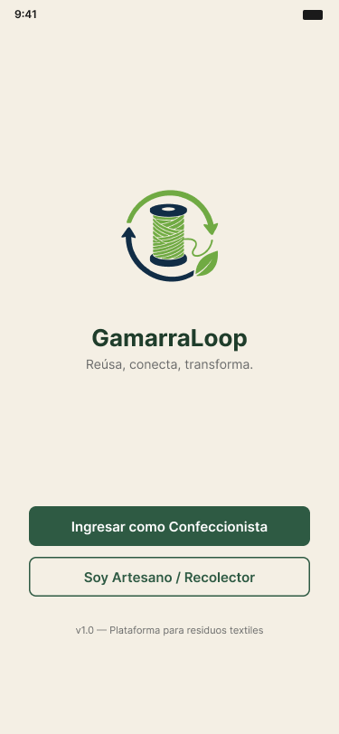<br><i>Figura: C-M01 — Splash</i><br/><sub><b>C-M01</b> · Splash / Acceso</sub></td>
    <td align="center">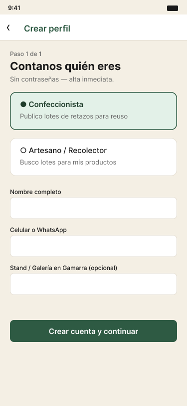<br><i>Figura: C-M02 — Onboarding</i><br/><sub><b>C-M02</b> · Onboarding (rol + datos)</sub></td>
    <td align="center">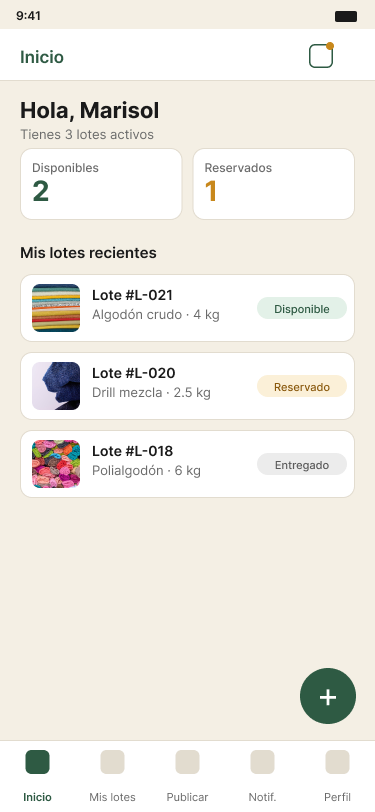<br><i>Figura: C-M03 — Home</i><br/><sub><b>C-M03</b> · Home / Mis lotes</sub></td>
  </tr>
  <tr>
    <td align="center">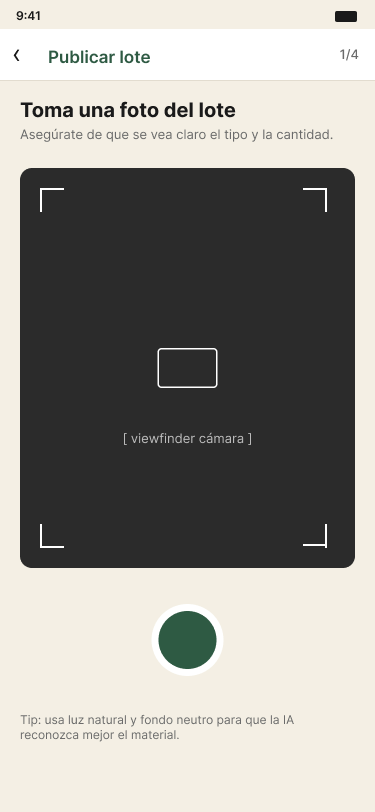<br><i>Figura: C-M04 — Publicar foto</i><br/><sub><b>C-M04</b> · Publicar · Paso 1 (foto)</sub></td>
    <td align="center">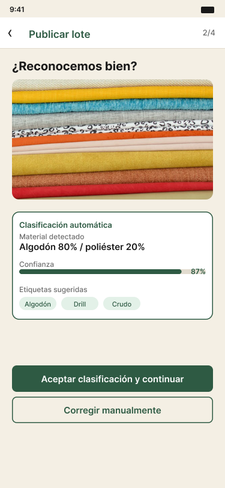<br><i>Figura: C-M05 — Publicar IA</i><br/><sub><b>C-M05</b> · Publicar · Paso 2 (clasificación IA)</sub></td>
    <td align="center">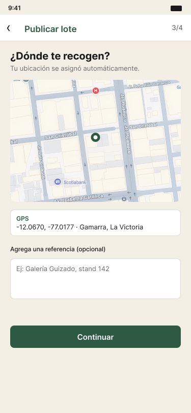<br><i>Figura: C-M06 — Publicar ubicación</i><br/><sub><b>C-M06</b> · Publicar · Paso 3 (ubicación)</sub></td>
  </tr>
  <tr>
    <td align="center">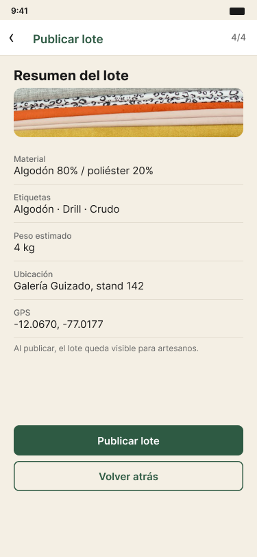<br><i>Figura: C-M07 — Publicar confirmación</i><br/><sub><b>C-M07</b> · Publicar · Paso 4 (confirmación)</sub></td>
    <td align="center">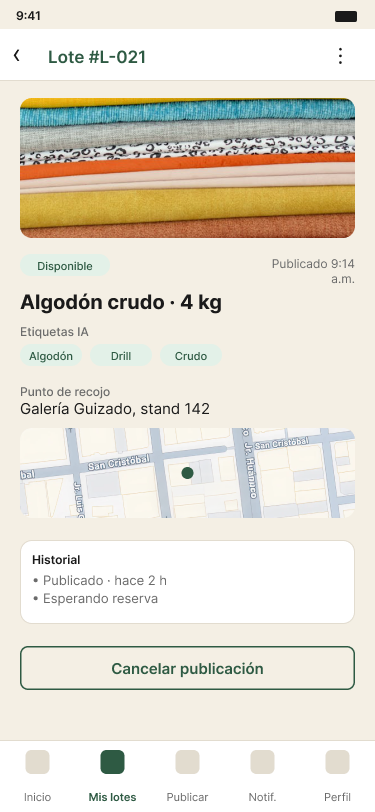<br><i>Figura: C-M08 — Detalle de lote</i><br/><sub><b>C-M08</b> · Detalle de Mi Lote</sub></td>
    <td align="center"><br><i>Figura: C-M09 — Notificación</i><br/><sub><b>C-M09</b> · Notificación de reserva</sub></td>
  </tr>
  <tr>
    <td align="center">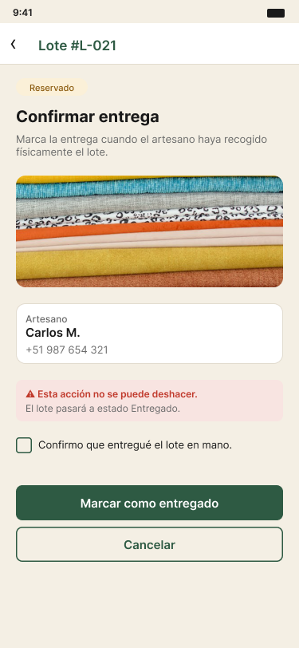<br><i>Figura: C-M10 — Confirmar entrega</i><br/><sub><b>C-M10</b> · Confirmar entrega</sub></td>
    <td align="center">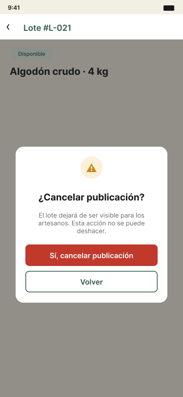<br><i>Figura: C-M11 — Cancelar lote</i><br/><sub><b>C-M11</b> · Cancelar lote (modal)</sub></td>
    <td></td>
  </tr>
</table>

**Detalle de cada mock-up — App Confeccionista**

- **C-M01 — Splash / Acceso.** Fondo beige con el logotipo a color centrado; los dos CTAs de bifurcación de rol adoptan el verde oscuro de interacción (relleno sólido para el rol primario, outline para el secundario), conservando las áreas táctiles de 44 px.
- **C-M02 — Onboarding (rol + datos).** La tarjeta de rol seleccionada se resalta con relleno verde claro y borde verde oscuro; los campos del formulario usan la tipografía body y el indicador "Paso 1 de 1" en caption gris, aplicando jerarquía tipográfica.
- **C-M03 — Home / Mis lotes.** Las cards de lotes muestran ahora el **chip de estado a color** (verde Disponible / amarillo Reservado / gris Entregado) con su label textual; el FAB "Publicar" en verde oscuro y la bottom navigation con el ítem Inicio activo en verde.
- **C-M04 — Publicar · Paso 1 (foto).** Viewfinder con marcas de encuadre y botón de captura en verde de interacción; el micro-tip al pie se presenta en caption sobre fondo translúcido oscuro para garantizar contraste.
- **C-M05 — Publicar · Paso 2 (clasificación IA).** La card de resultados de Cloud Vision usa borde verde reforzado; la barra de confianza se cromatiza (verde sobre beige) manteniendo el porcentaje numérico, y los chips de etiquetas sugeridas adoptan estilo Material Design relleno.
- **C-M06 — Publicar · Paso 3 (ubicación).** Mapa a color con pin verde en la posición GPS; el dato automático (GPS) y el campo manual de referencia se separan visualmente con la paleta para reforzar la divulgación progresiva.
- **C-M07 — Publicar · Paso 4 (confirmación).** Resumen tabular con divisores; el CTA primario "Publicar lote" en verde sólido se diferencia del secundario "Volver atrás" en outline, según la jerarquía de botones de 6.1.
- **C-M08 — Detalle de Mi Lote.** El chip de estado a color encabeza el contenido y el mini-historial del ciclo de vida del lote usa íconos a color (check verde, reloj ámbar) coherentes con la iconografía de 6.2.1.
- **C-M09 — Notificación de reserva.** Modal sobre overlay oscurecido; el encabezado de marca a color y los CTAs "Ver lote" (verde sólido) / "Descartar" (outline) priorizan la acción primaria.
- **C-M10 — Confirmar entrega.** Mantiene el patrón de doble paso (checkbox + CTA); el aviso de irreversibilidad se destaca en rojo de estado y el CTA primario se habilita en verde solo tras la confirmación manual.
- **C-M11 — Cancelar lote (modal).** Modal con icono de alerta ámbar; el CTA destructivo adopta el rojo de estado y el secundario el outline verde, cumpliendo prevención de errores (Nielsen) y foco visible (WCAG 2.4.7).

**App Artesano — 8 mock-ups**

Aplican el Design System sobre el ciclo de demanda. La bottom navigation se reduce a tres secciones (Explorar, Mis reservas, Perfil) y prioriza la exploración por proximidad.

<table>
  <tr>
    <td align="center">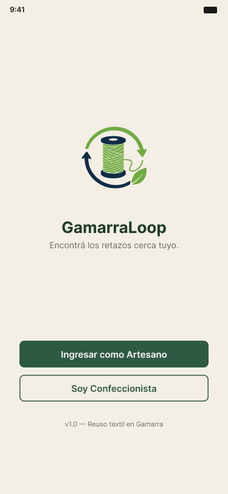<br><i>Figura: A-M01 — Splash</i><br/><sub><b>A-M01</b> · Splash / Acceso</sub></td>
    <td align="center">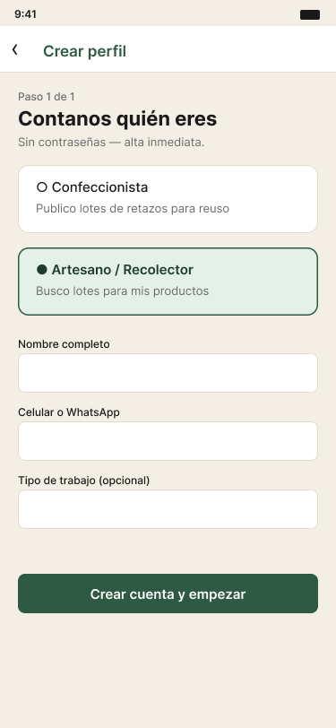<br><i>Figura: A-M02 — Onboarding</i><br/><sub><b>A-M02</b> · Onboarding (rol + datos)</sub></td>
    <td align="center">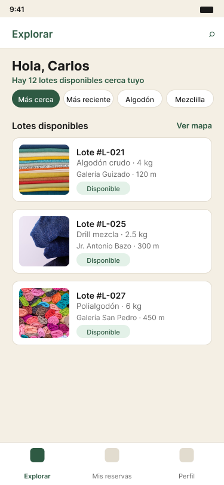<br><i>Figura: A-M03 — Home</i><br/><sub><b>A-M03</b> · Home / Explorar</sub></td>
  </tr>
  <tr>
    <td align="center">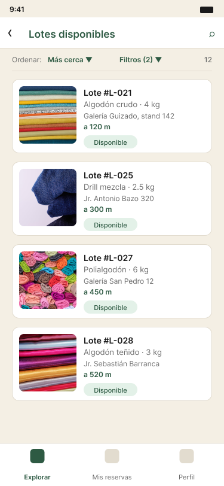<br><i>Figura: A-M04 — Lista de lotes</i><br/><sub><b>A-M04</b> · Lista de lotes disponibles</sub></td>
    <td align="center">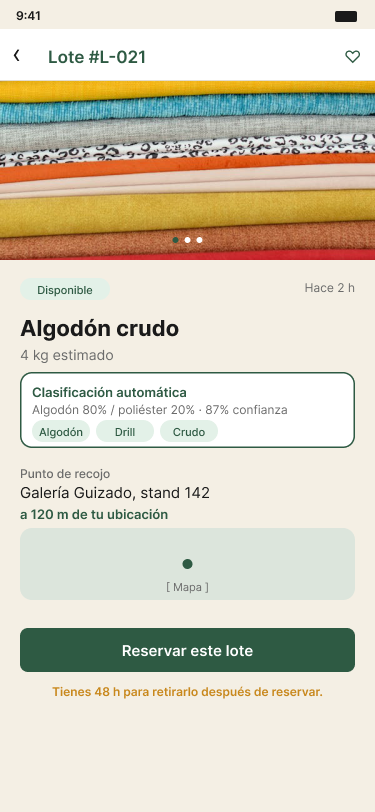<br><i>Figura: A-M05 — Detalle de lote</i><br/><sub><b>A-M05</b> · Detalle de lote</sub></td>
    <td align="center">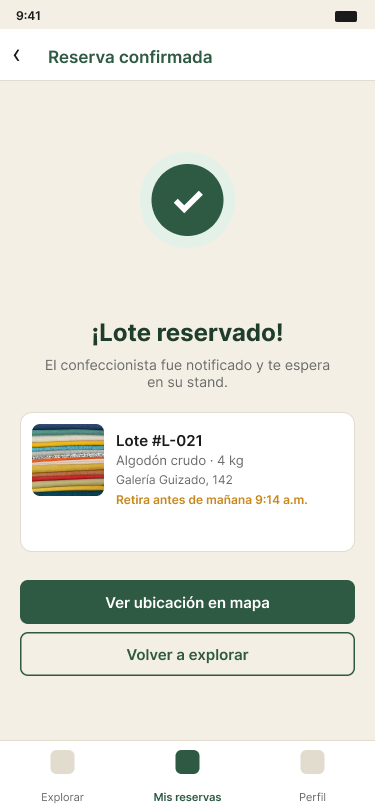<br><i>Figura: A-M06 — Reserva confirmada</i><br/><sub><b>A-M06</b> · Reserva confirmada</sub></td>
  </tr>
  <tr>
    <td align="center">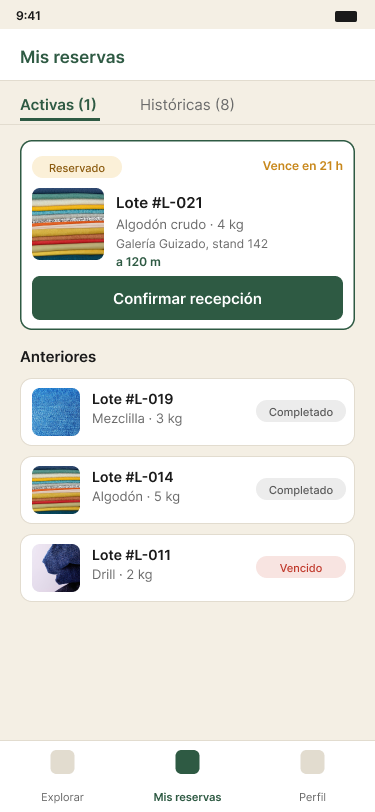<br><i>Figura: A-M07 — Mis reservas</i><br/><sub><b>A-M07</b> · Mis reservas</sub></td>
    <td align="center">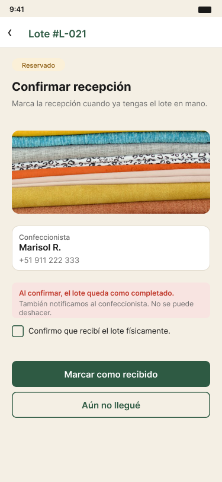<br><i>Figura: A-M08 — Confirmar recepción</i><br/><sub><b>A-M08</b> · Confirmar recepción</sub></td>
    <td></td>
  </tr>
</table>

**Detalle de cada mock-up — App Artesano**

- **A-M01 — Splash / Acceso.** Espejo cromático del C-M01 con la jerarquía invertida: el CTA "Ingresar como Artesano" en verde sólido como acción primaria.
- **A-M02 — Onboarding (rol + datos).** La card "Artesano / Recolector" queda resaltada en verde y la de Confeccionista en outline; el campo "Tipo de trabajo" sustituye al de stand/galería.
- **A-M03 — Home / Explorar.** La fila de filtros rápidos (Más cerca / Más reciente / Algodón / Mezclilla) usa chips Material Design; las cards de lotes muestran el chip de estado a color y el contador de lotes cercanos en verde.
- **A-M04 — Lista de lotes disponibles.** Cards de mayor densidad con thumbnail a color, distancia y chip de estado cromatizado; el criterio de orden activo y los filtros aplicados se muestran con la paleta de marca.
- **A-M05 — Detalle de lote.** Hero con galería de fotos a color, card de clasificación IA con borde verde, distancia explícita y CTA "Reservar este lote" en verde primario; el disclosure de las 48 h (US21) se destaca en ámbar.
- **A-M06 — Reserva confirmada.** Pantalla de éxito con check grande en verde sobre fondo beige; el deadline de retiro se enfatiza en peso tipográfico fuerte y color de estado.
- **A-M07 — Mis reservas.** Tabs Activas / Históricas; la reserva activa usa chip ámbar "Reservado" con label, deadline visible y CTA "Confirmar recepción" en verde dentro de la card.
- **A-M08 — Confirmar recepción.** Espejo del C-M10: foto, identidad del Confeccionista, aviso de irreversibilidad en rojo de estado, checkbox y CTA "Marcar como recibido" en verde.

<a name="6.4.4"></a>

### 6.4.4. Applications User Flow Diagrams.

Los User Flow Diagrams se derivan directamente de los Wireflow Diagrams de 6.4.2, elevando las pantallas a los mock-ups de alta fidelidad de 6.4.3 e incorporando de forma explícita, para cada User Goal, el **happy path** (ruta esperada) y los **unhappy paths** (rutas alternativas: errores, cancelaciones, expiraciones y validaciones fallidas). Se documenta un User Flow por cada User Goal de las dos aplicaciones, considerando su User Persona del 2.3.1, manteniendo la consistencia uno a uno con los wireflows de los que provienen (UG-C01…UG-C04, UG-A01…UG-A03).

Herramienta utilizada: Figma. Enlace al archivo: https://www.figma.com/design/85CeQoBh8DOJBiIarBx5al/GamarraLoop-%E2%80%94-Applications-UX-UI-Design

**User Flows — App Confeccionista**

- **UG-C01 — "Como Confeccionista, quiero registrarme por primera vez en la app."** _User Stories:_ US04. _Happy path:_ C-M01 → C-M02 → C-M03; el usuario elige el rol, completa nombre, contacto y stand opcional y aterriza en el Home. _Unhappy paths:_ si un campo obligatorio queda vacío o el contacto tiene formato inválido, C-M02 muestra el error inline y bloquea el avance; si el contacto ya está registrado, se ofrece reingresar en lugar de duplicar el perfil.

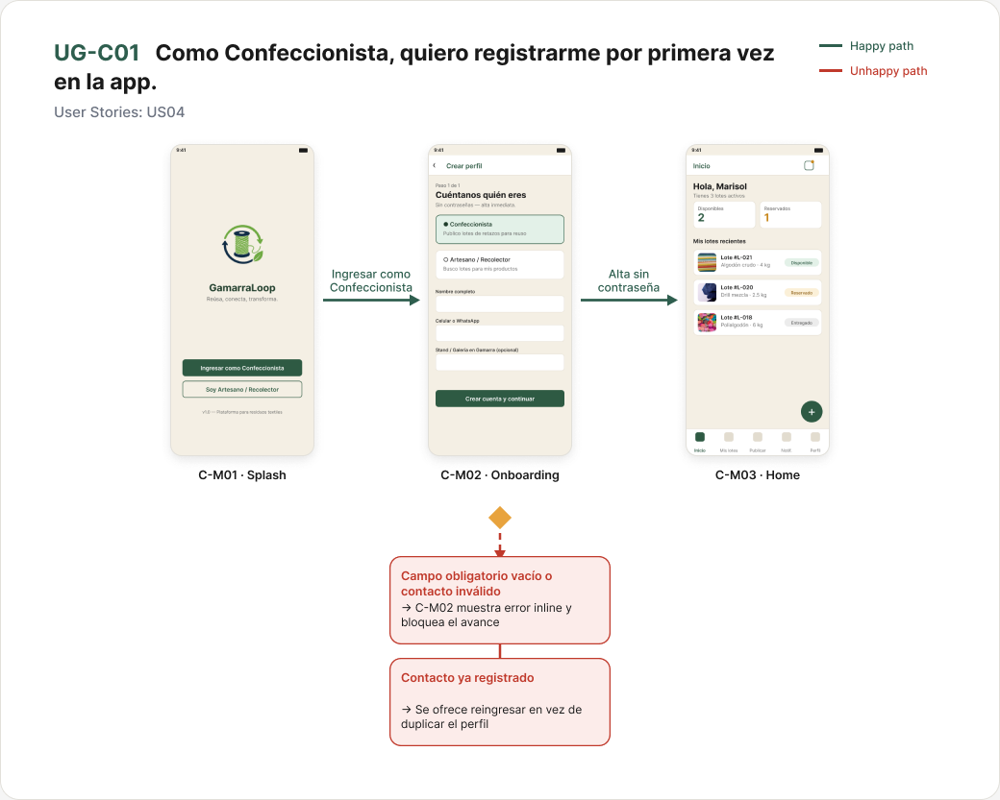

*Figura: User Flow UG-C01 — Registro Confeccionista*

- **UG-C02 — "Como Confeccionista, quiero publicar un lote de tela."** _User Stories:_ US05, US06, US07, US10, US11. _Happy path:_ C-M03 → C-M04 → C-M05 → C-M06 → C-M07 → C-M08; foto, clasificación IA aceptada, GPS, referencia, confirmación y lote en estado Disponible. _Unhappy paths:_ si la foto es de baja calidad, C-M04 sugiere recapturar; si la clasificación de Cloud Vision falla o devuelve baja confianza, C-M05 permite la corrección manual de etiquetas (US11); si el GPS no está disponible, C-M06 exige el ingreso manual de la referencia antes de continuar.

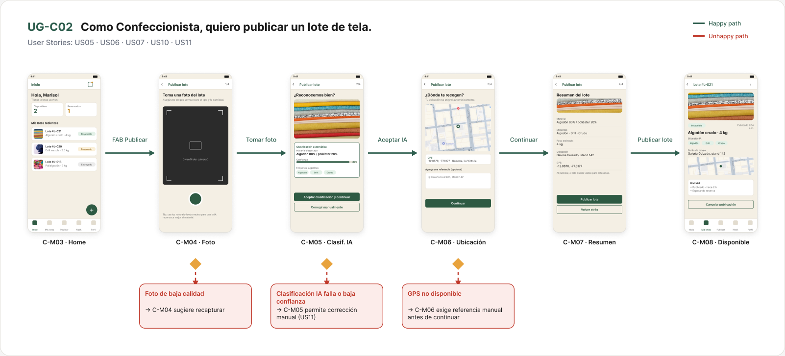

*Figura: User Flow UG-C02 — Publicar lote*

- **UG-C03 — "Como Confeccionista, quiero recibir la reserva y confirmar la entrega."** _User Stories:_ US16, US09. _Happy path:_ C-M09 → C-M08 (Reservado) → C-M10 → C-M08 (Entregado). _Unhappy paths:_ si el Confeccionista no marca el checkbox de confirmación, el CTA de C-M10 permanece deshabilitado; si la reserva expira antes de la entrega, el lote vuelve a Disponible y la notificación se descarta.

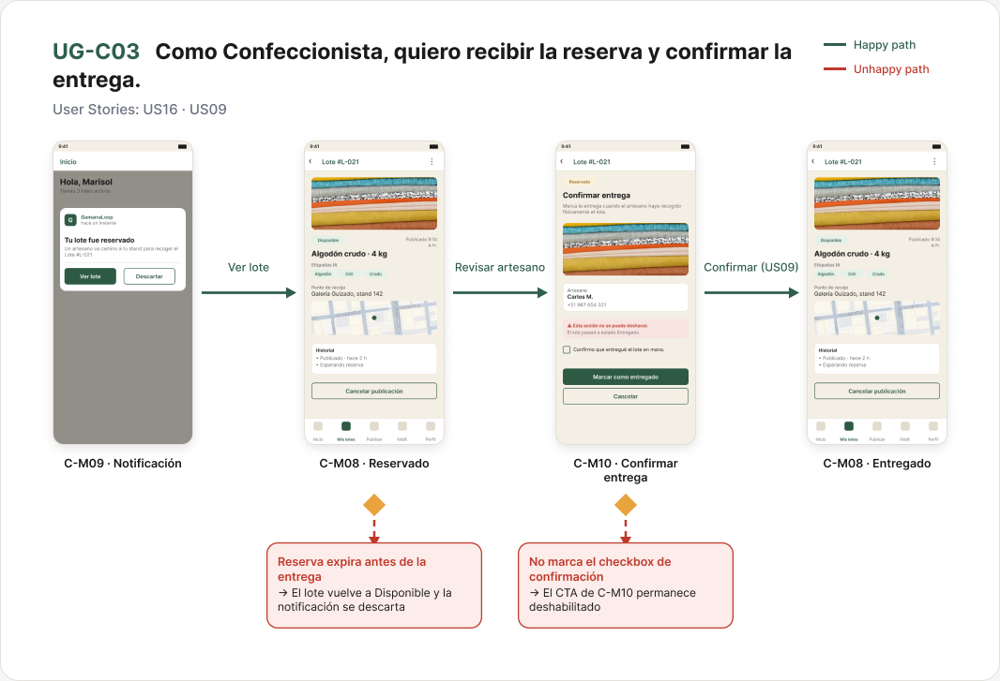

*Figura: User Flow UG-C03 — Reserva y entrega*

- **UG-C04 — "Como Confeccionista, quiero cancelar un lote que ya no está disponible."** _User Stories:_ US08. _Happy path:_ C-M03 → C-M08 → C-M11 → C-M08 (Cancelado). _Unhappy paths:_ si el lote ya tiene una reserva activa, C-M11 advierte que la cancelación afectará al artesano y exige confirmación reforzada; si el usuario cierra el modal, el lote permanece Disponible sin cambios.

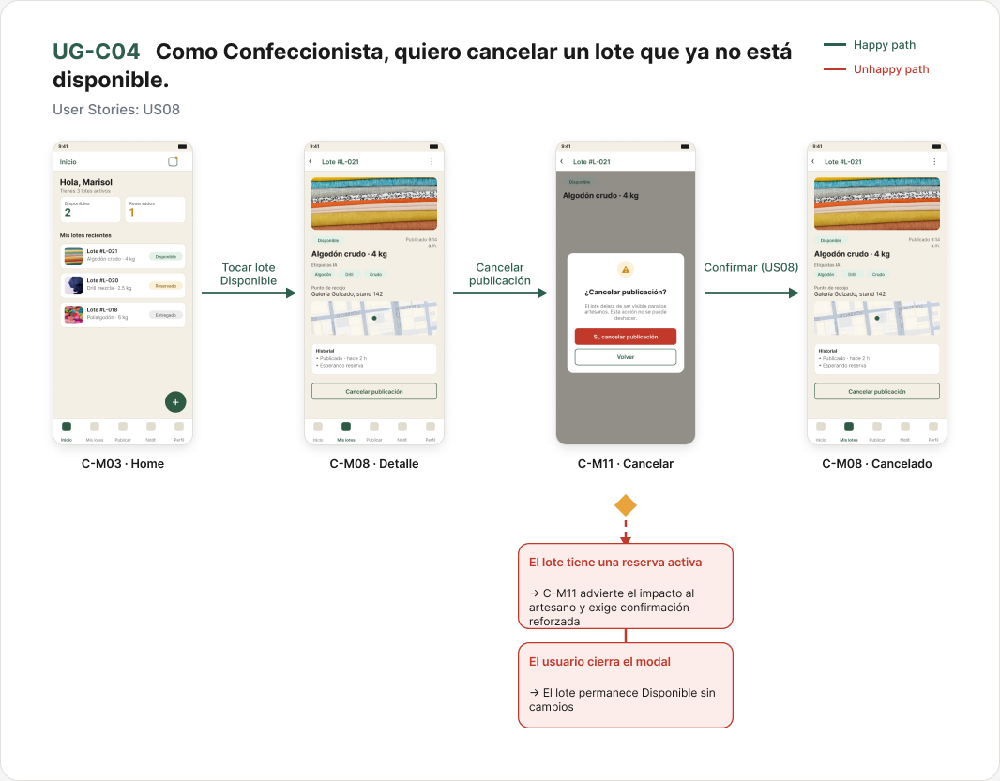

*Figura: User Flow UG-C04 — Cancelar lote*

**User Flows — App Artesano**

- **UG-A01 — "Como Artesano, quiero registrarme por primera vez en la app."** _User Stories:_ US04. _Happy path:_ A-M01 → A-M02 → A-M03; alta sin contraseña y aterrizaje directo en Explorar. _Unhappy paths:_ campos inválidos muestran error inline en A-M02; si se deniega el permiso de ubicación, A-M03 se renderiza igualmente pero solicita activarlo para ordenar por proximidad.

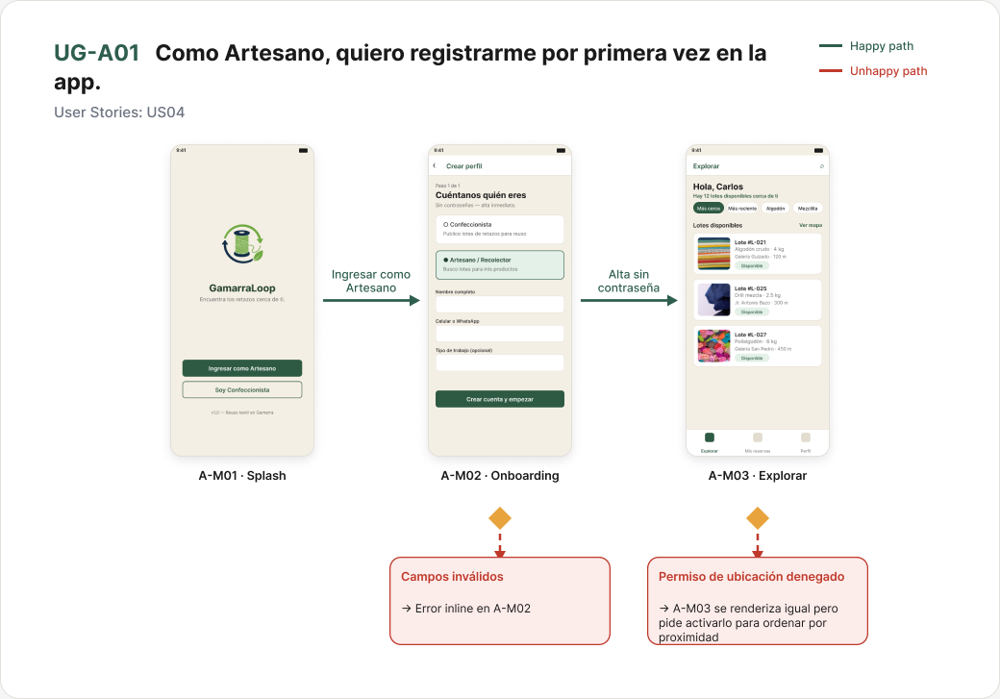

*Figura: User Flow UG-A01 — Registro Artesano*

- **UG-A02 — "Como Artesano, quiero explorar lotes disponibles y revisar su detalle."** _User Stories:_ US12, US13. _Happy path:_ A-M03 → A-M04 → A-M05; exploración, filtrado y detalle del lote con clasificación IA y distancia. _Unhappy paths:_ si ningún lote cumple los filtros, A-M04 muestra estado vacío con sugerencia de ampliar criterios; si un lote pasa a Reservado mientras se navega, A-M05 deshabilita el CTA "Reservar" y muestra el estado actualizado.

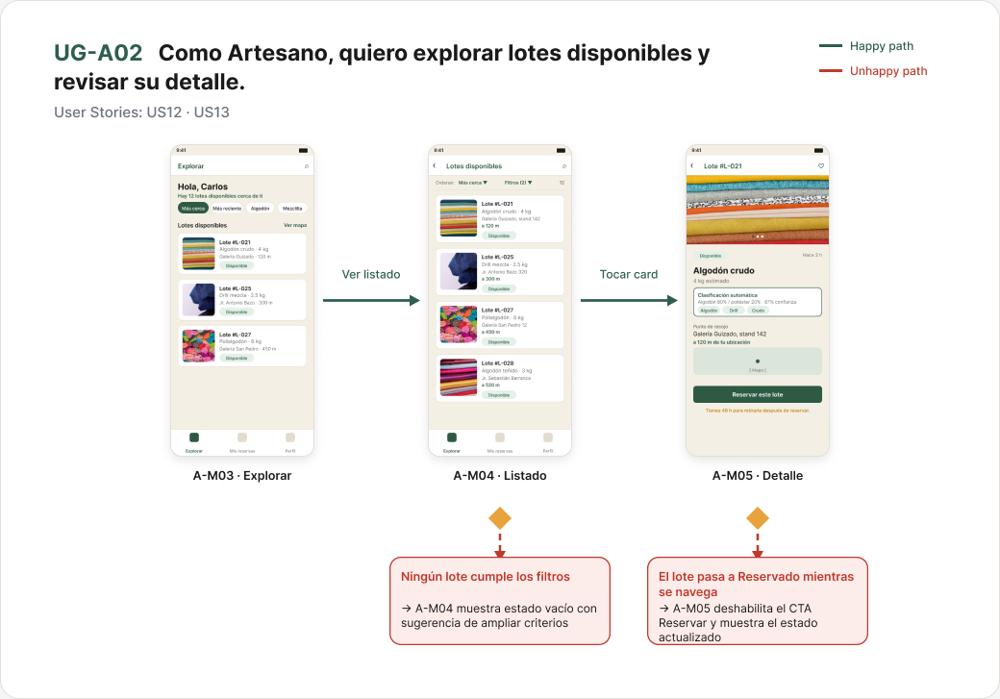

*Figura: User Flow UG-A02 — Explorar y detalle*

- **UG-A03 — "Como Artesano, quiero reservar un lote y confirmar su recepción."** _User Stories:_ US14, US15. _Happy path:_ A-M05 → A-M06 → A-M07 → A-M08; reserva transaccional (US19 en backend), confirmación con deadline y recepción física confirmada. _Unhappy paths:_ si otro artesano reserva primero, la transacción falla y A-M05 informa que el lote ya no está disponible; si vence el plazo de 48 h (US21) sin confirmar recepción, la reserva expira y la card pasa a "Vencido" en A-M07.

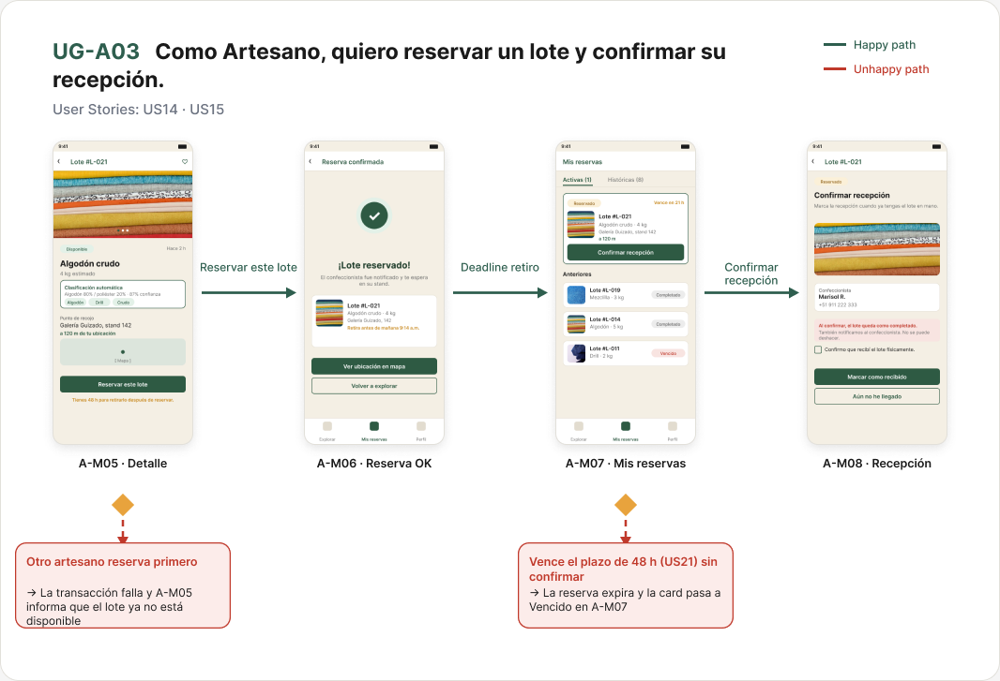

*Figura: User Flow UG-A03 — Reservar y recibir*

<a name="6.5."></a>

## 6.5. Applications Prototyping.

Esta sección presenta los prototipos navegables de las dos aplicaciones móviles de GamarraLoop, que simulan la interacción y la navegación reales sobre los mock-ups de 6.4.3, siguiendo los paths definidos en los User Flow Diagrams de 6.4.4.

Los principales criterios que guiaron las decisiones de interacción son: (1) **mínima fricción en la acción de mayor frecuencia** —publicar para el Confeccionista, explorar para el Artesano—, materializada en el FAB de publicación y en el aterrizaje directo en Explorar; (2) **divulgación progresiva** en los flujos de varios pasos (publicación de lote en cuatro pantallas) para no saturar al usuario con baja exposición digital; (3) **prevención de errores** mediante confirmaciones de doble paso (checkbox + CTA) en las acciones irreversibles (entrega y recepción); y (4) **retroalimentación inmediata** del estado del lote a través de los colores de estado y las transiciones de pantalla.

Estas decisiones se apoyan directamente en la arquitectura de información de 6.2: el **sistema de navegación** (6.2.4) se prototipa como una bottom navigation persistente —cinco secciones en la App Confeccionista, tres en la App Artesano— complementada con navegación contextual desde el detalle del lote; el **sistema de etiquetado** (6.2.1) conserva los mismos labels de acción y estado en todas las pantallas; y el **sistema de búsqueda** (6.2.2) se materializa en los filtros rápidos y la exploración por proximidad de la App Artesano. Los tipos de interacción seleccionados —tap, navegación por tabs, modales sobre overlay y captura de cámara— responden al uso en movilidad dentro del emporio de Gamarra exigido por la Technical Story TS01.

**App Confeccionista**

El prototipo cubre los flujos UG-C01 a UG-C04, con foco en el flujo de publicación de lote (UG-C02), que integra cámara, clasificación de IA y geolocalización.

<br>
*Figura: Captura del video de demostración — Prototipo App Confeccionista*

> **Video de demostración (Microsoft Stream):** https://upcedupe-my.sharepoint.com/:v:/g/personal/u202220528_upc_edu_pe/IQCfE4Akn3KkSKxJGbF5blUpAYgmCNq9PNkOoKCYWdB-gDg?e=03ZAjZ

**App Artesano**

El prototipo cubre los flujos UG-A01 a UG-A03, con foco en el flujo de exploración, reserva y confirmación de recepción (UG-A02 y UG-A03).

<br>
*Figura: Captura del video de demostración — Prototipo App Artesano*

> **Video de demostración (Microsoft Stream):** https://upcedupe-my.sharepoint.com/:v:/g/personal/u202220528_upc_edu_pe/IQBC6WDZIPypR4p6OlF73_p3AejradgONAmWfsrieUaROOo?e=Lar9f8

Enlace al prototipo navegable en Figma: https://www.figma.com/design/85CeQoBh8DOJBiIarBx5al/GamarraLoop-%E2%80%94-Applications-UX-UI-Design

<a name="7."></a>

# Capítulo VII: Product Implementation, Validation & Deployment

<a name="7.1."></a>

## 7.1. Software Configuration Management

<a name="7.1.1."></a>

### 7.1.1. Software Development Environment Configuration

<a name="7.1.2."></a>

### 7.1.2. Source Code Management

<a name="7.1.3."></a>

### 7.1.3. Source Code Style Guide & Conventions

<a name="7.1.4."></a>

### 7.1.4. Software Deployment Configuration

<a name="7.2."></a>

## 7.2. Software Implementation

<a name="7.2.1."></a>

### 7.2.1. Sprint 1

El Sprint 1 representa el inicio de la fase de construcción de GamarraLoop, enfocándose en la implementación de los componentes tecnológicos fundamentales que soportarán el funcionamiento de la plataforma. Durante este sprint, el principal esfuerzo de desarrollo estuvo orientado a la construcción completa del backend de la solución, estableciendo la arquitectura base, la lógica de negocio y los servicios necesarios para gestionar las operaciones relacionadas con la reutilización y circulación de retazos textiles dentro del ecosistema de Gamarra. Asimismo, el proyecto cuenta con un landing page previamente desarrollado en etapas anteriores, el cual continúa sirviendo como medio de difusión de la propuesta de valor y de validación con potenciales usuarios.

Como parte de este trabajo, se desarrolló una API RESTful basada en una arquitectura monolito sustentada en principios de Domain-Driven Design (DDD) y Arquitectura Hexagonal, donde se implementaron los bounded contexts del sistema, incluyendo la gestión de perfiles de usuario, lotes de textiles, reservas, entregas, notificaciones, clasificación automática de textiles mediante inteligencia artificial y la gestión automatizada de reservas vencidas, facilitando la validación temprana de los servicios desarrollados y la integración con futuros componentes del sistema.

De manera complementaria, se inició el desarrollo del frontend móvil utilizando la plataforma Low-Code FlutterFlow, con el objetivo de acelerar la construcción de interfaces y validar tempranamente la experiencia de usuario. Si bien el alcance específico de las funcionalidades frontend a implementar será definido durante la ejecución del sprint, este trabajo permitirá avanzar progresivamente hacia la integración completa entre la capa de presentación y los servicios backend desarrollados.

<a name="7.2.1.1."></a>

#### 7.2.1.1. Sprint Planning 1

| Sprint #                               | Sprint 1                                                                                                                                                                                                                                                                                                                                                                                                                                                                                   |
| -------------------------------------- | ------------------------------------------------------------------------------------------------------------------------------------------------------------------------------------------------------------------------------------------------------------------------------------------------------------------------------------------------------------------------------------------------------------------------------------------------------------------------------------------ |
| **Sprint Planning Background**         |                                                                                                                                                                                                                                                                                                                                                                                                                                                                                            |
| **Date**                               | 2026-05-30                                                                                                                                                                                                                                                                                                                                                                                                                                                                                 |
| **Time**                               | 09:30 PM                                                                                                                                                                                                                                                                                                                                                                                                                                                                                   |
| **Location**                           | Llamada por la plataforma "Discord"                                                                                                                                                                                                                                                                                                                                                                                                                                                        |
| **Prepared By**                        | Gongora Castillejos, Williams                                                                                                                                                                                                                                                                                                                                                                                                                                                              |
| **Attendees (to planning meeting)**    | 	Huanaco Huayta, Elizabeth Lucero / Cuya Villegas, Rafael Alberto / Gongora Castillejos, Williams / Torres Garcia, Andrés Alberto / Molina Falcón, Piero Leonardo                                                                                                                                                                                                                                                                                                                                  |
| **Sprint 1 – 1 Review Summary**        | Desarrollo completo del backend de GamarraLoop, incluyendo la implementación de los bounded contexts, la configuración de la base de datos PostgreSQL, la documentación de la API mediante Swagger/OpenAPI y la integración con servicios de clasificación de textiles mediante inteligencia artificial. Asimismo, se inició el desarrollo del frontend móvil utilizando FlutterFlow para integrar las interfaces con la API desarrollada.                                                                                                                                                                                                                                                                                                                                                                                                                              |
| **Sprint 1 – 1 Retrospective Summary** | Al tratarse del primer sprint de desarrollo, no existe una retrospectiva previa. Sin embargo, el equipo estableció los lineamientos técnicos, arquitectónicos y organizacionales que servirán de base para las siguientes iteraciones del proyecto.                                                                                                                                                                                                                                                                                                                                                                                                                              |
| **Sprint Goal & User Stories**         |                                                                                                                                                                                                                                                                                                                                                                                                                                                                                            |
| **Sprint #1 Goal**                     | Nuestro enfoque está en construir la infraestructura tecnológica fundamental de GamarraLoop mediante la implementación de una API REST robusta y escalable que soporte los procesos de publicación de lotes textiles, clasificación automática de materiales, reservas, entregas, notificaciones y gestión de usuarios. Creemos que esto permitirá disponer de una base sólida para el desarrollo progresivo de la aplicación móvil y la validación de los principales flujos de negocio. Esto se confirmará cuando los servicios backend se encuentren desplegados, documentados mediante Swagger e integrados progresivamente con la primera versión del frontend. |
| **Sprint #1 Velocity**                 | [Horas comprometidas por el equipo]                                                                                                                                                                                                                                                                                                                                                                                                                                                                                       |
| **Sum of Story Points**                | [Total de Story Points del Sprint]                                                                                                                                                                                                                                                                                                                                                                                                                                                                                        |

<a name="7.2.1.2."></a>

#### 7.2.1.2. Sprint Backlog 1

<a name="7.2.1.3."></a>

#### 7.2.1.3. Development Evidence for Sprint Review

Durante el Sprint 1, el equipo concentró sus esfuerzos en la consolidación de los principales componentes tecnológicos de GamarraLoop. Las actividades de desarrollo estuvieron enfocadas principalmente en la implementación completa del backend y la primera versión del frontend, así como en el mantenimiento y actualización del Landing Page utilizado para comunicar la propuesta de valor del proyecto.

La evidencia presentada en esta sección corresponde a los commits registrados en los repositorios GitHub asociados a dichos componentes, los cuales permiten verificar el progreso realizado durante la iteración. Por otro lado, aunque se iniciaron actividades relacionadas con el desarrollo de la aplicación móvil mediante FlutterFlow, esta plataforma Low-Code no formó parte del flujo principal de control de versiones durante el Sprint 1. Por esta razón, la evidencia de desarrollo presentada se centra en los repositorios que registraron actividad mediante GitHub, constituyendo los principales entregables técnicos de la iteración.

A continuación, se presentan los commits más representativos realizados durante el Sprint 1 para cada uno de los repositorios involucrados en el proyecto.

**Landing Page**

| Repository | Branch | Commit Id | Commit Message | Commit Message Body | Committed on (Date) |
|------------|--------|-----------|----------------|----------------|---------------------|
| https://github.com/GamarraLoop/gamarra-loop-landing	 | main | 3d2d79be64414019817d1c3bdf39aad570a61ca1 | feat: initial landing page for GamarraLoop | Hero with brand wordmark, tagline, segmented language toggle (ES/EN), Side-rail navigation with scroll spy, Sections: problema, cómo funciona, segmentos, bento, testimonios, CTA, footer, Real photos for bento and lot card thumbnails (Pexels), Full ES/EN i18n (textContent + aria-label + alt), Brand palette: beige + verde oscuro (#2D5F3F) + negro, Mobile responsive with hamburger overlay, Vanilla HTML/CSS/JS — no build, no frameworks | 10/05/2026 |
| https://github.com/GamarraLoop/gamarra-loop-landing	 | main | 9ca1386ccfb2c6d0c62a1138ee4ce60885d94031 | docs: add README with stack, structure, run instructions and team | | 10/05/2026 |


**Backend**

| Repository                                         | Branch | Commit Id | Commit Message                                                                 | Commit Message Body                                                                                                                                                                                                                                                                                                                                                                                         | Committed on (Date) |
| -------------------------------------------------- | ------ | --------- | ------------------------------------------------------------------------------ | ----------------------------------------------------------------------------------------------------------------------------------------------------------------------------------------------------------------------------------------------------------------------------------------------------------------------------------------------------------------------------------------------------------- | ------------------- |
| https://github.com/GamarraLoop/GamarraLoop-backend | main   | b2dc2759ab091b0b679c42636d9fc9c24713f5c8   | Initial commit: GamarraLoop Backend MVP                                        | Initial implementation of the GamarraLoop backend MVP using Spring Boot 3.4 and Java 21. Includes the bounded contexts for User Profiles, Lots, Reservations, Deliveries, Notifications, Classification and Expiration Scheduler. Integration with PostgreSQL (Supabase), Google Cloud Vision API, Swagger/OpenAPI documentation and RESTful endpoints following DDD and Hexagonal Architecture principles. | 29/05/2026          |
| https://github.com/GamarraLoop/GamarraLoop-backend | main   | 8cc709aee5a6cd66ba2761287cb58b68fd51da01   | docs: add comprehensive README.md                                              | Added comprehensive project documentation including architecture overview, bounded contexts, setup instructions, technology stack and execution guidelines.                                                                                                                                                                                                                                                 | 29/05/2026          |
| https://github.com/GamarraLoop/GamarraLoop-backend | main   | cee4f92820e57e81432c058a27f35d79fda74a64   | docs: Update README with project details and logo                              | Updated project documentation with branding assets, project description and additional repository information.                                                                                                                                                                                                                                                                                              | 29/05/2026          |

<a name="7.2.1.4."></a>

#### 7.2.1.4. Testing Suite Evidence for Sprint Review

<a name="7.2.1.5."></a>

#### 7.2.1.5. Execution Evidence for Sprint Review

**Landing Page**
La landing page de GamarraLoop fue desarrollada durante la fase inicial del proyecto como un canal de validación y difusión de la propuesta de valor. Su objetivo es comunicar la problemática asociada a los residuos textiles en Gamarra, presentar el funcionamiento de la plataforma y facilitar el acceso de potenciales usuarios a la aplicación móvil.

Las siguientes capturas muestran las principales secciones implementadas, incluyendo la propuesta de valor, descripción del problema, funcionamiento de la solución, segmentos de usuarios, beneficios de la economía circular y mecanismos de contacto. Asimismo, se evidencia la implementación de una interfaz responsiva con soporte bilingüe (español e inglés), permitiendo una experiencia de navegación accesible desde distintos dispositivos.

<br>
*Figura: Landing Page desplegada versión escritorio*

<br>
*Figura: Landing Page desplegada versión móvil*

> **Video de demostración:** [Demostración de la Landing Page de GamarraLoop](https://upcedupe-my.sharepoint.com/:v:/g/personal/u20211g522_upc_edu_pe/IQBtz6VKrPXwTYAS0uHEoDDnAcpis26c8AWhZXsU5S5Z4zs?nav=eyJyZWZlcnJhbEluZm8iOnsicmVmZXJyYWxBcHAiOiJPbmVEcml2ZUZvckJ1c2luZXNzIiwicmVmZXJyYWxBcHBQbGF0Zm9ybSI6IldlYiIsInJlZmVycmFsTW9kZSI6InZpZXciLCJyZWZlcnJhbFZpZXciOiJNeUZpbGVzTGlua0NvcHkifX0&e=tk6lic)

**Backend**

Para el desarrollo del backend de GamarraLoop se implementó una arquitectura basada en Domain-Driven Design (DDD) y Arquitectura Hexagonal, organizando la solución en los bounded contexts de User Profiles, Lots, Classification, Reservations, Delivery y Notifications. Cada contexto encapsula una parte específica de la lógica de negocio relacionada con la gestión de usuarios, publicación y clasificación de lotes textiles, reservas, seguimiento de entregas, notificaciones y procesos automáticos de expiración.

Los servicios desarrollados fueron expuestos mediante una API RESTful construida con Spring Boot y documentados utilizando Swagger/OpenAPI, permitiendo visualizar y validar los endpoints implementados durante el Sprint 1. Las capturas presentadas a continuación evidencian los controladores, recursos y operaciones disponibles para cada bounded context, facilitando la revisión funcional de la solución y la futura integración con la aplicación móvil desarrollada en FlutterFlow.

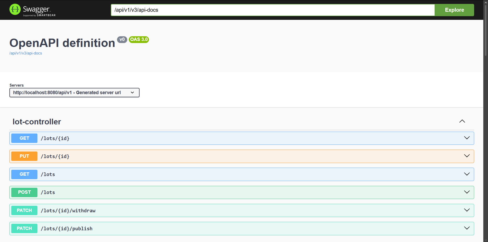<br>
*Figura: Endpoints expuestos por el Bounded Context Lots*

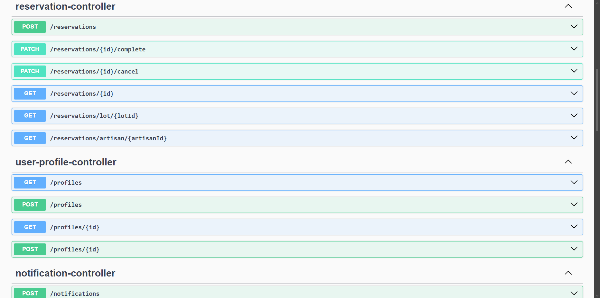<br>
*Figura: Endpoints expuestos por el Bounded Context Reservations y User Profiles*

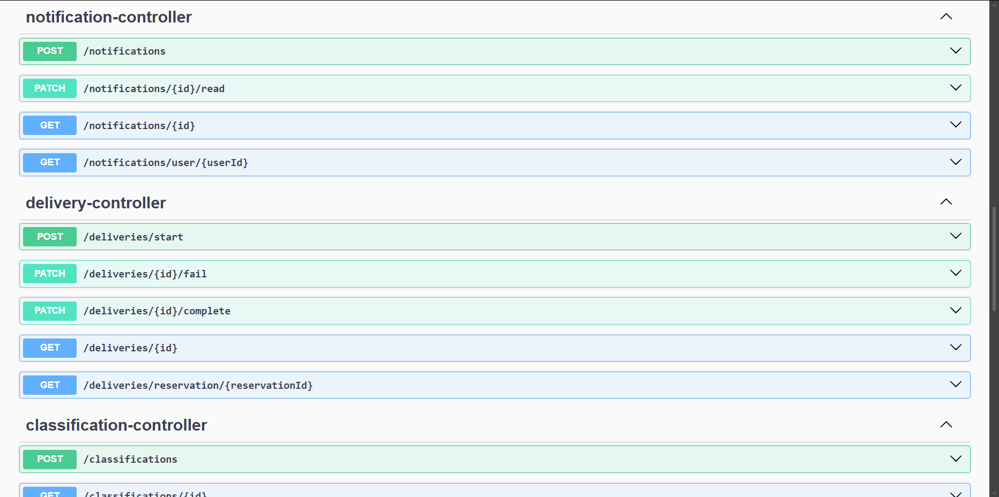<br>
*Figura: Endpoints expuestos por el Bounded Context Notifications y Delivery*

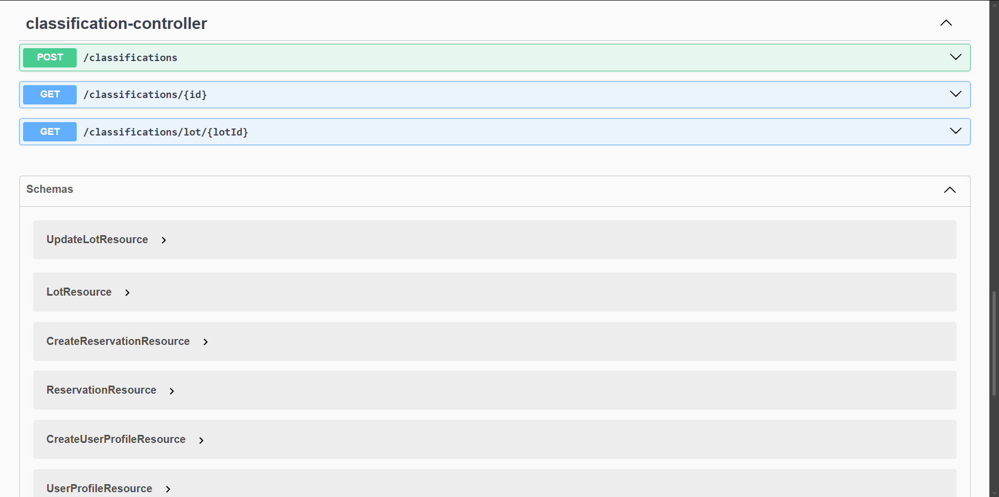<br>
*Figura: Endpoints expuestos por el Bounded Context Classification*

> **Video de demostración:** [Demostración de la API Backend de GamarraLoop en Swagger](https://miro.com/app/board/uXjVHd6pQow=/?share_link_id=174494873351)


**Frontend**

> **Video de demostración:** [Demostración del frontend de GamarraLoop](https://miro.com/app/board/uXjVHd6pQow=/?share_link_id=174494873351)

<a name="7.2.1.6."></a>

#### 7.2.1.6. Services Documentation Evidence for Sprint Review

A continuación se presentan las tablas resumen de los principales endpoints REST implementados en el backend de GamarraLoop durante el Sprint 1. Los endpoints se encuentran organizados según los bounded contexts definidos en la arquitectura del sistema, permitiendo identificar claramente las responsabilidades funcionales de cada módulo. Para cada endpoint se especifica el método HTTP utilizado, la ruta expuesta y una breve descripción de su propósito dentro de la plataforma.

Esta documentación complementa la evidencia presentada mediante Swagger/OpenAPI y facilita la comprensión de los servicios disponibles para la integración con la aplicación móvil desarrollada en FlutterFlow y futuros consumidores de la API.

**Bounded Context: Lots**
El Bounded Context Lots constituye el núcleo funcional de GamarraLoop, ya que gestiona el ciclo de vida de los lotes textiles publicados por los confeccionistas. Este contexto permite registrar, consultar, actualizar y administrar la disponibilidad de los lotes, incluyendo información como la descripción del material, peso, imágenes y ubicación de recojo. Asimismo, controla los cambios de estado asociados a la publicación o retiro de los lotes, garantizando que la información presentada a los artesanos refleje en todo momento la disponibilidad real de los recursos textiles dentro de la plataforma.

| Método HTTP | Acción realizada                                                                                 | Ruta del Endpoint            | Parámetros de entrada                                                                                               | Historia(s) de Usuario Relacionada(s)                                                                                               |
| ----------- | ------------------------------------------------------------------------------------------------ | ---------------------------- | ------------------------------------------------------------------------------------------------------------------- | ----------------------------------------------------------------------------------------------------------------------------------- |
| GET         | Obtiene la información detallada de un lote específico.                                          | `/api/v1/lots/{id}`          | `id`                                                                                                                | US13 – Ver detalle del lote                                                                                                         |
| GET         | Obtiene el listado de lotes registrados, permitiendo filtros opcionales por estado o publicador. | `/api/v1/lots`               | `status`, `publisherId`                                                                                             | US12 – Visualización de lotes disponibles                                                                                           |
| POST        | Registra un nuevo lote textil en la plataforma.                                                  | `/api/v1/lots`               | `publisherId`, `title`, `description`, `textileType`, `weightKg`, `imageUrl`, `pickupLat`, `pickupLng`, `pickupRef` | US05 – Carga de imagen de lote de tela<br>US06 – Asignación automática de ubicación<br>US07 – Edición manual de ubicación de recojo |
| PUT         | Actualiza la información de un lote existente.                                                   | `/api/v1/lots/{id}`          | `id`, `title`, `description`, `textileType`, `weightKg`, `imageUrl`, `pickupLat`, `pickupLng`, `pickupRef`          | US05 – Carga de imagen de lote de tela<br>US06 – Asignación automática de ubicación<br>US07 – Edición manual de ubicación de recojo |
| PATCH       | Cambia el estado de un lote a retirado o cancelado, ocultándolo de las consultas públicas.       | `/api/v1/lots/{id}/withdraw` | `id`                                                                                                                | US08 – Cancelación de lote publicado                                                                                                |
| PATCH       | Publica o republica un lote para que esté disponible para los artesanos.                         | `/api/v1/lots/{id}/publish`  | `id`                                                                                                                | US05 – Carga de imagen de lote de tela                                                                                              |

**Bounded Context: Reservations**
El Bounded Context Reservations gestiona el ciclo de vida de las reservas realizadas por los artesanos sobre los lotes textiles publicados en la plataforma. Este contexto permite registrar reservas, consultar su estado, acceder al historial asociado a lotes o artesanos y gestionar la finalización o cancelación de las mismas. La tabla presenta los endpoints REST implementados y su correspondencia con las historias de usuario y servicios definidos para este dominio.

| Método HTTP | Acción realizada                                                                                                                       | Ruta del Endpoint                          | Parámetros de entrada | Historia(s) de Usuario Relacionada(s)                                            |
| ----------- | -------------------------------------------------------------------------------------------------------------------------------------- | ------------------------------------------ | --------------------- | -------------------------------------------------------------------------------- |
| POST        | Registra una nueva reserva de un lote por parte de un artesano, asociando el lote seleccionado con el usuario que realizará el recojo. | `/api/v1/reservations`                     | `lotId`, `artisanId`  | US14 – Reserva de lote para recojo<br>US19 – Servicio transaccional de reserva   |
| PATCH       | Marca una reserva como completada luego de que el artesano haya recibido físicamente el lote.                                          | `/api/v1/reservations/{id}/complete`       | `id`                  | US15 – Confirmación de recepción                                                 |
| PATCH       | Cancela una reserva previamente realizada, liberando el lote para futuras reservas.                                                    | `/api/v1/reservations/{id}/cancel`         | `id`                  | US14 – Reserva de lote para recojo                                               |
| GET         | Obtiene la información detallada de una reserva específica.                                                                            | `/api/v1/reservations/{id}`                | `id`                  | US14 – Reserva de lote para recojo                                               |
| GET         | Obtiene todas las reservas asociadas a un lote determinado.                                                                            | `/api/v1/reservations/lot/{lotId}`         | `lotId`               | US09 – Confirmación de entrega al artesano<br>US14 – Reserva de lote para recojo |
| GET         | Obtiene el historial de reservas realizadas por un artesano específico.                                                                | `/api/v1/reservations/artisan/{artisanId}` | `artisanId`           | US14 – Reserva de lote para recojo<br>US15 – Confirmación de recepción           |

**Bounded Context: User Profiles**
El Bounded Context User Profiles es responsable de la gestión de los perfiles de los usuarios que interactúan con la plataforma GamarraLoop. Este contexto permite registrar confeccionistas y artesanos, consultar información de perfiles existentes y mantener actualizados sus datos de contacto. La tabla presenta los endpoints REST implementados para la administración de perfiles y su relación con las historias de usuario definidas para el sistema.

| Método HTTP | Acción realizada                                                                                                  | Ruta del Endpoint       | Parámetros de entrada                            | Historia(s) de Usuario Relacionada(s) |
| ----------- | ----------------------------------------------------------------------------------------------------------------- | ----------------------- | ------------------------------------------------ | ------------------------------------- |
| GET         | Obtiene el listado de perfiles registrados en la plataforma, permitiendo filtrar por rol de usuario.              | `/api/v1/profiles`      | `role`                                           | US04 – Creación de perfil básico      |
| POST        | Registra un nuevo perfil de usuario indicando sus datos básicos y el rol que desempeñará dentro de la plataforma. | `/api/v1/profiles`      | `fullName`, `email`, `phone`, `role`, `deviceId` | US04 – Creación de perfil básico      |
| GET         | Obtiene la información detallada de un perfil específico.                                                         | `/api/v1/profiles/{id}` | `id`                                             | US04 – Creación de perfil básico      |
| POST        | Actualiza la información de un perfil existente.                                                                  | `/api/v1/profiles/{id}` | `id`, `fullName`, `email`, `phone`               | US04 – Creación de perfil básico      |

**Bounded Context: Notifications**
El Bounded Context Notifications centraliza la gestión de alertas y mensajes generados por eventos relevantes dentro de GamarraLoop. Este contexto permite emitir notificaciones hacia los usuarios, consultar mensajes recibidos y gestionar su estado de lectura. Su implementación resulta fundamental para mantener informados a confeccionistas y artesanos sobre cambios importantes en el ciclo de vida de los lotes y reservas. La tabla presenta los endpoints REST implementados y su relación con las historias de usuario y servicios técnicos definidos para el sistema.

| Método HTTP | Acción realizada                                                                                           | Ruta del Endpoint                     | Parámetros de entrada        | Historia(s) de Usuario Relacionada(s)                                                       |
| ----------- | ---------------------------------------------------------------------------------------------------------- | ------------------------------------- | ---------------------------- | ------------------------------------------------------------------------------------------- |
| POST        | Registra y envía una nueva notificación dirigida a un usuario específico de la plataforma.                 | `/api/v1/notifications`               | `userId`, `title`, `message` | US16 – Recepción de notificación de reserva<br>US22 – Servicio de emisión de notificaciones |
| PATCH       | Marca una notificación como leída por el usuario destinatario.                                             | `/api/v1/notifications/{id}/read`     | `id`                         | US16 – Recepción de notificación de reserva                                                 |
| GET         | Obtiene la información detallada de una notificación específica.                                           | `/api/v1/notifications/{id}`          | `id`                         | US16 – Recepción de notificación de reserva                                                 |
| GET         | Obtiene el listado de notificaciones asociadas a un usuario, permitiendo filtrar únicamente las no leídas. | `/api/v1/notifications/user/{userId}` | `userId`, `unread`           | US16 – Recepción de notificación de reserva<br>US22 – Servicio de emisión de notificaciones |

**Bounded Context: Delivery**
El Bounded Context Delivery es responsable de gestionar el proceso de entrega y recepción de los lotes textiles reservados dentro de la plataforma GamarraLoop. Este contexto permite registrar el inicio de una entrega, realizar el seguimiento de su estado y confirmar su finalización o eventual fallo. De esta manera, se garantiza la trazabilidad de las transacciones entre confeccionistas y artesanos, asegurando que cada lote pase correctamente por las etapas posteriores a la reserva hasta su entrega efectiva.

| Método HTTP | Acción realizada                                                                                                             | Ruta del Endpoint                                | Parámetros de entrada | Historia(s) de Usuario Relacionada(s)                                        |
| ----------- | ---------------------------------------------------------------------------------------------------------------------------- | ------------------------------------------------ | --------------------- | ---------------------------------------------------------------------------- |
| POST        | Inicia el proceso de entrega asociado a una reserva previamente realizada, registrando el inicio del recojo del lote textil. | `/api/v1/deliveries/start`                       | `reservationId`       | US09 – Confirmación de entrega al artesano, US15 – Confirmación de recepción |
| PATCH       | Marca una entrega como fallida cuando el proceso de recojo no pudo completarse exitosamente.                                 | `/api/v1/deliveries/{id}/fail`                   | `id`                  | US09 – Confirmación de entrega al artesano, US15 – Confirmación de recepción |
| PATCH       | Marca una entrega como completada una vez que el artesano ha recibido correctamente el lote textil.                          | `/api/v1/deliveries/{id}/complete`               | `id`                  | US09 – Confirmación de entrega al artesano, US15 – Confirmación de recepción |
| GET         | Obtiene la información detallada de una entrega específica, incluyendo su estado y fechas asociadas al proceso de recojo.    | `/api/v1/deliveries/{id}`                        | `id`                  | US09 – Confirmación de entrega al artesano, US15 – Confirmación de recepción |
| GET         | Recupera el historial o registro de entregas asociadas a una reserva determinada.                                            | `/api/v1/deliveries/reservation/{reservationId}` | `reservationId`       | US09 – Confirmación de entrega al artesano, US15 – Confirmación de recepción |

**Bounded Context: Classification**
El Bounded Context Classification es responsable de gestionar el proceso de clasificación automática de los lotes textiles mediante el análisis de imágenes. Este contexto permite solicitar el procesamiento de una fotografía asociada a un lote, consultar el resultado de la clasificación realizada y recuperar las etiquetas generadas para un lote específico. Su propósito es proporcionar información descriptiva sobre los materiales textiles, facilitando la identificación y reutilización de los recursos disponibles dentro de la plataforma GamarraLoop.

| Método HTTP | Acción realizada                                                                                                                                         | Ruta del Endpoint                     | Parámetros de entrada | Historia(s) de Usuario Relacionada(s)                                                |
| ----------- | -------------------------------------------------------------------------------------------------------------------------------------------------------- | ------------------------------------- | --------------------- | ------------------------------------------------------------------------------------ |
| POST        | Solicita la clasificación automática de un lote textil a partir de una imagen asociada, generando etiquetas descriptivas sobre el material identificado. | `/api/v1/classifications`             | `lotId`, `imageUrl`   | US10 – Extracción de metadatos de imagen, US17 – Integración con Google Cloud Vision |
| GET         | Obtiene la información detallada de una clasificación específica, incluyendo su estado, etiquetas generadas y posibles errores de procesamiento.         | `/api/v1/classifications/{id}`        | `id`                  | US11 – Presentación de resultados de IA, US17 – Integración con Google Cloud Vision  |
| GET         | Recupera la clasificación asociada a un lote determinado, permitiendo consultar los resultados obtenidos a partir del análisis de la imagen.             | `/api/v1/classifications/lot/{lotId}` | `lotId`               | US10 – Extracción de metadatos de imagen, US11 – Presentación de resultados de IA    |

<a name="7.2.1.7."></a>

#### 7.2.1.7. Software Deployment Evidence for Sprint Review

<a name="7.2.1.8."></a>

#### 7.2.1.8. Team Collaboration Insights during Sprint

<a name="7.3."></a>

## 7.3. Validation Interviews

<a name="7.3.1."></a>

### 7.3.1. Diseño de Entrevistas

<a name="7.3.2."></a>

### 7.3.2. Registro de Entrevistas

<a name="7.3.3."></a>

### 7.3.3. Evaluaciones según heurísticas

<a name="7.4."></a>

## 7.4. Video About-the-Product

<a name="8."></a>

# Conclusiones

- El desarrollo de GamarraLoop permitió identificar la importancia de aplicar principios de experiencia de usuario y arquitectura de información para diseñar una aplicación móvil, facilitando la interacción entre talleres textiles y artesanos dentro de un entorno digital orientado a la reutilización de materiales.
  
- A través del análisis de User Personas, User Journey Maps, Empathy Maps y demás herramientas UX, se logró comprender las principales necesidades y problemáticas de los usuarios, permitiendo definir funcionalidades alineadas con los procesos reales de publicación, búsqueda y recojo de residuos textiles.
  
- La propuesta de GamarraLoop demuestra cómo el uso de tecnologías móviles junto con tecnologias emergentes puede contribuir a promover la economía circular en Gamarra, optimizando la gestión de residuos textiles y generando oportunidades de reutilización para distintos actores del sector.

- El diseño del Landing Page UI traduce las decisiones de arquitectura de información y los lineamientos visuales del style guide hacia una propuesta concreta en vistas Desktop y Mobile, priorizando un recorrido en patrón Z que comunica la propuesta de valor a los tres segmentos objetivo (Confeccionistas, recolectores/artesanos y aliados del ecosistema) y los conduce hacia los call-to-action correspondientes mediante principios de diseño responsivo e inclusivo.

- El trabajo de Applications UX/UI Design materializa los User Stories y los bounded contexts en wireframes en escala de grises y wireflows navegables para las aplicaciones móviles de Confeccionista y Artesano, garantizando trazabilidad entre cada User Goal y los servicios documentados en los Capítulos IV y V, y consolidando una base validada antes de avanzar hacia prototipos de alta fidelidad.

<a name="9."></a>

# Referencia bibliográficas

- Ellen MacArthur Foundation. (2017). _A new textiles economy: Redesigning fashion’s future_. https://ellenmacarthurfoundation.org/

- European Environment Agency. (2019). _Textiles in Europe’s circular economy_. https://www.eea.europa.eu/

<a name="10."></a>

# Anexos
